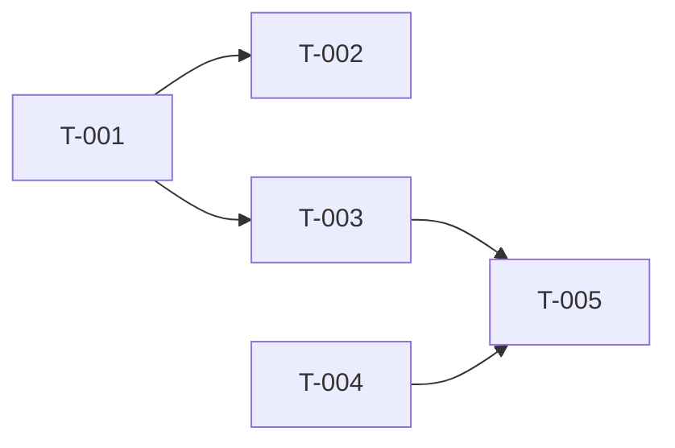

# Development Plan: {项目名称}

[NAV]
- §1 迭代规划 → Sprint 1..N (总览表)
- §2 依赖图
- §3 任务卡详细 → T-001..T-{NNN} (或见Sprint分卷)
- §4 关键路径
- §5 风险项
- §5.5 里程碑计划 (可选)
- §6 集成与E2E测试规划
[/NAV]

## 1. 迭代规划

### Sprint 1: {主题}
| 任务ID | 任务名 | 模块 | 依赖 | TDD测试点 | 状态 |
|--------|--------|------|------|-----------|------|
| T-001 | {名称} | M-001 | — | AC-001, AC-002 | todo |
| T-002 | {名称} | M-001 | T-001 | AC-003 | todo |

## 2. 依赖图

## 3. 任务卡详细

### T-001: {任务名}
- **目标**: {一句话描述任务目标}
- **模块**: M-001
- **接口**: API-001
- **task_kind**: feature
  <!-- 可选值: feature | fix | chore | config | docs | validation。chore/config/docs 跳过 TDD；validation 由用户手动验证，不进入 TDD -->
- **tdd_mode**: light
  <!-- 可选值: light | standard。缺省 = `TDD_DEFAULT_MODE`（light）。预估 LOC > `TDD_LIGHT_LOC_THRESHOLD` 或 `security_sensitive: true` / 跨模块时 tech-lead 应标记 standard -->
- **tdd_refactor**: auto
  <!-- 可选值: auto | required | skip。auto = 按 `TDD_REFACTOR_TRIGGER` 条件触发；required = 强制；skip = 强制跳过 -->
- **security_sensitive**: false
  <!-- true 时强制升 standard 模式 + code-review 不短路 Layer 2 -->
- **tdd_acceptance**:
  - [ ] AC-001: Given {前置条件}, When {触发动作}, Then {可观测结果（具体返回值/状态变化/错误类型）}
  - [ ] AC-002: Given {前置条件}, When {触发动作}, Then {可观测结果}
- **deliverables** (交付物):
  - [ ] `src/module-a/feature_x.py` — {功能模块实现}
  - [ ] `tests/module-a/test_feature_x.py` — {单元测试}
  - [ ] `src/module-a/types.py` — {类型定义} (如需新增)
- **context_load**: (context加载清单)
  - arch#§2.M-001
  - arch-api#API-001
  - arch-data#E-001
  - ui-spec#C-003
- **实现提示**: {关键技术点, 仅在必要时}

### T-{NNN}: [VALIDATION] {功能流程名称}
- **目标**: 用户手动验证{功能}的完整流程
- **task_kind**: validation
- **模块**: {相关模块 M-NNN}
- **验证清单**:
  - [ ] {操作步骤 1}，确认{预期结果 1}
  - [ ] {操作步骤 2}，确认{预期结果 2}
  - [ ] {边界情况}，确认{错误处理正确}
- **前置任务**: [T-{前置任务 ID 列表}]
- **context_load**: [{关联文档引用}]

## 4. 关键路径
{标注影响总工期的任务链}

## 5. 风险项
| 风险 | 影响 | 缓解措施 |
|------|------|----------|

## 5.5. 里程碑计划

### Milestone 1: {里程碑名称} (Sprint 1-{N})
- **交付功能**: {用户可感知的完整功能列表}
- **验收标准**: {里程碑级别的验收条件}
- **验证方式**: {用户手动验证 / 自动化回归 / 截图确认}

## 6. 集成与E2E测试规划
| Sprint | 测试类型 | 覆盖场景 | 依赖任务 | 测试范围描述 |
|--------|----------|----------|----------|-------------|
| Sprint {N} | Integration | {模块间交互场景} | T-{NNN} | {描述} |
| Sprint {N} | E2E | {端到端用户流程} | T-{NNN} | {描述} |