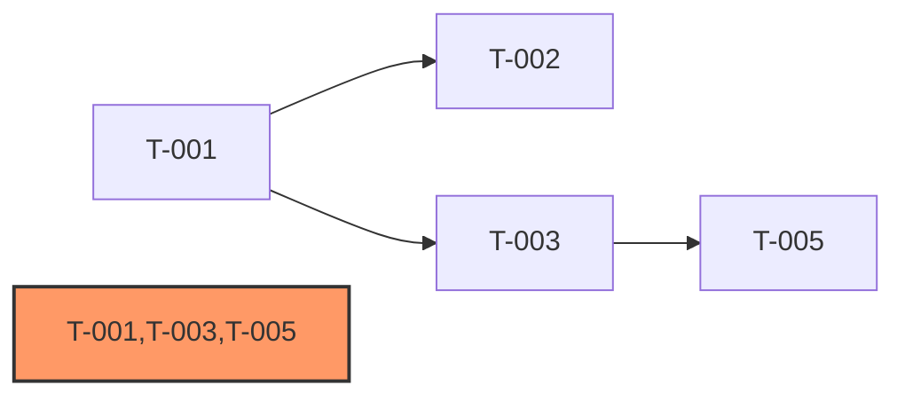

# 任务依赖分析 (task-dep-analysis)

## 能力边界
- 能做: 任务间依赖关系建模、拓扑排序、关键路径计算、循环依赖检测、Sprint分组建议
- 不做: 任务内容定义、代码实现、代码模块依赖图（→ code-review scan --focus coupling）

## 输入规范
- dev-plan#§1 Sprint任务表(任务ID + 依赖列)
- dev-plan#§2 依赖图(文本DAG关系)
- 任务卡的depends_on字段(如存在)

## 输出规范
- 环检测结果(通过/失败 + 循环路径)
- 拓扑排序(有效执行顺序)
- 关键路径(基于复杂度权重)
- Sprint分组建议(按拓扑层级和并行度)

## 执行流程

### Step 1: 提取依赖数据

**数据源**（自动）:

1. **优先经图谱取依赖边** — 用 context 的 query 分支把"列出所有任务依赖边（T→T）"翻译为只读追溯查询并执行，返回的 src→dst 对直接拼成 `--edges "T-001→T-002,..."`，无需再读 Markdown。
2. **回退读文档** — 追溯后端不可用时，从 dev-plan#§1 Sprint 任务表（任务 ID + 依赖列）、§2 依赖图（文本 DAG，T-001 ─→ T-002）、任务卡 `depends_on` 字段提取，合并去重成边列表。

任一路径都必须输出边列表（`(src, dst)` 元组），交给 Step 2 的脚本。

### Step 2: 运行依赖分析脚本
**调用约定（单一入口）**: 一律通过 `cataforge skill run <skill-id> -- <args>` 触发，由框架解析 SKILL.md 元数据并派发到内置脚本或项目覆写脚本。**不得**直接 `python .cataforge/skills/.../scripts/*.py`——该路径为框架内部实现细节，不保证存在。

使用Bash执行:
```bash
cataforge skill run task-dep-analysis -- \
  --edges "T-001→T-002,T-002→T-003,..." \
  [--weights "T-001:S,T-002:M,T-003:L,..."] \
  [--format json|mermaid]
```

脚本功能:
- 环检测(DFS): 输出循环路径或PASS
- 拓扑排序(Kahn算法): 输出有效执行顺序
- 关键路径计算: 基于复杂度权重(S=1,M=2,L=3,XL=5)
- Sprint分组建议: 按拓扑层级和并行度分组

输出格式:
- `--format json` (默认): JSON结构化数据
- `--format mermaid`: Mermaid `graph LR` 格式，关键路径节点高亮标注

JSON输出示例:
```json
{
  "cycle_detected": false,
  "cycles": [],
  "topological_order": ["T-001","T-002"],
  "critical_path": ["T-001","T-003"],
  "critical_path_weight": 7,
  "sprint_groups": [["T-001","T-004"],["T-002","T-005"]]
}
```

Mermaid输出示例:


### Step 3: 应用分析结果
- 有环 → 报告环路径，建议打破方式，status=blocked
- 无环 → 执行以下操作:
  1. 使用 `--format mermaid` 获取 Mermaid 依赖图
  2. 通过 context write-section 将 Mermaid 图自动写入 dev-plan#§2（包裹在 ` ```mermaid ` 代码块中）
  3. 使用 `--format json` 获取关键路径和Sprint分组数据
  4. 将关键路径信息写入 dev-plan#§4

## Anti-Patterns

- 禁止: 引入"先做A再做B更顺手"这种人为依赖 —— 依赖只能基于数据流 / 接口契约 / consumer-producer 关系，否则 sprint_groups 会过窄、并行度白丢
- 禁止: 检测到环依赖时静默改图绕过 —— 必须 FAIL 并要求 tech-lead 重新拆 task 或引入抽象层（task-decomp 步骤 6）
- 禁止: 把 dep-analysis 报告写入 dev-plan#§2 之外的位置 —— 该 section 是 orchestrator §Parallel Task Dispatch 读 sprint_groups 的唯一入口
- 避免: 未跑 `--format json` 就让 LLM 估算关键路径 —— 关键路径是确定性图算法的输出，LLM 估算既不必要也不可靠

## 效率策略
- 依赖仅基于数据/接口，不引入人为依赖
- 使用确定性Python脚本执行图算法，不依赖LLM推理
- 执行流程各Step与dev-plan#§2一一对应
