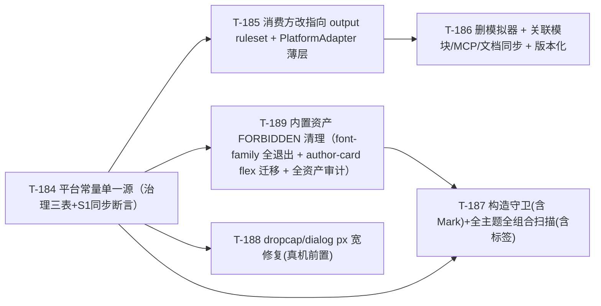

# 架构 amendment：采用 wechat-typeset 平台保真模型（复用 output ruleset 为 patch 层，删除独立模拟器）

> 本稿经三路对抗性审查（架构正确性 / 迁移完整性 / MCP·LLM API）修订至收敛。审查 findings 逐条处置见 §12。

## 0. 设计目标（唯一裁决基准）

**预览渲染 ≡ 粘贴到微信公众号后的视觉效果。** 任何只在预览中呈现、会被微信剥离/过滤的效果都是缺陷。

## 1. 根因诊断：wechat-flow 把平台模型建了两遍

对照生产验证的参照实现 `wechat-typeset`（同作者，多年真机实测），wechat-flow 复杂度来自**重复建模**：

| | wechat-typeset | wechat-flow 现状 |
|---|---|---|
| 平台模型 | 一条幂等 patch 链 output 跑一次 | output 域 ruleset（跑一次）**+ 独立粘贴模拟器 `simulate-paste.ts`（重复建一遍，且更弱：strip-tags 只剥 style/script、不建模 div）** |
| 兼容性报告 | `inspect`=同管线扫描计数 | 模拟器另算 + **收敛不变量**调和「ruleset 产物 ↔ 模拟器预测」 |
| 复制产物 | render 产物直接复制 | 复制 `simulatePaste(render).filteredHtml`（模拟器产物，**非 render 产物**）→ 预览≠复制 |

**根因**：`simulate-paste.ts`/`simulator/*` 与 output ruleset 是**同一平台模型的两份实现**，收敛不变量为强行让两者相等而生。**删掉重复的模拟器即消除全部对账机器。**

## 2. 关键裁定：复用 output ruleset 为 patch 层（非抽取/重写）

**wechat-flow 的 output 域 ruleset 本身就是 hast 上的幂等 patch 层。** `strip-position`/`strip-font-family`/`patch-flex-to-block`/`transform-svg-white-offset` 等已是幂等 hast `RuleDefinition`、已在 `render.ts` output 相（stage 11）跑一次、`nodeChangeRecords` 已由 `apply.ts` 的 `executeStrip/executeTransform` 产出。**wechat-typeset 的模型直接映射到它**——output ruleset = patch 链，`nodeChangeRecords` = inspect 报告。

**故 T-183 归域基础设施（`packages/ruleset` 37 条 output 域规则 + `stage-domain.test.ts`/`output-stage-behavior.test.ts` 基线）保留不动，不拆解。** 本次只删**重复的独立模拟器**，并在 output ruleset 之上做三件事：补全平台常量单一源、补齐三层防御的扫描面、把「兼容性报告/复制/MCP」全部改指向 output ruleset（而非模拟器）。

> **裁定依据**：抽取重写会拆解刚交付的 T-183、触发跨 `packages/ruleset` 大面 ripple、且要在 hast 上重造 wechat-typeset 的 jsdom patch；复用则 ripple 收敛于「删模拟器 + 改消费方指向」，且 output ruleset 已是 hast 幂等、已产 nodeChangeRecords。复用严格更优。

### 2.1 平台常量单一源（治理**三份**现存常量表）

现存三份平台约束源须收敛治理（审查 R1-F6 / R2 揭示）：

| 常量表 | 位置 | 现状 | 治理 |
|---|---|---|---|
| `WECHAT_PASTE_UNSAFE_TAGS` / `WECHAT_PASTE_STRIPPED_STYLE_PROPS` | `contracts/platform/wechat-paste.ts` | 2 松散 Set，被 `wechat-paste-safe-output.test.ts` 消费 | 扩为完整集（下），**保留旧名为 re-export 别名**避免破测试 |
| `CSS_SAFE_PROPERTIES` | `core/registry/css-property-whitelist.ts` | customCss/register 白名单，**放行 font-family + white-space** | 纳入单一源治理：**移除 font-family**（令 customCss 对 font-family 也 fail-fast 而非静默剥）；`white-space:nowrap+width:1%` 组合登记为不可 lint 洞（§9 R4） |
| （新）完整平台事实 | `contracts/platform/wechat-paste.ts` | — | 移植 wechat-typeset `rules.ts`：`FORBIDDEN_CSS_PROPS`=[font-family,position,float]、`FORBIDDEN_DISPLAY_VALUES`={flex,inline-flex,grid,inline-grid}、`FORBIDDEN_POSITION_PROPS`、`HARD_REMOVE_TAGS`、`FORBIDDEN_VALUE_PATTERNS`=[-webkit-,@media,@keyframes,:hover,:active]、`IFRAME_SRC_ALLOW`=[v.qq.com]、`NEAR_WHITE`=#fefefe |

> **-webkit- 例外须先核实代码库现有用例再敲定**（审查 N-3）：除通用的 `print-color-adjust`/`overflow-scrolling`（juice 注入 / iOS 动量滚动），已核实 `packages/marks/src/marks/emphasis.ts` 生产声明 `-webkit-text-emphasis`（着重号真实排版）。T-187 接入扫描前须 grep 全仓 `-webkit-` 用例，把合法在用的（如 text-emphasis 系列）纳入例外或另行处置，否则误杀已上线功能→假红/构造拒绝。

**S1 已裁定决策对账 + 可满足形式（CLAUDE.md 待办 / 计划 R-002 修订）**：用户曾裁定「保留双编码（可读常量 + strip 规则）+ 同步断言测试」。本稿不推翻双编码，但把「同步断言」从**不可满足的双向等式**改写为**可满足的单向 ⊆**——根因：常量集含 `float` / `grid` / 定位族（top/right/bottom/left/z-index），而 output 相**无对应运行期规则**（无 `strip-float` / `patch-grid` / strip-position 只剥 position），故「常量集 == output 规则覆盖集」字面恒不相等、`T-184` 按字面实现恒红，凑合成「人工清单 == 人工清单」又退化为空断言。可满足形式：

1. **单一源派生，不立第二份清单**：构造守卫的禁集**直接从平台常量源派生**（`FORBIDDEN_CSS_PROPS ∪ FORBIDDEN_DISPLAY_VALUES ∪ FORBIDDEN_POSITION_PROPS`）——无第二份守卫清单即无漂移可对账，双向等式自然不需要。
2. **output 补救规则单向 ⊆ 断言**：运行期 output 补救规则（`strip-position` / `strip-font-family` / `patch-flex-to-block`）保留一条**单向轻断言「其靶向属性/值 ⊆ 平台常量集」**（防 output 规则漂出常量集、引入常量未登记的平台假设），**不反向**要求常量每一项都有 output 规则。
3. **无运行期规则的平台事实不进 output 断言**：`float` / `grid` / 定位族由构造守卫（注册资产，从常量派生）+ 全覆盖扫描（产物）兜，不与 output 规则比对。

即：双编码保留、单一源派生消漂移、单向 ⊆ 防 output 规则越界——取代原不可满足的双向等式（供 `T-184` AC-004 改写）。

### 2.2 三层防御（全读 §2.1 单一源）

1. **构造期硬防（主防线，拦已注册设计资产）**：`registerBlock/Variant/Theme/Mark` 遇 `FORBIDDEN_CSS_PROPS`/`FORBIDDEN_DISPLAY_VALUES`/`FORBIDDEN_POSITION_PROPS` 声明即拒绝——**核心 register\* 函数抛出**含 `rejectedDeclarations`（`{slot,property,value,reason}` 结构化清单）的错误（对齐 `registerVariant` 现状 `packages/core/src/registry/variant.ts:100-107` 的 `throw Object.assign(new Error(...), {rejectedDeclarations})`），**MCP 边界层 catch 该异常后转 `{registered:false, rejectedDeclarations}` 非抛出响应**（Block/Theme/Mark 守卫同此 core-throw + MCP-catch 模式——见 §2.4）。**现状差异（审查 N-2，T-187 须据实建设，非「复用」）**：仅 `registerVariant` 现有 `validateStyle`/`rejectedDeclarations` 机制可复用；`registerBlock` 只校验 slot 形状、`registerTheme` 零校验、`registerMark` 零校验且 `MarkDefinition.style` 是**字符串**（如 `inline-code` 的 `font-family:monospace`、`emphasis` 的 `-webkit-text-emphasis`）须先 CSS 字符串解析——Block/Theme/Mark 三者的守卫基础设施需**从零建构**，与 Variant 声明式结构不同形。
2. **运行期兜底**：output ruleset（stage 11，跑一次，在 decorate/customCss 之后）——兜住主题 baseStyle / decorate 字面样式 / customCss 级联的漏网。**注意缺口**：output ruleset 现无 strip-div，且 float 只构造禁不运行剥 → decorate 若注入 `<div>`/`float` 无运行期防线，仅靠第 3 层扫描（见 §2.3 + §9 R3）。
3. **回归扫描（等效收敛不变量的门禁）**：扫**全注册主题 × 全 block × 全 variant** 的最终 HTML，含 (a) `FORBIDDEN_CSS_PATTERNS` CSS 模式扫描（**带 -webkit- 例外白名单**）+ (b) **不安全标签扫描**（`WECHAT_PASTE_UNSAFE_TAGS`，非仅 CSS）。升级现有 `tests/blocks/wechat-paste-safe-output.test.ts`（当前只跑 default 主题 + 无标签扫描）为全主题全组合 + 标签扫描。这是删收敛不变量后的等效保真门禁。

**三层按输入来源分工（非按属性建两级分类法）**：三层不是「按属性切成构造禁集 vs output 补救集」，而是**按输入来源**——
- **构造守卫（主）** 拦**已注册设计资产**（内置 block/variant/theme/mark + 第三方/LLM 经 `register*` 提交的资产），覆盖**全部** `FORBIDDEN` 常量。
- **output 补救（副）** 拦**唯一无 register 步、守卫拦不住的输入 = 运行期 `customCss`**（用户/LLM 渲染时注入）；`patch-flex-to-block`/`strip-*` 专管它。
- **扫描门禁** 验**全主题 × 全 block × 全 variant 产物**，兜构造守卫未拦的动态注入（decorate 生成的 div/float 缝，§9 R3）。

**「守卫禁 flex」与「output 补 flex」不矛盾**：二者管**不同输入**（守卫管注册资产、`patch-flex-to-block` 管运行期 customCss），非冗余、非需二选一。故 `display:flex` 在已注册资产里被守卫**源头拒绝**，在运行期 customCss 里被 output 补救**兜底转 block**——`patch-flex-to-block` 不为内置块违规兜底。

**内置资产 FORBIDDEN 声明须源头清理（守卫上线前置，范围 = 全 FORBIDDEN 非仅 font-family）**：构造守卫 throw 前，全部内置设计资产不得再声明任何 `FORBIDDEN_CSS_PROPS ∪ FORBIDDEN_DISPLAY_VALUES ∪ FORBIDDEN_POSITION_PROPS` 成员，否则进程注册内置资产即抛异常 → 注册中断 → 全 suite 红（硬阻塞）。已核实内置违规：`packages/blocks/src/blocks/author-card.ts` 静态 baseStyle `display:flex`（真 bug）——须**源头迁移**为微信安全布局（`display:table`/`inline-block`），不靠 output patch 蒙混。清理范围从「只清 font-family」**扩为审计全内置资产**（见 §6 T-189 扩范围 + §9 R7 清单）。

### 2.3 兼容性报告 = output ruleset 的 nodeChangeRecords（无独立模型）

DiagnosticsPanel / CompatibilityDiffView 消费的 `nodeChangeRecords` **保持由 `apply.ts` `executeStrip/executeTransform` 产出**（现状即如此，非模拟器产物）。删模拟器**不影响**此来源。clamp/readability(Q/N) 的变更记录也来自同一 `applyRuleset` 一次遍历——**单一模型，无面板侧双源复活**（审查 R1-F5 / R2-C2）。

### 2.4 平台抽象 `PlatformAdapter` + MCP/LLM 统一 API（核心区分特性）

`PlatformAdapter` 是 output ruleset 之上的**薄编排+报告层**（非重新实现）：

```ts
interface PlatformAdapter {
  id: string; name: string;
  patch(hast): hast;            // = render output 相既有 applyRuleset(hast, rules, "output") 的具名封装
  inspect(html: string): PatchLog;  // = 对任意外部 HTML：专用 inspect schema 标签剥离 + 跑平台规则 → 报告
}
```

**patch 与 render 的绑定（审查压测）**：`patch(hast)` **不是 render 后再跑一遍**——它就是 `render.ts` output 相既有的 `applyRuleset(afterCustomCss, rules, "output")` 那一次执行的具名封装。T-185 须让 render.ts 内部改为经 `wechatAdapter.patch` 调用（同一执行点），**禁止 render 与 adapter 各维护一份 output-stage 调用逻辑**而随时间漂移。`patch` 面向渲染管线（我方 hast），`inspect` 面向任意外部 HTML 字符串——入口不同，**规则集 `inspect` ⊆ `patch`**（非同一集）：`patch` = **全 output 域规则**（平台过滤 ∪ 产品归一），`inspect` **仅跑平台过滤规则子集**（strip/patch 族，建模微信真机剥/改；**排除** `clamp-*`/`readability-*`/`transform-em-to-px`/`transform-uppercase-hex-lower`/夜间风险等产品诊断·归一——它们不进平台判定，§9 R5）。**inspect 规则集身份钉死**：`inspect` 与 `patch` 共用的是「平台过滤规则子集（strip/patch 族）」，非全 output 规则；否则 `inspect(外部HTML)` 会把「字号夹 14 / em→px / hex 转小写」当微信平台行为误报给 LLM（违反 §2.4 inspect「报的是我方平台模型」对「平台」的界定）。

**inspect 诚实语义（审查 R1-F1 / R3-F3 / N-1 必修）**：inspect 面向**任意外部 HTML**（LLM 兼容性自查），语义 = 「wechat-flow 平台模型（标签剥离 ⊕ output 平台规则）会对这段 HTML 做什么」。**关键实现约束（N-1）**：现有 `wechatFlowSanitizeSchema` 与 `hast-util-sanitize` 的 `defaultSchema` 的**标签白名单都含 div**（defaultSchema.tagNames 含 div，wechatFlowSanitizeSchema 只增不减、不主动剥 div）。故 inspect **不能复用渲染管线的 schema**，须构造**专用 inspect schema** = `defaultSchema.tagNames` 减去 `WECHAT_PASTE_UNSAFE_TAGS ∪ HARD_REMOVE_TAGS`，方能真剥 div/script 等——否则 `inspect(<div style="position:absolute">)` 仍返回空、R1-F1 在字面实现下复现。inspect = 专用 schema 标签剥离 ⊕ output 平台过滤规则子集。**专用 schema 的存在理由是 inspect 面向任意外部 HTML（外部输入可含 div）**，**并非**渲染管线「留了 div」——**render 产物 div-free 由构造保证（核实结论 2026-07-09）**：① `packages/core/src/pipeline/transform.ts` `remarkRehype({ allowDangerousHtml: false })` 使 Markdown 源中的裸 `<div>`（及任意裸 HTML）不被转成 hast 元素、在 mdast→hast 即丢弃（**非「经 sanitize 存活」**）；② 全 source 零 div 创建，block 容器原语为 `section`（`transform.ts` 指令 `hName="section"`、`blocks/steps.ts`、`blocks/decorate-utils.ts`），`decorate` 不注入 div；③ customCss 级联 `pipeline/custom-css.ts` `fromHtml(juicedHtml,{fragment:true})` re-parse 的是 juice 内联产物，juice 不新建 div 容器、输入 div-free 则输出 div-free。**故 `inspect(render(x)).changes === []` 命题成立、非过度声明**（标签维度 render div-free 零命中、规则维度平台过滤子集幂等已应用零变更）——**对自家 render 产物返回空 = 证明产物已达平台稳定态**（原收敛不变量的诚实形式，按需触发非 CI 恒跑）。MCP request schema 钉死 `{ html: string }`（外部 HTML），tool description 明确「面向任意 HTML 的平台兼容体检；对已渲染产物返回空即干净」。**不宣称「预测微信真机」**——它报的是我方平台模型，真机保真由 §2.2 扫描 + 少量真机确认承载。

**MCP 工具 re-map**：

| 工具 | 现状 | 新模型 |
|---|---|---|
| `render_markdown` (API-001) | resp 带 `postPaste`；diagnostics 不含 nodeChangeRecords | **删 postPaste**；resp 带 `report{nodeChangeRecords,nightRiskIssues}`——使 customCss 被平台规则剥的声明（含 font-family）以 warn 诊断对 LLM 可见（审查 R3-M/R1-F6）；可选 `platform` 参数 = `z.enum(["wechat"])`（未注册平台显式 `E_UNSUPPORTED_PLATFORM`，**禁静默回退**） |
| `simulate_paste` (API-014) | `{filteredHtml,diffNodes,droppedAttrs}` 模拟器 opaque | **re-back 为 `inspect`**：resp `{patchedHtml, changes:[{patch,label,count,samples:[{selector,before}]}]}`（PatchLog 形）。**保留工具 key `simulate_paste`**（改名破 tool-count/外部配置）但**必须补 tool `description`** 澄清语义。`filteredHtml`→`patchedHtml`：保留 `filteredHtml` 别名一个过渡窗口 |
| `export_clipboard_payload` (API-015) | 返回 filteredHtml | 返回 `render().html`（等价性由 §7 compose-copy/export 测试坐实——output ruleset 覆盖 id+定位族+style/script） |
| `register_variant` | 核心 `registerVariant` 命中即 `throw({rejectedDeclarations})`（`variant.ts:100-107`）；MCP wrapper 现有 catch-and-structure 转 `{registered:false,rejectedDeclarations}` | **复用该 core-throw + MCP-catch 路径**（非新造机制）；扩 `FORBIDDEN_CSS_PROPS`/`DISPLAY_VALUES`/`POSITION_PROPS`；Block/Theme/Mark 守卫同此模式；reason 含**可执行替代指引**（「主题身份用字号/字重/配色/间距/布局承载，勿用 font-family」） |
| 全 24 工具 | **零 description**（`router.ts` 只注册 inputSchema） | 借本次**补齐 tool description**（既有 LLM 友好度硬伤，审查 R3-M） |
| `metrics.ts` | `observePasteSimulationDiffRatio`（render↔simulator，失义） | 重定为 `fallback_platform_patch_hits`（output 规则命中数/render，健康信号）；deploy-spec §metrics 同步为 breaking dashboard 变更 |

**现状根因暴露**：`composeCopy`/`export_clipboard_payload`/CLI `runCopy` 现复制 `simulatePaste(render).filteredHtml`（模拟器产物）→ 预览≠复制。改用 `render().html`（output ruleset 后即安全）→ 预览≡复制天然成立（T-178 本意）。**复制不变量（审查压测 N）**：copy 三路（composeCopy/runCopy/export_clipboard_payload）的 render 调用须保持 `injectNodeIds:false`（现状即如此——`data-node-id` 交互脚手架仅预览路径注入）；**禁止为省一次 render 而复用预览已注入 node-id 的结果**，否则脚手架泄漏进微信剪贴板。删 postPaste 不改变此事实（脚手架从不进 copy 路径产物）。

## 3. 删除清单（只删重复模拟器）

- `packages/core/src/simulate-paste.ts`、`simulator/{strip-attrs,strip-tags,rewrite-structure}.ts`、`diff/per-node-diff.ts`（顺带消解 D4 位置下标 diff bug——标记 D4 由本 amendment closed，审查 R1-F8）
- `packages/core/src/index.ts` 导出 `simulatePaste`/`SimulatePasteResult`/`NodeDiff`/`DroppedAttr`（**breaking npm API，见 §5**）
- 收敛不变量 CI 性质测试（若已存在）；`RenderResult.postPaste`（**breaking，见 §5**）
- 复制链路的 `filteredHtml`（editor/cli/mcp export 改用 render 产物）
- 孤儿 fixture 目录：**无**（output ruleset 规则保留，其 fixture 不删——复用框定下无规则文件删除，审查 R2-MEDIUM 的 orphan 顾虑随「复用」消解）
- 上一稿的 `TargetProfile`/P-Q-N 三分/`platformFidelity` 标记/oracle-as-CI-gate（过度设计）

## 4. 平台事实纠正（wechat-typeset 权威 > 网络调研 > 现状）

| 项 | 现状 | 纠正 |
|---|---|---|
| transform | — | **不剥**（wechat-typeset 禁区无 transform；本就无 strip-transform，维持） |
| font-family | output strip（T-183①） | **保持无差别剥 = 正确**（跨设备一致性）；撤销 system-only；themes/marks 禁声明（构造守卫，分阶段 T-189） |
| float | 常量含无规则 | 构造期禁止 + 扫描抓漏（非运行期剥；缺口见 §9 R3） |
| `display: flex/grid`（注册资产 vs 运行期 customCss） | author-card baseStyle 声明 `flex`（内置真 bug） | **按输入分工**：注册资产由构造守卫**源头拒绝**（内置 `author-card` 的 `display:flex` 须 T-189 迁 `table`/`inline-block`，不靠 output patch 蒙混）；运行期 customCss 的 flex 由 output `patch-flex-to-block` **兜底转 block**。二者管不同输入、非冗余（§2.2 三层按输入分工） |
| -webkit-/@media/@keyframes/:hover/:active | 未覆盖 | 纳入 `FORBIDDEN_VALUE_PATTERNS` + 扫描；**-webkit- 带 print-color-adjust/overflow-scrolling 例外**（审查 R1，否则误杀 juice 注入→假红） |
| dropcap `width:1%;white-space:nowrap` | paragraph/quote dropcap 用此 | **真 bug**：微信剥 nowrap 留 1% → shrink-cell 塌陷。改**显式 px 宽**（按字号推导，非硬编码 44px，审查 R1-F7）。真机确认为**前置**非并行 |
| SVG #fff | transform-svg-white-offset | 保留（NEAR_WHITE=#fefefe） |

## 5. 破坏性变更与版本化（审查 R2/R3 必修）

`postPaste` 删除、`simulate_paste` 字段重命名（filteredHtml→patchedHtml、结构变）、`@wechat-flow/core` 导出删除 = breaking API 变更。**当前 private 状态（审查 N-4 更正）**：`apps/mcp-server/package.json` 现 `private:true`（未发布 npm，破坏面暂限工作区内部消费方，直至 release go/no-go 翻转 private）；`packages/core/package.json` 无 private、版本 0.0.0（可发布包，导出删除属对外 API 破坏）。处置：

- `@wechat-flow/core` 与 mcp-server **major/minor 版本 bump** + CHANGELOG 迁移条目逐项列明。
- `simulate_paste` resp 保留 `filteredHtml` 别名过渡窗口；`patchedHtml` 为新主字段。
- 产品文档同步：`skill/SKILL.md`、`skill/references/tool-catalog.md`（现硬编码 `simulate_paste→{filteredHtml,diffNodes,droppedAttrs}` + upload 前置叙事）须重写为新语义。
- MCP 契约版本信号：现仅 `rulesetVersion` 探测不到工具形变——CHANGELOG 承担，release go/no-go 清单加「MCP 契约 breaking 说明」。

## 6. 任务重排（复用框定，收缩）



- **T-184｜平台常量单一源**：`wechat-paste.ts` 扩完整集 + 旧名别名；`CSS_SAFE_PROPERTIES` 移除 font-family、纳入治理；S1 同步断言测试（常量集==平台规则覆盖集）。
- **T-185｜消费方改指向 + PlatformAdapter 薄层**：`PlatformAdapter{patch,inspect}` 编排 output ruleset（**复用规则，不抽取不重写**）；inspect=sanitize⊕平台规则报告；`platform` 参数 z.enum。
- **T-186｜删模拟器 + 全消费方/MCP/文档同步 + 版本化**：删 §3；`composeCopy`/`runCopy`/`export_clipboard_payload`→render 产物；`simulate_paste`→inspect（+description+别名）；`render_markdown` 删 postPaste + 带 report；全 24 工具补 description；`metrics` 重定；`scripts/realworld-verify.ts` 迁移；`skill/*` 文档重写；CHANGELOG。
- **T-187｜构造守卫 + 扫描门禁**：`registerBlock/Variant/Theme/Mark` 命中禁区即 core throw（`{rejectedDeclarations}`）+ MCP 边界 catch-and-structure；`wechat-paste-safe-output.test.ts` 升级全主题×全 block×全 variant + 标签扫描 + -webkit- 例外。**依赖 T-189**（守卫 throw 前全内置资产不得再声明**任何 FORBIDDEN 成员**——非仅 font-family，含 author-card flex）。AC 须补「内置资产全量注册回归绿」坐实守卫不误杀。
- **T-188｜dropcap/dialog px 宽修复**：paragraph/quote dropcap + dialog shrink cell `width:1%;nowrap`→显式 px（按字号推导）；≤6 份真机确认 display:table 存活**作为前置**。
- **T-189｜内置资产 FORBIDDEN 清理（构造守卫前置，范围 = 全 FORBIDDEN 非仅 font-family）**：分阶段——运行期 output 规则兜底（现状）→ **审计并清理全内置资产 FORBIDDEN 声明**（font-family：5 主题 tokens/heading/paragraph/code-block + `packages/blocks/src/blocks/{paragraph,quote}.ts` dropcap 装饰 + `packages/marks/src/marks/inline-code.ts`；flex：`packages/blocks/src/blocks/author-card.ts` 迁 table/inline-block；grep 全仓内置静态声明 `display:(flex|grid)`/`position:`/`float:`/`font-family:`/定位族逐项源头改写清零）→ 上构造守卫。并入批二 T-179。

**批二校准**：font-family 无差别剥（非 system-only）；**T-178** AC-001（composeCopy 不经 filteredHtml）被 T-186 吸收、notes 指向的旧 T-184 作废须重写，AC-002（strip-width-height-inline 移除）正交保留；T-179 并入 T-189；T-176 dialog 气泡文字色反转随槽位 typography 下推；T-177/T-180 无平台耦合。

## 7. 关联模块迁移 ripple（全消费方，审查 R2 补全）

| 层 | 文件 | 迁移 |
|---|---|---|
| core | `simulate-paste.ts`/`simulator/*`/`diff/per-node-diff.ts` | **删** |
| core | `render.ts` | 去 postPaste；report 保持 ruleset nodeChangeRecords；customCss 剥除产 warn |
| core | `index.ts` | 删 simulatePaste 及类型导出（breaking §5） |
| core | `registry/css-property-whitelist.ts` | 移除 font-family；纳入单一源 |
| core | `registry/mark.ts` | 加构造守卫 |
| ruleset | （保留，不动） | output 规则即 patch 层；stage-domain/output-stage-behavior/builtin-fixtures 测试基线**不破** |
| contracts | `mcp/tool-contracts.ts` | simulate_paste/export/register schema 补全 LLM 友好；render_markdown 删 postPaste + 带 report；platform z.enum |
| contracts | `platform/wechat-paste.ts` | 完整集 + 旧名别名 |
| mcp-server | `tools/simulate-paste.ts` | →inspect |
| mcp-server | `tools/export-clipboard-payload.ts` | →render 产物 |
| mcp-server | `tools/render-markdown.ts` | 去 postPaste 组装 |
| mcp-server | `router.ts` | 补 24 工具 description |
| mcp-server | `metrics.ts` | 重定指标 |
| editor | `use-cases/copy.ts` | 复制 render().html |
| editor | `diagnostics/{DiagnosticsPanel,CompatibilityDiffView}.vue` | 来源不变（ruleset nodeChangeRecords），核对无 postPaste 依赖 |
| cli | `commands/copy.ts` | payload=render().html |
| scripts | `realworld-verify.ts` | 去 simulatePaste，改 render 产物 + inspect |
| skill | `SKILL.md` / `references/tool-catalog.md` | 重写 simulate_paste→inspect 语义 |

**破裂测试面（全，审查 R2 补全）**：`tests/core/simulate-paste.test.ts`(删)、`tests/core/sanitize.test.ts`(postPaste 契约 describe 块)、`tests/mcp-server/tools/{simulate-paste,render-markdown,export-clipboard-payload}.test.ts`、`tests/mcp-server/transport-http.test.ts`(工具路径+指标名)、`apps/mcp-server/src/metrics.test.ts`、`tests/app-layer/compose-copy{,-integration}.test.ts`、`apps/editor/src/use-cases/__tests__/copy.test.ts`、`apps/editor/.../EditorShell{CopyWiring,AutoBackupWiring}.test.ts`、`apps/editor/src/pages/__tests__/PreviewPage.test.ts`(死 mock 清理)、`tests/contracts/{tool-contracts,tool-count}.test.ts`、`tests/skill/orchestration.test.ts`、`tests/blocks/wechat-paste-safe-output.test.ts`(升级全主题+标签)、`tests/cross-runtime/fixtures.ts`(**golden SHA 须 `pnpm gen:cross-runtime-hashes` 重生成**，四 runtime job)、各 block-variants/typography-cascade(font-family 断言)。

## 8. 测试策略

- **等效保真门禁**（替代收敛不变量）：§2.2 第 3 层全主题×全 block×全 variant CSS 模式 + 标签双扫描。
- **S1 同步断言**：常量集 == output 平台规则覆盖集，漂移即红。
- **等价性坐实**：compose-copy/export 测试断言 render 产物 == 旧 filteredHtml 的过滤等价集（id/定位族/style-script）。
- **golden SHA 重生成**：cross-runtime 四运行时基线。
- **真机 oracle**：收窄至 dropcap/dialog display:table 存活 ≤6 份（T-188 前置），非大批 specimen。

## 9. 风险与开放问题

- **R1 主题 font-family 退出面**：不止 5 主题——含 blocks dropcap 装饰 + inline-code mark。T-189 分阶段（strip 兜底→清理→守卫）；期间「构造未拦运行兜」窗口由扫描守。
- **R2 display:table 存活未真机证**：§4 已定位真 bug=nowrap+1% 塌陷。display:table 本体存活仍须 ≤6 份真机确认（T-188 前置）；塌陷则装饰布局改真 `<table>`（更大返工）。
- **R3 decorate/customCss 的 div/float 缝（已收窄至扫描兜底）**：div 无运行期注入面（core/blocks 零 `tagName:"div"` 构造点，结构闭死）；float/定位族在 customCss 白名单（`css-property-whitelist.ts`）外且受构造守卫（`style-guard.ts`）拦截，双层闭死；display 白名单放行面上 grid/inline-grid 由 output 相 `patch-grid-to-block` 改写（与 flex 对称，镜像微信剥离后回退值，inspect 面同获覆盖）。残余：decorate 动态注入面扩大时按原裁定补运行期 strip，全覆盖扫描兜底照旧。
- **R4 customCss 是用户/LLM 责任边界**：`nowrap+百分比宽` 已知致命组合由 output 相 `lint-nowrap-percent-width` 组合诊断警示（同节点 `white-space:nowrap` + 百分比 `width` 即报 warning，单属性禁区不可行的登记不变）；除已知组合外，preview≡paste 对 customCss 任意输入**不可完全闭合**，诚实标注（非隐含全覆盖）。
- **R5 clamp/readability 定位**：保留为产品诊断/归一（不进平台判定）；「静默 clamp vs 作者诊断」是独立产品问题，登记待议，不在本重构。
- **R6 多平台 YAGNI**：PlatformAdapter 为 xhs/zhihu 预留但只实 wechat；`platform` z.enum 仅 wechat，未支持平台显式报错不静默回退。
- **R7 内置资产 FORBIDDEN 清理面（已闭合）**：T-189 已完成全 `FORBIDDEN_CSS_PROPS ∪ FORBIDDEN_DISPLAY_VALUES ∪ FORBIDDEN_POSITION_PROPS` 内置声明清零（author-card `display:flex` 已源头迁 `table`，全仓 grep 零命中），构造守卫（`style-guard.ts`）在位。裁定「守卫禁 flex（注册资产）」与「output `patch-flex-to-block` 补 flex（运行期 customCss）」**按输入分工非矛盾**（§2.2）不变。

## 10. 锁定决策（用户 2026-07-09）

- 采用 wechat-typeset 模型：**复用 output ruleset 为 patch 层**，删独立模拟器/收敛不变量/postPaste；MCP 面同步（simulate_paste→inspect、复制用 render 产物、register_variant 复用结构化拒绝、补 24 工具 description）。
- transform 不剥；font-family 无差别剥（T-183① 成立，撤销 system-only）；float 构造禁止。
- dropcap nowrap+1% 真 bug，改显式 px 宽（真机前置）。

## 11. 下游 amendment

- arch-wechat-flow-modules §2.M-003（output ruleset=平台 patch 层，不拆）、§2.M-004（模拟器删除，inspect=sanitize⊕平台规则报告）、§2.M-005（构造守卫含 Mark）、§2.M-009（MCP simulate_paste→inspect + 24 工具 description + breaking 版本化）、附录 A/B（撤销 P/Q/N + system-only + transform）
- dev-plan-s7：T-184..T-189 拆卡 + T-178 重写 + T-179 并入 T-189
- ui-spec §10.5 font-family（无差别剥 + themes/marks 禁声明，owner=ui-designer）
- deploy-spec §metrics（指标重命名 breaking）
- 记忆 `wechat-paste-tag-whitelist`（已更新）

## 12. 对抗性审查 findings 处置

| finding | 严重度 | 处置 |
|---|---|---|
| R1-F1/R3-F3 inspect 对任意输入不诚实（无 strip-div） | HIGH | §2.4 inspect=sanitize⊕平台规则、诚实语义、request schema 钉死、去「预测微信」叙事 |
| R1-F2 删不变量后非 default 主题零门禁 | HIGH | §2.2 第 3 层扩全主题×全组合 + 标签扫描 |
| R1-F3 decorate 字面样式/标签逃守卫 | HIGH | §9 R3：output patch 在 decorate 后跑兜 flex/position/font-family；div/float 靠全覆盖标签扫描 |
| R1-F4/R2-C1 抽取 vs 复用歧义（拆 T-183） | CRITICAL | §2 裁定**复用**，ruleset 不拆，ripple 收敛 |
| R1-F5/R2-C2 面板 nodeChangeRecords 来源架空 | CRITICAL | §2.3 来源保持 ruleset executeStrip/Transform，不受删模拟器影响 |
| R1-F6 第三份常量源 css-property-whitelist 放行 font-family/nowrap | MEDIUM | §2.1 纳入治理、移除 font-family；nowrap+1% 登记 §9 R4 |
| R1-F7 dropcap px 定值/真机顺序 | LOW | §4 px 按字号推导 + 真机前置 |
| R1-F8 删 per-node-diff 消 D4 | LOW | §3 标记 D4 closed |
| R1 -webkit- 例外漏移植 | MEDIUM | §2.1/§4 带 print-color-adjust/overflow-scrolling 例外 |
| R2-HIGH realworld-verify/render-markdown/大批测试/skill 文档/core 导出/T-178 遗漏 | HIGH | §5/§7 全补入 ripple + 破裂测试面 + breaking 版本化 |
| R2 S1 已裁定决策未对账 | HIGH | §2.1 单一源+同步断言即 S1 裁定落地 |
| R2 registerMark/font-family 清理面窄 | MEDIUM | §2.2/§6 T-187 含 Mark、T-189 含 blocks/marks |
| R2 cross-runtime golden SHA | MEDIUM | §7/§8 须重生成 |
| R3 register_variant throw 退化 | HIGH | §2.4 复用 rejectedDeclarations 结构化路径 + 替代指引 |
| R3 breaking 无版本化 | HIGH | §5 版本 bump + CHANGELOG + 别名 |
| R3 customCss font-family 静默剥 | MEDIUM | §2.4 render_markdown 带 report + warn 诊断 |
| R3 24 工具零 description | MEDIUM | §2.4/§6 补齐 |
| R3 export 等价性/platform 回退/metrics 命名 | MEDIUM/LOW | §7 等价测试、§2.4 z.enum 显式报错、§2.4 metrics 新名+deploy-spec |
| N-1 inspect「过 sanitize 剥 div」机制在现有 schema 不成立 | HIGH | §2.4 须构造专用 inspect schema=defaultSchema.tagNames − unsafe，区别于渲染管线 schema |
| N-2 构造守卫「复用」仅 Variant 现成，Block/Theme/Mark 须新建（Mark style 是字符串需解析） | MEDIUM | §2.2 据实更正 T-187 范围 |
| N-3 -webkit- 例外未核实现有用例（emphasis mark 的 -webkit-text-emphasis 会误杀） | MEDIUM | §2.1 T-187 接入扫描前须 grep 全仓 -webkit- 用例 |
| N-4 §5「mcp-server 均无 private」事实错（实为 private:true） | LOW | §5 更正 |
| N 压测 adapter.patch vs render 输出相绑定 / copy injectNodeIds:false 不变量 | MEDIUM | §2.4 具名封装同一执行点 + copy 保持 injectNodeIds:false |
