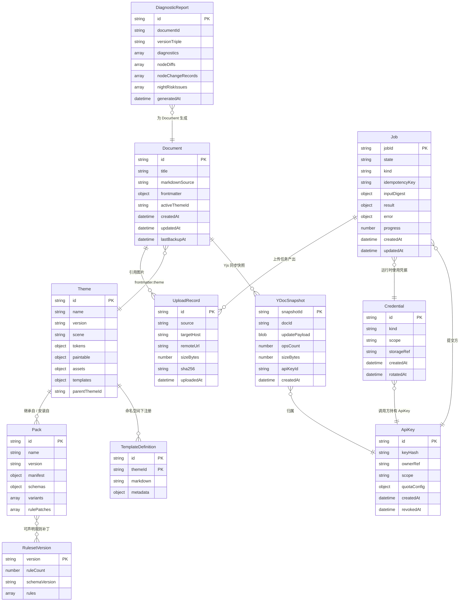

# Architecture 分卷 — 数据模型: wechat-flow

[NAV]
- §4 数据模型 → §4.1 实体关系, E-001 Document, E-002 Theme, E-003 Pack, E-004 RulesetVersion, E-005 Job, E-006 Credential, E-007 UploadRecord, E-008 DiagnosticReport, E-009 YDocSnapshot, E-010 ApiKey, E-011 TemplateDefinition, §4.2 DDL 兼容性
[/NAV]

## 4. 数据模型

> 说明：
> - **客户端实体**（E-001 Document、E-008 DiagnosticReport 内存对象、E-007 UploadRecord 缓存部分）持久化在浏览器 IndexedDB
> - **服务端实体**（E-005 Job / E-006 Credential / E-007 UploadRecord 服务端部分 / E-009 YDocSnapshot / E-010 ApiKey）持久化首选 SQLite (libsql / better-sqlite3)，横扩切 Postgres；具体由 deploy-spec 按部署形态决定。本卷 §4.x 每张表给出 SQLite 优先的 DDL 示例 + Postgres 等价语法附注
> - **打包实体**（E-002 Theme、E-003 Pack、E-004 RulesetVersion、E-011 TemplateDefinition）以静态 manifest + 资产文件形态在 npm registry 分发，运行时仅在内存中索引，无需数据库存储
> - **awareness 状态**（Yjs 协同的光标 / 选区 / 在线状态）只存 Redis pub/sub channel，不入数据库（断线即失效）

### 4.1 实体关系



### E-001: Document (客户端 IndexedDB)

| 字段 | 类型 | 约束 | 说明 |
|------|------|------|------|
| id | string | PK，uuid v4 | 文档唯一标识 |
| title | string | required，≤ 200 | 文档标题，缺省取 frontmatter.title 或首个 H1 |
| markdownSource | string | required | 完整 Markdown 源码（含 frontmatter） |
| frontmatter | object | required | 解析后的 frontmatter 对象。字段语义：`theme: string` (必需，命名 template 的命名空间)；`template?: string` (可选，主题命名空间下的预设变体名，运行时仅作为审计标记不参与渲染，详 PRD F-008 AC-003)；`paint?: Record<TokenPath, string>` (可选，单文档级配色覆盖)；`base-color?: string` (可选，调色板派生 seed)；以及主题/插件声明的自定义变量。 |
| activeThemeId | string | required | 当前生效主题 ID（写作者主题切换时更新） |
| createdAt | datetime | required | 创建时间 |
| updatedAt | datetime | required | 最后编辑时间，触发自动备份依据 |
| lastBackupAt | datetime | optional | 最近一次本地自动备份时间 |

映射：F-001 AC-005 多文档管理 / 本地草稿持久化 / 自动备份

### E-002: Theme (打包实体，npm registry 分发)

| 字段 | 类型 | 约束 | 说明 |
|------|------|------|------|
| id | string | PK，kebab-case | 主题 ID（如 `magazine`、`org-acme-brand`） |
| name | string | required | 显示名 |
| version | string | required，semver | 主题版本，参与版本三元组 |
| scene | string | required | 5 大内容场景之一：`generic`/`magazine`/`literary`/`business`/`tech` 或自定义 |
| tokens | object | required，≥ 60 个 token | 五大类别 token 字典（color/spacing/font/decoration/alignment） |
| paintable | "string[] \| 'all-colors'" | required | 可被 frontmatter.paint 覆盖的 token 路径白名单 |
| assets | object | optional | 主题装饰资产字典（内联 SVG + `{{tokenId}}` 占位符） |
| templates | `Record<TemplateId, TemplateDef>` | 内置主题必需 ≥ 1 (F-011 AC-009 守护) | 该主题命名空间下注册的预设变体字典（详 E-011 TemplateDefinition）；同名 templateId 在不同主题下互相隔离；运行时由 M-005 `registry/template.ts` 按 `Map<themeId, Map<templateId, TemplateDef>>` 存储 |
| parentThemeId | string | optional | 主题继承父 ID（F-009 AC-001） |
| brandLock | object | optional | 品牌包字体 / 配色 / 组件子集锁定（F-009 AC-002） |

映射：F-003 / F-008 AC-002 / F-009

### E-003: Pack (打包实体，npm registry 分发)

| 字段 | 类型 | 约束 | 说明 |
|------|------|------|------|
| id | string | PK，scope+name 形态 | 如 `@author/my-pack` |
| name | string | required | 包名 |
| version | string | required，semver | pack 版本 |
| manifest | object | required | manifest 描述（kind: `plugin`/`theme`、entry、permissions、白名单声明） |
| schemas | object | optional | 注册的 Block / Mark / Theme 的 attrsSchema 集合 |
| variants | array | optional | 注册的 variant 列表（含 namespace 前缀） |
| rulePatches | array | optional | 注册的规则补丁列表 |
| dependencies | object | optional | 对其他 pack / theme / token 的依赖声明 |

映射：F-010 AC-001 / AC-002 / AC-006

### E-004: RulesetVersion (打包实体，npm registry 分发)

| 字段 | 类型 | 约束 | 说明 |
|------|------|------|------|
| version | string | PK，semver | 规则集版本号，参与版本三元组 |
| ruleCount | number | required，≥ 42 | 当前生效规则数 |
| schemaVersion | string | required | Public Tool Schema 版本（与 PRD F-013 AC-005 联动） |
| rules | array | required | 规则定义列表，每条含 `{id, scope, severity, matcher, action, fixtureRef}` |
| patches | array | optional | 已知 Bug 补丁列表（F-011 AC-005，按微信客户端版本号匹配） |

映射：F-007 / F-011 AC-005 / F-013 AC-005 / AC-006

### E-005: Job (服务端持久化)

| 字段 | 类型 | 约束 | 说明 |
|------|------|------|------|
| jobId | TEXT | PK，uuid v4 | 任务唯一标识 |
| state | TEXT | required，enum | `pending`/`running`/`succeeded`/`failed` |
| kind | TEXT | required，enum | `image-upload`/`wechat-asset-upload`/`long-image-render`/`cover-render` |
| idempotencyKey | TEXT | required，indexed | `sha256(canonicalize(input) + toolsetVersion).hex` 去重键 |
| inputDigest | TEXT (JSON) | required | 输入参数的最小化摘要（不存原始 imageData / 大字段；用于 Idempotency 冲突检测） |
| result | TEXT (JSON) | optional | succeeded 时的产出（URL / mediaId / 文件引用） |
| error | TEXT (JSON) | optional | failed 时的 `{code, message}` |
| progress | REAL | required | 0..1 |
| createdAt | TEXT (ISO datetime) | required | 入队时间 |
| updatedAt | TEXT (ISO datetime) | required | 最后状态更新时间 |
| apiKeyId | TEXT | required，FK→ApiKey | 提交方的 API key ID（用于配额计费） |

**SQLite DDL**:
```sql
CREATE TABLE IF NOT EXISTS jobs (
  job_id           TEXT PRIMARY KEY,
  state            TEXT NOT NULL CHECK (state IN ('pending','running','succeeded','failed')),
  kind             TEXT NOT NULL CHECK (kind IN ('image-upload','wechat-asset-upload','long-image-render','cover-render')),
  idempotency_key  TEXT NOT NULL,
  input_digest     TEXT NOT NULL,
  result           TEXT,
  error            TEXT,
  progress         REAL NOT NULL DEFAULT 0,
  created_at       TEXT NOT NULL DEFAULT (datetime('now')),
  updated_at       TEXT NOT NULL DEFAULT (datetime('now')),
  api_key_id       TEXT NOT NULL REFERENCES api_keys(id)
);
CREATE UNIQUE INDEX IF NOT EXISTS idx_jobs_idem ON jobs(api_key_id, idempotency_key);
CREATE INDEX IF NOT EXISTS idx_jobs_state_kind ON jobs(state, kind);
CREATE INDEX IF NOT EXISTS idx_jobs_created_at ON jobs(created_at);
```

**Postgres 等价语法**: `TEXT (JSON)` 字段改用 `JSONB`；`datetime('now')` 改用 `NOW()`；`CHECK` 子句一致。

映射：F-005 AC-004 / F-013 AC-004

### E-006: Credential (服务端持久化)

| 字段 | 类型 | 约束 | 说明 |
|------|------|------|------|
| id | TEXT | PK | 凭据 ID |
| kind | TEXT | required，enum | `wechat-appid-secret`/`qiniu-token`/`oss-token`/`cos-token`/`smms-token`/`custom-host` |
| scope | TEXT | required | 适用范围（哪些 apiKeyId 可消费此凭据） |
| storageRef | TEXT | required | 存储后端引用（环境变量名 / KMS keyId / Vault path —— **凭据明文不入此表**） |
| createdAt | TEXT (ISO datetime) | required | 创建时间 |
| rotatedAt | TEXT (ISO datetime) | optional | 最近轮换时间 |

**SQLite DDL**:
```sql
CREATE TABLE IF NOT EXISTS credentials (
  id           TEXT PRIMARY KEY,
  kind         TEXT NOT NULL CHECK (kind IN (
                 'wechat-appid-secret','qiniu-token','oss-token',
                 'cos-token','smms-token','custom-host')),
  scope        TEXT NOT NULL,
  storage_ref  TEXT NOT NULL,
  created_at   TEXT NOT NULL DEFAULT (datetime('now')),
  rotated_at   TEXT
);
CREATE INDEX IF NOT EXISTS idx_credentials_kind_scope ON credentials(kind, scope);
```

映射：PRD §3.2 (凭据隔离) / F-005 / F-006

### E-007: UploadRecord

| 字段 | 类型 | 约束 | 说明 |
|------|------|------|------|
| id | TEXT | PK，uuid v4 | 上传记录 ID |
| source | TEXT | required，enum | `local`/`url`/`paste` |
| targetHost | TEXT | required，enum | `qiniu`/`oss`/`cos`/`smms`/`local`/`custom`/`wechat-asset` |
| remoteUrl | TEXT | required | 上传后远端访问 URL（wechat-asset 时为 mediaId） |
| sizeBytes | INTEGER | required | 上传后大小（已压缩） |
| sha256 | TEXT | required，indexed | 源文件 SHA-256，便于去重与 Idempotency 关联 |
| uploadedAt | TEXT (ISO datetime) | required | 上传完成时间 |
| jobId | TEXT | optional，FK→Job | 关联的 Job ID |

**SQLite DDL**:
```sql
CREATE TABLE IF NOT EXISTS upload_records (
  id           TEXT PRIMARY KEY,
  source       TEXT NOT NULL CHECK (source IN ('local','url','paste')),
  target_host  TEXT NOT NULL CHECK (target_host IN ('qiniu','oss','cos','smms','local','custom','wechat-asset')),
  remote_url   TEXT NOT NULL,
  size_bytes   INTEGER NOT NULL,
  sha256       TEXT NOT NULL,
  uploaded_at  TEXT NOT NULL DEFAULT (datetime('now')),
  job_id       TEXT REFERENCES jobs(job_id)
);
CREATE INDEX IF NOT EXISTS idx_upload_sha256 ON upload_records(sha256);
CREATE INDEX IF NOT EXISTS idx_upload_job_id ON upload_records(job_id);
```

映射：F-005 AC-003 / F-006

### E-008: DiagnosticReport

| 字段 | 类型 | 约束 | 说明 |
|------|------|------|------|
| id | string | PK，uuid v4 | 诊断报告 ID |
| documentId | string | optional，FK→Document | 关联文档（编辑器侧）；MCP server 调用方式下为 null |
| versionTriple | string | required | 序列化的 `{coreVersion, themeVersion, rulesetVersion}` |
| diagnostics | array | required | `Diagnostic[]`，含每项 `{severity, ruleId?, nodeRef?, message}` |
| nodeDiffs | array | optional | M-004 粘贴过滤模拟产出的逐节点差异（F-002 AC-006，复制路径触发） |
| nodeChangeRecords | array | required（可为空数组） | `NodeChangeRecord[]`，含每项 `{nodeSelector, before (outerHTML), after (outerHTML), attrDiff: AttrDiffEntry[], triggerRuleId}`；由 M-003 在执行 strip / clamp / transform / patch 作用域规则时记录；M-001 C-013.1 CompatibilityDiffView 据此渲染双栏对比 |
| nightRiskIssues | array | required（可为空数组） | `NightRiskEntry[]`，含每项 `{nodeSelector, contrastRatio, foreground, background, suggestion}`；由 M-003 `lint/readability.ts` 在节点遍历时对 `contrastRatio < 4.5` (WCAG AA) 节点产；M-001 DiagnosticsPanel `night-risk-alert` 状态据此激活 |
| generatedAt | datetime | required | 生成时间 |

> **持久化**：E-008 默认仅作为内存对象在 M-003 → M-002 → M-001 之间传递；编辑器侧不强制写 IndexedDB（详 §4.2 末尾的持久化与持久度说明）。schema 完整定义见 `@wechat-flow/contracts` `diagnostic/diagnostic-report.ts`（M-012）。

映射：F-002 AC-005 / AC-006 / F-007 AC-004 / F-011 AC-002 / F-011 AC-006 (nightRiskIssues 来源)

### E-009: YDocSnapshot (服务端持久化)

可选拓扑实体，保留以支持后续协作能力激活；当前发布 M-010 不部署 `y-websocket-server`，本表无写入路径。结构设计与 F-012 AC-003 / AC-004 接口对齐，启用时由 `y-websocket-server` 节流写入。

| 字段 | 类型 | 约束 | 说明 |
|------|------|------|------|
| snapshotId | TEXT | PK，uuid v4 | 快照 ID |
| docId | TEXT | required，FK→Document，indexed | 所属文档 |
| updatePayload | BLOB | required | `Y.encodeStateAsUpdate(doc)` 二进制 |
| opsCount | INTEGER | required | 该快照覆盖的累计 ops 数 |
| sizeBytes | INTEGER | required | updatePayload 字节大小 |
| apiKeyId | TEXT | required，FK→ApiKey | 触发快照的 apiKeyId（用于 ACL 校验） |
| createdAt | TEXT (ISO datetime) | required，indexed | 创建时间 |

**SQLite DDL**:
```sql
CREATE TABLE IF NOT EXISTS y_doc_snapshots (
  snapshot_id     TEXT PRIMARY KEY,
  doc_id          TEXT NOT NULL,
  update_payload  BLOB NOT NULL,
  ops_count       INTEGER NOT NULL,
  size_bytes      INTEGER NOT NULL,
  api_key_id      TEXT NOT NULL REFERENCES api_keys(id),
  created_at      TEXT NOT NULL DEFAULT (datetime('now'))
);
CREATE INDEX IF NOT EXISTS idx_yds_doc_created ON y_doc_snapshots(doc_id, created_at DESC);
```

**Postgres 等价语法**：`BLOB` → `BYTEA`；其余一致。

**保留策略**：默认保留最近 200 个快照 + 7 天内全部；超出由 cron job 清理（具体由 deploy-spec 规划）。

映射：F-012 AC-003 (版本历史) / F-012 AC-004 (回滚)

### E-010: ApiKey (服务端持久化)

| 字段 | 类型 | 约束 | 说明 |
|------|------|------|------|
| id | TEXT | PK，uuid v4 | API key 内部 ID |
| keyHash | TEXT | required，unique indexed | API key 明文的 SHA-256（明文只在创建时返回一次，不入表） |
| ownerRef | TEXT | required | 调用方标识（用户 ID / 团队 ID / 服务名） |
| scope | TEXT | required | 鉴权层级（粗粒度 + 细粒度组合）：粗粒度 `'user'` 或 `'admin'`（决定能否调 admin 端点 API-028..API-031；M-009 `auth/scope-guard.ts` 强制 admin 不可调 Tool）；细粒度逗号分隔补充 `'render'` / `'upload'` / `'wechat-asset'` / `'sync'`（限制 user key 可触达的子能力）。示例：`'user,render,upload'` 或 `'admin'` |
| quotaConfig | TEXT (JSON) | required | per-key 配额配置；schema 见 `arch-wechat-flow-api.md` §3 共享 `QuotaConfigSchema`（字段 `requestsPerMinute` / `burstSize` / `requestsPerDay` / `monthlyJobCap` / `maxConcurrentJobs`）。 |
| createdAt | TEXT (ISO datetime) | required | 创建时间 |
| revokedAt | TEXT (ISO datetime) | optional | 吊销时间，非空即视为失效 |
| lastUsedAt | TEXT (ISO datetime) | optional | 最近调用时间（用于检测僵尸 key） |

**SQLite DDL**:
```sql
CREATE TABLE IF NOT EXISTS api_keys (
  id            TEXT PRIMARY KEY,
  key_hash      TEXT NOT NULL UNIQUE,
  owner_ref     TEXT NOT NULL,
  scope         TEXT NOT NULL,
  quota_config  TEXT NOT NULL,
  created_at    TEXT NOT NULL DEFAULT (datetime('now')),
  revoked_at    TEXT,
  last_used_at  TEXT
);
CREATE INDEX IF NOT EXISTS idx_apikeys_owner ON api_keys(owner_ref);
```

映射：F-013 AC-004 (鉴权 + 配额) / PRD §3.2 (凭据隔离)

### E-011: TemplateDefinition (打包实体，随 Theme pack 分发)

template 作为主题命名空间下的预设变体（PRD F-008 D2.1 决策），随 Theme pack 一同发布；运行时由 M-005 `registry/template.ts` 索引到 `Map<themeId, Map<templateId, TemplateDef>>`，不入数据库。本实体定义 schema 单源，便于第三方主题包按同一字段集贡献 template。

| 字段 | 类型 | 约束 | 说明 |
|------|------|------|------|
| id | string | required，kebab-case | templateId（在 themeId 命名空间内唯一） |
| themeId | string | required，FK→Theme.id | 归属主题 ID |
| markdown | string | required | 预填 Markdown 源码（含 frontmatter，已绑定 themeId）；须 mdast 覆盖 F-003 AC-012 白名单 9 基础元素 + ≥ 6 核心 Block 容器 |
| metadata | object | required | `{title: string, description: string, thumbnailUrl?: string}`；缩略图缺省时由 ThemeMarketGallery 现场渲染 |

**主键**: 复合 `(themeId, id)`；同 id 在不同 themeId 下可独立定义。

**索引**: `themeId` 单列（支持 `listThemeTemplates(themeId)` O(1) 路由到该主题模板列表）。

**TypeScript 类型**（schema 单源在 M-012 `theme/template-schema.ts`）：

```ts
import { z } from 'zod';

export const TemplateDefSchema = z.object({
  id: z.string().regex(/^[a-z0-9][a-z0-9-]*$/),
  themeId: z.string().regex(/^[a-z0-9][a-z0-9-]*$/),
  markdown: z.string().min(1),
  metadata: z.object({
    title: z.string().min(1).max(100),
    description: z.string().min(1).max(500),
    thumbnailUrl: z.string().url().optional(),
  }),
});
export type TemplateDef = z.infer<typeof TemplateDefSchema>;

export type TemplateMeta = Pick<TemplateDef, 'id' | 'themeId' | 'metadata'>;

export const CoverageReportSchema = z.object({
  pass: z.boolean(),
  coveredElements: z.array(z.string()),
  missingElements: z.array(z.string()),
  coveredBlocks: z.array(z.string()),
  missingBlocks: z.array(z.string()),
});
export type CoverageReport = z.infer<typeof CoverageReportSchema>;
```

**完整性守护**: 内置主题（default / magazine / literary / business / tech）须各 ≥ 1 TemplateDefinition；每条 TemplateDefinition 的 markdown 字段须通过 `validateTemplateCoverage(themeId, templateId)` 返回 `pass: true`；CI 静态校验阻断发布（F-011 AC-009）。

**导出包**: `@wechat-flow/contracts/theme/template-definition`（M-012 contracts 包），与 M-005 `theme-registry` 实现解耦——schema 单源在 contracts 层、消费方按需 import，避免 contracts 反向依赖 theme-registry。

映射：F-003 AC-012 / F-008 AC-001..AC-004 / F-011 AC-009 / F-013 AC-002 (describe_template 数据源)

### 4.2 DDL 兼容性

服务端实体首选 SQLite（libsql / better-sqlite3 12.x）；横扩切换 Postgres 16.x 时需做的类型映射：

| SQLite 类型 / 习惯 | Postgres 等价 |
|----|----|
| `TEXT` JSON 字段 | `JSONB` |
| `BLOB` | `BYTEA` |
| `TEXT` (ISO datetime) | `TIMESTAMPTZ` |
| `datetime('now')` | `NOW()` |
| `INTEGER` AUTOINCREMENT | `BIGSERIAL` 或 `GENERATED BY DEFAULT AS IDENTITY` |
| `CHECK (col IN (...))` | 一致；或建议用 `CREATE TYPE ... AS ENUM` |
| Boolean as `INTEGER` (0/1) | `BOOLEAN` |

**禁止**直接执行 SQLite DDL 到 Postgres；deploy-spec 阶段由 devops 维护两份等价 migration 文件（或用 drizzle-orm / Prisma 等支持双方言的 ORM 自动生成）。

> **持久化与持久度说明**：
> - E-008 DiagnosticReport 在编辑器侧仅作为内存对象传给 `DiagnosticsPanel` 渲染，不强制持久化；如需复现历史诊断，可结合 E-005 Job 的 inputDigest + 版本三元组重新计算
> - E-006 Credential 表本身不存凭据明文，仅存对外部凭据存储（KMS / Vault / env）的引用；具体后端在 deploy-spec 阶段由 devops 规划
> - E-009 YDocSnapshot 在 P2 模块上线前可不建表；P0 阶段服务端持久化只涉及 jobs / credentials / upload_records / api_keys 四表
