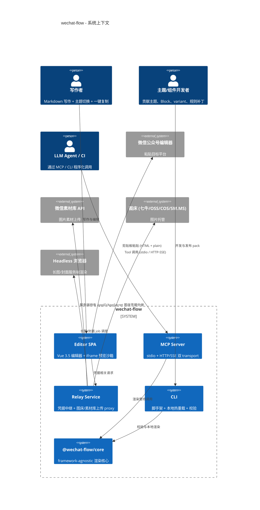
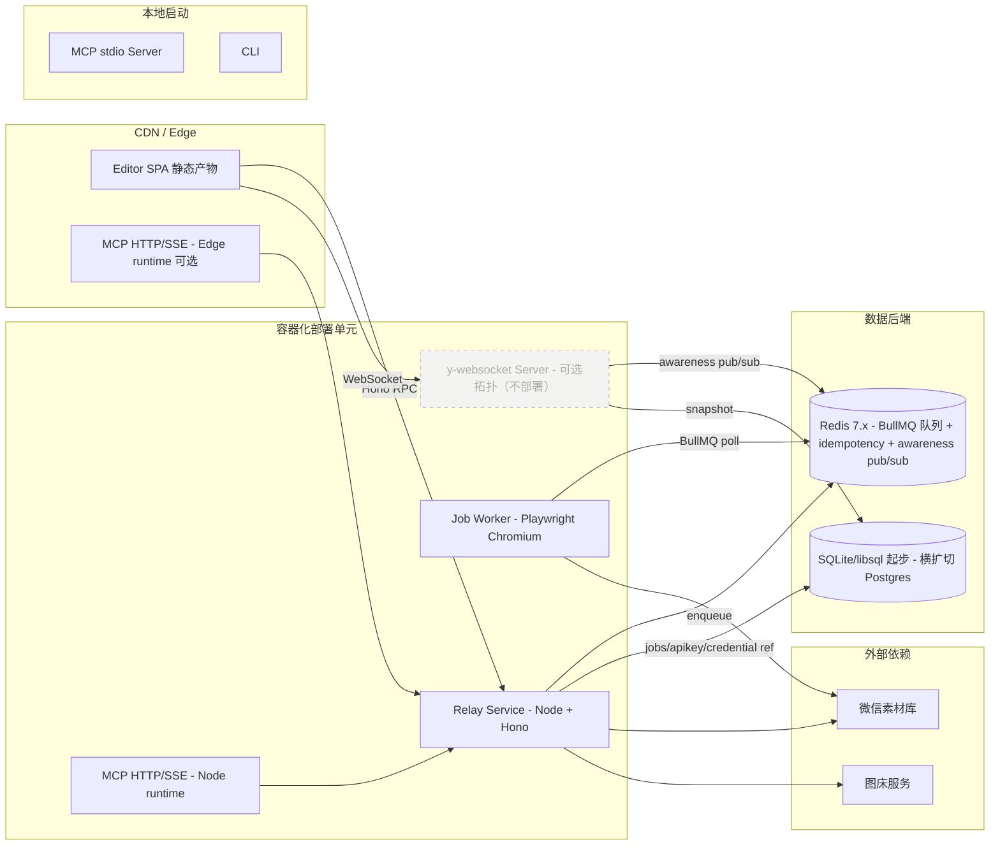

# Architecture: wechat-flow

[NAV]
- §1 架构概览 → §1.1 项目类型, §1.2 架构风格, §1.3 系统上下文图, §1.4 技术栈
- §2 模块划分 → 见分卷 arch-wechat-flow-modules（M-001..M-013）
- §3 接口契约 → 见分卷 arch-wechat-flow-api（API-001..API-016 含合并条目、API-017..API-033，其中 API-033 = describe_template）
- §4 数据模型 → 见分卷 arch-wechat-flow-data（E-001..E-011，其中 E-011 = TemplateDefinition）
- §5 非功能架构 → §5.1 性能, §5.2 可靠性与确定性, §5.3 安全, §5.4 兼容性, §5.5 可观测性
- §6 部署架构 → §6.1 分发形态, §6.2 部署单元, §6.3 后端服务部署
- §7 开发约定 → §7.1 命名, §7.2 目录, §7.3 测试, §7.4 CI, §7.5 Git
- §8 附录 → §8.1 F→M 覆盖表, §8.2 决策记录
[/NAV]

## 1. 架构概览

### 1.1 项目类型

**类型**: fullstack

包含浏览器编辑器（Vue 3.5 SPA + Vite）、Hono BFF / 中继 / MCP HTTP server、Node 端 MCP stdio server、CLI、可热加载主题/插件 pack 体系。所有形态共享同一份 framework-agnostic 渲染核心包 `@wechat-flow/core`。

### 1.2 架构风格

**风格**: monorepo + 共享渲染核心 + 多端壳（Editor / MCP / CLI / Relay）+ 插件沙箱（Web Worker） + 异步 job 队列

- **核心抽象**: 渲染管线为纯函数式 stage 链（`mdast → hast → pre-paste-hast → post-paste-hast → inline-styled HTML`），所有 stage 无 DOM 依赖，可在浏览器主线程 / Web Worker / Node / Edge runtime 字节级一致执行
- **状态边界**: 编辑器 UI 状态（光标、视口、面板）属应用层；渲染输入（mdast/frontmatter/theme/ruleset 版本）属机制层；二者通过 use case 函数桥接，UI 不直接调用机制 stage
- **扩展边界**: 主题、Block / Mark、variant、规则补丁统一通过 pack 体系注入；core 不持有任何具体主题/组件常量；所有扩展点声明在 `@wechat-flow/plugin-api`

**备选与决策依据**：
- 备选 1（已否决）: 单一 SPA + 后端 monolith — 无法满足 PRD §3.3 跨四运行时一致性
- 备选 2（已否决）: micro-frontends（按主题/插件拆 host） — 性能预算 < 50ms 键入延迟与微前端通信成本冲突
- 选定方案理由：核心稳定（pure functions）+ 边缘可扩展（pack）+ 形态多样（多端壳）三者正交，每形态可独立演进而不破坏确定性渲染契约

### 1.3 系统上下文图



补充说明：
- 编辑器与后端通过 **REST + Hono `zValidator` 类型契约**连接（Editor SPA 通过 API-032 交换短期 JWT 后调用 API-017..020）；凭据（AppID/AppSecret / 图床 token）由 Relay 服务端持有，不进浏览器
- MCP server / CLI / 编辑器三端共享同一份 `@wechat-flow/core`，确定性渲染由共享代码 + 版本三元组双重保证
- Headless 浏览器作为长任务执行单元，由 Relay 通过 job 队列调度

### 1.4 技术栈

| 层次 | 技术 | 版本 | 生命周期 | 选型理由 | 调研来源 |
|------|------|------|----------|----------|----------|
| Monorepo | pnpm | 9.x | Active LTS | 严格依赖隔离 + workspace protocol，对插件沙箱 supply-chain 校验友好 | [rn-001](../research/tech-eval-stack-monorepo.md) |
| 任务编排 | Turborepo | 2.x | Active | 远程缓存 + 并行任务图，支撑规则集 fixture + Playwright 视觉回归矩阵 | [rn-001](../research/tech-eval-stack-monorepo.md) |
| 前端框架 | Vue | 3.5 (Vapor Mode) | Active | Volar TS 推导 + Vapor 性能接近 Svelte 5 + 中文社区生态丰富 | [rn-002](../research/tech-eval-stack-frontend.md) |
| 构建工具 | Vite | 6.x | Active | Vue 3.5 + Vapor Mode 一等公民、SSR / Worker bundle 链路成熟 | Vue 3.5 release notes |
| 编辑器引擎 | CodeMirror | 6.x | Active | 模块化、TS 原生、Markdown + directive 语法扩展能力强 | CodeMirror 6 docs |
| 后端框架 | Hono | 4.x | Active | Web Standards API + 多 runtime 同代码 + SSE 原生支持 | [rn-003](../research/tech-eval-stack-backend.md) |
| 运行时 (Node) | Node.js | 22.x LTS | Active LTS | LTS 至 2027-04，Web Standards API 覆盖完整 | Node.js release schedule |
| 运行时 (Edge) | Cloudflare Workers / Vercel Edge | wrangler 3.x + workerd (Cloudflare 2024.x runtime) | Active | Hono 多 runtime 一等公民，MCP HTTP transport 低冷启动选项；`@cloudflare/vitest-pool-workers` 0.x 与 workerd 同源跑 Miniflare 测试 | Hono multi-runtime docs / Cloudflare workerd release notes |
| 类型系统 | TypeScript | 5.x | Active | F-010 全链路类型推导基础，与 Vue 3.5 Volar + Hono RPC 协同 | TS release notes |
| Schema 校验 | Zod | 4.x (含 `@zod/mini` + `.toJSONSchema()`) | Active | F-013 AC-002 强类型 schema + 运行时校验、F-010 全链路类型推导；`.toJSONSchema()` 原生互转喂 LLM 通过 `describeBlock` 拿到 attrsSchema | Zod v4 release notes |
| Markdown 管线 | unified + remark + rehype | 17 / 15 / 13 | Active | mdast/hast 双 AST 体系成熟，五段管线 stage 化自然 | unified ecosystem docs |
| Directive 语法 | remark-directive | 4.x | Active | F-001 AC-002 容器/行内指令语法的事实标准 | remark-directive |
| CSS 内联化 | juice | 11.x | Active | F-004 AC-003 CSS 内联化；纯 JavaScript 实现跨四运行时无 Wasm 加载差异；`preserveImportant` / `removeStyleTags` / `applyHeightAttributes` 等选项确定性可控（决策记录 §8.2 Q3.9） | juice docs |
| 插件沙箱 | Web Worker + Comlink RPC | — | — | F-010 AC-008 沙箱隔离，主线程与 Worker 间结构化克隆；网络访问"仅事件通道"模型（§5.3） | PRD §3.2 候选 + Comlink docs |
| Job 队列 | BullMQ + Redis | 5.x / Redis 7.x | Active | F-005 长图任务 + F-006 图片上传重试的成熟队列能力（重试、延迟、优先级、rate-limit、SSE 进度推送）；Node 端事实标准 | BullMQ docs |
| Headless 渲染 | Playwright (Chromium) | 1.4x | Active | F-005 长图/封面服务端渲染；与 §7.3 视觉回归共用同一 runner，避免双引擎维护 | Playwright docs |
| 视觉回归 | Playwright | 1.4x | Active | F-011 AC-004 截图 diff 矩阵，跨浏览器一致 | Playwright docs |
| 测试框架 | Vitest + Playwright + `@cloudflare/vitest-pool-workers` (Miniflare) | Vitest 2.x / Playwright 1.4x / vitest-pool-workers 0.x | Active | F-013 AC-001 跨四 runtime 字节级一致：Vitest 跑 Node + 浏览器主线程，Playwright 跑 e2e + 视觉回归，Miniflare/workerd 跑 Edge runtime；与 PRD §3.3 跨运行时一致性目标对齐 | Vitest / Playwright / Cloudflare Workers Vitest 集成 docs |
| 浏览器持久化 | IndexedDB (via idb) | idb 8.x | Standard | F-001 AC-005 本地草稿 + 多文档管理 | MDN IndexedDB |
| 同步协议（可选拓扑） | Yjs + y-codemirror.next + y-websocket | yjs 13.6.x / y-codemirror.next 0.3.x / y-websocket 服务端进程 | Active | F-012 协作与同步保留的架构候选；当前发布不部署 YwsServer，依赖关系与 Y.Doc 模型保留以便后续激活协作能力 | yjs / y-codemirror.next docs + [rn-004](../research/tech-eval-stack-sync-protocol.md) |
| 服务端持久化 | SQLite (libsql / better-sqlite3) 起步，Postgres 横扩备选 | libsql 0.x / better-sqlite3 12.x / Postgres 16.x | Active | 自托管首选 SQLite 单文件低运维；托管 SaaS 横向扩展路径走 Postgres；deploy-spec 按部署形态终定 | libsql / better-sqlite3 / Postgres docs |
| 服务端缓存与协同中继 | Redis | 7.x | Active | BullMQ 后端、idempotency 缓存、awareness pub/sub 同源单一组件 | Redis docs |

## 2. 模块划分

模块定义见分卷 [arch-wechat-flow-modules](./arch-wechat-flow-modules.md)，含 M-001..M-013。本主卷 frontmatter `sections_in_volumes."2"` 指向该分卷，`cataforge docs load arch-wechat-flow#§2.M-NNN` 由 doc-nav 路由到对应分卷条目。

## 3. 接口契约

接口定义见分卷 [arch-wechat-flow-api](./arch-wechat-flow-api.md)，含 API-001..API-016（合并条目）+ API-017..API-033（其中 API-033 = `describe_template`）。本主卷 frontmatter `sections_in_volumes."3"` 指向该分卷。

**MCP Tool 总数对账**：§3.1 共 23 个 Tool（17 同步 + 6 异步）= API-001..API-015（15 同步）+ API-016 合并条目（4 异步长任务 + `get_job` + `get_ruleset_version`，1 同步 + 5 异步混编实为 1+5 中 `get_ruleset_version` / `get_job` 视作同步轮询入口，按调用模型 16 同步 + 6 异步）+ API-033 `describe_template`（1 同步）。与 PRD §1.2.2 交付形态表的「MCP server 覆盖 23 个 Tool」字面一致。

## 4. 数据模型

数据模型见分卷 [arch-wechat-flow-data](./arch-wechat-flow-data.md)，含 E-001..E-011（其中 E-011 = TemplateDefinition 打包实体，承载 F-008 主题预设变体）。本主卷 frontmatter `sections_in_volumes."4"` 指向该分卷。

## 5. 非功能架构

### 5.1 性能

| 场景 | 目标 (PRD §3.1) | 架构机制 |
|------|----------------|----------|
| 万字键入延迟 P95 < 50ms | 编辑器响应 | 增量解析（CodeMirror 6 syntax tree 增量更新）+ 渲染管线增量执行（mdast diff 驱动，仅重渲染受影响子树）+ Vapor Mode 命令式 DOM 更新 |
| 主题切换 < 200ms | 重跑后段管线 | 主题切换不重跑 mdast 解析，仅重跑 `hast → pre-paste → post-paste → inline-styled HTML`；token 字典预编译为 CSS-in-JS 字面量映射 |
| MCP `render_markdown` 冷启动 P95 < 800ms | 万字稿件 | 渲染核心 `@wechat-flow/core` lazy import + pack 按需加载 + Edge runtime 部署形态时 V8 isolate < 50ms 冷启 |
| 视觉回归 CI 时长 | 不阻塞 PR | Turborepo affected 检测 + 远程缓存，仅 fixture / 主题受影响时跑对应子矩阵 |

### 5.2 可靠性与确定性

| 维度 | PRD 要求 | 架构机制 |
|------|---------|----------|
| 确定性渲染 | PRD §3.3 — 同输入产出 SHA-256 一致 HTML | 渲染管线全部为纯函数 stage；core 不依赖 `Math.random` / `Date.now` / 文件系统 / 网络；序列化使用稳定排序的属性 key（详细规范见下方"确定性容器迭代规范"） |
| 跨运行时一致性 | PRD §3.3 — 浏览器主线程 / Web Worker / Node / Edge 四运行时字节级一致 | core 仅依赖 Web Standards API（`TextEncoder` / `URL` / `crypto.subtle`）；CI 矩阵在四 runtime 各跑 SHA-256 一致性测试 |
| 版本三元组 | PRD §1.3 — `coreVersion + themeVersion + rulesetVersion` | `@wechat-flow/core` package.json `version` + 主题 manifest `version` + 规则集 manifest `version` 三者在 `render_markdown` 响应中透传 |
| 规则集回归 | PRD §3.3 — 100% CI 通过 | 两层 fixture：规则级（每条规则 `input.html` / `expected.html`，hast→hast）+ 端到端（Markdown → 最终 HTML） |
| 主题守护 | PRD §3.3 — 9 维静态校验阻断发布 | 主题 CI 任务在 `pnpm --filter @wechat-flow/themes-* validate` 跑 9 维校验（含「内置 template 完整性」维，对应 F-011 AC-009），任一不通过阻断；执行器位于 M-005 `guard/nine-dimensions.ts` + `guard/validate-theme-templates.ts` |
| 错误恢复 | F-010 AC-008 | 插件沙箱 Worker 异常时降级为占位符 + 上报诊断；不污染主渲染管线 |
| 异步任务 | F-005 / F-013 AC-004 | 长任务统一 job 模型；job 状态机 `pending → running → succeeded / failed`；`Idempotency-Key = sha256(input + toolsetVersion)` 去重 |

#### 确定性容器迭代规范

JavaScript 的 `Map.entries` / `Set.values` / `Object.keys` 迭代顺序虽然在 ES2015+ 由规范统一为插入序，但跨四 runtime（V8 / SpiderMonkey / WebKit / workerd）实测在数字键自动排序与符号键边界仍有差异。为保证 SHA-256 字节级一致，core 强制以下规范：

- **禁用** `Object.keys` / `Object.entries` / `Object.values` 隐式顺序，所有遍历前显式 `.sort()`（默认按字典序，特殊场景声明 comparator）
- **禁用** `Map.entries` / `Map.keys` / `Map.values` 直接遍历用于序列化，先 `[...map.entries()].sort(([a], [b]) => a < b ? -1 : a > b ? 1 : 0)` 再消费
- **禁用** `Set.values` 直接序列化，先 `[...set].sort()`（元素须可比较；混合类型 set 在 core 内部禁止）
- **JSON 序列化** 统一用 canonical JSON（按 key 字典序排序、不输出 undefined、不依赖 `JSON.stringify` 默认实现），位于 `packages/core/src/utils/canonical-json.ts`
- **浮点运算** 在样式 token 派生（如 paint 调色板距离计算）必须用定点整数（×1000 整数运算）或 `fractions.js` 等定点库；任何中间浮点结果先 `Math.round(value * 1000) / 1000` 截断到 3 位小数再参与下游
- **辅助函数** 集中在 `packages/core/src/utils/deterministic.ts`：`sortedKeys(obj)` / `sortedEntries(obj)` / `sortedSet(set)` / `canonicalStringify(obj)`；M-002 五段管线内禁止跳过这层

`tests/cross-runtime/` 在每个 stage 的输出上跑 SHA-256 对比，任何跨 runtime 差异直接定位到违反此规范的代码点。

### 5.3 安全

| 维度 | PRD 要求 | 架构机制 |
|------|---------|---------|
| 凭据隔离 | PRD §3.2 — AppID/AppSecret / 图床 token / MCP API key 服务端持有 | Relay 服务持有凭据；浏览器仅持短期会话 token；凭据存储引擎抽象（环境变量 / KMS / Vault 二选一，devops 阶段定）|
| 沙箱隔离 | F-010 AC-008 / PRD §3.2 | 第三方插件运行在 Web Worker；Comlink RPC 仅暴露白名单 API（`registerBlock` / `registerVariant` / `registerRule`）；**网络访问采用"仅事件通道"模型**：Worker 启动时执行 `assertNetIsolation()`：`delete globalThis.fetch / XMLHttpRequest / WebSocket / EventSource`，紧随其后断言 `typeof globalThis.fetch === 'undefined' && typeof globalThis.XMLHttpRequest === 'undefined'`，否则抛 `E_WORKER_NETWORK_LEAK` 并终止 Worker；插件如需访问网络必须调用 `plugin-api.requestResource(url, init)` → 主线程接收请求 → 主线程依据 pack manifest `permissions.network[]` 白名单做 ACL 检查 → 主线程代为 fetch → 通过 Comlink 把 `Response` 结构化克隆回沙箱；ACL 检查拒绝时抛 `E_PERMISSION_DENIED`；CI 集成测试覆盖 Vite Worker bundle / Comlink 边界，禁止在 Worker 依赖图引入带 fetch 的库；放行调用与隔离断言失败均写入 §5.5 审计日志 |
| MCP 鉴权 | F-013 AC-004 | 两级 API key：**普通 user key**（`scope=user`，调用 23 个 Tool + Relay 业务端点）+ **admin key**（`scope=admin`，独立鉴权基线，仅可调 API-028..API-031 管理端点）；per-key 配额（rate-limit 中间件）；key 创建 / 列出 / 轮换 / 吊销暴露 admin API（见 arch-wechat-flow-api §3.5）；key 哈希存储（不存明文，仅创建时一次性返回明文） |
| XSS 防护 | PRD §3.2 | **sanitizer 选型 `rehype-sanitize` 6.x**（基于 `hast-util-sanitize` 5.x，详见 [rn-005](../research/tech-eval-stack-sanitizer.md)）：在 `hast → pre-paste-hast` stage 强制执行；白名单 schema 位于 `packages/core/src/sanitize/schema.ts` 导出 `wechatFlowSanitizeSchema`，类型 `Schema` 由 `hast-util-sanitize` 提供；schema 基于 `defaultSchema` deepmerge：放行 inline `style` 属性 + 自定义 Block 标签，全量移除 `on*` 事件处理器，限制 `href`/`src` 协议为 `https?` / `mailto`；sanitizer 之后追加 `pipeline/css-attr-filter.ts` 做 CSS 属性二级白名单（拒绝 `expression(` / `javascript:` / `behavior:` / `@import`）；directive 参数经 schema 校验后再注入；iframe 预览见下方"预览 iframe 沙箱" |
| 传输安全 | PRD §3.2 | 中继与 MCP HTTP 端点强制 TLS；编辑器与 Relay 跨域走 CORS 白名单 |
| 凭据传输 | PRD §3.2 | 凭据相关请求 Authorization header 不进 URL；query string 不允许携带 token |
| 剪贴板 | F-004 AC-002 | HTTPS + 用户手势触发 Clipboard API；不在事件之外的回调使用剪贴板 |

#### 预览 iframe 沙箱

编辑器右栏预览 iframe 的完整沙箱策略：

- **加载方式**: `<iframe srcdoc="...inline-styled HTML..." sandbox="">`；通过 `srcdoc` 内联渲染产物，iframe origin 为 `null`（opaque origin），与父页面同源策略完全隔离
- **sandbox 标志**: 空属性（最严格档位，等价于禁用 scripts / forms / popups / pointer-lock / same-origin 等所有特权）；origin 为 null 使 iframe 内代码无法访问父页面 `document.cookie` / `localStorage` / `sessionStorage` / `IndexedDB`
- **CSP**: iframe 渲染产物附加 `<meta http-equiv="Content-Security-Policy" content="default-src 'none'; style-src 'unsafe-inline'; img-src https: data:; font-src https: data:;">`（不允许任何脚本源、不允许 `eval`）。sandbox 与 CSP 形成两层一致的"完全禁 JS"边界：sandbox 阻止 iframe 内任何脚本上下文创建，CSP 兜底覆盖 sandbox 配置失误场景
- **设计意图**: 微信公众号编辑器粘贴过滤剥离 `<script>` 与所有 `on*` 事件，最终发布产物零 JS。预览引入 JS 会产生"本地能跑、公众号不能跑"的视觉偏差，违背 PRD §1.1 视觉一致性承诺
- **UI 钩子全部由主线程承担**: 编辑器主线程通过 `iframe.contentDocument.scrollTo()` 控制目录跳转与源码↔预览高亮联动（节点用 `data-node-id` 属性定位）；复制按钮等覆盖层在主线程渲染、定位在 iframe 上方，点击事件由主线程消费源 Markdown 拼装剪贴板 payload，不穿透 iframe；视口切换由主线程改 iframe 容器尺寸实现
- **二级防御**: sanitizer 默认 schema 全量移除 `on*` 属性 + CSS 属性二级白名单拒绝 `javascript:` / `expression()`；即使 iframe 沙箱配置回归失误，注入 vector 也被前置过滤拦截

### 5.4 兼容性

| 平台/场景 | PRD §3.4 要求 | 架构机制 |
|----------|--------------|----------|
| 桌面浏览器 | Chrome 100+ / Safari 15+ / Edge 100+ | Vite target `es2022` + Vue 3.5 polyfill 策略；Clipboard API / IndexedDB / Web Worker / iframe sandbox 全部为基线特性 |
| 移动端浏览器 | 不要求完整功能 | 编辑器在 < 768px 视口降级为只读预览 + 剪贴板单按钮（Firefox 移动端纯前端剪贴板降级）|
| 公众号粘贴 | 视觉差异 ≤ 5% | 渲染管线末端粘贴过滤模拟 stage 完整复现 42+ 条规则；导出前自动跑模拟 |
| 微信客户端渲染 | ≥ 42 条规则集对齐 | 规则集独立版本化包 `@wechat-flow/ruleset`；规则补丁可热加载（F-011 AC-005）|

### 5.5 可观测性

- **诊断输出**：渲染管线在每个 stage 产出 `Diagnostic[]`（severity / ruleId / nodeRef / message），最终汇聚到 `render_markdown` 响应的 `diagnostics` 字段
- **结构化日志**：后端服务统一 JSON 日志（`level / ts / requestId / tool / latencyMs / coreVersion / rulesetVersion`）；具体日志收集后端由 devops 阶段在 deploy-spec 中规划
- **指标埋点**：MCP server / Relay 暴露 `/metrics`（Prometheus 格式）；关键 SLI：`render_markdown_latency_ms`、`job_queue_depth`、`paste_simulation_diff_ratio`
- **审计追溯**：版本三元组与 `Idempotency-Key` 写入每条 job 记录，支持按输入哈希定位历史 job 结果

## 6. 部署架构

### 6.1 分发形态

| 形态 | 目标用户 | 部署单元 | 后端依赖 |
|------|---------|---------|---------|
| 浏览器编辑器 SPA | 写作者 | `apps/editor` 静态产物 → CDN 托管 | 仅在使用图床上传 / 素材库上传 / 长任务时调用 Relay |
| MCP server (stdio) | LLM Agent (本地嵌入) | `apps/mcp-server` Node 二进制 / npx 启动 | 可选连接 Relay 共享凭据 |
| MCP server (HTTP/SSE) | LLM Agent (远程) | `apps/mcp-server` Node 容器 / Edge runtime | 与 Relay 共部署或独立部署 |
| CLI | 主题/组件开发者 | `apps/cli` npm 包，`npx @wechat-flow/cli` 启动 | 无（纯本地） |
| Skill bundle | LLM Agent / 自动化调用方 | `apps/skill/`（含 `SKILL.md` + 资源目录 + 编排示例），可作为 Claude Code 等 Agent 框架的 Skill 单元加载 | 复用 MCP server / Relay |
| Relay 中继服务 | 服务端凭据托管 | `apps/relay` Node 容器 | 持有微信公众号 / 图床凭据；外接 Headless 浏览器 |

### 6.2 部署单元拓扑



### 6.3 后端服务部署边界

- **共享渲染核心**：`@wechat-flow/core` 作为 npm 包发布到私有 registry（或 GitHub Packages），所有形态以 `workspace:*` 或 fixed semver 引用
- **Relay 与 MCP HTTP 服务**：默认共部署（同容器、不同 path prefix）；高负载场景可拆分
- **Job Worker (Playwright Chromium)**：长任务执行器独立部署，避免阻塞 HTTP 服务事件循环；进程内运行 Chromium headless（`chromium-headless-shell`），从 BullMQ 拉 job、写结果到对象存储后回写 Job 记录；容器化或进程池形态由 deploy-spec 决策
- **Redis 实例**：单实例承载三类用途——BullMQ 队列后端（`bullmq:wechatflow:*` 命名前缀）+ MCP idempotency 缓存（key=`idem:{apiKeyId}:{sha256}` TTL 24h）+ Yjs awareness pub/sub channel（`yjs:awareness:{docId}`）
- **y-websocket Server**：可选拓扑，当前发布不部署；保留以便后续协作与同步能力激活时无需重新设计架构。如启用：独立 Node 进程或与 Hono 同进程 integration（按部署规模择优）；接受 WebSocket 连接、维护 Y.Doc 内存副本、订阅 Redis awareness channel；周期性 snapshot 持久化到 SQLite/Postgres（节流：每 60s 或 100 ops）
- **持久化**：
  - 客户端：编辑器侧 IndexedDB（E-001 Document + E-007 UploadRecord 客户端缓存）
  - 服务端首选 SQLite（libsql / better-sqlite3 12.x）单文件低运维：自托管 Relay 默认启动即用；横扩场景由 deploy-spec 切到 Postgres 16.x（等价 DDL 见分卷 [arch-wechat-flow-data.md](./arch-wechat-flow-data.md) §4.x）
- **Job 命名规范**：BullMQ 队列名 `bullmq-{kind}`，kind ∈ {`image-upload` / `wechat-asset-upload` / `long-image-render` / `cover-render`}；job name 形如 `<kind>:<apiKeyId>:<idempotencyKey-prefix8>`
- **部署形态备注**：MCP HTTP 端点同时支持 Node 容器与 Cloudflare Workers / Vercel Edge；Edge 形态下 BullMQ 不可用，长任务统一回落到 Node Relay；CLI / MCP stdio 纯本地启动不依赖任何后端
- **Editor → Relay 鉴权链路**: Editor SPA 静态构件本身无凭据；首次加载调用 `POST /api/v1/editor/session`（API-032）交换 ≤15min JWT；后续 API-017..020 调用以此 JWT 鉴权。OAuth bootstrap 由 deploy-spec 阶段按托管 / 自部署形态选择 provider；匿名 bootstrap 默认开启但 wechat-asset 路径不可达。

#### 部署约束基线

各后端组件的网络端口与资源参考值（deploy-spec 按实际规模与负载调整）：

| 组件 | 端口（默认） | 进程数 / 连接数 | 内存基线 | 备注 |
|------|-------------|----------------|---------|------|
| Relay (Hono) | 8787 (HTTP) | 1 进程 × (cpu_count) workers | dev 256MB / prod 1GB | 同容器与 MCP HTTP 共部署时端口复用，path prefix 区分 |
| MCP HTTP/SSE | 8787（与 Relay 同进程）或 8788（独立） | 同上 | 同上 | Edge runtime 部署形态由 workerd 进程承载，单 isolate < 128MB |
| Job Worker (Playwright Chromium) | 无对外端口 | 进程数 = `min(cpu_count, 4)` | 每进程 1GB（含 Chromium ~400MB + workdir ~200MB + Node heap ~400MB） | 单 job 超时 60s；超时即 SIGTERM 并 BullMQ retry |
| y-websocket Server | 8789 (WS) | 单实例建议 ≤ 10000 并发 WS 连接；超过拆多实例 + Redis pub/sub | dev 256MB / prod 1GB | 客户端心跳 25s；断线 30s 清理 awareness |
| Redis | 6379 (默认) | 单实例（dev/小规模 prod）；多实例时由 BullMQ 分片 | dev 256MB / prod 1GB；满载告警阈值 80% | 三类用途同一实例：BullMQ + idempotency + awareness pub/sub；网络仅对后端组件开放，禁止暴露公网 |
| SQLite (libsql) | 无（嵌入式）或 8090 (libsql server) | — | 数据卷 SSD，预留 ≥ 10GB | 横扩切 Postgres 时端口 5432 |

> 上表数值为基线参考，具体生产环境由 deploy-spec 阶段按 SLO（PRD §3.1 性能预算）与实际并发负载校准；Edge runtime 形态下 BullMQ / Playwright / y-websocket 均不可用，相应能力回落到 Node Relay。

## 7. 开发约定

### 7.1 命名规范

- **包**：scope `@wechat-flow/*`，名称 kebab-case，如 `@wechat-flow/core`、`@wechat-flow/ruleset`、`@wechat-flow/theme-magazine`
- **目录**：kebab-case
- **TS 文件**：kebab-case `.ts` / `.tsx`；Vue SFC PascalCase `.vue`（组件）/ kebab-case（页面）
- **类型 / 类**：PascalCase；接口前缀不加 `I`
- **常量**：UPPER_SNAKE_CASE
- **API path**：`/api/v1/{resource}`；MCP Tool 名 snake_case（与 PRD F-013 既定 tool 名一致）
- **模块 ID**：`M-{NNN}`；接口 ID：`API-{NNN}`；实体 ID：`E-{NNN}`

### 7.2 目录结构

```text
wechat-flow/
├── apps/
│   ├── editor/              # Vue 3.5 编辑器 SPA
│   ├── mcp-server/          # MCP server (stdio + HTTP)
│   ├── relay/               # 凭据中继 + 上传 proxy
│   ├── cli/                 # 主题/插件 CLI 脚手架
│   └── job-worker/          # Headless 渲染执行器
├── packages/
│   ├── core/                # framework-agnostic 渲染核心
│   ├── contracts/           # Hono RPC + MCP Tool schema
│   ├── plugin-api/          # 主题/插件公共 API surface
│   ├── ruleset/             # 微信平台过滤规则集
│   ├── themes/              # 内置 5 套主题
│   │   ├── default/
│   │   ├── magazine/
│   │   ├── literary/
│   │   ├── business/
│   │   └── tech/
│   ├── blocks/              # 内置 Block 组件
│   ├── marks/               # 内置 Mark 组件
│   ├── palette/             # 调色板派生 (base-color)
│   └── zh-typo/             # F-014 中文排版修订
├── skill/
│   ├── SKILL.md             # F-013 AC-003 Skill bundle 编排说明
│   ├── prompts/             # 典型语义任务的 system prompt 片段
│   └── resources/           # SKILL.md 引用的样例 Markdown / 主题示例
├── tests/
│   ├── ruleset-fixtures/    # 规则级 input/expected fixture
│   ├── e2e-fixtures/        # 端到端 Markdown 输入 → HTML
│   ├── visual-regression/   # Playwright 截图基线
│   └── cross-runtime/       # 浏览器/Worker/Node/Edge 一致性测试
├── docs/                    # 全部框架产出物（PRD / ARCH / ...）
├── .cataforge/              # framework 元资产
├── turbo.json
├── pnpm-workspace.yaml
└── package.json
```

### 7.3 测试约定

- **测试框架**: Vitest（共享 core / plugin / utility 包）+ Playwright（视觉回归 + 端到端编辑器）
- **fixture 组织**: 规则级 fixture 与端到端 fixture 物理分离；fixture 文件由测试运行时校验，无需手维护 manifest
- **跨运行时一致性矩阵**：`tests/cross-runtime/` 在 4 个 target 上对同一 fixture 集跑 SHA-256 字节级一致性：

  | target | 实现方式 | 入口包 |
  |--------|---------|--------|
  | node | `vitest --environment node` | `@wechat-flow/core` |
  | worker | `vitest --environment happy-dom` + Web Worker harness | `@wechat-flow/core` |
  | edge | `@cloudflare/vitest-pool-workers` (miniflare) | `@wechat-flow/core` |
  | browser-main | Vitest browser mode (`@vitest/browser`) 或 Playwright `page.evaluate` import core | `@wechat-flow/core` |
- **TDD 模式遵循**：默认 `tdd_mode: light`；规则集核心 / 沙箱边界 / 凭据中继路径走 `tdd_mode: standard`（由 tech-lead 标 `security_sensitive: true`）
- **覆盖率**：核心 stage `@wechat-flow/core` 行覆盖率 ≥ 90%；其他包 ≥ 80%

### 7.4 CI 约定

- **任务图**：`lint → typecheck → unit-test → ruleset-fixture → cross-runtime → theme-guard → visual-regression`
- **缓存策略**：Turborepo 远程缓存，按 `package.json` + 源码 hash 命中
- **门禁**：规则集 fixture 100% 通过、主题 9 维守护通过（含内置 template 完整性，F-011 AC-009）、视觉回归 ≤ 5% 像素差异
- **CI runner**：Linux Node 22.x LTS + Chromium（Playwright bundled）

### 7.5 Git 约定

- **分支**: `main`（默认）；feature 分支 `feature/<scope>` ；fix 分支 `fix/<scope>`；release tag `v{major}.{minor}.{patch}`
- **Commit**: 遵循 CLAUDE.md §全局约定；不在 commit message 外（即源码 / 文档）记录变更过程标签
- **版本策略**: SemVer；Public Tool Schema 破坏性变更走 major + ≥ 1 minor deprecation window（PRD F-013 AC-005）

## 8. 附录

### 8.1 F→M 覆盖表

| F-NNN | 功能名称 | 优先级 | 覆盖模块 (M-NNN) |
|-------|---------|--------|------------------|
| F-001 | 写作体验 | P0 | M-001 (编辑器 UI) / M-008 (应用层 use case) / M-012 (schema 契约层) / M-013 (浏览器端持久化) |
| F-002 | 视觉一致性与预览 | P0 | M-001 (编辑器 UI - 预览面板) / M-002 (渲染管线核心) / M-004 (粘贴过滤模拟器) |
| F-003 | 主题与组件系统 | P0 | M-005 (主题与组件注册中心) / M-006 (调色板派生) / M-002 (渲染管线核心) |
| F-004 | 一键复制与 HTML 导出 | P0 | M-002 (渲染管线核心) / M-004 (粘贴过滤模拟器) / M-008 (应用层 use case) |
| F-005 | 长图/封面 + 素材库上传 | P1 | M-010 (中继服务) / M-008 (应用层 use case) |
| F-006 | 图片处理 | P0 | M-010 (中继服务) / M-008 (应用层 use case) |
| F-007 | 微信平台适配规则集 | P0 | M-003 (过滤规则集引擎) / M-002 (渲染管线核心) |
| F-008 | 主题预设变体 (template) 与主题模板市场 | P1 | M-005 (主题与组件注册中心 — defineTemplate / listThemeTemplates / describeTemplate / validateTemplateCoverage) / M-001 (编辑器 UI — ThemeMarketGallery) / M-009 (API-033 describe_template Tool) |
| F-009 | 主题继承与品牌包 | P2 | M-005 (主题与组件注册中心) |
| F-010 | 开发者扩展与插件系统 | P1 | M-007 (插件沙箱与 plugin-api) / M-011 (CLI) / M-012 (schema 契约层) |
| F-011 | 质量保障 | P0/P1 | M-003 (过滤规则集引擎 — 含 lint/readability + lint/keywords + report/node-change-recorder) / M-004 (粘贴过滤模拟器) / M-005 (主题守护 9 维 — 含 guard/validate-theme-templates) / 测试基础设施 `tests/realworld/` (F-011 AC-008 实地验证) + `packages/core/src/theme-guard/template-coverage.test.ts` (F-011 AC-009 内置 template 完整性) |
| F-012 | 协作与同步 | P2 | M-013 (浏览器端持久化) / M-010 (中继服务 - 同步后端，可选拓扑保留) — 当前发布不交付本族任何 AC |
| F-013 | 程序化调用 (MCP/CLI/Skill) | P1 | M-009 (MCP server, 23 Tool — 含 API-033 describe_template) / M-011 (CLI) / M-008 (应用层 use case) / M-012 (schema 契约层) / `skill/` 目录 (Skill bundle，编排说明与 prompts) |
| F-014 | 中文排版修订 | P1 | M-008 (应用层 use case) / M-001 (编辑器 UI 命令入口) |

**覆盖验证**：14 个 F-NNN 全部至少被 1 个 M-NNN 覆盖；M-001..M-013 均承担至少 1 项功能。详细模块定义见 [`arch-wechat-flow-modules.md`](./arch-wechat-flow-modules.md)。

### 8.2 决策记录

7 项关键选型已通过用户访谈定稿（来源：EVENT-LOG `state_change` 记录）：

| 编号 | 决策 | 影响章节 |
|------|------|---------|
| Q2.1 | Zod 4（含 `@zod/mini` + `.toJSONSchema()` 原生互转） | §1.4、M-012 schema 契约层、所有 API request/response schema |
| Q2.2 | 仅事件通道（`requestResource(url)` → 主线程 manifest ACL → fetch） | §5.3、M-007 plugin-api surface |
| Q2.3 | Vitest + Playwright + Miniflare (`@cloudflare/vitest-pool-workers`) 三层覆盖 | §1.4、§7.3 测试约定 |
| Q3.1 | BullMQ + Redis 7.x | §1.4、§6.3、M-010 job 队列实现 |
| Q3.2 | Playwright (Chromium) 与视觉回归共用 runner | §1.4、§6.3、M-010 headless renderer |
| Q3.3 | Yjs + y-codemirror.next + y-websocket（用户覆盖 architect "推迟" 推荐） | §1.4、§6.3、M-013 同步协议、E-009/E-010 实体、API-026/API-027 接口 — 决策对比见 [rn-004](../research/tech-eval-stack-sync-protocol.md) |
| Q3.4 | SQLite (libsql / better-sqlite3) 起步，Postgres 横扩备选；具体由 deploy-spec 按部署形态确定 | §1.4、§6.3、所有服务端实体 DDL 同时给 SQLite + Postgres 等价语法 |
| Q3.5 | rehype-sanitize 6.x（基于 hast-util-sanitize 5.x）作为 XSS 防护 sanitizer；五段管线 hast 模型原生集成，跨四 runtime 兼容 | §5.3、M-002 sanitize/css-attr-filter 组件 — 决策对比见 [rn-005](../research/tech-eval-stack-sanitizer.md) |
| Q3.6 | API key 两级（user / admin）+ admin 端点鉴权基线（X-Admin-Request header + IP 白名单 + 审计日志）；admin 不可调 Tool | §5.3 MCP 鉴权、M-009 scope-guard、M-010 admin/api-keys + admin-guard、API-028..API-031 |
| Q3.7 | 渲染管线确定性容器迭代规范：禁用隐式 Object/Map/Set 顺序、统一 canonical JSON、定点数学 | §5.2 确定性容器迭代规范、M-002 `utils/deterministic.ts` + `utils/canonical-json.ts` |
| Q3.8 | iframe 预览沙箱：`srcdoc` + `sandbox=""`（空属性，完全禁 JS）+ CSP `default-src 'none'`；UI 钩子全部由主线程通过 `contentDocument` 与 overlay 承担，与微信公众号"产物零 JS"现实对齐 | §5.3 预览 iframe 沙箱、M-001 PreviewPane |
| Q3.9 | CSS 内联化库锁定 `juice` 11.x（纯 JavaScript、跨四运行时无 Wasm 加载差异、`options.preserveImportant` / `removeStyleTags` 等开关确定性可控）；不切换 `css-inline` (Wasm) 以避免 Edge/Worker 加载漂移；CI 黄金 fixture：**核心 5 篇** PRD 锁定样本（`tests/visual/samples/{theme}/article.md`，与 PRD §4 ASSUMPTION 同源）+ **≥5 篇补充 fixture**（`packages/core/src/__tests__/fixtures/`，覆盖 GFM baseline / 中文混排 / 嵌套 list / 空文档 / 超长段落等场景），总数 ≥ 10；CI 双向 SHA-256 守护全部场景 | §1.4 技术栈、M-002/M-008 内联化 stage、§7.4 CI 门禁 |
| Q3.10 | Skill bundle 形态：`skill/` 顶级目录（独立于 `apps/` 与 `packages/`），`SKILL.md` 描述编排意图、`prompts/` 存语义 prompt 片段、`resources/` 存示例 Markdown；Skill 不持有业务逻辑，仅引用 MCP Tool 调用顺序（list_themes → describe_block → render_markdown → simulate_paste → upload_to_wechat_asset 等）；与 MCP server 共版本号发布 | §6.1 分发形态、§7.2 目录结构、M-009 |
| Q3.11 | 渲染管线 simulatePaste 节点归属：`composeRender` 输出 `postPaste: false`（不含 M-004），M-002 五段管线终止于 inline-style；M-008 `composeCopy` / MCP `export_clipboard_payload` 显式在 stage 5 之后追加 simulatePaste 置 `postPaste: true`；Preview / `render_markdown` / 复制三路径布尔语义对账，杜绝双跑 | §5.2、M-002 stage 序列表、M-004 对外接口、M-008 composeCopy pipeline 约束 |
| Q3.12 | 规则集包名锁定 `@wechat-flow/ruleset` / `packages/ruleset`（删除全部 `wechat-spec` 残留引用）；命名理由：与 PRD F-007 `ruleset` 术语对齐 + 与 ARCH §1.4 / §5.4 / §7.2 原始声明一致 | M-002 css-attr-filter 注释、M-003 规则文件存放与版本化策略 |
| Q3.13 | M-003 作者侧 ruleset vs M-004 粘贴行为模拟边界：M-003 在渲染管线 `hast → hast` 执行全部 5 类作用域规则，目标产出符合微信约束的 HTML；M-004 仅复现微信编辑器**额外**的粘贴过滤行为（剥 `<style>` 标签 / `id` 属性、ul/ol → table 改写等），输入为 M-003 已处理后的 hast；共享 strip 子集声明在 `packages/ruleset/src/shared/paste-strip.ts` 导出 `pasteStripRuleIds: readonly RuleId[]`，M-003 与 M-004 均 import 同一常量，禁止重复执行 | M-002 stage 序列表、M-003 / M-004 components |
| Q3.14 | template 在 ARCH 层的注册与查询模型：采用主题命名空间隔离 — 主题是 template 的命名空间，`defineTheme.templates: Record<TemplateId, TemplateDef>` 嵌套字段与独立 `defineTemplate({ themeId, templateId, render })` API 等价两路注册，存储结构 `Map<themeId, Map<templateId, TemplateDef>>`；同名 templateId 在不同主题下独立定义；BlockRegistry / ThemeRegistry 暴露 `listThemeTemplates(themeId)` / `describeTemplate(themeId, templateId)` / `validateTemplateCoverage(themeId, templateId)` 三个查询方法；MCP 层 `describe_theme.templates` 返回 TemplateMeta 轻量元数据，正文须经 `describe_template` (API-033) 取得；主题守护 9 维新增「内置 template 完整性」维度由 `guard/validate-theme-templates.ts` 落地 — 落地 PRD F-008 AC-001..AC-004 与 F-003 AC-012 / F-011 AC-009 | §3 API-033 / §8.1 F-008 / F-011 / F-013 行、M-001 ThemeMarketGallery + DiagnosticsPanel 数据契约、M-005 register/list/describe/validate template 接口、M-005 guard/nine-dimensions + validate-theme-templates、M-012 theme/template-schema + diagnostic/structure |
