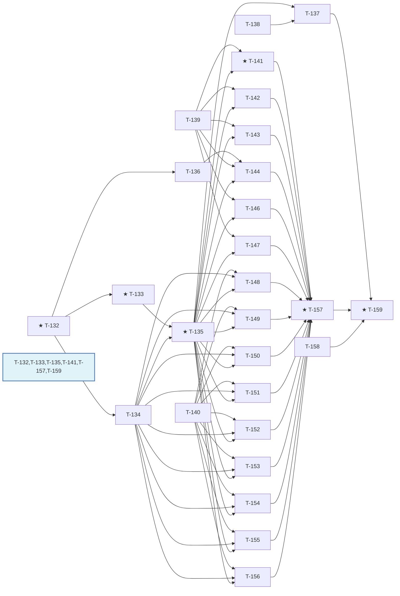

# Dev-Plan wechat-flow — Sprint 7（视觉升级批）任务卡

[NAV]
- Sprint 7 任务卡 → T-132..T-159
[/NAV]

## 1. 迭代目标

Sprint 7 目标：落地「视觉升级」amendment（arch v0.7.2 / ui-spec v0.3.1）——`BlockCategory` 6 值枚举驱动 InsertDrawer 分类数据化、40 内置 Block 冻结分类补全、5 主题 Markdown 基础元素排版规格补齐、9 个 Block 变体视觉规格填充。交付里程碑：`BlockDefinition.category` required 且全量 40 Block 覆盖；`getBlockBaseStyle` 四步解析补全（L1 内置 variant baseStyle 命中）；UC-015 InsertDrawer 6 分类 Tab + 搜索框数据驱动上线；5 主题 table/blockquote/strong/code-block/heading-accent/dropcap 视觉分化到位；9 组件变体（callout/divider/pull-quote/steps/quote/compare/dialog/announcement/gallery）真实形态落地；divider SVG 变体 sanitize schema 安全放行经审查闭环；design-first 轨道（Penpot 视觉基准）先于对应实现卡完成并经用户 sign-off。

本批任务依赖 arch `BlockCategory` / `BlockVariant.baseStyle` / `getBlockBaseStyle` 契约（`arch-wechat-flow-modules#§2.M-005`）与 ui-spec 三个新分卷（`ui-spec-wechat-flow-block-taxonomy#§8`、`ui-spec-wechat-flow-content-elements#§9`、`ui-spec-wechat-flow-block-variants#§10`）。

任务编号 T-145 空缺：`ui-spec-wechat-flow-content-elements#§9.6`（list-marker 主题色设计）核实为「marker 色彩差异化是低价值投入，维持默认继承行为即可满足可用性」，本身不产生开发工作量，故本批不为其单独产出任务卡（详见 T-139 AC-001 附带说明）。

---

## 2. 依赖图

关键路径：`T-132 → T-133 → T-135 → T-148 → T-157 → T-159`（关键路径权重 10）。`T-132`（BlockCategory 枚举 + BlockVariant.baseStyle 契约）是全批唯一根依赖；`T-135`（破坏性变更影响面修复）是 Layer 1/2 全部视觉实现卡的强制前置闸门——契约变更未在调用方（contracts/mcp-server/plugin-api/既有测试）落地前，任何视觉卡写入的 `category` / 新 `baseStyle` 字段都会被下游类型检查拒绝。

---

## 3. 任务卡详细

### T-132: BlockCategory 枚举 + BlockDefinition.category required + BlockVariant.baseStyle 契约

- **目标**: 在 `packages/core/src/registry/block.ts` 落地 `BlockCategory` 6 值枚举（`text|media|emphasis|structured|marketing|meta`）、`BlockDefinition.category` 改为 required 字段（无默认值）、`BlockVariant.baseStyle?` 可选静态样式字段（slot → cssProp → cssValue，与 block 级 `baseStyle` 同构）。
- **模块**: M-005
- **task_kind**: feature
- **priority**: P0
- **complexity**: small
- **sprint**: 7
- **tdd_mode**: light
- **tdd_acceptance**: all
- **tdd_refactor**: skip
- **security_sensitive**: false
- **dependencies**: []
- **acceptance_criteria**:
  - [x] AC-001: `registerBlock` 入参缺失 `category` 字段时 TypeScript 编译期报错（`BlockDefinition.category` 为 required，非 `?:`）[ARCH#§2.M-005]
  - [x] AC-002: `category` 类型仅接受字面量联合 `'text' | 'media' | 'emphasis' | 'structured' | 'marketing' | 'meta'`，赋值其他字符串字面量编译期报错 [ARCH#§2.M-005]
  - [x] AC-003: `BlockVariant` 接口新增 `baseStyle?: Record<string, Record<string, string>>`，缺省时该 variant 无 L1 静态样式（`undefined`，非 `{}`）[ARCH#§2.M-005]
  - [x] AC-004: `registerBlock` 校验逻辑不变——`baseStyle` 存在时仍强制含 `root` slot、`slots` 仍强制含 `root`（既有校验路径不因新增字段回归）
- **deliverables**:
  - [x] `packages/core/src/registry/block.ts` — `BlockCategory` 类型 + `BlockDefinition.category: BlockCategory` + `BlockVariant.baseStyle?`
  - [x] `packages/core/src/registry/block.test.ts` — category 类型契约测试 + 既有 root slot 校验回归测试（colocate 约定）
- **context_load**:
  - arch-wechat-flow-modules#§2.M-005
- **notes**: LOC_SIGNAL: 60。本卡是全批唯一无前置依赖的根任务，须最先完成。

---

### T-133: defineBlock 工厂签名升级 + 40 内置 Block 补 category

- **目标**: `packages/blocks/src/factory.ts` 的 `defineBlock` 工厂函数新增 `category: BlockCategory` 位置参数；`packages/blocks/src/blocks/*.ts` 全部 40 个内置 Block 按 `ui-spec-wechat-flow-block-taxonomy#§8.2` 冻结分类表逐一补齐 `category` 实参。
- **模块**: M-005
- **task_kind**: feature
- **priority**: P0
- **complexity**: medium
- **sprint**: 7
- **tdd_mode**: light
- **tdd_acceptance**: all
- **tdd_refactor**: skip
- **security_sensitive**: false
- **dependencies**: [T-132]
- **acceptance_criteria**:
  - [x] AC-001: `defineBlock(id, name, attrsSchema, category, variants, baseStyle?, slots?)` 新签名下 `category` 为必填位置参数（原有位置参数顺序不变，`category` 插入 `attrsSchema` 之后 `variants` 之前）[ARCH#§2.M-005]
  - [x] AC-002: `listBlocks()` 返回的 40 个 `BlockDefinition` 逐一核对 `category` 值与 `ui-spec-wechat-flow-block-taxonomy#§8.2` 冻结表完全一致（`text` 8 个 / `media` 6 个 / `emphasis` 7 个 / `structured` 7 个 / `marketing` 7 个 / `meta` 5 个，合计 40）
  - [x] AC-003: `table` 与 `definition-list` 两个易混淆 Block 的 `category` 均为 `text`（非 `structured`），验证归类依据（taxonomy §8.2 归类依据列）在测试断言中体现
  - [x] AC-004: `disclaimer` 的 `category` 为 `emphasis`（非 `meta`），验证归类依据在测试断言中体现
- **deliverables**:
  - [x] `packages/blocks/src/factory.ts` — `defineBlock` 签名新增 `category` 参数
  - [x] `packages/blocks/src/blocks/*.ts` — 40 个文件逐一补 `category` 实参
  - [x] `packages/blocks/src/blocks/block-category.test.ts` — 40 Block category 全量核对测试（含 table/definition-list/disclaimer 边界断言，根 tests/ 或 colocate 均可，就近落点）
- **context_load**:
  - arch-wechat-flow-modules#§2.M-005
  - ui-spec-wechat-flow-block-taxonomy#§8
- **notes**: LOC_SIGNAL: 200（40 文件各 1 行改动 + factory 签名 + 测试）。`tdd_mode: light` 豁免理由：200 LOC 中 40 处属同构单行改动（逐一补 `category` 实参，机械性重复、无分支/状态数增长），实际认知复杂度远低于常规 200 LOC 任务；仅 factory 签名扩展与测试断言部分具备常规实现复杂度，故维持 light 而非因 LOC 字面超阈值升 standard。

---

### T-134: getBlockBaseStyle 四步解析补全

- **目标**: `packages/core/src/registry/variant.ts` 的 `getBlockBaseStyle(blockId, variantId)` 当前仅实现步骤 1（`default` 读 block 级 `baseStyle.root`）与步骤 3（回退 `registerVariant` 运行时 store），缺失步骤 2（`variantId` 命中某内置 variant 且该 variant 自带 `baseStyle` 时优先读取）。补全四步解析顺序。
- **模块**: M-005
- **task_kind**: feature
- **priority**: P0
- **complexity**: small
- **sprint**: 7
- **tdd_mode**: light
- **tdd_acceptance**: all
- **tdd_refactor**: skip
- **security_sensitive**: false
- **dependencies**: [T-132]
- **acceptance_criteria**:
  - [x] AC-001: Given 某 block 注册时某内置 variant（非 `default`）携带 `baseStyle: { root: {...} }`，When 调用 `getBlockBaseStyle(blockId, thatVariantId)`，Then 返回值等于该 variant 的 `baseStyle.root`（非空对象，逐键匹配）[ARCH#§2.M-005 四步解析]
  - [x] AC-002: Given `variantId === 'default'`，When 调用 `getBlockBaseStyle`，Then 解析顺序不变——仍读 `blockDef.baseStyle.root`（步骤 1 优先级不受步骤 2 引入影响）
  - [x] AC-003: Given `variantId` 命中内置 variant 但该 variant 无 `baseStyle` 字段（`undefined`），When 调用 `getBlockBaseStyle`，Then 回退步骤 3（`registry/variant.ts` 运行时 store 查找），若 store 亦无命中则回退步骤 4（返回 `{}`）
  - [x] AC-004: Given `variantId` 既非 `default` 也未命中任何内置 variant 且运行时 store 无对应 entry，When 调用 `getBlockBaseStyle`，Then 返回 `{}`（步骤 4，非 `undefined` 非抛错）
- **deliverables**:
  - [x] `packages/core/src/registry/variant.ts` — `getBlockBaseStyle` 四步解析补全（读 `describeBlock(blockId)?.variants` 找 `variantId` 命中项的 `baseStyle?.root`）
  - [x] `packages/core/src/registry/variant.test.ts` — 四步解析全路径测试（含步骤 2 新增路径 + 步骤 1/3/4 回归，colocate 约定）
- **context_load**:
  - arch-wechat-flow-modules#§2.M-005
- **notes**: LOC_SIGNAL: 50。本卡是 Layer 2 全部变体卡（T-148..T-156）的强制前置——变体 `baseStyle` 不经四步解析补全就无法被 `inlineStyle` 真实消费。

---

### T-135: 破坏性变更影响面修复（contracts / mcp-server / plugin-api / 既有测试）

- **目标**: `BlockDefinition.category` 转为 required 后，逐一排查并修复受影响的下游调用方——MCP `list_blocks`/`describe_block` 工具响应补 `category`、plugin-api `DefineBlockInput`/`BlockRegistryEntry`/`RegistryBridge` 补 `category` 透传、既有 `tests/plugin-api/surface.test.ts` 与 `tests/contracts/tool-count.test.ts` 等调用 `registerBlock`/`defineBlock` 的测试补齐 `category` 实参。
- **模块**: M-005, M-009, M-007
- **接口**: API-005, API-006
- **task_kind**: fix
- **priority**: P0
- **complexity**: medium
- **sprint**: 7
- **tdd_mode**: standard
- **tdd_acceptance**: all
- **tdd_refactor**: auto
- **security_sensitive**: false
- **dependencies**: [T-133, T-134]
- **acceptance_criteria**:
  - [x] AC-001（API-005 正常路径）: Given 已注册 40 个内置 Block，When 调用 `listBlocksTool({})`，Then 返回数组每项含 `category` 字段且值 ∈ `text|media|emphasis|structured|marketing|meta`，与 `describeBlock(id).category` 一致 [ARCH#§3.API-005]
  - [x] AC-002（API-006 正常路径）: Given 某已注册 blockId，When 调用 `describeBlockTool({ blockId })`，Then 返回对象含 `category` 字段，值与该 block 注册时的 `category` 完全一致 [ARCH#§3.API-006]
  - [x] AC-003（API-006 错误路径）: Given 未注册的 blockId，When 调用 `describeBlockTool({ blockId })`，Then 返回 `{ code: 'E_NOT_FOUND', blockId }`（既有行为不回归，`category` 字段新增不影响错误路径结构）[ARCH#§3.API-006]
  - [x] AC-004: `packages/plugin-api/src/surface/plugin-api.ts` 的 `DefineBlockInput` / `BlockRegistryEntry` / `RegistryBridge.registerBlock` 三处类型新增 `category: BlockCategory` 字段，`createPluginSurface().defineBlock()` 实现将 `input.category` 透传进 `registry.registerBlock({ ..., category: input.category })`
  - [x] AC-005: `tests/plugin-api/surface.test.ts` 中全部 `surface.defineBlock({...})` 调用补齐 `category` 实参，测试套件全绿（不因新增 required 字段而编译失败）
  - [x] AC-006: 全仓 `pnpm typecheck`（含 `tests/tsconfig.json` 管辖的根 tests/）与 `pnpm vitest run` 因本卡改动新增的编译错误清零
- **deliverables**:
  - [x] `apps/mcp-server/src/tools/list-blocks.ts` — 响应对象补 `category`
  - [x] `apps/mcp-server/src/tools/describe-block.ts` — 响应对象补 `category`
  - [x] `packages/plugin-api/src/surface/plugin-api.ts` — `DefineBlockInput`/`BlockRegistryEntry`/`RegistryBridge`/`createPluginSurface` 补 `category` 透传
  - [x] `tests/plugin-api/surface.test.ts` — 全部 `defineBlock` 调用补 `category` 实参
  - [x] `tests/contracts/tool-count.test.ts` — 若涉及 `registerBlock`/`defineBlock` 调用同样补齐（按实际编译报错范围核实调整）
  - [x] `tests/mcp-server/tools/*.test.ts` — 涉及 `list_blocks`/`describe_block` 响应结构的既有测试补 `category` 断言（不新增测试文件时在既有文件内追加断言）
- **context_load**:
  - arch-wechat-flow-modules#§2.M-005
  - arch-wechat-flow-api#§3.API-005
  - arch-wechat-flow-api#§3.API-006
- **notes**: LOC_SIGNAL: 180。本卡是 Layer 1/2 全部视觉实现卡（T-141..T-156）与 UC-015 前端卡（T-137）的强制前置闸门——契约变更未在全部调用方落地前，下游卡的类型检查会因 `category` required 字段缺失而红。跨 3 个 arch 模块（M-005/M-009/M-007）+ 影响面排查故标 `tdd_mode: standard`。

---

### T-136: 新增 token `--color-code-block-bg`（×5 主题）

- **目标**: 在 5 套内置主题的 `tokens.ts` 中新增 `--color-code-block-bg` token（ARCH E-002 open record 内非破坏性追加），承载 `pre`（代码块）专属底色，与既有 `--color-code-bg`（inline code）区分语义。
- **模块**: M-005
- **task_kind**: chore
- **priority**: P1
- **complexity**: small
- **sprint**: 7
- **tdd_mode**: light
- **tdd_acceptance**: all
- **tdd_refactor**: skip
- **security_sensitive**: false
- **dependencies**: [T-132]
- **acceptance_criteria**:
  - [x] AC-001: 5 主题 `tokens.ts` 均新增 `--color-code-block-bg` 键，值按 `ui-spec-wechat-flow-content-elements#§9.5` 表逐一赋值：default `#F0EDE8` / business `#EEF2F7` / literary `#F2ECE0` / magazine `#FFF3E8` / tech `#1A1A2E`
  - [x] AC-002: 主题守护 9 维校验（`validateThemeGuard`）在新增 token 后仍全部通过（token 覆盖率维度不因新增而破坏既有基线）
- **deliverables**:
  - [x] `packages/themes/default/src/tokens.ts` — 新增 `--color-code-block-bg: #F0EDE8`
  - [x] `packages/themes/business/src/tokens.ts` — 新增 `--color-code-block-bg: #EEF2F7`
  - [x] `packages/themes/literary/src/tokens.ts` — 新增 `--color-code-block-bg: #F2ECE0`
  - [x] `packages/themes/magazine/src/tokens.ts` — 新增 `--color-code-block-bg: #FFF3E8`
  - [x] `packages/themes/tech/src/tokens.ts` — 新增 `--color-code-block-bg: #1A1A2E`
- **context_load**:
  - ui-spec-wechat-flow-content-elements#§9.5
- **notes**: LOC_SIGNAL: 15。`task_kind: chore` 跳过 TDD RED/GREEN，由 implementer 单次产出 + lint hook 兜底。T-144（代码块视觉实现）消费本卡产出的 token。

---

### T-137: UC-015 InsertDrawer 分类 Tab 数据驱动 + 搜索框 + UC-021 同步

- **目标**: `apps/editor/src/components/panel/InsertDrawer.vue` 从当前扁平列表升级为 6 分类 Tab（数据驱动自 `BlockDefinition.category`，前端仅硬编码 `category → 中文标签` 映射）+ 搜索框（跨分类过滤，搜索时不切 Tab、在当前 Tab 结果内过滤）；`DirectiveAutocompletePopover.vue`（UC-021）现有 `block/inline` 触发类型 Tab 与新 6 分类 Tab 是不同维度，需在 UC-021 侧新增分类子过滤或确认现有交互路径与 UC-015 语义同步（按 ui-spec UC-015/UC-021 章节裁定）。
- **模块**: M-001
- **接口**: API-005
- **task_kind**: feature
- **priority**: P0
- **complexity**: medium
- **sprint**: 7
- **tdd_mode**: standard
- **tdd_acceptance**: all
- **tdd_refactor**: auto
- **security_sensitive**: false
- **user_facing_critical_path**: true
- **dependencies**: [T-135, T-138]
- **acceptance_criteria**:
  - [x] AC-001: Given `listBlocks()` 返回 40 个 Block（含 6 种 `category`），When InsertDrawer 挂载，Then 渲染 6 个分类 Tab，顺序为 `BlockCategory` 枚举声明顺序（`text/media/emphasis/structured/marketing/meta`），默认选中第一个 Tab（`text`）[ARCH#§2.M-005] [ui-spec#UC-015]
  - [x] AC-002: Given 分类 Tab 标签文案，Then 前端硬编码的仅为 `category → 中文标签` 映射（`text`→「基础排版」/ `media`→「图文媒体」/ `emphasis`→「强调提示」/ `structured`→「结构化」/ `marketing`→「运营引流」/ `meta`→「元信息」），不硬编码分类清单本身（Tab 集合随 `BlockDefinition.category` 实际取值集合派生）
  - [x] AC-003: Given 用户点击某分类 Tab（如 `media`），When Tab 切换，Then 组件列表仅显示 `category === 'media'` 的 Block（6 个），不做加载态过渡
  - [x] AC-004: Given 用户在搜索框输入关键字，When 输入变化，Then 列表在当前选中 Tab 的结果集内按 Block 名称/id 模糊过滤（不切换当前 Tab）；Given 清空搜索框，Then 恢复该 Tab 全量列表
  - [x] AC-005: 无「全部」Tab——6 个分类 Tab 完整覆盖全部 40 个 Block，DOM 中不存在「全部」文案的 Tab 元素
  - [x] AC-006: 渲染后计算视觉核验——分类 Tab 行实际渲染高度 `40px`、搜索框实际渲染高度 `36px`，与 ui-spec 布局规格一致（非源码字面断言，取 `getBoundingClientRect()` 或等效渲染后计算值）
  - [x] AC-007: 视觉一致性审查通过——InsertDrawer 6 分类 Tab + 搜索框渲染结果与 T-138 产出的 Penpot 设计稿对应帧视觉一致（尺寸/色值/间距在容差内），经 `docs/reviews/design/DESIGN-REVIEW-UC-015-r{N}.md` reviewer 核验为 `approved`/`approved_with_notes`
- **deliverables**:
  - [x] `apps/editor/src/components/panel/InsertDrawer.vue` — 分类 Tab 行 + 搜索框 + 数据驱动过滤逻辑
  - [x] `apps/editor/src/components/panel/CATEGORY_LABELS.ts`（或就近内联常量）— `category → 中文标签` 映射表
  - [x] `apps/editor/src/components/panel/__tests__/InsertDrawer.test.ts` — Tab 渲染/切换/搜索过滤/无「全部」Tab 断言（既有测试文件扩展）
  - [x] `e2e/visual/design-overlay.spec.ts` — UC-015 STATIC_COMPONENTS 条目补充分类 Tab 触发前置操作（若既有 selector 需扩展覆盖 Tab 行）
- **context_load**:
  - arch-wechat-flow-modules#§2.M-005
  - ui-spec-wechat-flow#§2.UC-015
  - ui-spec-wechat-flow-block-taxonomy#§8
- **notes**: LOC_SIGNAL: 220。跨 2 个 arch 模块 + AC 含视觉一致性审查门禁，故标 `tdd_mode: standard`。依赖 T-138（Penpot 设计稿先行）与 T-135（category 契约落地）。UC-021 同步范围以 ui-spec UC-015/UC-021 实际交互裁定为准，若查证 UC-021 触发路径本身不承载 6 分类导航（`:::` 触发已是搜索输入语境）则本卡 AC 聚焦 UC-015，UC-021 侧仅需确认无冲突不新增交互面，此裁定记入 code-review 附注。

---

**Design-First 轨道（阻塞对应实现卡）**

### T-138: [DESIGN] PS-011 InsertDrawer 6 分类 Tab Penpot 帧追平

- **目标**: 将 `ui-spec-wechat-flow#§7.PS-011` 从「后续项、不阻塞」升格为本批阻塞性设计卡——在 Penpot 中把 UC-015 InsertDrawer 编辑器帧的旧 4 分类占位 Tab（行内/块级/标注/封面）替换为 6 分类 Tab（基础排版/图文媒体/强调提示/结构化/运营引流/元信息），追平 `BlockDefinition.category` 冻结决策。
- **task_kind**: design
- **tdd_acceptance**: skip
- **priority**: P0
- **complexity**: small
- **sprint**: 7
- **tdd_mode**: skip
- **tdd_skip_reason**: "Penpot 设计稿，由用户视觉验证 sign-off"
- **dependencies**: []
- **acceptance_criteria**:
  - [x] AC-001: Penpot UC-015 帧的分类 Tab 行更新为 6 个 Tab，顺序与文案与 `ui-spec-wechat-flow-block-taxonomy#§8.1` 完全一致（基础排版/图文媒体/强调提示/结构化/运营引流/元信息）
  - [x] AC-002: 帧内同步新增搜索框视觉元素（占位符「搜索组件…」），布局位置符合 UC-015 narrative（标题行下方、分类 Tab 行上方或按最终裁定位置）
  - [x] AC-003: 帧导出图路径 `docs/design/frames/components/UC-015.png` 更新覆盖（沿用 T-130 既有 design-overlay 固化路径约定，替换旧 4 分类占位截图）
  - [x] AC-004: 用户视觉 sign-off — 以 `event=user_decision` 写入 `docs/EVENT-LOG.jsonl`，`detail` 含 `design_signoff T-138: InsertDrawer 6 分类 Tab Penpot 帧确认` 字样，`ref=T-138`
- **deliverables**:
  - [x] Penpot UC-015 帧更新（6 分类 Tab + 搜索框）
  - [x] `docs/design/frames/components/UC-015.png` — 更新后帧导出
  - [x] `docs/EVENT-LOG.jsonl` — design_signoff 事件
- **notes**: Penpot 同步参考: ui-spec-wechat-flow#§7.PS-011, ui-spec-wechat-flow#§2.UC-015, ui-spec-wechat-flow-block-taxonomy#§8。本卡硬阻塞 T-137（UC-015 前端实现），可与 T-132（Layer 0 契约）并行。

---

### T-139: [DESIGN] Layer 1 基础元素排版 Penpot 视觉样张（5 主题对照）

- **目标**: 在 Penpot 中为 `ui-spec-wechat-flow-content-elements#§9` 定义的 7 类基础元素（table/blockquote/strong/code-block/list-marker/heading-accent/dropcap）各主题分化产出视觉样张（specimen），作为 T-141/T-142/T-143/T-144/T-146/T-147 实现前的视觉基准。
- **task_kind**: design
- **tdd_acceptance**: skip
- **priority**: P0
- **complexity**: medium
- **sprint**: 7
- **tdd_mode**: skip
- **tdd_skip_reason**: "Penpot 设计稿，由用户视觉验证 sign-off"
- **dependencies**: []
- **acceptance_criteria**:
  - [x] AC-001: 按元素族出样张页——每个基础元素（table/blockquote/strong/code-block/heading-accent/dropcap，6 个视觉分化元素；list-marker 因 §9.6 平台限制无跨主题差异化设计，不产出样张）产出 1 张 Penpot 样张页，页内并排展示 5 主题（default/business/literary/magazine/tech）该元素的渲染效果
  - [x] AC-002: 每张样张标注对应 ui-spec 章节色值/间距规格来源（如 table 样张标注 `--color-surface-alt` 等 token 名与实值），供实现卡逐项核对
  - [x] AC-003: 样张导出图固化到 `docs/design/frames/specimens/content-elements-{element}.png`（6 个文件：table/blockquote/strong/code-block/heading-accent/dropcap）
  - [x] AC-004: 用户视觉 sign-off — `event=user_decision` 写入 `docs/EVENT-LOG.jsonl`，`detail` 含 `design_signoff T-139: 基础元素排版样张确认` 字样，`ref=T-139`
- **deliverables**:
  - [x] Penpot 基础元素样张页 ×6（table/blockquote/strong/code-block/heading-accent/dropcap，各含 5 主题对照）
  - [x] `docs/design/frames/specimens/content-elements-table.png` 等 6 个导出文件
  - [x] `docs/EVENT-LOG.jsonl` — design_signoff 事件
- **notes**: Penpot 同步参考: ui-spec-wechat-flow-content-elements#§9。本卡硬阻塞 T-141/T-142/T-143/T-144/T-146/T-147，可与 T-132/T-138/T-140 并行。

---

### T-140: [DESIGN] Layer 2 Block 变体 Penpot 视觉样张（9 组件）

- **目标**: 在 Penpot 中为 `ui-spec-wechat-flow-block-variants#§10` 定义的 9 个 Block 变体族（callout/divider/pull-quote/steps/quote/compare/dialog/announcement/gallery）各产出视觉样张，作为 T-148..T-156 实现前的视觉基准。
- **task_kind**: design
- **tdd_acceptance**: skip
- **priority**: P0
- **complexity**: medium
- **sprint**: 7
- **tdd_mode**: skip
- **tdd_skip_reason**: "Penpot 设计稿，由用户视觉验证 sign-off"
- **dependencies**: []
- **acceptance_criteria**:
  - [x] AC-001: 按组件族出样张页——每个 Block 的全部目标变体（callout 4 态 / divider 3 装饰变体 / pull-quote decorated / steps card / quote large-quote-mark+dropcap / compare ledger / dialog chat-bubbles / announcement danger-bar+compact+default / gallery duo+triptych）在 1 张样张页内并排展示各变体形态差异
  - [x] AC-002: divider 的 wave/dots/flower 三个 SVG 变体样张附带 SVG 路径/形状参数标注（`viewBox`、`stroke-width`、色值 token 名），供 T-149 实现与安全审查双重核对
  - [x] AC-003: 样张导出图固化到 `docs/design/frames/specimens/block-variants-{blockId}.png`（9 个文件：callout/divider/pull-quote/steps/quote/compare/dialog/announcement/gallery）
  - [x] AC-004: 用户视觉 sign-off — `event=user_decision` 写入 `docs/EVENT-LOG.jsonl`，`detail` 含 `design_signoff T-140: Block 变体样张确认` 字样，`ref=T-140`
- **deliverables**:
  - [x] Penpot Block 变体样张页 ×9
  - [x] `docs/design/frames/specimens/block-variants-callout.png` 等 9 个导出文件
  - [x] `docs/EVENT-LOG.jsonl` — design_signoff 事件
- **notes**: Penpot 同步参考: ui-spec-wechat-flow-block-variants#§10。本卡硬阻塞 T-148..T-156，可与 T-132/T-138/T-139 并行。

---

**Layer 1：基础元素排版实现（依赖 T-135 契约落地 + T-139 设计基准）**

### T-141: 表格（table/th/td）5 主题排版实现

- **目标**: 按 `ui-spec-wechat-flow-content-elements#§9.2` 为 5 主题的 `table`/`th`/`td` 补齐完整视觉规格（当前渲染为浏览器默认边框样式）。
- **模块**: M-005
- **task_kind**: feature
- **priority**: P1
- **complexity**: medium
- **sprint**: 7
- **tdd_mode**: light
- **tdd_acceptance**: all
- **tdd_refactor**: skip
- **security_sensitive**: false
- **dependencies**: [T-135, T-139]
- **acceptance_criteria**:
  - [x] AC-001: Given default 主题渲染含表格的 Markdown，When `renderMarkdown` 完成，Then `<table>` 计算样式 `border-collapse: collapse`、`<th>` 背景色计算值 = `--color-surface-alt`（`#F3F0EB`）、字重计算值 `600`，`<td>` 四边 `border` 计算值含 `--color-border`（`#D6D3CE`）
  - [x] AC-002: Given business 主题，Then `<th>` 背景计算值 = `--color-brand`（`#1A4F8A`）、文字色计算值 = `--color-text-inverse`（`#FFFFFF`）、无边框；`<td>` 偶数行背景计算值 = `--color-surface-alt`（`#EEF2F7`，斑马纹生效）
  - [x] AC-003: Given literary 主题，Then `<th>` 背景计算值透明、仅 `border-bottom` 计算值含 `--color-border-strong`（`#B8A882`），无斑马纹（偶数行背景计算值与奇数行一致）
  - [x] AC-004: Given magazine 主题，Then `<th>` 仅 `border-bottom` 计算值 `2px solid` 含 `--color-brand`（`#D4521A`）
  - [x] AC-005: Given tech 主题，Then `<th>`/`<td>` padding 计算值为紧凑型 `6px 10px`（非通用 `8px 12px`），`<td>` 偶数行背景计算值 = `--color-background`（`#0F1117`，斑马纹生效）
  - [x] AC-006: 视觉一致性审查通过——5 主题表格渲染结果与 T-139 样张对应表格样张视觉一致（色值/边框/斑马纹在容差内），经 `docs/reviews/design/DESIGN-REVIEW-table-r{N}.md` reviewer 核验为 `approved`/`approved_with_notes`（reviewer 经 `pnpm test:design-overlay` 渲染比对链路 + penpot-bridge verify 独占裁决，容差判定采用 s6 T-131 先例的人工「一致/存在差异」二元标记 + overlay-report.html 逐节引用形式）
- **deliverables**:
  - [x] `packages/themes/default/src/blocks/table.ts` — 新建 `ThemeBlocks` 选择器（`table`/`th`/`td`）
  - [x] `packages/themes/business/src/blocks/table.ts`
  - [x] `packages/themes/literary/src/blocks/table.ts`
  - [x] `packages/themes/magazine/src/blocks/table.ts`
  - [x] `packages/themes/tech/src/blocks/table.ts`
  - [x] 各主题 `packages/themes/{theme}/src/blocks/index.ts` 注册新增 table 选择器
  - [x] `tests/core/theme/table-blocks.test.ts` — 5 主题渲染后计算样式断言（根 tests/ 约定）
- **context_load**:
  - ui-spec-wechat-flow-content-elements#§9.2
- **notes**: LOC_SIGNAL: 150。

---

### T-142: 引用块（blockquote）差异化 5 主题实现

- **目标**: 按 `ui-spec-wechat-flow-content-elements#§9.3` 为 5 主题的 `blockquote` 拉开差异化视觉（当前 5 主题视觉雷同）。
- **模块**: M-005
- **task_kind**: feature
- **priority**: P1
- **complexity**: medium
- **sprint**: 7
- **tdd_mode**: light
- **tdd_acceptance**: all
- **tdd_refactor**: skip
- **security_sensitive**: false
- **dependencies**: [T-135, T-139]
- **acceptance_criteria**:
  - [x] AC-001: Given business 主题渲染 blockquote，Then 计算样式含双侧 `1px solid` 边框（`border-left`/`border-right`）均取 `--color-brand`（`#1A4F8A`）色值，`background-color` 计算值为 `transparent`
  - [x] AC-002: Given literary 主题，Then 计算样式 `font-style` **不为** `italic`（去斜体验证），文字色计算值 = `--color-text-secondary`（`#5A4228`），`letter-spacing` 计算值 = `1.2px`
  - [x] AC-003: Given magazine 主题，Then `font-size` 计算值相对正文放大约 `1.15em` 换算后的实际 px 值，`border-left` 计算值 `3px solid` 含 `--color-brand`（`#D4521A`）
  - [x] AC-004: Given tech 主题，Then `border-left` 计算值 `3px solid` 含 `--color-brand`（`#58A6FF`），`background-color` 计算值为 `transparent`
  - [x] AC-005: Given default 主题，Then 保留现状微调——`border-left: 4px solid` 含 `--color-quote-border`（`#2D5A4E`），`background-color` 计算值含 `--color-quote-bg`（`#F3F0EB`）
  - [x] AC-006: 视觉一致性审查通过——5 主题 blockquote 渲染结果与 T-139 样张对应 blockquote 样张视觉一致，经 `docs/reviews/design/DESIGN-REVIEW-blockquote-r{N}.md` reviewer 核验为 `approved`/`approved_with_notes`（判定路径同 T-141 AC-006）
- **deliverables**:
  - [x] `packages/themes/default/src/blocks/quote.ts` — 更新 `blockquote` 选择器（微调）
  - [x] `packages/themes/business/src/blocks/quote.ts` — 新建（双侧细线无底色）
  - [x] `packages/themes/literary/src/blocks/quote.ts` — 更新去斜体 + 字距
  - [x] `packages/themes/magazine/src/blocks/quote.ts` — 新建（大字拉引感）
  - [x] `packages/themes/tech/src/blocks/quote.ts` — 新建（简洁竖条）
  - [x] `tests/core/theme/blockquote-blocks.test.ts` — 5 主题渲染后计算样式断言
- **context_load**:
  - ui-spec-wechat-flow-content-elements#§9.3
- **notes**: LOC_SIGNAL: 130。

---

### T-143: `strong` 字重梯度 5 主题实现

- **目标**: 按 `ui-spec-wechat-flow-content-elements#§9.4` 为 5 主题的 `strong` 分化字重梯度（当前全部使用统一字重）。
- **模块**: M-005
- **task_kind**: feature
- **priority**: P2
- **complexity**: small
- **sprint**: 7
- **tdd_mode**: light
- **tdd_acceptance**: all
- **tdd_refactor**: skip
- **security_sensitive**: false
- **dependencies**: [T-135, T-139]
- **acceptance_criteria**:
  - [x] AC-001: Given default 主题渲染 `<strong>` 文本，When 渲染完成，Then 计算字重值 = `600`
  - [x] AC-002: Given business 主题，Then 计算字重值 = `700`
  - [x] AC-003: Given literary 主题，Then 计算字重值 = `500`
  - [x] AC-004: Given magazine 主题，Then 计算字重值 = `700`
  - [x] AC-005: Given tech 主题，Then 计算字重值 = `600`
- **deliverables**:
  - [x] `packages/themes/default/src/blocks/*.ts`（或新建 `emphasis.ts`）— `strong` 选择器字重 `600`
  - [x] `packages/themes/business/src/blocks/emphasis.ts` — `strong` 字重 `700`
  - [x] `packages/themes/literary/src/blocks/emphasis.ts` — `strong` 字重 `500`
  - [x] `packages/themes/magazine/src/blocks/emphasis.ts` — `strong` 字重 `700`
  - [x] `packages/themes/tech/src/blocks/emphasis.ts` — `strong` 字重 `600`
  - [x] `tests/core/theme/strong-weight.test.ts` — 5 主题渲染后计算字重断言
- **context_load**:
  - ui-spec-wechat-flow-content-elements#§9.4
- **notes**: LOC_SIGNAL: 60。AC 数=5（≤6 上限），与其他 Layer 1 卡相比规模最小，可作为并行组内优先起步任务。

---

### T-144: 代码块（pre）主题感知底色实现

- **目标**: 按 `ui-spec-wechat-flow-content-elements#§9.5` 区分 `code-block` Block（`<pre>`）与 inline `<code>` 的底色语义，`<pre>` 消费新 token `--color-code-block-bg`（T-136 产出）。
- **模块**: M-005
- **task_kind**: feature
- **priority**: P1
- **complexity**: small
- **sprint**: 7
- **tdd_mode**: light
- **tdd_acceptance**: all
- **tdd_refactor**: skip
- **security_sensitive**: false
- **dependencies**: [T-135, T-136, T-139]
- **acceptance_criteria**:
  - [x] AC-001: Given tech 主题渲染 `code-block` Block，When 渲染完成，Then `<pre>` 计算背景色 = `--color-code-block-bg`（`#1A1A2E`），与该主题 inline `<code>` 计算背景色一致（均暗底）
  - [x] AC-002: Given default/business/magazine 三主题，Then `<pre>` 计算背景色分别 = `#F0EDE8`/`#EEF2F7`/`#FFF3E8`，与各自 inline `<code>` 计算背景色一致（同值不同 token 名）
  - [x] AC-003: Given literary 主题，Then `<pre>` 计算背景色 = `#F2ECE0`（暖米亮底），`border` 计算值含该主题 `--color-border`，`border-radius` 计算值含该主题 `--decoration-border-radius-sm`
  - [x] AC-004: `<pre>` 消费的 token 是 `--color-code-block-bg` 而非直接复用 `--color-code-bg` 字面值（token 引用关系可通过修改 `--color-code-block-bg` 后 `<pre>` 计算背景色随之变化来验证，即使当前实值与 `--color-code-bg` 相同）
- **deliverables**:
  - [x] `packages/themes/default/src/blocks/code-block.ts` — `pre` 选择器消费 `--color-code-block-bg`
  - [x] `packages/themes/business/src/blocks/code-block.ts`
  - [x] `packages/themes/literary/src/blocks/code-block.ts`
  - [x] `packages/themes/magazine/src/blocks/code-block.ts`
  - [x] `packages/themes/tech/src/blocks/code-block.ts`（既有文件已含 `pre`，更新为消费新 token 而非硬编码值）
  - [x] `tests/core/theme/code-block-bg.test.ts` — 5 主题 token 消费与渲染后计算背景色断言（含 token 值变更联动验证）
- **context_load**:
  - ui-spec-wechat-flow-content-elements#§9.5
- **notes**: LOC_SIGNAL: 90。依赖 T-136（token 定义）与 T-139（设计基准），三者可并行完成后本卡收尾。

---

### T-146: Heading Accent（h2 左竖条）实现

- **目标**: 按 `ui-spec-wechat-flow-content-elements#§9.7` 为 business/magazine/tech 三主题的 `h2` 增加左竖条 accent（default/literary 不启用）。
- **模块**: M-005
- **task_kind**: feature
- **priority**: P2
- **complexity**: small
- **sprint**: 7
- **tdd_mode**: light
- **tdd_acceptance**: all
- **tdd_refactor**: skip
- **security_sensitive**: false
- **dependencies**: [T-135, T-139]
- **acceptance_criteria**:
  - [x] AC-001: Given business 主题渲染 `<h2>`，When 渲染完成，Then 计算样式 `border-left` = `4px solid` 含 `--color-brand`（`#1A4F8A`），`padding-left` 计算值 = `8px`
  - [x] AC-002: Given magazine 主题，Then `border-left` 计算值 `6px solid` 含 `--color-brand`（`#D4521A`），`padding-left` 计算值 = `10px`
  - [x] AC-003: Given tech 主题，Then `border-left` 计算值 `3px solid` 含 `--color-brand`（`#58A6FF`），`padding-left` 计算值 = `8px`
  - [x] AC-004: Given default 主题，Then `<h2>` 计算样式无 `border-left`（`border-left-width` 计算值为 `0px` 或属性不存在）
  - [x] AC-005: Given literary 主题，Then `<h2>` 计算样式无左竖条，保持现有 `border-bottom` 下划线风格不变（既有行为不回归）
  - [x] AC-006: 渲染产物不含任何依赖 `::before`/`::after` 伪元素的序号徽章实现（§9.1 通则明确排除项，静态审查确认无伪元素选择器引入）
- **deliverables**:
  - [x] `packages/themes/business/src/blocks/heading.ts` — 新建或扩展 `h2` accent
  - [x] `packages/themes/magazine/src/blocks/heading.ts`
  - [x] `packages/themes/tech/src/blocks/heading.ts`
  - [x] `tests/core/theme/heading-accent.test.ts` — 3 主题启用 + 2 主题不启用的渲染后计算样式断言
- **context_load**:
  - ui-spec-wechat-flow-content-elements#§9.7
- **notes**: LOC_SIGNAL: 70。

---

### T-147: 首字下沉（dropcap）可选 paragraph variant

- **目标**: 按 `ui-spec-wechat-flow-content-elements#§9.8` 实现「段首独立大号衬线字符块」变通方案作为 `paragraph` Block 的可选 variant（非默认渲染），不依赖 `float`。
- **模块**: M-005
- **task_kind**: feature
- **priority**: P2
- **complexity**: small
- **sprint**: 7
- **tdd_mode**: light
- **tdd_acceptance**: all
- **tdd_refactor**: skip
- **security_sensitive**: false
- **dependencies**: [T-135, T-139]
- **acceptance_criteria**:
  - [x] AC-001: Given `paragraph` Block 注册新增 variant `id: 'dropcap'`，When 该 variant 被选定渲染，Then 段落首字符被包裹为独立 ``，计算字号 = `2.2em` 换算后实际 px 值、`display` 计算值 = `inline-block`、`vertical-align` 计算值 = `top`
  - [x] AC-002: Given 任一主题渲染 `dropcap` variant，Then 该 `` 计算文字色 = 该主题 `--color-brand`，`font-family` 计算值 = 该主题 `--font-family-heading`
  - [x] AC-003: 渲染产物不含 `float` 声明（`float` 属性不出现在该 variant 任何计算样式中，验证 §9.1 通则合规）
  - [x] AC-004: Given `paragraph` Block 未选定 `dropcap` variant（默认渲染），Then 段落渲染保持现状不变（默认非该 variant，回归验证）
- **deliverables**:
  - [x] `packages/blocks/src/blocks/paragraph.ts` — 新增 `dropcap` variant 声明（`baseStyle` 承载首字 span 规格）
  - [x] `packages/core/src/pipeline/transform.ts`（或既有 paragraph 渲染路径）— dropcap variant 首字符抽取为独立 `` 的转换逻辑（若现有管线不支持子节点级 variant 渲染，需评估最小接入点）
  - [x] `tests/core/blocks/paragraph-dropcap.test.ts` — variant 选定/未选定两路径渲染后计算样式断言 + `float` 缺失断言
- **context_load**:
  - ui-spec-wechat-flow-content-elements#§9.8
- **notes**: LOC_SIGNAL: 100。低优先级（P2），若段落 Block 现有渲染管线对"抽取首字符为独立子节点"无原生支持点，实现须评估最小侵入接入方式（如 mdast 转换阶段的文本节点拆分），必要时在 code-review 阶段与 tech-lead 复核接入点选择。

---

**Layer 2：Block 变体视觉实现（依赖 T-135 契约 + T-134 四步解析 + T-140 设计基准）**

### T-148: callout 四态形态差异化（tip/warning/info/danger）

- **目标**: 按 `ui-spec-wechat-flow-block-variants#§10.1` 将 `callout` 现有 10 个变体收敛为 4 个具备真实形态差异的变体（`tip`/`warning`/`info`/`danger`），删除空壳变体 ID，旧变体 ID 按收敛映射表迁移。
- **模块**: M-005
- **task_kind**: feature
- **priority**: P1
- **complexity**: medium
- **sprint**: 7
- **tdd_mode**: light
- **tdd_acceptance**: all
- **tdd_refactor**: skip
- **security_sensitive**: false
- **dependencies**: [T-134, T-135, T-140]
- **acceptance_criteria**:
  - [x] AC-001: `packages/blocks/src/blocks/callout.ts` 的 `variants` 数组收敛为恰好 4 项：`tip`/`warning`/`info`/`danger`（原 10 个变体 ID 中 `default`/`filled`/`minimal`/`success`/`error`/`note`/`important` 按收敛映射表迁移，不再作为独立注册项）
  - [x] AC-002: Given `variantId: 'tip'`，When 经 `getBlockBaseStyle('callout', 'tip')` 解析，Then 返回值含 `border-radius` 计算值 `8px 0 8px 8px`（不对称圆角）与 `box-shadow` 含 `inset -4px 0 0 0` 右侧色条声明
  - [x] AC-003: Given `variantId: 'warning'`，Then 返回值含 `border-top` 计算值 `2px dashed` 与 `border-bottom` 计算值 `2px solid` 同色、`background` 计算值为 `transparent`
  - [x] AC-004: Given `variantId: 'info'`，Then 返回值含全边框 `1px solid` 与 `box-shadow` 含 `inset 0 2px 0 0` 顶部高光声明
  - [x] AC-005: Given `variantId: 'danger'`，Then 返回值含 `border-top` 计算值 `8px solid`、`border-radius` 计算值 `0`（零圆角）
  - [x] AC-006: 四态变体 `baseStyle` 经 `getBlockBaseStyle` 真实返回并被 `inlineStyle` 合成进最终 HTML 的 `style` 属性（端到端渲染验证，非仅注册表存在性检查）
  - [x] AC-007: 视觉一致性审查通过——callout 四态渲染结果与 T-140 样张对应 callout 样张视觉一致，经 `docs/reviews/design/DESIGN-REVIEW-callout-r{N}.md` reviewer 核验为 `approved`/`approved_with_notes`（判定路径同 T-141 AC-006）
- **deliverables**:
  - [x] `packages/blocks/src/blocks/callout.ts` — 变体收敛 + 4 态 `baseStyle` 声明（`registerVariant` 或内置 variant `baseStyle` 二选一实现路径，按 M-005 契约选内置路径更简）
  - [x] `tests/core/blocks/callout-variants.test.ts` — 4 态 `getBlockBaseStyle` 解析断言 + 端到端渲染 inline style 合成断言
- **context_load**:
  - arch-wechat-flow-modules#§2.M-005
  - ui-spec-wechat-flow-block-variants#§10.1
- **notes**: LOC_SIGNAL: 140。

---

### T-149: divider SVG 装饰变体（wave/dots/flower）+ sanitize schema 安全审查

- **目标**: 按 `ui-spec-wechat-flow-block-variants#§10.2` 为 `divider` 新增 3 个具名装饰变体（`wave`/`dots`/`flower`），均以 inline SVG 实现。**风险项**：`defaultSchema`（hast-util-sanitize）当前不含 `svg`/`path`/`circle`/`line` 标签，`wechatFlowSanitizeSchema` 若不显式扩展白名单，这些标签会在 sanitize 阶段被剥离；本卡须确认扩展方案（复用既有 `injectDecorations` 的 post-sanitize 注入模式，或显式扩展 `wechatFlowSanitizeSchema.tagNames`/`attributes`）并走 XSS 审查，采用最小必要放行集。
- **模块**: M-005, M-002
- **task_kind**: feature
- **priority**: P1
- **complexity**: medium
- **sprint**: 7
- **tdd_mode**: standard
- **tdd_acceptance**: all
- **tdd_refactor**: required
- **security_sensitive**: true
- **dependencies**: [T-134, T-135, T-140]
- **acceptance_criteria**:
  - [x] AC-001: Given `variantId: 'wave'`，When `divider` Block 以该 variant 渲染，Then 输出 HTML 含 `<svg viewBox="0 0 240 20">` 与 `<path d="M0,10 C40,2 80,18 120,10 C160,2 200,18 240,10" ...>` 元素，`stroke` 属性值等于该主题 `--color-border` 实际计算值
  - [x] AC-002: Given `variantId: 'dots'`，Then 输出 HTML 含 `<svg viewBox="0 0 60 10">` 与 3 个 `<circle r="2">` 元素，`fill` 属性值等于该主题 `--color-border-strong` 实际计算值
  - [x] AC-003: Given `variantId: 'flower'`，Then 输出 HTML 含 2 个 `<line>` 元素与 1 个花瓣 `<path>`（或菱形）元素，`stroke`/`fill` 属性值分别等于该主题 `--color-border`/`--color-brand` 实际计算值
  - [x] AC-004（安全路径 — sanitize 放行）: Given 采用的扩展方案（`injectDecorations` post-sanitize 注入 或 `wechatFlowSanitizeSchema` 显式扩展），When 完整渲染管线执行（含 `sanitizeHast` 阶段），Then 最终输出 HTML 中 `svg`/`path`/`circle`/`line` 标签及其 `viewBox`/`stroke`/`fill`/`d`/`cx`/`cy`/`r`/`stroke-width` 属性未被剥离（与既有 heading SVG 装饰资产链路一致，验证不因新增标签放行而引入未预期属性泄漏）
  - [x] AC-005（安全路径 — XSS 边界）: Given 恶意构造的 SVG 载荷（如含 `<script>`、`onload` 事件属性、`javascript:` URI 的 `<path>` 变体输入），When 经完整 sanitize 管线处理，Then 上述危险内容被剥离或拒绝，divider SVG 变体的放行范围严格限定为本卡声明的固定标签+属性最小集，不引入通用 SVG 任意标签放行
  - [x] AC-006: 3 个 SVG 变体的 `<svg>` 外层计算样式 `display` = `block`，`margin` 计算值符合各变体规格（wave/flower `24px 0`，dots `20px 0`）
  - [x] AC-007: 视觉一致性审查通过——divider 3 个 SVG 变体渲染结果与 T-140 样张对应 divider 样张视觉一致，经 `docs/reviews/design/DESIGN-REVIEW-divider-r{N}.md` reviewer 核验为 `approved`/`approved_with_notes`（判定路径同 T-141 AC-006）
- **deliverables**:
  - [x] `packages/blocks/src/blocks/divider.ts` — 3 个新变体声明（SVG 字符串 + token 占位符，复用 `resolveTokenPlaceholders` 机制或等效方案）
  - [x] `packages/core/src/sanitize/schema.ts`（若采用显式扩展路径）— `wechatFlowSanitizeSchema` 新增 `svg`/`path`/`circle`/`line` 标签与最小属性白名单
  - [x] `tests/core/blocks/divider-svg-variants.test.ts` — 3 变体渲染断言 + 端到端 sanitize 保留断言
  - [x] `tests/core/sanitize/svg-xss-boundary.test.ts` — AC-005 恶意载荷剥离断言（新增安全边界测试文件）
- **context_load**:
  - arch-wechat-flow-modules#§2.M-005
  - arch-wechat-flow-modules#§2.M-002
  - ui-spec-wechat-flow-block-variants#§10.2
- **notes**: LOC_SIGNAL: 170。`security_sensitive: true` + 跨 2 个 arch 模块，标 `tdd_mode: standard`；`tdd_refactor: required`（新 sanitize 白名单扩展点需与既有 `injectDecorations` 模式对齐，避免引入第二套 SVG 处理路径造成耦合）。本卡是全批安全风险最高项，code-review 须重点核验 AC-004/AC-005。

---

### T-150: pull-quote decorated 变体（装饰引号 + 署名行）

- **目标**: 按 `ui-spec-wechat-flow-block-variants#§10.3` 填充 `pull-quote` 现有空壳变体 `decorated` 的视觉规格（装饰引号 + 居中署名行）。
- **模块**: M-005
- **task_kind**: feature
- **priority**: P2
- **complexity**: small
- **sprint**: 7
- **tdd_mode**: light
- **tdd_acceptance**: all
- **tdd_refactor**: skip
- **security_sensitive**: false
- **dependencies**: [T-134, T-135, T-140]
- **acceptance_criteria**:
  - [x] AC-001: Given `variantId: 'decorated'`，When `pull-quote` 以该 variant 渲染且传入 `author` 字段，Then 输出 HTML 含装饰引号文本字符「「」+ 计算 `font-size` = `28px`、`opacity` = `0.35`，色值计算值等于该主题 `--color-brand`
  - [x] AC-002: Given 同上，Then 输出 HTML 含独立署名行元素，计算 `font-size` = `13px`、`text-align` = `center`、`margin-top` = `10px`，色值计算值等于该主题 `--color-text-muted`
  - [x] AC-003: Given `pull-quote` block 级 `baseStyle`（root 容器）与 `decorated` variant `baseStyle` 叠加合成，Then 最终 inline style 同时含 root 容器基线（`text-align: center`/`padding: 24px 16px`）与 variant 装饰声明（引号+署名），二者不互相覆盖冲突属性
  - [x] AC-004: 视觉一致性审查通过——pull-quote decorated 渲染结果与 T-140 样张对应 pull-quote 样张视觉一致，经 `docs/reviews/design/DESIGN-REVIEW-pull-quote-r{N}.md` reviewer 核验为 `approved`/`approved_with_notes`（判定路径同 T-141 AC-006）
- **deliverables**:
  - [x] `packages/blocks/src/blocks/pull-quote.ts` — `decorated` variant `baseStyle` 填充
  - [x] `tests/core/blocks/pull-quote-decorated.test.ts` — 装饰引号/署名行渲染断言 + L1⊕variant 合成断言
- **context_load**:
  - ui-spec-wechat-flow-block-variants#§10.3
- **notes**: LOC_SIGNAL: 80。

---

### T-151: steps card 变体（step-card 卡片形态）

- **目标**: 按 `ui-spec-wechat-flow-block-variants#§10.4` 填充 `steps` 现有空壳变体 `card` 的视觉规格。
- **模块**: M-005
- **task_kind**: feature
- **priority**: P2
- **complexity**: small
- **sprint**: 7
- **tdd_mode**: light
- **tdd_acceptance**: all
- **tdd_refactor**: skip
- **security_sensitive**: false
- **dependencies**: [T-134, T-135, T-140]
- **acceptance_criteria**:
  - [x] AC-001: Given `variantId: 'card'`，When `steps` 以该 variant 渲染多个 step 项，Then 每个 step 项计算样式含背景 = `--color-surface-alt`、`border` 计算值 `1px solid` 含 `--color-border`、`border-radius` 计算值等于该主题 `--decoration-border-radius-md`
  - [x] AC-002: Given 同上，Then 每个 step 卡片间 `margin-bottom` 计算值 = `12px`，最后一项 `margin-bottom` 计算值 = `0`
  - [x] AC-003: Given 同上，Then 卡片内 `title` 计算字重 = `600`，`description` 计算色值等于该主题 `--color-text-secondary`、计算字号等于该主题 `--font-size-sm`
  - [x] AC-004: 视觉一致性审查通过——steps card 渲染结果与 T-140 样张对应 steps 样张视觉一致，经 `docs/reviews/design/DESIGN-REVIEW-steps-r{N}.md` reviewer 核验为 `approved`/`approved_with_notes`（判定路径同 T-141 AC-006）
- **deliverables**:
  - [x] `packages/blocks/src/blocks/steps.ts` — `card` variant `baseStyle` 填充
  - [x] `tests/core/blocks/steps-card.test.ts` — 卡片间距/最后一项特殊值/内部排版断言
- **context_load**:
  - ui-spec-wechat-flow-block-variants#§10.4
- **notes**: LOC_SIGNAL: 70。

---

### T-152: quote large-quote-mark + dropcap 变体（原 magazine/literary 重命名）

- **目标**: 按 `ui-spec-wechat-flow-block-variants#§10.5` 将 `quote` 现有 `magazine`/`literary` 变体重命名为 `large-quote-mark`/`dropcap`（去除主题名暗示专属绑定），填充其视觉规格。
- **模块**: M-005
- **task_kind**: feature
- **priority**: P2
- **complexity**: small
- **sprint**: 7
- **tdd_mode**: light
- **tdd_acceptance**: all
- **tdd_refactor**: skip
- **security_sensitive**: false
- **dependencies**: [T-134, T-135, T-140]
- **acceptance_criteria**:
  - [x] AC-001: `packages/blocks/src/blocks/quote.ts` 的 `variants` 数组不再含 `magazine`/`literary` 变体 ID，改为 `large-quote-mark`/`dropcap`
  - [x] AC-002: Given `variantId: 'large-quote-mark'`，When `quote` 以该 variant 渲染，Then 输出 HTML 含引号文本字符「"」+ 计算 `font-size` = `2em` 换算值、`opacity` = `0.4`、色值等于该主题 `--color-brand`
  - [x] AC-003: Given `variantId: 'dropcap'`，Then 输出 HTML 含首字符独立 ``，计算 `font-size` = `2.2em` 换算值、`font-weight` = `700`、色值等于该主题 `--color-brand`、`font-family` 计算值等于该主题 `--font-family-heading`
  - [x] AC-004: 两变体渲染产物均不含 `float` 声明（§9.1 通则合规验证）
  - [x] AC-005: 视觉一致性审查通过——quote 两个重命名变体渲染结果与 T-140 样张对应 quote 样张视觉一致，经 `docs/reviews/design/DESIGN-REVIEW-quote-r{N}.md` reviewer 核验为 `approved`/`approved_with_notes`（判定路径同 T-141 AC-006）
- **deliverables**:
  - [x] `packages/blocks/src/blocks/quote.ts` — 变体重命名 + `baseStyle` 填充
  - [x] `tests/core/blocks/quote-variants.test.ts` — 两变体渲染断言 + 变体 ID 重命名回归断言（旧 ID 不再存在）
- **context_load**:
  - ui-spec-wechat-flow-block-variants#§10.5
- **notes**: LOC_SIGNAL: 90。与 T-147（dropcap paragraph variant）共享首字下沉视觉手法但作用于不同 Block（`quote` vs `paragraph`），两卡各自独立声明 `baseStyle`，不抽象共享实现（YAGNI，两处用量均为 1，抽象化收益低于维护成本）。

---

### T-153: compare ledger 变体（双色账本，原 color-coded 重命名）

- **目标**: 按 `ui-spec-wechat-flow-block-variants#§10.6` 将 `compare` 现有空壳变体 `color-coded` 重命名为 `ledger`，填充双色账本布局规格（table-based，无需 flex/grid fallback）。
- **模块**: M-005
- **task_kind**: feature
- **priority**: P2
- **complexity**: small
- **sprint**: 7
- **tdd_mode**: light
- **tdd_acceptance**: all
- **tdd_refactor**: skip
- **security_sensitive**: false
- **dependencies**: [T-134, T-135, T-140]
- **acceptance_criteria**:
  - [x] AC-001: `packages/blocks/src/blocks/compare.ts` 的 `variants` 数组不再含 `color-coded`，改为 `ledger`
  - [x] AC-002: Given `variantId: 'ledger'`，When `compare` 以该 variant 渲染，Then 左列（`left` 字段）计算 `display` = `table-cell`、`width` = `50%`、`padding` = `16px`
  - [x] AC-003: Given 同上，Then 右列（`right` 字段）计算样式同左列布局参数，两列间存在 `border-left` 计算值 `1px solid` 含 `--color-border`
  - [x] AC-004: Given 传入 `title` 字段，Then 顶部标题独立一行，计算 `text-align` = `center`、`font-weight` = `600`、`margin-bottom` = `8px`，且该标题行不在两列 `table-cell` 结构内（跨列独立块）
  - [x] AC-005: 渲染产物不依赖 `display: flex` 或 `display: grid`（`ledger` 布局全部基于 `display: table`/`table-cell`，§9.1 通则合规验证）
  - [x] AC-006: 视觉一致性审查通过——compare ledger 渲染结果与 T-140 样张对应 compare 样张视觉一致，经 `docs/reviews/design/DESIGN-REVIEW-compare-r{N}.md` reviewer 核验为 `approved`/`approved_with_notes`（判定路径同 T-141 AC-006）
- **deliverables**:
  - [x] `packages/blocks/src/blocks/compare.ts` — 变体重命名 + `ledger` `baseStyle` 填充
  - [x] `tests/core/blocks/compare-ledger.test.ts` — 双列布局/标题跨列/无 flex-grid 依赖断言
- **context_load**:
  - ui-spec-wechat-flow-block-variants#§10.6
- **notes**: LOC_SIGNAL: 90。

---

### T-154: dialog chat-bubbles 变体（原 bubble 重命名）

- **目标**: 按 `ui-spec-wechat-flow-block-variants#§10.7` 将 `dialog` 现有变体 `bubble` 重命名为 `chat-bubbles`，填充左右气泡布局规格。
- **模块**: M-005
- **task_kind**: feature
- **priority**: P2
- **complexity**: medium
- **sprint**: 7
- **tdd_mode**: light
- **tdd_acceptance**: all
- **tdd_refactor**: skip
- **security_sensitive**: false
- **dependencies**: [T-134, T-135, T-140]
- **acceptance_criteria**:
  - [x] AC-001: `packages/blocks/src/blocks/dialog.ts` 的 `variants` 数组不再含 `bubble`，改为 `chat-bubbles`
  - [x] AC-002: Given 第一位出现的 `speaker`，When `dialog` 以 `chat-bubbles` variant 渲染，Then 该气泡计算 `margin-right` = `auto`（贴左），背景计算值 = `--color-surface-alt`
  - [x] AC-003: Given 第二位出现的不同 `speaker`（按出现顺序交替），Then 该气泡计算 `margin-left` = `auto`（贴右），背景计算值 = `--color-brand`，文字色计算值 = `--color-text-inverse`
  - [x] AC-004: Given 气泡容器，Then 计算 `border-radius` = `12px`、`max-width` 计算值对应 `80%`、`display` = `inline-block`
  - [x] AC-005: Given 传入 `avatar` 字段，Then 气泡外侧渲染 `24px` 圆形头像元素（`border-radius` 计算值 = `50%`），左侧气泡头像在左、右侧气泡头像在右
  - [x] AC-006: 每条消息独立一行块级容器，消息间 `margin-bottom` 计算值 = `8px`
  - [x] AC-007: 视觉一致性审查通过——dialog chat-bubbles 渲染结果与 T-140 样张对应 dialog 样张视觉一致，经 `docs/reviews/design/DESIGN-REVIEW-dialog-r{N}.md` reviewer 核验为 `approved`/`approved_with_notes`（判定路径同 T-141 AC-006）
- **deliverables**:
  - [x] `packages/blocks/src/blocks/dialog.ts` — 变体重命名 + `chat-bubbles` `baseStyle` 填充 + speaker 奇偶交替侧位判定逻辑
  - [x] `tests/core/blocks/dialog-chat-bubbles.test.ts` — 左右侧位交替/头像位置/消息间距断言
- **context_load**:
  - ui-spec-wechat-flow-block-variants#§10.7
- **notes**: LOC_SIGNAL: 110。speaker 奇偶交替侧位判定需要渲染时状态（非纯静态 baseStyle），实现须确认现有 Block 渲染管线支持基于兄弟节点顺序的条件样式（若不支持，评估最小接入点，同 T-147 备注）。

---

### T-155: announcement danger-bar/compact/default 变体

- **目标**: 按 `ui-spec-wechat-flow-block-variants#§10.8` 填充 `announcement` 现有 3 个空壳变体规格，`banner` 收敛重命名为 `danger-bar`，新增/完善 `compact`/`default`。
- **模块**: M-005
- **task_kind**: feature
- **priority**: P2
- **complexity**: small
- **sprint**: 7
- **tdd_mode**: light
- **tdd_acceptance**: all
- **tdd_refactor**: skip
- **security_sensitive**: false
- **dependencies**: [T-134, T-135, T-140]
- **acceptance_criteria**:
  - [x] AC-001: `packages/blocks/src/blocks/announcement.ts` 的 `variants` 数组不再含 `banner`，改为 `danger-bar`
  - [x] AC-002: Given `variantId: 'danger-bar'`，When `announcement` 以该 variant 渲染，Then 计算 `border-top` = `4px solid` 含 `--color-accent`、`border-left` = `3px solid` 含 `--color-accent`、背景计算值 = `--color-surface-alt`
  - [x] AC-003: Given `variantId: 'compact'`，Then 计算 `padding` = `8px 12px`、`border-left` = `3px solid` 含 `--color-brand`、无 `border-top` 声明、`font-size` 计算值等于该主题 `--font-size-sm`
  - [x] AC-004: Given `variantId: 'default'`，Then 计算样式为 `danger-bar` 去掉顶部实条的简化版（仅左边框 + 浅底，无 `border-top` 声明）
  - [x] AC-005: 渲染产物不含 `transform: rotate(...)` 声明（明确排除的贴纸感旋转变体，静态审查确认未引入）
  - [x] AC-006: 视觉一致性审查通过——announcement 三变体渲染结果与 T-140 样张对应 announcement 样张视觉一致，经 `docs/reviews/design/DESIGN-REVIEW-announcement-r{N}.md` reviewer 核验为 `approved`/`approved_with_notes`（判定路径同 T-141 AC-006）
- **deliverables**:
  - [x] `packages/blocks/src/blocks/announcement.ts` — 变体重命名 + 3 变体 `baseStyle` 填充
  - [x] `tests/core/blocks/announcement-variants.test.ts` — 三变体渲染断言 + 无 transform:rotate 断言
- **context_load**:
  - ui-spec-wechat-flow-block-variants#§10.8
- **notes**: LOC_SIGNAL: 90。

---

### T-156: gallery duo/triptych 变体 + 既有 grid/masonry/carousel 降级 fallback

- **目标**: 按 `ui-spec-wechat-flow-block-variants#§10.9` 为 `gallery` 新增 2 个 table-based 变体（`duo`/`triptych`）作为微信兼容主力实现；既有 `grid`/`masonry`/`carousel` 3 个变体 ID 保留但渲染逻辑改为按图片数量回退至 `duo`（≤2 列语义）或 `triptych`（≥3 列语义）的 table 布局。
- **模块**: M-005
- **task_kind**: feature
- **priority**: P2
- **complexity**: medium
- **sprint**: 7
- **tdd_mode**: light
- **tdd_acceptance**: all
- **tdd_refactor**: skip
- **security_sensitive**: false
- **dependencies**: [T-134, T-135, T-140]
- **acceptance_criteria**:
  - [x] AC-001: Given `variantId: 'duo'` 且传入 2 张图片，When `gallery` 渲染，Then 输出 HTML 每两张图片一组 `display: table-row`（计算值），各图 `display: table-cell` 计算值、`width` 计算值 = `50%`、`padding` 计算值 = `4px`
  - [x] AC-002: Given `variantId: 'triptych'` 且传入 3 张图片，Then 单个 `table-row` 内 3 个 `table-cell`（计算值），`width` 计算值 = `33.33%`（换算容差内）、`padding` 计算值 = `3px`
  - [x] AC-003: Given `variantId: 'triptych'` 且传入 5 张图片，Then 按每 3 张一组换行渲染出 2 个 `table-row`（第二组 2 张）
  - [x] AC-004: Given 图片含 `caption` 字段，Then 图片下方渲染独立 `
`，计算 `text-align` = `center`、`font-size` 计算值等于该主题 `--font-size-sm`、色值计算值等于该主题 `--color-text-muted`
  - [x] AC-005: Given `variantId: 'grid'`（既有变体 ID）且传入 2 张图片，When 渲染，Then 实际渲染布局与 `duo` variant 的 table 布局结构一致（降级 fallback 生效，非真实 CSS grid）
  - [x] AC-006: Given `variantId: 'masonry'` 或 `variantId: 'carousel'` 且传入 4 张图片，Then 实际渲染布局回退至 `triptych` 的 table 布局结构（≥3 列语义），不产生真实瀑布流或轮播 JS 交互
  - [x] AC-007: 视觉一致性审查通过——gallery duo/triptych 渲染结果与 T-140 样张对应 gallery 样张视觉一致，经 `docs/reviews/design/DESIGN-REVIEW-gallery-r{N}.md` reviewer 核验为 `approved`/`approved_with_notes`（判定路径同 T-141 AC-006）
- **deliverables**:
  - [x] `packages/blocks/src/blocks/gallery.ts` — 新增 `duo`/`triptych` 变体 `baseStyle` + 既有 3 变体降级 fallback 逻辑（按图片数量映射到 duo/triptych 渲染路径）
  - [x] `packages/core/src/pipeline/transform.ts`（或既有 gallery 渲染路径）— 图片分组换行的转换逻辑（若现有管线不支持按数量动态分组，评估最小接入点）
  - [x] `tests/core/blocks/gallery-variants.test.ts` — duo/triptych 布局断言 + 换行分组断言 + 既有 3 变体降级 fallback 断言
- **context_load**:
  - ui-spec-wechat-flow-block-variants#§10.9
- **notes**: LOC_SIGNAL: 150。既有 `grid`/`masonry`/`carousel` 降级渲染需要按图片数量动态判定分组，若现有 Block 渲染管线仅支持静态 `baseStyle` 声明（不支持按 `attrs.images.length` 动态生成子节点结构），需评估最小接入点（同 T-147/T-154 备注模式），必要时升级为跨 Block 渲染管线的通用能力并在 code-review 复核。

---

**微信兼容验证**

### T-157: [VALIDATION] 微信平台粘贴兼容回归

- **目标**: 对 Layer 1（T-141/T-142/T-143/T-144/T-146/T-147）与 Layer 2（T-148..T-156）新增视觉规格执行微信公众号编辑器真实粘贴回归（或既有 fixture 链路验证），确认全部新增视觉手法（inline SVG / table-based 多列布局 / 首字装饰 span）在粘贴过滤后视觉一致，无伪元素/float/flex-grid 依赖导致的降级或丢失。
- **task_kind**: validation
- **tdd_acceptance**: skip
- **priority**: P0
- **complexity**: medium
- **sprint**: 7
- **tdd_mode**: skip
- **tdd_skip_reason**: "由 orchestrator 触发用户手动验证，不进 TDD 流程"
- **user_facing_critical_path**: true
- **dependencies**: [T-141, T-142, T-143, T-144, T-146, T-147, T-148, T-149, T-150, T-151, T-152, T-153, T-154, T-155, T-156]
- **acceptance_criteria**:
  - [ ] AC-001: Given Layer 1 全部 6 项视觉规格渲染出的完整 HTML 片段（table/blockquote/strong/code-block/heading-accent/dropcap），When 粘贴进真实微信公众号图文编辑器（或既有 `simulatePaste`/M-004 fixture 链路验证），Then 视觉效果与 fixture 快照/design-overlay 截图一致，无样式丢失
  - [ ] AC-002: Given Layer 2 全部 9 个 Block 变体渲染出的完整 HTML 片段，When 粘贴回归，Then divider 的 3 个 SVG 变体保留 SVG 渲染（不降级为空白）、compare/gallery 的 table-based 布局保留列结构（不塌陷为单列）
  - [ ] AC-003: 全部新增视觉手法均未触发微信编辑器已知的伪元素/float/flex-grid/`<style>` 标签剥离问题（`ui-spec-wechat-flow-content-elements#§9.1` 通则逐项核对）
  - [ ] AC-004: 用户视觉 sign-off — 以 `event=user_decision` 写入 `docs/EVENT-LOG.jsonl`，`detail` 含 `design_signoff T-157: 微信平台粘贴兼容回归通过` 字样，`ref=T-157`
  - [ ] AC-005: Given 回归中发现的降级/丢失问题（若有），Then 本卡不产出 `approved`，而是产出 `conditional_release`，`blocking_conditions` 逐条列出 `{ condition, owner: developer, detail }`，非空前不视为通过
- **deliverables**:
  - [ ] `docs/EVENT-LOG.jsonl` — design_signoff 事件（或 conditional_release 记录）
  - [ ] 若存在残差问题：登记进对应 sprint-review 报告 `blocking_conditions` 清单
- **context_load**:
  - ui-spec-wechat-flow-content-elements#§9.1
- **notes**: 若真实公众号账号粘贴回归环境不可用，走既有 `simulatePaste`/M-004 fixture 链路验证（既有回归资产复用），不得以环境受限为由跳过本卡，须走 `conditional_release` 语义（COMMON-RULES §verdict_blocking_semantics）。

---

**收尾/合并项**

### T-158: doc-ops：ui-spec 主卷 P-001..P-003 图导出漂移修复

- **目标**: 修复 `REVIEW-ui-spec-wechat-flow-r4`/`r5` 中登记的 UI-003 MEDIUM 问题——ui-spec 主卷 P-001..P-003 页面图导出与当前设计稿存在漂移，用户已裁决合并进本批一并收口。
- **模块**: 无（纯文档运维）
- **task_kind**: docs
- **priority**: P2
- **complexity**: small
- **sprint**: 7
- **tdd_mode**: skip
- **tdd_acceptance**: skip
- **dependencies**: []
- **acceptance_criteria**:
  - [x] AC-001: `docs/design/frames/pages/P-001-desktop.png`/`P-002-desktop.png`/`P-003-desktop.png` 重新导出，与当前 Penpot 设计稿最新状态一致（非历史漂移版本）
  - [x] AC-002: `REVIEW-ui-spec-wechat-flow-r4.md`/`r5.md` 中登记的 UI-003 问题在后续审查报告中标记为已解决（若产出新版审查报告；若不产出新报告，本卡 deliverables 的图导出更新本身即为解决证据，由 sprint-review 收口时核验）
- **deliverables**:
  - [x] `docs/design/frames/pages/P-001-desktop.png` — 重新导出
  - [x] `docs/design/frames/pages/P-002-desktop.png` — 重新导出
  - [x] `docs/design/frames/pages/P-003-desktop.png` — 重新导出
- **context_load**:
  - ui-spec-wechat-flow-p001-p005#§3
- **notes**: `task_kind: docs` 跳过 TDD，由 implementer/ui-designer 单次产出。可与全批任何任务并行，无阻塞关系。

---

### T-159: [VALIDATION] Sprint 7（视觉升级批）验证

- **目标**: Sprint 7 完成门禁——验证 Layer 0 契约变更全量落地、UC-015 分类 Tab 上线、Layer 1/2 视觉规格全部实现并经视觉一致性审查、微信兼容回归通过、doc-ops 收尾完成。
- **task_kind**: validation
- **tdd_acceptance**: skip
- **priority**: P0
- **complexity**: small
- **sprint**: 7
- **tdd_mode**: skip
- **tdd_skip_reason**: "由 orchestrator 触发用户手动验证，不进 TDD 流程"
- **user_facing_critical_path**: true
- **dependencies**: [T-137, T-157, T-158]
- **acceptance_criteria**:
  - [ ] AC-001: 全仓 `pnpm typecheck` + `pnpm vitest run`（含 `tests/tsconfig.json`）+ `pnpm biome check .` 全绿
  - [ ] AC-002: `listBlocks()` 返回 40 个 Block 均含合法 `category` 字段，`getBlockBaseStyle` 四步解析全路径测试通过
  - [ ] AC-003: UC-015 InsertDrawer 6 分类 Tab + 搜索框渲染验证通过（T-137 AC 全部满足）
  - [ ] AC-004: T-157 微信兼容回归验证已产出 `design_signoff` 或已闭环的 `conditional_release`（`blocking_conditions` 为空）
  - [ ] AC-005: 用户对本批全部 [DESIGN] 卡（T-138/T-139/T-140）与实现卡视觉一致性审查报告逐项确认，以 `event=user_decision` 写入 `docs/EVENT-LOG.jsonl`，`detail` 含 `design_signoff T-159: Sprint 7 视觉升级批全量验证通过` 字样，`ref=T-159`
- **deliverables**:
  - [ ] `docs/EVENT-LOG.jsonl` — design_signoff 事件
  - [ ] 若存在残差问题：登记进 Sprint 7 sprint-review 报告 `blocking_conditions` 清单
- **notes**: 本卡是 Sprint 7 收尾验证的最终门禁，`user_facing_critical_path: true`，orchestrator 遇到时暂停并向用户展示走查清单（COMMON-RULES §verdict_blocking_semantics）。
