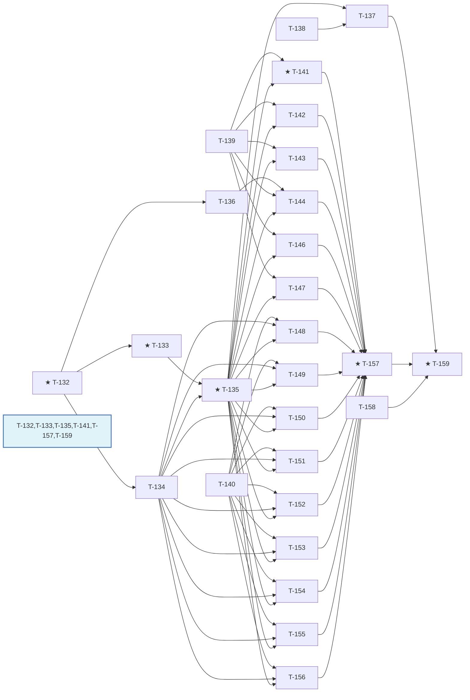
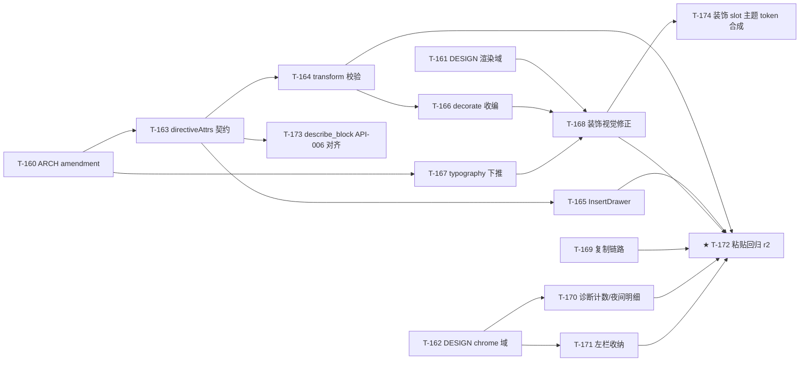
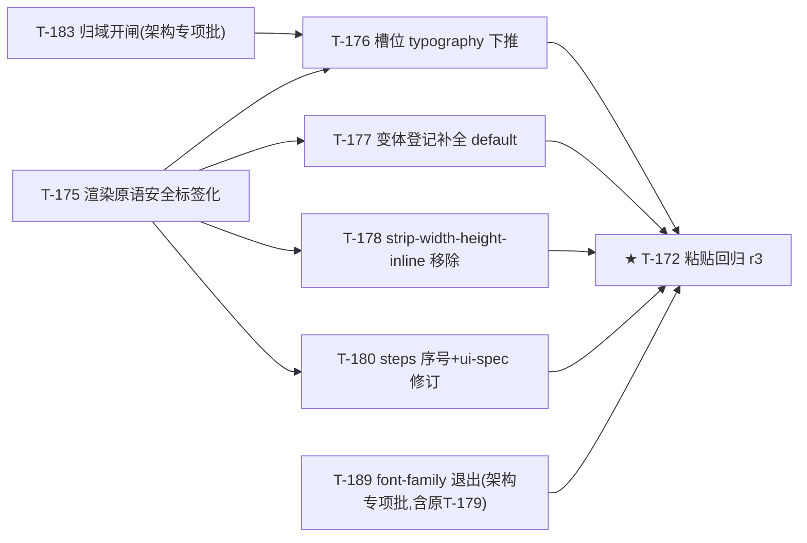
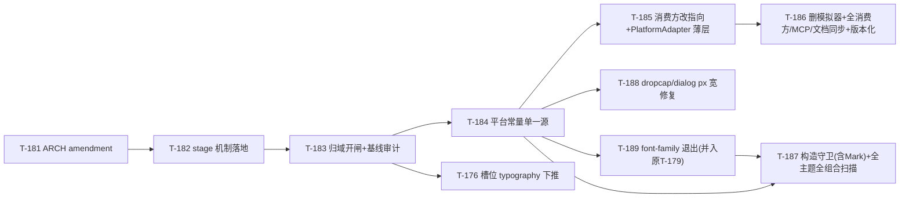
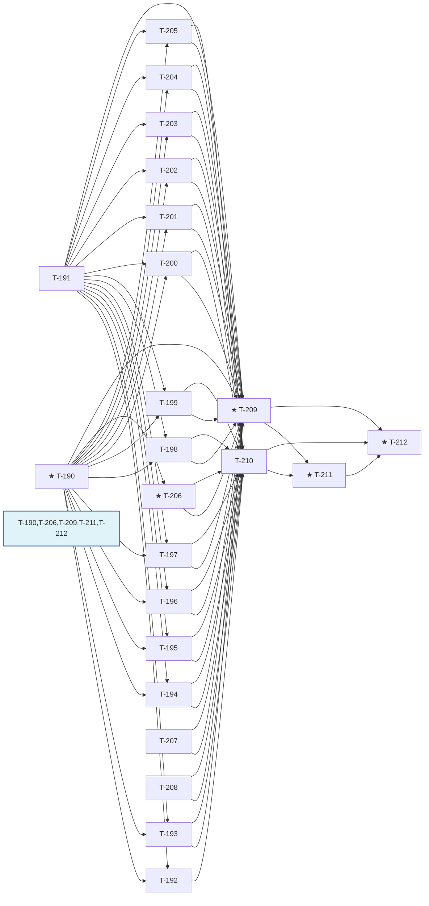

# Dev-Plan wechat-flow — Sprint 7（视觉升级批）任务卡

[NAV]
- Sprint 7 任务卡 → T-132..T-159
- Sprint 7 修复批任务卡（T-157 粘贴回归 blocking_conditions 消除）→ T-160..T-174
- Sprint 7 修复批二任务卡（微信粘贴标签兼容与保真链归位）→ T-175..T-180
- Sprint 7 架构专项批任务卡（微信平台保真模型收窄，复用 output ruleset 为 patch 层）→ T-181..T-189
- Sprint 7 变体缺口方案实施批（merge 语义机制 + 96 项清单裁定落地 + 收口）→ T-190..T-212
[/NAV]

## 1. 迭代目标

Sprint 7 目标：落地「视觉升级」amendment（arch v0.7.2 / ui-spec v0.3.1）——`BlockCategory` 6 值枚举驱动 InsertDrawer 分类数据化、40 内置 Block 冻结分类补全、5 主题 Markdown 基础元素排版规格补齐、9 个 Block 变体视觉规格填充。交付里程碑：`BlockDefinition.category` required 且全量 40 Block 覆盖；`getBlockBaseStyle` 四步解析补全（L1 内置 variant baseStyle 命中）；UC-015 InsertDrawer 6 分类 Tab + 搜索框数据驱动上线；5 主题 table/blockquote/strong/code-block/heading-accent/dropcap 视觉分化到位；9 组件变体（callout/divider/pull-quote/steps/quote/compare/dialog/announcement/gallery）真实形态落地；divider SVG 变体 sanitize schema 安全放行经审查闭环；design-first 轨道（Penpot 视觉基准）先于对应实现卡完成并经用户 sign-off。

本批任务依赖 arch `BlockCategory` / `BlockVariant.baseStyle` / `getBlockBaseStyle` 契约（`arch-wechat-flow-modules#§2.M-005`）与 ui-spec 三个新分卷（`ui-spec-wechat-flow-block-taxonomy#§8`、`ui-spec-wechat-flow-content-elements#§9`、`ui-spec-wechat-flow-block-variants#§10`）。

任务编号 T-145 空缺：`ui-spec-wechat-flow-content-elements#§9.6`（list-marker 主题色设计）核实为「marker 色彩差异化是低价值投入，维持默认继承行为即可满足可用性」，本身不产生开发工作量，故本批不为其单独产出任务卡（详见 T-139 AC-001 附带说明）。

**修复批（T-160..T-172）**：T-157 微信平台粘贴回归产出 `conditional_release`，`blocking_conditions` 核实为六类缺陷——①指令属性校验契约错位（结构化 `attrsSchema` 被误用于校验 markdown 指令属性，合法指令全量假警告）②复制链路失效（`buildDualMimePayload` 产出多 ClipboardItem，Chromium `clipboard.write` 不支持多 item 必然 reject，降级为纯文本）③容器块内子元素被全局 tag 样式覆盖（容器 typography 声明失效）④装饰变体与设计样张偏差（引号装饰断行、变体 root 残留默认边框、dropcap 缺 `line-height: 1`、署名行缺前缀）⑤诊断计数在 UC-013/UC-023 双处重复且 `nightRiskIssues` 明细无渲染出口⑥左栏收纳为占位命令未接线。修复批按契约先行原则组织：T-160 arch amendment + T-161/T-162 ui-spec amendment 前置，T-163..T-171 实现，T-172 为 T-157 的复验载体（r2），其通过即 T-157 `blocking_conditions` 清空。

---

## 2. 依赖图

关键路径：`T-132 → T-133 → T-135 → T-148 → T-157 → T-159`（关键路径权重 10）。`T-132`（BlockCategory 枚举 + BlockVariant.baseStyle 契约）是全批唯一根依赖；`T-135`（破坏性变更影响面修复）是 Layer 1/2 全部视觉实现卡的强制前置闸门——契约变更未在调用方（contracts/mcp-server/plugin-api/既有测试）落地前，任何视觉卡写入的 `category` / 新 `baseStyle` 字段都会被下游类型检查拒绝。

---

## 3. 任务卡详细

### T-132: BlockCategory 枚举 + BlockDefinition.category required + BlockVariant.baseStyle 契约

- **目标**: 在 `packages/core/src/registry/block.ts` 落地 `BlockCategory` 6 值枚举（`text|media|emphasis|structured|marketing|meta`）、`BlockDefinition.category` 改为 required 字段（无默认值）、`BlockVariant.baseStyle?` 可选静态样式字段（slot → cssProp → cssValue，与 block 级 `baseStyle` 同构）。
- **模块**: M-005
- **task_kind**: feature
- **priority**: P0
- **complexity**: small
- **sprint**: 7
- **tdd_mode**: light
- **tdd_acceptance**: all
- **tdd_refactor**: skip
- **security_sensitive**: false
- **dependencies**: []
- **acceptance_criteria**:
  - [x] AC-001: `registerBlock` 入参缺失 `category` 字段时 TypeScript 编译期报错（`BlockDefinition.category` 为 required，非 `?:`）[ARCH#§2.M-005]
  - [x] AC-002: `category` 类型仅接受字面量联合 `'text' | 'media' | 'emphasis' | 'structured' | 'marketing' | 'meta'`，赋值其他字符串字面量编译期报错 [ARCH#§2.M-005]
  - [x] AC-003: `BlockVariant` 接口新增 `baseStyle?: Record<string, Record<string, string>>`，缺省时该 variant 无 L1 静态样式（`undefined`，非 `{}`）[ARCH#§2.M-005]
  - [x] AC-004: `registerBlock` 校验逻辑不变——`baseStyle` 存在时仍强制含 `root` slot、`slots` 仍强制含 `root`（既有校验路径不因新增字段回归）
- **deliverables**:
  - [x] `packages/core/src/registry/block.ts` — `BlockCategory` 类型 + `BlockDefinition.category: BlockCategory` + `BlockVariant.baseStyle?`
  - [x] `packages/core/src/registry/block.test.ts` — category 类型契约测试 + 既有 root slot 校验回归测试（colocate 约定）
- **context_load**:
  - arch-wechat-flow-modules#§2.M-005
- **notes**: LOC_SIGNAL: 60。本卡是全批唯一无前置依赖的根任务，须最先完成。

---

### T-133: defineBlock 工厂签名升级 + 40 内置 Block 补 category

- **目标**: `packages/blocks/src/factory.ts` 的 `defineBlock` 工厂函数新增 `category: BlockCategory` 位置参数；`packages/blocks/src/blocks/*.ts` 全部 40 个内置 Block 按 `ui-spec-wechat-flow-block-taxonomy#§8.2` 冻结分类表逐一补齐 `category` 实参。
- **模块**: M-005
- **task_kind**: feature
- **priority**: P0
- **complexity**: medium
- **sprint**: 7
- **tdd_mode**: light
- **tdd_acceptance**: all
- **tdd_refactor**: skip
- **security_sensitive**: false
- **dependencies**: [T-132]
- **acceptance_criteria**:
  - [x] AC-001: `defineBlock(id, name, attrsSchema, category, variants, baseStyle?, slots?)` 新签名下 `category` 为必填位置参数（原有位置参数顺序不变，`category` 插入 `attrsSchema` 之后 `variants` 之前）[ARCH#§2.M-005]
  - [x] AC-002: `listBlocks()` 返回的 40 个 `BlockDefinition` 逐一核对 `category` 值与 `ui-spec-wechat-flow-block-taxonomy#§8.2` 冻结表完全一致（`text` 8 个 / `media` 6 个 / `emphasis` 7 个 / `structured` 7 个 / `marketing` 7 个 / `meta` 5 个，合计 40）
  - [x] AC-003: `table` 与 `definition-list` 两个易混淆 Block 的 `category` 均为 `text`（非 `structured`），验证归类依据（taxonomy §8.2 归类依据列）在测试断言中体现
  - [x] AC-004: `disclaimer` 的 `category` 为 `emphasis`（非 `meta`），验证归类依据在测试断言中体现
- **deliverables**:
  - [x] `packages/blocks/src/factory.ts` — `defineBlock` 签名新增 `category` 参数
  - [x] `packages/blocks/src/blocks/*.ts` — 40 个文件逐一补 `category` 实参
  - [x] `packages/blocks/src/blocks/block-category.test.ts` — 40 Block category 全量核对测试（含 table/definition-list/disclaimer 边界断言，根 tests/ 或 colocate 均可，就近落点）
- **context_load**:
  - arch-wechat-flow-modules#§2.M-005
  - ui-spec-wechat-flow-block-taxonomy#§8
- **notes**: LOC_SIGNAL: 200（40 文件各 1 行改动 + factory 签名 + 测试）。`tdd_mode: light` 豁免理由：200 LOC 中 40 处属同构单行改动（逐一补 `category` 实参，机械性重复、无分支/状态数增长），实际认知复杂度远低于常规 200 LOC 任务；仅 factory 签名扩展与测试断言部分具备常规实现复杂度，故维持 light 而非因 LOC 字面超阈值升 standard。

---

### T-134: getBlockBaseStyle 四步解析补全

- **目标**: `packages/core/src/registry/variant.ts` 的 `getBlockBaseStyle(blockId, variantId)` 当前仅实现步骤 1（`default` 读 block 级 `baseStyle.root`）与步骤 3（回退 `registerVariant` 运行时 store），缺失步骤 2（`variantId` 命中某内置 variant 且该 variant 自带 `baseStyle` 时优先读取）。补全四步解析顺序。
- **模块**: M-005
- **task_kind**: feature
- **priority**: P0
- **complexity**: small
- **sprint**: 7
- **tdd_mode**: light
- **tdd_acceptance**: all
- **tdd_refactor**: skip
- **security_sensitive**: false
- **dependencies**: [T-132]
- **acceptance_criteria**:
  - [x] AC-001: Given 某 block 注册时某内置 variant（非 `default`）携带 `baseStyle: { root: {...} }`，When 调用 `getBlockBaseStyle(blockId, thatVariantId)`，Then 返回值等于该 variant 的 `baseStyle.root`（非空对象，逐键匹配）[ARCH#§2.M-005 四步解析]
  - [x] AC-002: Given `variantId === 'default'`，When 调用 `getBlockBaseStyle`，Then 解析顺序不变——仍读 `blockDef.baseStyle.root`（步骤 1 优先级不受步骤 2 引入影响）
  - [x] AC-003: Given `variantId` 命中内置 variant 但该 variant 无 `baseStyle` 字段（`undefined`），When 调用 `getBlockBaseStyle`，Then 回退步骤 3（`registry/variant.ts` 运行时 store 查找），若 store 亦无命中则回退步骤 4（返回 `{}`）
  - [x] AC-004: Given `variantId` 既非 `default` 也未命中任何内置 variant 且运行时 store 无对应 entry，When 调用 `getBlockBaseStyle`，Then 返回 `{}`（步骤 4，非 `undefined` 非抛错）
- **deliverables**:
  - [x] `packages/core/src/registry/variant.ts` — `getBlockBaseStyle` 四步解析补全（读 `describeBlock(blockId)?.variants` 找 `variantId` 命中项的 `baseStyle?.root`）
  - [x] `packages/core/src/registry/variant.test.ts` — 四步解析全路径测试（含步骤 2 新增路径 + 步骤 1/3/4 回归，colocate 约定）
- **context_load**:
  - arch-wechat-flow-modules#§2.M-005
- **notes**: LOC_SIGNAL: 50。本卡是 Layer 2 全部变体卡（T-148..T-156）的强制前置——变体 `baseStyle` 不经四步解析补全就无法被 `inlineStyle` 真实消费。

---

### T-135: 破坏性变更影响面修复（contracts / mcp-server / plugin-api / 既有测试）

- **目标**: `BlockDefinition.category` 转为 required 后，逐一排查并修复受影响的下游调用方——MCP `list_blocks`/`describe_block` 工具响应补 `category`、plugin-api `DefineBlockInput`/`BlockRegistryEntry`/`RegistryBridge` 补 `category` 透传、既有 `tests/plugin-api/surface.test.ts` 与 `tests/contracts/tool-count.test.ts` 等调用 `registerBlock`/`defineBlock` 的测试补齐 `category` 实参。
- **模块**: M-005, M-009, M-007
- **接口**: API-005, API-006
- **task_kind**: fix
- **priority**: P0
- **complexity**: medium
- **sprint**: 7
- **tdd_mode**: standard
- **tdd_acceptance**: all
- **tdd_refactor**: auto
- **security_sensitive**: false
- **dependencies**: [T-133, T-134]
- **acceptance_criteria**:
  - [x] AC-001（API-005 正常路径）: Given 已注册 40 个内置 Block，When 调用 `listBlocksTool({})`，Then 返回数组每项含 `category` 字段且值 ∈ `text|media|emphasis|structured|marketing|meta`，与 `describeBlock(id).category` 一致 [ARCH#§3.API-005]
  - [x] AC-002（API-006 正常路径）: Given 某已注册 blockId，When 调用 `describeBlockTool({ blockId })`，Then 返回对象含 `category` 字段，值与该 block 注册时的 `category` 完全一致 [ARCH#§3.API-006]
  - [x] AC-003（API-006 错误路径）: Given 未注册的 blockId，When 调用 `describeBlockTool({ blockId })`，Then 返回 `{ code: 'E_NOT_FOUND', blockId }`（既有行为不回归，`category` 字段新增不影响错误路径结构）[ARCH#§3.API-006]
  - [x] AC-004: `packages/plugin-api/src/surface/plugin-api.ts` 的 `DefineBlockInput` / `BlockRegistryEntry` / `RegistryBridge.registerBlock` 三处类型新增 `category: BlockCategory` 字段，`createPluginSurface().defineBlock()` 实现将 `input.category` 透传进 `registry.registerBlock({ ..., category: input.category })`
  - [x] AC-005: `tests/plugin-api/surface.test.ts` 中全部 `surface.defineBlock({...})` 调用补齐 `category` 实参，测试套件全绿（不因新增 required 字段而编译失败）
  - [x] AC-006: 全仓 `pnpm typecheck`（含 `tests/tsconfig.json` 管辖的根 tests/）与 `pnpm vitest run` 因本卡改动新增的编译错误清零
- **deliverables**:
  - [x] `apps/mcp-server/src/tools/list-blocks.ts` — 响应对象补 `category`
  - [x] `apps/mcp-server/src/tools/describe-block.ts` — 响应对象补 `category`
  - [x] `packages/plugin-api/src/surface/plugin-api.ts` — `DefineBlockInput`/`BlockRegistryEntry`/`RegistryBridge`/`createPluginSurface` 补 `category` 透传
  - [x] `tests/plugin-api/surface.test.ts` — 全部 `defineBlock` 调用补 `category` 实参
  - [x] `tests/contracts/tool-count.test.ts` — 若涉及 `registerBlock`/`defineBlock` 调用同样补齐（按实际编译报错范围核实调整）
  - [x] `tests/mcp-server/tools/*.test.ts` — 涉及 `list_blocks`/`describe_block` 响应结构的既有测试补 `category` 断言（不新增测试文件时在既有文件内追加断言）
- **context_load**:
  - arch-wechat-flow-modules#§2.M-005
  - arch-wechat-flow-api#§3.API-005
  - arch-wechat-flow-api#§3.API-006
- **notes**: LOC_SIGNAL: 180。本卡是 Layer 1/2 全部视觉实现卡（T-141..T-156）与 UC-015 前端卡（T-137）的强制前置闸门——契约变更未在全部调用方落地前，下游卡的类型检查会因 `category` required 字段缺失而红。跨 3 个 arch 模块（M-005/M-009/M-007）+ 影响面排查故标 `tdd_mode: standard`。

---

### T-136: 新增 token `--color-code-block-bg`（×5 主题）

- **目标**: 在 5 套内置主题的 `tokens.ts` 中新增 `--color-code-block-bg` token（ARCH E-002 open record 内非破坏性追加），承载 `pre`（代码块）专属底色，与既有 `--color-code-bg`（inline code）区分语义。
- **模块**: M-005
- **task_kind**: chore
- **priority**: P1
- **complexity**: small
- **sprint**: 7
- **tdd_mode**: light
- **tdd_acceptance**: all
- **tdd_refactor**: skip
- **security_sensitive**: false
- **dependencies**: [T-132]
- **acceptance_criteria**:
  - [x] AC-001: 5 主题 `tokens.ts` 均新增 `--color-code-block-bg` 键，值按 `ui-spec-wechat-flow-content-elements#§9.5` 表逐一赋值：default `#F0EDE8` / business `#EEF2F7` / literary `#F2ECE0` / magazine `#FFF3E8` / tech `#1A1A2E`
  - [x] AC-002: 主题守护 9 维校验（`validateThemeGuard`）在新增 token 后仍全部通过（token 覆盖率维度不因新增而破坏既有基线）
- **deliverables**:
  - [x] `packages/themes/default/src/tokens.ts` — 新增 `--color-code-block-bg: #F0EDE8`
  - [x] `packages/themes/business/src/tokens.ts` — 新增 `--color-code-block-bg: #EEF2F7`
  - [x] `packages/themes/literary/src/tokens.ts` — 新增 `--color-code-block-bg: #F2ECE0`
  - [x] `packages/themes/magazine/src/tokens.ts` — 新增 `--color-code-block-bg: #FFF3E8`
  - [x] `packages/themes/tech/src/tokens.ts` — 新增 `--color-code-block-bg: #1A1A2E`
- **context_load**:
  - ui-spec-wechat-flow-content-elements#§9.5
- **notes**: LOC_SIGNAL: 15。`task_kind: chore` 跳过 TDD RED/GREEN，由 implementer 单次产出 + lint hook 兜底。T-144（代码块视觉实现）消费本卡产出的 token。

---

### T-137: UC-015 InsertDrawer 分类 Tab 数据驱动 + 搜索框 + UC-021 同步

- **目标**: `apps/editor/src/components/panel/InsertDrawer.vue` 从当前扁平列表升级为 6 分类 Tab（数据驱动自 `BlockDefinition.category`，前端仅硬编码 `category → 中文标签` 映射）+ 搜索框（跨分类过滤，搜索时不切 Tab、在当前 Tab 结果内过滤）；`DirectiveAutocompletePopover.vue`（UC-021）现有 `block/inline` 触发类型 Tab 与新 6 分类 Tab 是不同维度，需在 UC-021 侧新增分类子过滤或确认现有交互路径与 UC-015 语义同步（按 ui-spec UC-015/UC-021 章节裁定）。
- **模块**: M-001
- **接口**: API-005
- **task_kind**: feature
- **priority**: P0
- **complexity**: medium
- **sprint**: 7
- **tdd_mode**: standard
- **tdd_acceptance**: all
- **tdd_refactor**: auto
- **security_sensitive**: false
- **user_facing_critical_path**: true
- **dependencies**: [T-135, T-138]
- **acceptance_criteria**:
  - [x] AC-001: Given `listBlocks()` 返回 40 个 Block（含 6 种 `category`），When InsertDrawer 挂载，Then 渲染 6 个分类 Tab，顺序为 `BlockCategory` 枚举声明顺序（`text/media/emphasis/structured/marketing/meta`），默认选中第一个 Tab（`text`）[ARCH#§2.M-005] [ui-spec#UC-015]
  - [x] AC-002: Given 分类 Tab 标签文案，Then 前端硬编码的仅为 `category → 中文标签` 映射（`text`→「基础排版」/ `media`→「图文媒体」/ `emphasis`→「强调提示」/ `structured`→「结构化」/ `marketing`→「运营引流」/ `meta`→「元信息」），不硬编码分类清单本身（Tab 集合随 `BlockDefinition.category` 实际取值集合派生）
  - [x] AC-003: Given 用户点击某分类 Tab（如 `media`），When Tab 切换，Then 组件列表仅显示 `category === 'media'` 的 Block（6 个），不做加载态过渡
  - [x] AC-004: Given 用户在搜索框输入关键字，When 输入变化，Then 列表在当前选中 Tab 的结果集内按 Block 名称/id 模糊过滤（不切换当前 Tab）；Given 清空搜索框，Then 恢复该 Tab 全量列表
  - [x] AC-005: 无「全部」Tab——6 个分类 Tab 完整覆盖全部 40 个 Block，DOM 中不存在「全部」文案的 Tab 元素
  - [x] AC-006: 渲染后计算视觉核验——分类 Tab 行实际渲染高度 `40px`、搜索框实际渲染高度 `36px`，与 ui-spec 布局规格一致（非源码字面断言，取 `getBoundingClientRect()` 或等效渲染后计算值）
  - [x] AC-007: 视觉一致性审查通过——InsertDrawer 6 分类 Tab + 搜索框渲染结果与 T-138 产出的 Penpot 设计稿对应帧视觉一致（尺寸/色值/间距在容差内），经 `docs/reviews/design/DESIGN-REVIEW-UC-015-r{N}.md` reviewer 核验为 `approved`/`approved_with_notes`
- **deliverables**:
  - [x] `apps/editor/src/components/panel/InsertDrawer.vue` — 分类 Tab 行 + 搜索框 + 数据驱动过滤逻辑
  - [x] `apps/editor/src/components/panel/CATEGORY_LABELS.ts`（或就近内联常量）— `category → 中文标签` 映射表
  - [x] `apps/editor/src/components/panel/__tests__/InsertDrawer.test.ts` — Tab 渲染/切换/搜索过滤/无「全部」Tab 断言（既有测试文件扩展）
  - [x] `e2e/visual/design-overlay.spec.ts` — UC-015 STATIC_COMPONENTS 条目补充分类 Tab 触发前置操作（若既有 selector 需扩展覆盖 Tab 行）
- **context_load**:
  - arch-wechat-flow-modules#§2.M-005
  - ui-spec-wechat-flow#§2.UC-015
  - ui-spec-wechat-flow-block-taxonomy#§8
- **notes**: LOC_SIGNAL: 220。跨 2 个 arch 模块 + AC 含视觉一致性审查门禁，故标 `tdd_mode: standard`。依赖 T-138（Penpot 设计稿先行）与 T-135（category 契约落地）。UC-021 同步范围以 ui-spec UC-015/UC-021 实际交互裁定为准，若查证 UC-021 触发路径本身不承载 6 分类导航（`:::` 触发已是搜索输入语境）则本卡 AC 聚焦 UC-015，UC-021 侧仅需确认无冲突不新增交互面，此裁定记入 code-review 附注。

---

**Design-First 轨道（阻塞对应实现卡）**

### T-138: [DESIGN] PS-011 InsertDrawer 6 分类 Tab Penpot 帧追平

- **目标**: 将 `ui-spec-wechat-flow#§7.PS-011` 从「后续项、不阻塞」升格为本批阻塞性设计卡——在 Penpot 中把 UC-015 InsertDrawer 编辑器帧的旧 4 分类占位 Tab（行内/块级/标注/封面）替换为 6 分类 Tab（基础排版/图文媒体/强调提示/结构化/运营引流/元信息），追平 `BlockDefinition.category` 冻结决策。
- **task_kind**: design
- **tdd_acceptance**: skip
- **priority**: P0
- **complexity**: small
- **sprint**: 7
- **tdd_mode**: skip
- **tdd_skip_reason**: "Penpot 设计稿，由用户视觉验证 sign-off"
- **dependencies**: []
- **acceptance_criteria**:
  - [x] AC-001: Penpot UC-015 帧的分类 Tab 行更新为 6 个 Tab，顺序与文案与 `ui-spec-wechat-flow-block-taxonomy#§8.1` 完全一致（基础排版/图文媒体/强调提示/结构化/运营引流/元信息）
  - [x] AC-002: 帧内同步新增搜索框视觉元素（占位符「搜索组件…」），布局位置符合 UC-015 narrative（标题行下方、分类 Tab 行上方或按最终裁定位置）
  - [x] AC-003: 帧导出图路径 `docs/design/frames/components/UC-015.png` 更新覆盖（沿用 T-130 既有 design-overlay 固化路径约定，替换旧 4 分类占位截图）
  - [x] AC-004: 用户视觉 sign-off — 以 `event=user_decision` 写入 `docs/EVENT-LOG.jsonl`，`detail` 含 `design_signoff T-138: InsertDrawer 6 分类 Tab Penpot 帧确认` 字样，`ref=T-138`
- **deliverables**:
  - [x] Penpot UC-015 帧更新（6 分类 Tab + 搜索框）
  - [x] `docs/design/frames/components/UC-015.png` — 更新后帧导出
  - [x] `docs/EVENT-LOG.jsonl` — design_signoff 事件
- **notes**: Penpot 同步参考: ui-spec-wechat-flow#§7.PS-011, ui-spec-wechat-flow#§2.UC-015, ui-spec-wechat-flow-block-taxonomy#§8。本卡硬阻塞 T-137（UC-015 前端实现），可与 T-132（Layer 0 契约）并行。

---

### T-139: [DESIGN] Layer 1 基础元素排版 Penpot 视觉样张（5 主题对照）

- **目标**: 在 Penpot 中为 `ui-spec-wechat-flow-content-elements#§9` 定义的 7 类基础元素（table/blockquote/strong/code-block/list-marker/heading-accent/dropcap）各主题分化产出视觉样张（specimen），作为 T-141/T-142/T-143/T-144/T-146/T-147 实现前的视觉基准。
- **task_kind**: design
- **tdd_acceptance**: skip
- **priority**: P0
- **complexity**: medium
- **sprint**: 7
- **tdd_mode**: skip
- **tdd_skip_reason**: "Penpot 设计稿，由用户视觉验证 sign-off"
- **dependencies**: []
- **acceptance_criteria**:
  - [x] AC-001: 按元素族出样张页——每个基础元素（table/blockquote/strong/code-block/heading-accent/dropcap，6 个视觉分化元素；list-marker 因 §9.6 平台限制无跨主题差异化设计，不产出样张）产出 1 张 Penpot 样张页，页内并排展示 5 主题（default/business/literary/magazine/tech）该元素的渲染效果
  - [x] AC-002: 每张样张标注对应 ui-spec 章节色值/间距规格来源（如 table 样张标注 `--color-surface-alt` 等 token 名与实值），供实现卡逐项核对
  - [x] AC-003: 样张导出图固化到 `docs/design/frames/specimens/content-elements-{element}.png`（6 个文件：table/blockquote/strong/code-block/heading-accent/dropcap）
  - [x] AC-004: 用户视觉 sign-off — `event=user_decision` 写入 `docs/EVENT-LOG.jsonl`，`detail` 含 `design_signoff T-139: 基础元素排版样张确认` 字样，`ref=T-139`
- **deliverables**:
  - [x] Penpot 基础元素样张页 ×6（table/blockquote/strong/code-block/heading-accent/dropcap，各含 5 主题对照）
  - [x] `docs/design/frames/specimens/content-elements-table.png` 等 6 个导出文件
  - [x] `docs/EVENT-LOG.jsonl` — design_signoff 事件
- **notes**: Penpot 同步参考: ui-spec-wechat-flow-content-elements#§9。本卡硬阻塞 T-141/T-142/T-143/T-144/T-146/T-147，可与 T-132/T-138/T-140 并行。

---

### T-140: [DESIGN] Layer 2 Block 变体 Penpot 视觉样张（9 组件）

- **目标**: 在 Penpot 中为 `ui-spec-wechat-flow-block-variants#§10` 定义的 9 个 Block 变体族（callout/divider/pull-quote/steps/quote/compare/dialog/announcement/gallery）各产出视觉样张，作为 T-148..T-156 实现前的视觉基准。
- **task_kind**: design
- **tdd_acceptance**: skip
- **priority**: P0
- **complexity**: medium
- **sprint**: 7
- **tdd_mode**: skip
- **tdd_skip_reason**: "Penpot 设计稿，由用户视觉验证 sign-off"
- **dependencies**: []
- **acceptance_criteria**:
  - [x] AC-001: 按组件族出样张页——每个 Block 的全部目标变体（callout 4 态 / divider 3 装饰变体 / pull-quote decorated / steps card / quote large-quote-mark+dropcap / compare ledger / dialog chat-bubbles / announcement danger-bar+compact+default / gallery duo+triptych）在 1 张样张页内并排展示各变体形态差异
  - [x] AC-002: divider 的 wave/dots/flower 三个 SVG 变体样张附带 SVG 路径/形状参数标注（`viewBox`、`stroke-width`、色值 token 名），供 T-149 实现与安全审查双重核对
  - [x] AC-003: 样张导出图固化到 `docs/design/frames/specimens/block-variants-{blockId}.png`（9 个文件：callout/divider/pull-quote/steps/quote/compare/dialog/announcement/gallery）
  - [x] AC-004: 用户视觉 sign-off — `event=user_decision` 写入 `docs/EVENT-LOG.jsonl`，`detail` 含 `design_signoff T-140: Block 变体样张确认` 字样，`ref=T-140`
- **deliverables**:
  - [x] Penpot Block 变体样张页 ×9
  - [x] `docs/design/frames/specimens/block-variants-callout.png` 等 9 个导出文件
  - [x] `docs/EVENT-LOG.jsonl` — design_signoff 事件
- **notes**: Penpot 同步参考: ui-spec-wechat-flow-block-variants#§10。本卡硬阻塞 T-148..T-156，可与 T-132/T-138/T-139 并行。

---

**Layer 1：基础元素排版实现（依赖 T-135 契约落地 + T-139 设计基准）**

### T-141: 表格（table/th/td）5 主题排版实现

- **目标**: 按 `ui-spec-wechat-flow-content-elements#§9.2` 为 5 主题的 `table`/`th`/`td` 补齐完整视觉规格（当前渲染为浏览器默认边框样式）。
- **模块**: M-005
- **task_kind**: feature
- **priority**: P1
- **complexity**: medium
- **sprint**: 7
- **tdd_mode**: light
- **tdd_acceptance**: all
- **tdd_refactor**: skip
- **security_sensitive**: false
- **dependencies**: [T-135, T-139]
- **acceptance_criteria**:
  - [x] AC-001: Given default 主题渲染含表格的 Markdown，When `renderMarkdown` 完成，Then `<table>` 计算样式 `border-collapse: collapse`、`<th>` 背景色计算值 = `--color-surface-alt`（`#F3F0EB`）、字重计算值 `600`，`<td>` 四边 `border` 计算值含 `--color-border`（`#D6D3CE`）
  - [x] AC-002: Given business 主题，Then `<th>` 背景计算值 = `--color-brand`（`#1A4F8A`）、文字色计算值 = `--color-text-inverse`（`#FFFFFF`）、无边框；`<td>` 偶数行背景计算值 = `--color-surface-alt`（`#EEF2F7`，斑马纹生效）
  - [x] AC-003: Given literary 主题，Then `<th>` 背景计算值透明、仅 `border-bottom` 计算值含 `--color-border-strong`（`#B8A882`），无斑马纹（偶数行背景计算值与奇数行一致）
  - [x] AC-004: Given magazine 主题，Then `<th>` 仅 `border-bottom` 计算值 `2px solid` 含 `--color-brand`（`#D4521A`）
  - [x] AC-005: Given tech 主题，Then `<th>`/`<td>` padding 计算值为紧凑型 `6px 10px`（非通用 `8px 12px`），`<td>` 偶数行背景计算值 = `--color-background`（`#0F1117`，斑马纹生效）
  - [x] AC-006: 视觉一致性审查通过——5 主题表格渲染结果与 T-139 样张对应表格样张视觉一致（色值/边框/斑马纹在容差内），经 `docs/reviews/design/DESIGN-REVIEW-table-r{N}.md` reviewer 核验为 `approved`/`approved_with_notes`（reviewer 经 `pnpm test:design-overlay` 渲染比对链路 + penpot-bridge verify 独占裁决，容差判定采用 s6 T-131 先例的人工「一致/存在差异」二元标记 + overlay-report.html 逐节引用形式）
- **deliverables**:
  - [x] `packages/themes/default/src/blocks/table.ts` — 新建 `ThemeBlocks` 选择器（`table`/`th`/`td`）
  - [x] `packages/themes/business/src/blocks/table.ts`
  - [x] `packages/themes/literary/src/blocks/table.ts`
  - [x] `packages/themes/magazine/src/blocks/table.ts`
  - [x] `packages/themes/tech/src/blocks/table.ts`
  - [x] 各主题 `packages/themes/{theme}/src/blocks/index.ts` 注册新增 table 选择器
  - [x] `tests/core/theme/table-blocks.test.ts` — 5 主题渲染后计算样式断言（根 tests/ 约定）
- **context_load**:
  - ui-spec-wechat-flow-content-elements#§9.2
- **notes**: LOC_SIGNAL: 150。

---

### T-142: 引用块（blockquote）差异化 5 主题实现

- **目标**: 按 `ui-spec-wechat-flow-content-elements#§9.3` 为 5 主题的 `blockquote` 拉开差异化视觉（当前 5 主题视觉雷同）。
- **模块**: M-005
- **task_kind**: feature
- **priority**: P1
- **complexity**: medium
- **sprint**: 7
- **tdd_mode**: light
- **tdd_acceptance**: all
- **tdd_refactor**: skip
- **security_sensitive**: false
- **dependencies**: [T-135, T-139]
- **acceptance_criteria**:
  - [x] AC-001: Given business 主题渲染 blockquote，Then 计算样式含双侧 `1px solid` 边框（`border-left`/`border-right`）均取 `--color-brand`（`#1A4F8A`）色值，`background-color` 计算值为 `transparent`
  - [x] AC-002: Given literary 主题，Then 计算样式 `font-style` **不为** `italic`（去斜体验证），文字色计算值 = `--color-text-secondary`（`#5A4228`），`letter-spacing` 计算值 = `1.2px`
  - [x] AC-003: Given magazine 主题，Then `font-size` 计算值相对正文放大约 `1.15em` 换算后的实际 px 值，`border-left` 计算值 `3px solid` 含 `--color-brand`（`#D4521A`）
  - [x] AC-004: Given tech 主题，Then `border-left` 计算值 `3px solid` 含 `--color-brand`（`#58A6FF`），`background-color` 计算值为 `transparent`
  - [x] AC-005: Given default 主题，Then 保留现状微调——`border-left: 4px solid` 含 `--color-quote-border`（`#2D5A4E`），`background-color` 计算值含 `--color-quote-bg`（`#F3F0EB`）
  - [x] AC-006: 视觉一致性审查通过——5 主题 blockquote 渲染结果与 T-139 样张对应 blockquote 样张视觉一致，经 `docs/reviews/design/DESIGN-REVIEW-blockquote-r{N}.md` reviewer 核验为 `approved`/`approved_with_notes`（判定路径同 T-141 AC-006）
- **deliverables**:
  - [x] `packages/themes/default/src/blocks/quote.ts` — 更新 `blockquote` 选择器（微调）
  - [x] `packages/themes/business/src/blocks/quote.ts` — 新建（双侧细线无底色）
  - [x] `packages/themes/literary/src/blocks/quote.ts` — 更新去斜体 + 字距
  - [x] `packages/themes/magazine/src/blocks/quote.ts` — 新建（大字拉引感）
  - [x] `packages/themes/tech/src/blocks/quote.ts` — 新建（简洁竖条）
  - [x] `tests/core/theme/blockquote-blocks.test.ts` — 5 主题渲染后计算样式断言
- **context_load**:
  - ui-spec-wechat-flow-content-elements#§9.3
- **notes**: LOC_SIGNAL: 130。

---

### T-143: `strong` 字重梯度 5 主题实现

- **目标**: 按 `ui-spec-wechat-flow-content-elements#§9.4` 为 5 主题的 `strong` 分化字重梯度（当前全部使用统一字重）。
- **模块**: M-005
- **task_kind**: feature
- **priority**: P2
- **complexity**: small
- **sprint**: 7
- **tdd_mode**: light
- **tdd_acceptance**: all
- **tdd_refactor**: skip
- **security_sensitive**: false
- **dependencies**: [T-135, T-139]
- **acceptance_criteria**:
  - [x] AC-001: Given default 主题渲染 `<strong>` 文本，When 渲染完成，Then 计算字重值 = `600`
  - [x] AC-002: Given business 主题，Then 计算字重值 = `700`
  - [x] AC-003: Given literary 主题，Then 计算字重值 = `500`
  - [x] AC-004: Given magazine 主题，Then 计算字重值 = `700`
  - [x] AC-005: Given tech 主题，Then 计算字重值 = `600`
- **deliverables**:
  - [x] `packages/themes/default/src/blocks/*.ts`（或新建 `emphasis.ts`）— `strong` 选择器字重 `600`
  - [x] `packages/themes/business/src/blocks/emphasis.ts` — `strong` 字重 `700`
  - [x] `packages/themes/literary/src/blocks/emphasis.ts` — `strong` 字重 `500`
  - [x] `packages/themes/magazine/src/blocks/emphasis.ts` — `strong` 字重 `700`
  - [x] `packages/themes/tech/src/blocks/emphasis.ts` — `strong` 字重 `600`
  - [x] `tests/core/theme/strong-weight.test.ts` — 5 主题渲染后计算字重断言
- **context_load**:
  - ui-spec-wechat-flow-content-elements#§9.4
- **notes**: LOC_SIGNAL: 60。AC 数=5（≤6 上限），与其他 Layer 1 卡相比规模最小，可作为并行组内优先起步任务。

---

### T-144: 代码块（pre）主题感知底色实现

- **目标**: 按 `ui-spec-wechat-flow-content-elements#§9.5` 区分 `code-block` Block（`<pre>`）与 inline `<code>` 的底色语义，`<pre>` 消费新 token `--color-code-block-bg`（T-136 产出）。
- **模块**: M-005
- **task_kind**: feature
- **priority**: P1
- **complexity**: small
- **sprint**: 7
- **tdd_mode**: light
- **tdd_acceptance**: all
- **tdd_refactor**: skip
- **security_sensitive**: false
- **dependencies**: [T-135, T-136, T-139]
- **acceptance_criteria**:
  - [x] AC-001: Given tech 主题渲染 `code-block` Block，When 渲染完成，Then `<pre>` 计算背景色 = `--color-code-block-bg`（`#1A1A2E`），与该主题 inline `<code>` 计算背景色一致（均暗底）
  - [x] AC-002: Given default/business/magazine 三主题，Then `<pre>` 计算背景色分别 = `#F0EDE8`/`#EEF2F7`/`#FFF3E8`，与各自 inline `<code>` 计算背景色一致（同值不同 token 名）
  - [x] AC-003: Given literary 主题，Then `<pre>` 计算背景色 = `#F2ECE0`（暖米亮底），`border` 计算值含该主题 `--color-border`，`border-radius` 计算值含该主题 `--decoration-border-radius-sm`
  - [x] AC-004: `<pre>` 消费的 token 是 `--color-code-block-bg` 而非直接复用 `--color-code-bg` 字面值（token 引用关系可通过修改 `--color-code-block-bg` 后 `<pre>` 计算背景色随之变化来验证，即使当前实值与 `--color-code-bg` 相同）
- **deliverables**:
  - [x] `packages/themes/default/src/blocks/code-block.ts` — `pre` 选择器消费 `--color-code-block-bg`
  - [x] `packages/themes/business/src/blocks/code-block.ts`
  - [x] `packages/themes/literary/src/blocks/code-block.ts`
  - [x] `packages/themes/magazine/src/blocks/code-block.ts`
  - [x] `packages/themes/tech/src/blocks/code-block.ts`（既有文件已含 `pre`，更新为消费新 token 而非硬编码值）
  - [x] `tests/core/theme/code-block-bg.test.ts` — 5 主题 token 消费与渲染后计算背景色断言（含 token 值变更联动验证）
- **context_load**:
  - ui-spec-wechat-flow-content-elements#§9.5
- **notes**: LOC_SIGNAL: 90。依赖 T-136（token 定义）与 T-139（设计基准），三者可并行完成后本卡收尾。

---

### T-146: Heading Accent（h2 左竖条）实现

- **目标**: 按 `ui-spec-wechat-flow-content-elements#§9.7` 为 business/magazine/tech 三主题的 `h2` 增加左竖条 accent（default/literary 不启用）。
- **模块**: M-005
- **task_kind**: feature
- **priority**: P2
- **complexity**: small
- **sprint**: 7
- **tdd_mode**: light
- **tdd_acceptance**: all
- **tdd_refactor**: skip
- **security_sensitive**: false
- **dependencies**: [T-135, T-139]
- **acceptance_criteria**:
  - [x] AC-001: Given business 主题渲染 `<h2>`，When 渲染完成，Then 计算样式 `border-left` = `4px solid` 含 `--color-brand`（`#1A4F8A`），`padding-left` 计算值 = `8px`
  - [x] AC-002: Given magazine 主题，Then `border-left` 计算值 `6px solid` 含 `--color-brand`（`#D4521A`），`padding-left` 计算值 = `10px`
  - [x] AC-003: Given tech 主题，Then `border-left` 计算值 `3px solid` 含 `--color-brand`（`#58A6FF`），`padding-left` 计算值 = `8px`
  - [x] AC-004: Given default 主题，Then `<h2>` 计算样式无 `border-left`（`border-left-width` 计算值为 `0px` 或属性不存在）
  - [x] AC-005: Given literary 主题，Then `<h2>` 计算样式无左竖条，保持现有 `border-bottom` 下划线风格不变（既有行为不回归）
  - [x] AC-006: 渲染产物不含任何依赖 `::before`/`::after` 伪元素的序号徽章实现（§9.1 通则明确排除项，静态审查确认无伪元素选择器引入）
- **deliverables**:
  - [x] `packages/themes/business/src/blocks/heading.ts` — 新建或扩展 `h2` accent
  - [x] `packages/themes/magazine/src/blocks/heading.ts`
  - [x] `packages/themes/tech/src/blocks/heading.ts`
  - [x] `tests/core/theme/heading-accent.test.ts` — 3 主题启用 + 2 主题不启用的渲染后计算样式断言
- **context_load**:
  - ui-spec-wechat-flow-content-elements#§9.7
- **notes**: LOC_SIGNAL: 70。

---

### T-147: 首字下沉（dropcap）可选 paragraph variant

- **目标**: 按 `ui-spec-wechat-flow-content-elements#§9.8` 实现「段首独立大号衬线字符块」变通方案作为 `paragraph` Block 的可选 variant（非默认渲染），不依赖 `float`。
- **模块**: M-005
- **task_kind**: feature
- **priority**: P2
- **complexity**: small
- **sprint**: 7
- **tdd_mode**: light
- **tdd_acceptance**: all
- **tdd_refactor**: skip
- **security_sensitive**: false
- **dependencies**: [T-135, T-139]
- **acceptance_criteria**:
  - [x] AC-001: Given `paragraph` Block 注册新增 variant `id: 'dropcap'`，When 该 variant 被选定渲染，Then 段落首字符被包裹为独立 ``，计算字号 = `2.2em` 换算后实际 px 值、`display` 计算值 = `inline-block`、`vertical-align` 计算值 = `top`
  - [x] AC-002: Given 任一主题渲染 `dropcap` variant，Then 该 `` 计算文字色 = 该主题 `--color-brand`，`font-family` 计算值 = 该主题 `--font-family-heading`
  - [x] AC-003: 渲染产物不含 `float` 声明（`float` 属性不出现在该 variant 任何计算样式中，验证 §9.1 通则合规）
  - [x] AC-004: Given `paragraph` Block 未选定 `dropcap` variant（默认渲染），Then 段落渲染保持现状不变（默认非该 variant，回归验证）
- **deliverables**:
  - [x] `packages/blocks/src/blocks/paragraph.ts` — 新增 `dropcap` variant 声明（`baseStyle` 承载首字 span 规格）
  - [x] `packages/core/src/pipeline/transform.ts`（或既有 paragraph 渲染路径）— dropcap variant 首字符抽取为独立 `` 的转换逻辑（若现有管线不支持子节点级 variant 渲染，需评估最小接入点）
  - [x] `tests/core/blocks/paragraph-dropcap.test.ts` — variant 选定/未选定两路径渲染后计算样式断言 + `float` 缺失断言
- **context_load**:
  - ui-spec-wechat-flow-content-elements#§9.8
- **notes**: LOC_SIGNAL: 100。低优先级（P2），若段落 Block 现有渲染管线对"抽取首字符为独立子节点"无原生支持点，实现须评估最小侵入接入方式（如 mdast 转换阶段的文本节点拆分），必要时在 code-review 阶段与 tech-lead 复核接入点选择。

---

**Layer 2：Block 变体视觉实现（依赖 T-135 契约 + T-134 四步解析 + T-140 设计基准）**

### T-148: callout 四态形态差异化（tip/warning/info/danger）

- **目标**: 按 `ui-spec-wechat-flow-block-variants#§10.1` 将 `callout` 现有 10 个变体收敛为 4 个具备真实形态差异的变体（`tip`/`warning`/`info`/`danger`），删除空壳变体 ID，旧变体 ID 按收敛映射表迁移。
- **模块**: M-005
- **task_kind**: feature
- **priority**: P1
- **complexity**: medium
- **sprint**: 7
- **tdd_mode**: light
- **tdd_acceptance**: all
- **tdd_refactor**: skip
- **security_sensitive**: false
- **dependencies**: [T-134, T-135, T-140]
- **acceptance_criteria**:
  - [x] AC-001: `packages/blocks/src/blocks/callout.ts` 的 `variants` 数组收敛为恰好 4 项：`tip`/`warning`/`info`/`danger`（原 10 个变体 ID 中 `default`/`filled`/`minimal`/`success`/`error`/`note`/`important` 按收敛映射表迁移，不再作为独立注册项）
  - [x] AC-002: Given `variantId: 'tip'`，When 经 `getBlockBaseStyle('callout', 'tip')` 解析，Then 返回值含 `border-radius` 计算值 `8px 0 8px 8px`（不对称圆角）与 `box-shadow` 含 `inset -4px 0 0 0` 右侧色条声明
  - [x] AC-003: Given `variantId: 'warning'`，Then 返回值含 `border-top` 计算值 `2px dashed` 与 `border-bottom` 计算值 `2px solid` 同色、`background` 计算值为 `transparent`
  - [x] AC-004: Given `variantId: 'info'`，Then 返回值含全边框 `1px solid` 与 `box-shadow` 含 `inset 0 2px 0 0` 顶部高光声明
  - [x] AC-005: Given `variantId: 'danger'`，Then 返回值含 `border-top` 计算值 `8px solid`、`border-radius` 计算值 `0`（零圆角）
  - [x] AC-006: 四态变体 `baseStyle` 经 `getBlockBaseStyle` 真实返回并被 `inlineStyle` 合成进最终 HTML 的 `style` 属性（端到端渲染验证，非仅注册表存在性检查）
  - [x] AC-007: 视觉一致性审查通过——callout 四态渲染结果与 T-140 样张对应 callout 样张视觉一致，经 `docs/reviews/design/DESIGN-REVIEW-callout-r{N}.md` reviewer 核验为 `approved`/`approved_with_notes`（判定路径同 T-141 AC-006）
- **deliverables**:
  - [x] `packages/blocks/src/blocks/callout.ts` — 变体收敛 + 4 态 `baseStyle` 声明（`registerVariant` 或内置 variant `baseStyle` 二选一实现路径，按 M-005 契约选内置路径更简）
  - [x] `tests/core/blocks/callout-variants.test.ts` — 4 态 `getBlockBaseStyle` 解析断言 + 端到端渲染 inline style 合成断言
- **context_load**:
  - arch-wechat-flow-modules#§2.M-005
  - ui-spec-wechat-flow-block-variants#§10.1
- **notes**: LOC_SIGNAL: 140。

---

### T-149: divider SVG 装饰变体（wave/dots/flower）+ sanitize schema 安全审查

- **目标**: 按 `ui-spec-wechat-flow-block-variants#§10.2` 为 `divider` 新增 3 个具名装饰变体（`wave`/`dots`/`flower`），均以 inline SVG 实现。**风险项**：`defaultSchema`（hast-util-sanitize）当前不含 `svg`/`path`/`circle`/`line` 标签，`wechatFlowSanitizeSchema` 若不显式扩展白名单，这些标签会在 sanitize 阶段被剥离；本卡须确认扩展方案（复用既有 `injectDecorations` 的 post-sanitize 注入模式，或显式扩展 `wechatFlowSanitizeSchema.tagNames`/`attributes`）并走 XSS 审查，采用最小必要放行集。
- **模块**: M-005, M-002
- **task_kind**: feature
- **priority**: P1
- **complexity**: medium
- **sprint**: 7
- **tdd_mode**: standard
- **tdd_acceptance**: all
- **tdd_refactor**: required
- **security_sensitive**: true
- **dependencies**: [T-134, T-135, T-140]
- **acceptance_criteria**:
  - [x] AC-001: Given `variantId: 'wave'`，When `divider` Block 以该 variant 渲染，Then 输出 HTML 含 `<svg viewBox="0 0 240 20">` 与 `<path d="M0,10 C40,2 80,18 120,10 C160,2 200,18 240,10" ...>` 元素，`stroke` 属性值等于该主题 `--color-border` 实际计算值
  - [x] AC-002: Given `variantId: 'dots'`，Then 输出 HTML 含 `<svg viewBox="0 0 60 10">` 与 3 个 `<circle r="2">` 元素，`fill` 属性值等于该主题 `--color-border-strong` 实际计算值
  - [x] AC-003: Given `variantId: 'flower'`，Then 输出 HTML 含 2 个 `<line>` 元素与 1 个花瓣 `<path>`（或菱形）元素，`stroke`/`fill` 属性值分别等于该主题 `--color-border`/`--color-brand` 实际计算值
  - [x] AC-004（安全路径 — sanitize 放行）: Given 采用的扩展方案（`injectDecorations` post-sanitize 注入 或 `wechatFlowSanitizeSchema` 显式扩展），When 完整渲染管线执行（含 `sanitizeHast` 阶段），Then 最终输出 HTML 中 `svg`/`path`/`circle`/`line` 标签及其 `viewBox`/`stroke`/`fill`/`d`/`cx`/`cy`/`r`/`stroke-width` 属性未被剥离（与既有 heading SVG 装饰资产链路一致，验证不因新增标签放行而引入未预期属性泄漏）
  - [x] AC-005（安全路径 — XSS 边界）: Given 恶意构造的 SVG 载荷（如含 `<script>`、`onload` 事件属性、`javascript:` URI 的 `<path>` 变体输入），When 经完整 sanitize 管线处理，Then 上述危险内容被剥离或拒绝，divider SVG 变体的放行范围严格限定为本卡声明的固定标签+属性最小集，不引入通用 SVG 任意标签放行
  - [x] AC-006: 3 个 SVG 变体的 `<svg>` 外层计算样式 `display` = `block`，`margin` 计算值符合各变体规格（wave/flower `24px 0`，dots `20px 0`）
  - [x] AC-007: 视觉一致性审查通过——divider 3 个 SVG 变体渲染结果与 T-140 样张对应 divider 样张视觉一致，经 `docs/reviews/design/DESIGN-REVIEW-divider-r{N}.md` reviewer 核验为 `approved`/`approved_with_notes`（判定路径同 T-141 AC-006）
- **deliverables**:
  - [x] `packages/blocks/src/blocks/divider.ts` — 3 个新变体声明（SVG 字符串 + token 占位符，复用 `resolveTokenPlaceholders` 机制或等效方案）
  - [x] `packages/core/src/sanitize/schema.ts`（若采用显式扩展路径）— `wechatFlowSanitizeSchema` 新增 `svg`/`path`/`circle`/`line` 标签与最小属性白名单
  - [x] `tests/core/blocks/divider-svg-variants.test.ts` — 3 变体渲染断言 + 端到端 sanitize 保留断言
  - [x] `tests/core/sanitize/svg-xss-boundary.test.ts` — AC-005 恶意载荷剥离断言（新增安全边界测试文件）
- **context_load**:
  - arch-wechat-flow-modules#§2.M-005
  - arch-wechat-flow-modules#§2.M-002
  - ui-spec-wechat-flow-block-variants#§10.2
- **notes**: LOC_SIGNAL: 170。`security_sensitive: true` + 跨 2 个 arch 模块，标 `tdd_mode: standard`；`tdd_refactor: required`（新 sanitize 白名单扩展点需与既有 `injectDecorations` 模式对齐，避免引入第二套 SVG 处理路径造成耦合）。本卡是全批安全风险最高项，code-review 须重点核验 AC-004/AC-005。

---

### T-150: pull-quote decorated 变体（装饰引号 + 署名行）

- **目标**: 按 `ui-spec-wechat-flow-block-variants#§10.3` 填充 `pull-quote` 现有空壳变体 `decorated` 的视觉规格（装饰引号 + 居中署名行）。
- **模块**: M-005
- **task_kind**: feature
- **priority**: P2
- **complexity**: small
- **sprint**: 7
- **tdd_mode**: light
- **tdd_acceptance**: all
- **tdd_refactor**: skip
- **security_sensitive**: false
- **dependencies**: [T-134, T-135, T-140]
- **acceptance_criteria**:
  - [x] AC-001: Given `variantId: 'decorated'`，When `pull-quote` 以该 variant 渲染且传入 `author` 字段，Then 输出 HTML 含装饰引号文本字符「「」+ 计算 `font-size` = `28px`、`opacity` = `0.35`，色值计算值等于该主题 `--color-brand`
  - [x] AC-002: Given 同上，Then 输出 HTML 含独立署名行元素，计算 `font-size` = `13px`、`text-align` = `center`、`margin-top` = `10px`，色值计算值等于该主题 `--color-text-muted`
  - [x] AC-003: Given `pull-quote` block 级 `baseStyle`（root 容器）与 `decorated` variant `baseStyle` 叠加合成，Then 最终 inline style 同时含 root 容器基线（`text-align: center`/`padding: 24px 16px`）与 variant 装饰声明（引号+署名），二者不互相覆盖冲突属性
  - [x] AC-004: 视觉一致性审查通过——pull-quote decorated 渲染结果与 T-140 样张对应 pull-quote 样张视觉一致，经 `docs/reviews/design/DESIGN-REVIEW-pull-quote-r{N}.md` reviewer 核验为 `approved`/`approved_with_notes`（判定路径同 T-141 AC-006）
- **deliverables**:
  - [x] `packages/blocks/src/blocks/pull-quote.ts` — `decorated` variant `baseStyle` 填充
  - [x] `tests/core/blocks/pull-quote-decorated.test.ts` — 装饰引号/署名行渲染断言 + L1⊕variant 合成断言
- **context_load**:
  - ui-spec-wechat-flow-block-variants#§10.3
- **notes**: LOC_SIGNAL: 80。

---

### T-151: steps card 变体（step-card 卡片形态）

- **目标**: 按 `ui-spec-wechat-flow-block-variants#§10.4` 填充 `steps` 现有空壳变体 `card` 的视觉规格。
- **模块**: M-005
- **task_kind**: feature
- **priority**: P2
- **complexity**: small
- **sprint**: 7
- **tdd_mode**: light
- **tdd_acceptance**: all
- **tdd_refactor**: skip
- **security_sensitive**: false
- **dependencies**: [T-134, T-135, T-140]
- **acceptance_criteria**:
  - [x] AC-001: Given `variantId: 'card'`，When `steps` 以该 variant 渲染多个 step 项，Then 每个 step 项计算样式含背景 = `--color-surface-alt`、`border` 计算值 `1px solid` 含 `--color-border`、`border-radius` 计算值等于该主题 `--decoration-border-radius-md`
  - [x] AC-002: Given 同上，Then 每个 step 卡片间 `margin-bottom` 计算值 = `12px`，最后一项 `margin-bottom` 计算值 = `0`
  - [x] AC-003: Given 同上，Then 卡片内 `title` 计算字重 = `600`，`description` 计算色值等于该主题 `--color-text-secondary`、计算字号等于该主题 `--font-size-sm`
  - [x] AC-004: 视觉一致性审查通过——steps card 渲染结果与 T-140 样张对应 steps 样张视觉一致，经 `docs/reviews/design/DESIGN-REVIEW-steps-r{N}.md` reviewer 核验为 `approved`/`approved_with_notes`（判定路径同 T-141 AC-006）
- **deliverables**:
  - [x] `packages/blocks/src/blocks/steps.ts` — `card` variant `baseStyle` 填充
  - [x] `tests/core/blocks/steps-card.test.ts` — 卡片间距/最后一项特殊值/内部排版断言
- **context_load**:
  - ui-spec-wechat-flow-block-variants#§10.4
- **notes**: LOC_SIGNAL: 70。

---

### T-152: quote large-quote-mark + dropcap 变体（原 magazine/literary 重命名）

- **目标**: 按 `ui-spec-wechat-flow-block-variants#§10.5` 将 `quote` 现有 `magazine`/`literary` 变体重命名为 `large-quote-mark`/`dropcap`（去除主题名暗示专属绑定），填充其视觉规格。
- **模块**: M-005
- **task_kind**: feature
- **priority**: P2
- **complexity**: small
- **sprint**: 7
- **tdd_mode**: light
- **tdd_acceptance**: all
- **tdd_refactor**: skip
- **security_sensitive**: false
- **dependencies**: [T-134, T-135, T-140]
- **acceptance_criteria**:
  - [x] AC-001: `packages/blocks/src/blocks/quote.ts` 的 `variants` 数组不再含 `magazine`/`literary` 变体 ID，改为 `large-quote-mark`/`dropcap`
  - [x] AC-002: Given `variantId: 'large-quote-mark'`，When `quote` 以该 variant 渲染，Then 输出 HTML 含引号文本字符「"」+ 计算 `font-size` = `2em` 换算值、`opacity` = `0.4`、色值等于该主题 `--color-brand`
  - [x] AC-003: Given `variantId: 'dropcap'`，Then 输出 HTML 含首字符独立 ``，计算 `font-size` = `2.2em` 换算值、`font-weight` = `700`、色值等于该主题 `--color-brand`、`font-family` 计算值等于该主题 `--font-family-heading`
  - [x] AC-004: 两变体渲染产物均不含 `float` 声明（§9.1 通则合规验证）
  - [x] AC-005: 视觉一致性审查通过——quote 两个重命名变体渲染结果与 T-140 样张对应 quote 样张视觉一致，经 `docs/reviews/design/DESIGN-REVIEW-quote-r{N}.md` reviewer 核验为 `approved`/`approved_with_notes`（判定路径同 T-141 AC-006）
- **deliverables**:
  - [x] `packages/blocks/src/blocks/quote.ts` — 变体重命名 + `baseStyle` 填充
  - [x] `tests/core/blocks/quote-variants.test.ts` — 两变体渲染断言 + 变体 ID 重命名回归断言（旧 ID 不再存在）
- **context_load**:
  - ui-spec-wechat-flow-block-variants#§10.5
- **notes**: LOC_SIGNAL: 90。与 T-147（dropcap paragraph variant）共享首字下沉视觉手法但作用于不同 Block（`quote` vs `paragraph`），两卡各自独立声明 `baseStyle`，不抽象共享实现（YAGNI，两处用量均为 1，抽象化收益低于维护成本）。

---

### T-153: compare ledger 变体（双色账本，原 color-coded 重命名）

- **目标**: 按 `ui-spec-wechat-flow-block-variants#§10.6` 将 `compare` 现有空壳变体 `color-coded` 重命名为 `ledger`，填充双色账本布局规格（table-based，无需 flex/grid fallback）。
- **模块**: M-005
- **task_kind**: feature
- **priority**: P2
- **complexity**: small
- **sprint**: 7
- **tdd_mode**: light
- **tdd_acceptance**: all
- **tdd_refactor**: skip
- **security_sensitive**: false
- **dependencies**: [T-134, T-135, T-140]
- **acceptance_criteria**:
  - [x] AC-001: `packages/blocks/src/blocks/compare.ts` 的 `variants` 数组不再含 `color-coded`，改为 `ledger`
  - [x] AC-002: Given `variantId: 'ledger'`，When `compare` 以该 variant 渲染，Then 左列（`left` 字段）计算 `display` = `table-cell`、`width` = `50%`、`padding` = `16px`
  - [x] AC-003: Given 同上，Then 右列（`right` 字段）计算样式同左列布局参数，两列间存在 `border-left` 计算值 `1px solid` 含 `--color-border`
  - [x] AC-004: Given 传入 `title` 字段，Then 顶部标题独立一行，计算 `text-align` = `center`、`font-weight` = `600`、`margin-bottom` = `8px`，且该标题行不在两列 `table-cell` 结构内（跨列独立块）
  - [x] AC-005: 渲染产物不依赖 `display: flex` 或 `display: grid`（`ledger` 布局全部基于 `display: table`/`table-cell`，§9.1 通则合规验证）
  - [x] AC-006: 视觉一致性审查通过——compare ledger 渲染结果与 T-140 样张对应 compare 样张视觉一致，经 `docs/reviews/design/DESIGN-REVIEW-compare-r{N}.md` reviewer 核验为 `approved`/`approved_with_notes`（判定路径同 T-141 AC-006）
- **deliverables**:
  - [x] `packages/blocks/src/blocks/compare.ts` — 变体重命名 + `ledger` `baseStyle` 填充
  - [x] `tests/core/blocks/compare-ledger.test.ts` — 双列布局/标题跨列/无 flex-grid 依赖断言
- **context_load**:
  - ui-spec-wechat-flow-block-variants#§10.6
- **notes**: LOC_SIGNAL: 90。

---

### T-154: dialog chat-bubbles 变体（原 bubble 重命名）

- **目标**: 按 `ui-spec-wechat-flow-block-variants#§10.7` 将 `dialog` 现有变体 `bubble` 重命名为 `chat-bubbles`，填充左右气泡布局规格。
- **模块**: M-005
- **task_kind**: feature
- **priority**: P2
- **complexity**: medium
- **sprint**: 7
- **tdd_mode**: light
- **tdd_acceptance**: all
- **tdd_refactor**: skip
- **security_sensitive**: false
- **dependencies**: [T-134, T-135, T-140]
- **acceptance_criteria**:
  - [x] AC-001: `packages/blocks/src/blocks/dialog.ts` 的 `variants` 数组不再含 `bubble`，改为 `chat-bubbles`
  - [x] AC-002: Given 第一位出现的 `speaker`，When `dialog` 以 `chat-bubbles` variant 渲染，Then 该气泡计算 `margin-right` = `auto`（贴左），背景计算值 = `--color-surface-alt`
  - [x] AC-003: Given 第二位出现的不同 `speaker`（按出现顺序交替），Then 该气泡计算 `margin-left` = `auto`（贴右），背景计算值 = `--color-brand`，文字色计算值 = `--color-text-inverse`
  - [x] AC-004: Given 气泡容器，Then 计算 `border-radius` = `12px`、`max-width` 计算值对应 `80%`、`display` = `inline-block`
  - [x] AC-005: Given 传入 `avatar` 字段，Then 气泡外侧渲染 `24px` 圆形头像元素（`border-radius` 计算值 = `50%`），左侧气泡头像在左、右侧气泡头像在右
  - [x] AC-006: 每条消息独立一行块级容器，消息间 `margin-bottom` 计算值 = `8px`
  - [x] AC-007: 视觉一致性审查通过——dialog chat-bubbles 渲染结果与 T-140 样张对应 dialog 样张视觉一致，经 `docs/reviews/design/DESIGN-REVIEW-dialog-r{N}.md` reviewer 核验为 `approved`/`approved_with_notes`（判定路径同 T-141 AC-006）
- **deliverables**:
  - [x] `packages/blocks/src/blocks/dialog.ts` — 变体重命名 + `chat-bubbles` `baseStyle` 填充 + speaker 奇偶交替侧位判定逻辑
  - [x] `tests/core/blocks/dialog-chat-bubbles.test.ts` — 左右侧位交替/头像位置/消息间距断言
- **context_load**:
  - ui-spec-wechat-flow-block-variants#§10.7
- **notes**: LOC_SIGNAL: 110。speaker 奇偶交替侧位判定需要渲染时状态（非纯静态 baseStyle），实现须确认现有 Block 渲染管线支持基于兄弟节点顺序的条件样式（若不支持，评估最小接入点，同 T-147 备注）。

---

### T-155: announcement danger-bar/compact/default 变体

- **目标**: 按 `ui-spec-wechat-flow-block-variants#§10.8` 填充 `announcement` 现有 3 个空壳变体规格，`banner` 收敛重命名为 `danger-bar`，新增/完善 `compact`/`default`。
- **模块**: M-005
- **task_kind**: feature
- **priority**: P2
- **complexity**: small
- **sprint**: 7
- **tdd_mode**: light
- **tdd_acceptance**: all
- **tdd_refactor**: skip
- **security_sensitive**: false
- **dependencies**: [T-134, T-135, T-140]
- **acceptance_criteria**:
  - [x] AC-001: `packages/blocks/src/blocks/announcement.ts` 的 `variants` 数组不再含 `banner`，改为 `danger-bar`
  - [x] AC-002: Given `variantId: 'danger-bar'`，When `announcement` 以该 variant 渲染，Then 计算 `border-top` = `4px solid` 含 `--color-accent`、`border-left` = `3px solid` 含 `--color-accent`、背景计算值 = `--color-surface-alt`
  - [x] AC-003: Given `variantId: 'compact'`，Then 计算 `padding` = `8px 12px`、`border-left` = `3px solid` 含 `--color-brand`、无 `border-top` 声明、`font-size` 计算值等于该主题 `--font-size-sm`
  - [x] AC-004: Given `variantId: 'default'`，Then 计算样式为 `danger-bar` 去掉顶部实条的简化版（仅左边框 + 浅底，无 `border-top` 声明）
  - [x] AC-005: 渲染产物不含 `transform: rotate(...)` 声明（明确排除的贴纸感旋转变体，静态审查确认未引入）
  - [x] AC-006: 视觉一致性审查通过——announcement 三变体渲染结果与 T-140 样张对应 announcement 样张视觉一致，经 `docs/reviews/design/DESIGN-REVIEW-announcement-r{N}.md` reviewer 核验为 `approved`/`approved_with_notes`（判定路径同 T-141 AC-006）
- **deliverables**:
  - [x] `packages/blocks/src/blocks/announcement.ts` — 变体重命名 + 3 变体 `baseStyle` 填充
  - [x] `tests/core/blocks/announcement-variants.test.ts` — 三变体渲染断言 + 无 transform:rotate 断言
- **context_load**:
  - ui-spec-wechat-flow-block-variants#§10.8
- **notes**: LOC_SIGNAL: 90。

---

### T-156: gallery duo/triptych 变体 + 既有 grid/masonry/carousel 降级 fallback

- **目标**: 按 `ui-spec-wechat-flow-block-variants#§10.9` 为 `gallery` 新增 2 个 table-based 变体（`duo`/`triptych`）作为微信兼容主力实现；既有 `grid`/`masonry`/`carousel` 3 个变体 ID 保留但渲染逻辑改为按图片数量回退至 `duo`（≤2 列语义）或 `triptych`（≥3 列语义）的 table 布局。
- **模块**: M-005
- **task_kind**: feature
- **priority**: P2
- **complexity**: medium
- **sprint**: 7
- **tdd_mode**: light
- **tdd_acceptance**: all
- **tdd_refactor**: skip
- **security_sensitive**: false
- **dependencies**: [T-134, T-135, T-140]
- **acceptance_criteria**:
  - [x] AC-001: Given `variantId: 'duo'` 且传入 2 张图片，When `gallery` 渲染，Then 输出 HTML 每两张图片一组 `display: table-row`（计算值），各图 `display: table-cell` 计算值、`width` 计算值 = `50%`、`padding` 计算值 = `4px`
  - [x] AC-002: Given `variantId: 'triptych'` 且传入 3 张图片，Then 单个 `table-row` 内 3 个 `table-cell`（计算值），`width` 计算值 = `33.33%`（换算容差内）、`padding` 计算值 = `3px`
  - [x] AC-003: Given `variantId: 'triptych'` 且传入 5 张图片，Then 按每 3 张一组换行渲染出 2 个 `table-row`（第二组 2 张）
  - [x] AC-004: Given 图片含 `caption` 字段，Then 图片下方渲染独立 `
`，计算 `text-align` = `center`、`font-size` 计算值等于该主题 `--font-size-sm`、色值计算值等于该主题 `--color-text-muted`
  - [x] AC-005: Given `variantId: 'grid'`（既有变体 ID）且传入 2 张图片，When 渲染，Then 实际渲染布局与 `duo` variant 的 table 布局结构一致（降级 fallback 生效，非真实 CSS grid）
  - [x] AC-006: Given `variantId: 'masonry'` 或 `variantId: 'carousel'` 且传入 4 张图片，Then 实际渲染布局回退至 `triptych` 的 table 布局结构（≥3 列语义），不产生真实瀑布流或轮播 JS 交互
  - [x] AC-007: 视觉一致性审查通过——gallery duo/triptych 渲染结果与 T-140 样张对应 gallery 样张视觉一致，经 `docs/reviews/design/DESIGN-REVIEW-gallery-r{N}.md` reviewer 核验为 `approved`/`approved_with_notes`（判定路径同 T-141 AC-006）
- **deliverables**:
  - [x] `packages/blocks/src/blocks/gallery.ts` — 新增 `duo`/`triptych` 变体 `baseStyle` + 既有 3 变体降级 fallback 逻辑（按图片数量映射到 duo/triptych 渲染路径）
  - [x] `packages/core/src/pipeline/transform.ts`（或既有 gallery 渲染路径）— 图片分组换行的转换逻辑（若现有管线不支持按数量动态分组，评估最小接入点）
  - [x] `tests/core/blocks/gallery-variants.test.ts` — duo/triptych 布局断言 + 换行分组断言 + 既有 3 变体降级 fallback 断言
- **context_load**:
  - ui-spec-wechat-flow-block-variants#§10.9
- **notes**: LOC_SIGNAL: 150。既有 `grid`/`masonry`/`carousel` 降级渲染需要按图片数量动态判定分组，若现有 Block 渲染管线仅支持静态 `baseStyle` 声明（不支持按 `attrs.images.length` 动态生成子节点结构），需评估最小接入点（同 T-147/T-154 备注模式），必要时升级为跨 Block 渲染管线的通用能力并在 code-review 复核。

---

**微信兼容验证**

### T-157: [VALIDATION] 微信平台粘贴兼容回归

- **目标**: 对 Layer 1（T-141/T-142/T-143/T-144/T-146/T-147）与 Layer 2（T-148..T-156）新增视觉规格执行微信公众号编辑器真实粘贴回归（或既有 fixture 链路验证），确认全部新增视觉手法（inline SVG / table-based 多列布局 / 首字装饰 span）在粘贴过滤后视觉一致，无伪元素/float/flex-grid 依赖导致的降级或丢失。
- **task_kind**: validation
- **tdd_acceptance**: skip
- **priority**: P0
- **complexity**: medium
- **sprint**: 7
- **tdd_mode**: skip
- **tdd_skip_reason**: "由 orchestrator 触发用户手动验证，不进 TDD 流程"
- **user_facing_critical_path**: true
- **dependencies**: [T-141, T-142, T-143, T-144, T-146, T-147, T-148, T-149, T-150, T-151, T-152, T-153, T-154, T-155, T-156]
- **acceptance_criteria**:
  - [ ] AC-001: Given Layer 1 全部 6 项视觉规格渲染出的完整 HTML 片段（table/blockquote/strong/code-block/heading-accent/dropcap），When 粘贴进真实微信公众号图文编辑器（或既有 `simulatePaste`/M-004 fixture 链路验证），Then 视觉效果与 fixture 快照/design-overlay 截图一致，无样式丢失
  - [ ] AC-002: Given Layer 2 全部 9 个 Block 变体渲染出的完整 HTML 片段，When 粘贴回归，Then divider 的 3 个 SVG 变体保留 SVG 渲染（不降级为空白）、compare/gallery 的 table-based 布局保留列结构（不塌陷为单列）
  - [ ] AC-003: 全部新增视觉手法均未触发微信编辑器已知的伪元素/float/flex-grid/`<style>` 标签剥离问题（`ui-spec-wechat-flow-content-elements#§9.1` 通则逐项核对）
  - [ ] AC-004: 用户视觉 sign-off — 以 `event=user_decision` 写入 `docs/EVENT-LOG.jsonl`，`detail` 含 `design_signoff T-157: 微信平台粘贴兼容回归通过` 字样，`ref=T-157`
  - [ ] AC-005: Given 回归中发现的降级/丢失问题（若有），Then 本卡不产出 `approved`，而是产出 `conditional_release`，`blocking_conditions` 逐条列出 `{ condition, owner: developer, detail }`，非空前不视为通过
- **deliverables**:
  - [ ] `docs/EVENT-LOG.jsonl` — design_signoff 事件（或 conditional_release 记录）
  - [ ] 若存在残差问题：登记进对应 sprint-review 报告 `blocking_conditions` 清单
- **context_load**:
  - ui-spec-wechat-flow-content-elements#§9.1
- **notes**: 若真实公众号账号粘贴回归环境不可用，走既有 `simulatePaste`/M-004 fixture 链路验证（既有回归资产复用），不得以环境受限为由跳过本卡，须走 `conditional_release` 语义（COMMON-RULES §verdict_blocking_semantics）。

---

**收尾/合并项**

### T-158: doc-ops：ui-spec 主卷 P-001..P-003 图导出漂移修复

- **目标**: 修复 `REVIEW-ui-spec-wechat-flow-r4`/`r5` 中登记的 UI-003 MEDIUM 问题——ui-spec 主卷 P-001..P-003 页面图导出与当前设计稿存在漂移，用户已裁决合并进本批一并收口。
- **模块**: 无（纯文档运维）
- **task_kind**: docs
- **priority**: P2
- **complexity**: small
- **sprint**: 7
- **tdd_mode**: skip
- **tdd_acceptance**: skip
- **dependencies**: []
- **acceptance_criteria**:
  - [x] AC-001: `docs/design/frames/pages/P-001-desktop.png`/`P-002-desktop.png`/`P-003-desktop.png` 重新导出，与当前 Penpot 设计稿最新状态一致（非历史漂移版本）
  - [x] AC-002: `REVIEW-ui-spec-wechat-flow-r4.md`/`r5.md` 中登记的 UI-003 问题在后续审查报告中标记为已解决（若产出新版审查报告；若不产出新报告，本卡 deliverables 的图导出更新本身即为解决证据，由 sprint-review 收口时核验）
- **deliverables**:
  - [x] `docs/design/frames/pages/P-001-desktop.png` — 重新导出
  - [x] `docs/design/frames/pages/P-002-desktop.png` — 重新导出
  - [x] `docs/design/frames/pages/P-003-desktop.png` — 重新导出
- **context_load**:
  - ui-spec-wechat-flow-p001-p005#§3
- **notes**: `task_kind: docs` 跳过 TDD，由 implementer/ui-designer 单次产出。可与全批任何任务并行，无阻塞关系。

---

### T-159: [VALIDATION] Sprint 7（视觉升级批）验证

- **目标**: Sprint 7 完成门禁——验证 Layer 0 契约变更全量落地、UC-015 分类 Tab 上线、Layer 1/2 视觉规格全部实现并经视觉一致性审查、微信兼容回归通过、doc-ops 收尾完成。
- **task_kind**: validation
- **tdd_acceptance**: skip
- **priority**: P0
- **complexity**: small
- **sprint**: 7
- **tdd_mode**: skip
- **tdd_skip_reason**: "由 orchestrator 触发用户手动验证，不进 TDD 流程"
- **user_facing_critical_path**: true
- **dependencies**: [T-137, T-157, T-158]
- **acceptance_criteria**:
  - [ ] AC-001: 全仓 `pnpm typecheck` + `pnpm vitest run`（含 `tests/tsconfig.json`）+ `pnpm biome check .` 全绿
  - [ ] AC-002: `listBlocks()` 返回 40 个 Block 均含合法 `category` 字段，`getBlockBaseStyle` 四步解析全路径测试通过
  - [ ] AC-003: UC-015 InsertDrawer 6 分类 Tab + 搜索框渲染验证通过（T-137 AC 全部满足）
  - [ ] AC-004: T-157 微信兼容回归验证已产出 `design_signoff` 或已闭环的 `conditional_release`（`blocking_conditions` 为空）
  - [ ] AC-005: 用户对本批全部 [DESIGN] 卡（T-138/T-139/T-140）与实现卡视觉一致性审查报告逐项确认，以 `event=user_decision` 写入 `docs/EVENT-LOG.jsonl`，`detail` 含 `design_signoff T-159: Sprint 7 视觉升级批全量验证通过` 字样，`ref=T-159`
- **deliverables**:
  - [ ] `docs/EVENT-LOG.jsonl` — design_signoff 事件
  - [ ] 若存在残差问题：登记进 Sprint 7 sprint-review 报告 `blocking_conditions` 清单
- **notes**: 本卡是 Sprint 7 收尾验证的最终门禁，`user_facing_critical_path: true`，orchestrator 遇到时暂停并向用户展示走查清单（COMMON-RULES §verdict_blocking_semantics）。T-157 的闭环证据由修复批复验卡 T-172 承载：T-172 通过 → T-157 `blocking_conditions` 清空 → 本卡 AC-004 满足。

---

**修复批：T-157 粘贴回归 blocking_conditions 消除（T-160..T-174）**

修复批依赖图：

并行冲突面：T-164→T-166 均改 `packages/core/src/pipeline/transform.ts`，串行（依赖已表达）；T-170/T-171 均触碰 `EditorShell.vue` 接线，同批调度时二者不并行；T-167 独立改 `inline-style.ts`，与 T-163/T-164 无代码耦合可并行；T-169 全程独立，任意时点可先行。

### T-160: [ARCH] M-002/M-005/M-007 契约 amendment — 指令属性契约与渲染管线机制

- **目标**: 为修复批的契约变更先行修订 arch：`BlockDefinition` 指令属性契约归位（结构化 `attrsSchema` 与 markdown 指令语法域分离）、块装饰逻辑收编、容器 typography 下推 cascade 机制登记。
- **模块**: M-002, M-005, M-007
- **task_kind**: docs
- **priority**: P1
- **complexity**: small
- **sprint**: 7
- **tdd_mode**: skip
- **tdd_acceptance**: skip
- **dependencies**: []
- **acceptance_criteria**:
  - [x] AC-001: `arch-wechat-flow-modules#§2.M-005` 的 `BlockDefinition` 契约不再含 `attrsSchema`，新增 `directiveAttrs`（strict zod object，建模指令 `{}` 语法域属性：`pull-quote {author?}`、`dialog {speaker?, avatar?}`、`compare {left-label?, left-value?, right-label?, right-value?, title?}`，其余块为空 strict object）与可选 `decorate(element, ctx)`（块级 hast 装饰钩子，ctx 含 variant、透传属性、文档级状态）
  - [x] AC-002: `arch-wechat-flow-modules#§2.M-002` 渲染管线描述新增两条通用机制：①指令声明属性按 `data-{block}-{attr}` 透传至 hast（管线不含块名特化分支）②inline-style 容器 typography 下推 cascade——容器块 root 合成样式中的可继承属性集（`text-align`/`color`/`font-size`/`line-height`/`font-family`/`letter-spacing`）显式合并进容器内无 slot 子元素，优先级 slot 样式 > 容器下推 > 全局 tag token
  - [x] AC-003: `arch-wechat-flow-modules#§2.M-007` 声明 plugin-api `DefineBlockInput.attrsSchema`（结构化数据模型 + `render(attrs)`）自持于 M-007 surface，core 注册中心不承载结构化 schema
  - [x] AC-004: doc-review 门禁 `approved` / `approved_with_notes`
- **deliverables**:
  - [x] `docs/arch/arch-wechat-flow-modules.md` — §2.M-002/M-005/M-007 amendment
- **context_load**:
  - arch-wechat-flow-modules#§2.M-002
  - arch-wechat-flow-modules#§2.M-005
  - arch-wechat-flow-modules#§2.M-007
- **notes**: owner=architect。契约现状三方矛盾：transform 用结构化 schema 校验指令属性（合法指令全量假警告且解析结果弃用）、InsertDrawer 按结构化 shape 生成渲染管线不消费的属性、plugin-api 是结构化域唯一正当消费方。

---

### T-161: [DESIGN] 内容渲染域 ui-spec amendment — 装饰变体视觉裁定

- **目标**: 收敛 T-157 回归暴露的 spec 与样张矛盾，为 T-168 视觉修正提供权威基线。
- **task_kind**: design
- **tdd_acceptance**: skip
- **priority**: P1
- **complexity**: small
- **sprint**: 7
- **tdd_mode**: skip
- **tdd_skip_reason**: "ui-spec amendment + 用户裁定，无代码产出"
- **dependencies**: []
- **acceptance_criteria**:
  - [x] AC-001: `ui-spec-wechat-flow-block-variants#§10.5` 显式声明 `large-quote-mark`/`dropcap` 变体 root 基线不含 `border-left`（对齐 `block-variants-quote.png` 样张无边框视觉），且引号/首字装饰节点位于首个段落内部行首（与正文同行，非独立行块）
  - [x] AC-002: `ui-spec-wechat-flow-block-variants#§10.3` 补署名行「—— {author}」前缀声明（对齐 `block-variants-pull-quote.png` 样张），并显式声明 root 容器 typography（`text-align: center`/`font-size: 1.25em`）须对正文段落真实生效
  - [x] AC-003: `ui-spec-wechat-flow-content-elements#§9.8`「段前装饰」与 `content-elements-dropcap.png` 样张「正文多行悬挂于首字右侧」矛盾裁定，二选一：a) 维持段前装饰、修正样张；b) 升级为 `display: table-cell` 双格悬挂技法（微信兼容性由 §10.6 ledger 同技法背书）并同步 §9.8 技法描述与 §10.5 dropcap 引用
  - [x] AC-004: §9.8/§10.5 的 dropcap 装饰 span 样式声明含 `line-height: 1`（两处引用一致）
  - [x] AC-005: 用户裁定 sign-off — `event=user_decision` 写入 `docs/EVENT-LOG.jsonl`，`detail` 含 `design_signoff T-161: 装饰变体视觉裁定确认` 字样，`ref=T-161`
- **deliverables**:
  - [x] `docs/ui-spec/ui-spec-wechat-flow-block-variants.md` — §10.3/§10.5 amendment
  - [x] `docs/ui-spec/ui-spec-wechat-flow-content-elements.md` — §9.8 amendment
  - [ ] 若裁定 a：`docs/design/frames/specimens/content-elements-dropcap.png` 重导出
  - [x] `docs/EVENT-LOG.jsonl` — design_signoff 事件
- **context_load**:
  - ui-spec-wechat-flow-block-variants#§10.3
  - ui-spec-wechat-flow-block-variants#§10.5
  - ui-spec-wechat-flow-content-elements#§9.8
- **notes**: owner=ui-designer。样张为权威视觉基线（T-140 已 sign-off），spec 文字与实现均向样张对齐；唯 §9.8 悬挂效果为样张与 spec 技法描述互斥，须用户裁定。

---

### T-162: [DESIGN] 编辑器 chrome 域 ui-spec amendment — UC-006 左栏收纳 + UC-013/UC-023 计数归属

- **目标**: 修订编辑器 chrome 交互规格：左栏桌面态收纳形态、诊断计数唯一权威归属、状态栏指标段可点击与夜间风险明细出口。
- **task_kind**: design
- **tdd_acceptance**: skip
- **priority**: P1
- **complexity**: small
- **sprint**: 7
- **tdd_mode**: skip
- **tdd_skip_reason**: "ui-spec amendment + Penpot 帧更新，由用户视觉 sign-off"
- **dependencies**: []
- **acceptance_criteria**:
  - [x] AC-001: UC-006 补桌面态左栏收纳交互规格：收起按钮位置与形态、收纳后 rail 形态（宽度、图标集、tooltip、恢复交互）、与视图菜单「折叠左栏」命令的联动语义、收纳状态持久化策略
  - [x] AC-002: UC-013 折叠态标题行移除汇总计数段（计数唯一权威 = UC-023 状态栏），折叠态仅保留标题 + 夜间风险标记 + 展开按钮；展开列表新增「夜间风险」分组区，逐项渲染 `nightRiskIssues` 明细（现规格无明细出口）
  - [x] AC-003: UC-023 指标段交互修订：夜间风险/可读性/违规词段为可点击元素，点击展开 UC-013 并锚定至对应分组；替换「其他指标区域无 hover 反馈」条款，补 hover/focus 反馈规格
  - [x] AC-004: Penpot 对应组件板/页面帧更新并导出，用户 sign-off — `event=user_decision` 写入 `docs/EVENT-LOG.jsonl`，`detail` 含 `design_signoff T-162: 编辑器 chrome 交互修订确认` 字样，`ref=T-162`
- **deliverables**:
  - [x] `docs/ui-spec/ui-spec-wechat-flow-uc001-uc014.md` — UC-006/UC-013/UC-023 amendment
  - [x] Penpot 帧更新 + 对应导出图（`docs/design/frames/components/UC-006-collapse-rail.png` / `UC-013-grouped-details.png` / `UC-023-segment-buttons.png`）
  - [x] `docs/EVENT-LOG.jsonl` — design_signoff 事件
- **context_load**:
  - ui-spec-wechat-flow-uc001-uc014#§2.UC-006
  - ui-spec-wechat-flow-uc001-uc014#§2.UC-013
  - ui-spec-wechat-flow-uc001-uc014#§2.UC-023
- **notes**: owner=ui-designer。UC-013/UC-023 双处计数为 spec 级重复（用户裁定：诊断面板折叠态计数为冗余项）；「夜间风险不可点击」为现 spec 明文设计，本卡为规格修订而非实现纠偏。Penpot 修订板落 S6 组件视觉稿页（三块 S7 修订板），导出帧见 deliverables。

---

### T-163: BlockDefinition.directiveAttrs 契约落地 + 40 内置 Block 迁移

- **目标**: 按 T-160 amendment 落地 `BlockDefinition` 指令属性契约：移除 `attrsSchema`，新增 `directiveAttrs`（strict zod），40 内置 Block 完成声明迁移，plugin-api 结构化 schema 收编自持。
- **模块**: M-005, M-007
- **task_kind**: fix
- **priority**: P1
- **complexity**: medium
- **sprint**: 7
- **tdd_mode**: standard
- **tdd_acceptance**: all
- **tdd_refactor**: skip
- **security_sensitive**: false
- **dependencies**: [T-160]
- **acceptance_criteria**:
  - [x] AC-001: `BlockDefinition` 类型不含 `attrsSchema` 字段，含 `directiveAttrs`（strict zod object）；`listBlocks()` 返回的 40 个 Block 均含 `directiveAttrs`，其中 `pull-quote`/`dialog`/`compare` 按 T-160 AC-001 声明属性集，其余块为空 strict object
  - [x] AC-002: plugin-api `DefineBlockInput` 自持 `attrsSchema`（结构化域），`defineBlock` 注册进 core registry 的条目不含结构化 schema；plugin-api surface 既有测试全绿
  - [x] AC-003: 全仓 typecheck 50/50 + `tsc -p tests/tsconfig.json` 全绿，core registry 无 `attrsSchema` 残留引用
- **deliverables**:
  - [x] `packages/core/src/registry/block.ts` — 契约变更
  - [x] `packages/blocks/src/factory.ts` + `packages/blocks/src/blocks/*.ts` — 40 Block 声明迁移
  - [x] `packages/plugin-api/src/surface/plugin-api.ts` — 结构化 schema 收编
  - [x] 受影响测试同步更新
- **context_load**:
  - arch-wechat-flow-modules#§2.M-005
  - arch-wechat-flow-modules#§2.M-007
- **notes**: LOC_SIGNAL: 300（40 文件小幅改动 + registry + plugin-api）。不做向后兼容，`attrsSchema` 直接移除不留 deprecated 别名。

---

### T-164: transform 指令校验重写 + 声明属性通用透传

- **目标**: 指令校验语义按 `directiveAttrs` 重写（假警告清零、新增变体合法性校验、诊断带源位置），声明属性统一 `data-{block}-{attr}` 透传，删除 mdast 阶段块名特化分支。
- **模块**: M-002
- **task_kind**: fix
- **priority**: P1
- **complexity**: medium
- **sprint**: 7
- **tdd_mode**: standard
- **tdd_acceptance**: all
- **tdd_refactor**: skip
- **security_sensitive**: false
- **dependencies**: [T-163]
- **acceptance_criteria**:
  - [x] AC-001: Given T-157 粘贴回归源文（全部 29 条合法指令），When `renderMarkdown`，Then diagnostics 中 `directive-attrs-invalid` 计数 = 0（现状 17 条假警告清零）
  - [x] AC-002: Given 指令含 `directiveAttrs` 未声明的属性 / 属性类型不符，Then 产出 warning 诊断，message 含属性名与该块允许属性清单；Given 指令 class 首词不在该块 `variants[]`，Then 产出 warning 含合法变体清单（现状非法变体静默通过，新增覆盖）
  - [x] AC-003: 诊断 message 含指令源位置（mdast position 行号），用户可据此定位源文
  - [x] AC-004: 声明属性统一按 `data-{block}-{attr}` 透传至 hast properties，`visitContainerDirectives` 不再含 `pull-quote`/`quote`/`paragraph`/`compare`/`dialog` 块名特化分支；既有装饰渲染行为等价（全量 vitest 不改既有断言全绿）
- **deliverables**:
  - [x] `packages/core/src/pipeline/transform.ts` — 校验重写 + 通用透传
  - [x] 校验语义测试（假警告清零回归 + 未知属性/非法变体/源位置断言）
- **context_load**:
  - arch-wechat-flow-modules#§2.M-002
- **notes**: LOC_SIGNAL: 200。与 T-166 同文件串行（依赖链已表达）。

---

### T-165: InsertDrawer 参数表单接 directiveAttrs

- **目标**: 参数区字段从 `directiveAttrs.shape` 生成，插入指令的每个属性在渲染中真实生效；shape 提取逻辑收敛为共用 util。
- **模块**: M-001
- **task_kind**: fix
- **priority**: P2
- **complexity**: small
- **sprint**: 7
- **tdd_mode**: light
- **tdd_acceptance**: all
- **tdd_refactor**: skip
- **security_sensitive**: false
- **dependencies**: [T-163]
- **acceptance_criteria**:
  - [x] AC-001: Given 选中 `pull-quote`，Then 参数区显示 `author` 字段；Given 选中 `dialog`，Then 显示 `speaker`/`avatar`；Given 选中 `callout`，Then 无参数字段（结构化域字段 `text`/`title` 不再出现）
  - [x] AC-002: Given 参数区填写 `author="鲁迅"` 后插入并渲染，Then 渲染产物含署名行且文本含「鲁迅」（插入的属性经渲染管线可观测生效，非仅写入源码字面）
  - [x] AC-003: shape 字段提取为单一共用 util，`InsertDrawer` 与 `DirectiveAutocompletePopover` 均消费之（收敛既有 shape 提取重复）
- **deliverables**:
  - [x] `apps/editor/src/components/panel/InsertDrawer.vue` — 参数表单数据源切换
  - [x] shape 提取共用 util + 消费方接线
  - [x] 组件测试更新
- **context_load**:
  - ui-spec-wechat-flow-uc001-uc014#§2.UC-021
- **notes**: LOC_SIGNAL: 120。

---

### T-166: 块装饰逻辑收编 BlockDefinition.decorate

- **目标**: hast 阶段块装饰结构重建从 core 管线集中分支收编为块定义的 `decorate(element, ctx)` 注册分发，块知识回归 `packages/blocks` 单一来源，行为等价迁移。
- **模块**: M-005, M-002
- **task_kind**: feature
- **priority**: P1
- **complexity**: medium
- **sprint**: 7
- **tdd_mode**: standard
- **tdd_acceptance**: all
- **tdd_refactor**: skip
- **security_sensitive**: false
- **dependencies**: [T-164]
- **acceptance_criteria**:
  - [x] AC-001: `injectContainerDecorations` 收敛为注册表分发（查 `describeBlock(id).decorate` 调用），core 管线不再含 `gallery`/`steps`/`compare`/`dialog`/`pull-quote`/`quote`/`paragraph` 块名特化分支与装饰构建函数
  - [x] AC-002: 既有 8 类装饰（pull-quote decorated / quote large-quote-mark / quote dropcap / paragraph dropcap / steps card / compare ledger / dialog chat-bubbles / gallery rows）迁移至各自 `packages/blocks/src/blocks/*.ts`，渲染行为等价——全量 vitest 既有断言不修改全绿
  - [x] AC-003: 文档级装饰状态（dialog speaker 侧位交替分配）经 `ctx` 传递，跨块调用序保持既有语义（同 speaker 同侧、新 speaker 交替）
- **deliverables**:
  - [x] `packages/core/src/pipeline/transform.ts` — 装饰分发通用化
  - [x] `packages/core/src/registry/block.ts` — `decorate` 契约
  - [x] `packages/blocks/src/blocks/{pull-quote,quote,paragraph,steps,compare,dialog,gallery}.ts` — 装饰迁移
- **context_load**:
  - arch-wechat-flow-modules#§2.M-005
  - arch-wechat-flow-modules#§2.M-002
- **notes**: LOC_SIGNAL: 350。本卡为行为等价迁移，视觉修正由 T-168 在新机制上实施，两卡边界清晰不混批。

---

### T-167: inline-style 容器 typography 下推 cascade

- **目标**: 容器块 root 合成样式的可继承属性显式下推合并进容器内无 slot 子元素，全 inline 契约下让容器 typography 真实生效（不依赖运行时 CSS 继承——微信编辑器自带样式表不可控）。
- **模块**: M-002
- **task_kind**: fix
- **priority**: P1
- **complexity**: medium
- **sprint**: 7
- **tdd_mode**: standard
- **tdd_acceptance**: all
- **tdd_refactor**: skip
- **security_sensitive**: false
- **dependencies**: [T-160]
- **acceptance_criteria**:
  - [x] AC-001: 可继承属性集（`text-align`/`color`/`font-size`/`line-height`/`font-family`/`letter-spacing`）按优先级 slot 样式 > 容器下推 > 全局 tag token 合成进容器内普通子元素 inline style
  - [x] AC-002: Given `:::pull-quote{.decorated}`，Then 正文 `
` 计算 `text-align` = `center`、`font-size` 反映 root `1.25em` 声明（不再是 tag token 的 `left`/`15px`）
  - [x] AC-003: Given `:::quote{.large-quote-mark}`，Then 正文 `
` 计算 `color` = root 声明色值（覆盖全局 tag token 色值）
  - [x] AC-004: 非容器上下文的普通元素样式 byte-identical 不变（全量渲染快照回归绿）
  - [x] AC-005: `simulatePaste` 过滤后下推属性完整保留（css-attr 白名单核验）
- **deliverables**:
  - [x] `packages/core/src/pipeline/inline-style.ts` — 下推 cascade 步骤
  - [x] 下推优先级/回归测试
- **context_load**:
  - arch-wechat-flow-modules#§2.M-002
- **notes**: LOC_SIGNAL: 180。横切全部容器块（callout 内 `
` 残留 `margin-bottom` 造成底部双倍留白同源收敛）。与 T-164 无代码耦合可并行。

---

### T-168: 装饰变体视觉修正（对齐样张）

- **目标**: 在 T-166 装饰机制上按 T-161 裁定实施视觉修正：引号装饰与正文同行、变体 root 去默认边框、dropcap 行高、署名前缀。
- **模块**: M-005
- **task_kind**: fix
- **priority**: P1
- **complexity**: small
- **sprint**: 7
- **tdd_mode**: light
- **tdd_acceptance**: all
- **tdd_refactor**: skip
- **security_sensitive**: false
- **dependencies**: [T-161, T-166, T-167]
- **acceptance_criteria**:
  - [x] AC-001: Given `:::quote{.large-quote-mark}` / `:::pull-quote{.decorated}`，Then 引号装饰 span 为首个 `
` 的第一个子节点（与正文同行），非其兄弟节点
  - [x] AC-002: `large-quote-mark`/`dropcap` 变体渲染产物 root 计算样式不含 `border-left`（按 T-161 AC-001）
  - [x] AC-003: dropcap 装饰 span 计算 `line-height` = `1`（`paragraph` 与 `quote` 两处 variant）
  - [x] AC-004: pull-quote decorated 署名行渲染文本为「—— {author}」
  - [x] AC-005: §9.8 悬挂裁定实施（按 T-161 AC-003 产物：table-cell 技法或维持段前装饰 + 样张修正，前者须补渲染结构断言）
  - [x] AC-006: 视觉一致性审查通过——四个装饰变体真实管线渲染结果与 T-140/T-161 样张对照一致，经 `docs/reviews/design/DESIGN-REVIEW-quote-decorations-r{N}.md` 核验 `approved`/`approved_with_notes`；审查方法须为渲染对照（design-overlay/渲染截图 vs 样张），不得以源码样式表比对替代
- **deliverables**:
  - [x] `packages/blocks/src/blocks/{quote,pull-quote,paragraph}.ts` — decorate + baseStyle 修正
  - [x] `tests/core/blocks/` 对应断言更新
  - [x] `docs/reviews/design/DESIGN-REVIEW-quote-decorations-r{N}.md`（r1 needs_revision → r2 approved_with_notes）
- **context_load**:
  - ui-spec-wechat-flow-block-variants#§10.3
  - ui-spec-wechat-flow-block-variants#§10.5
  - ui-spec-wechat-flow-content-elements#§9.8
- **notes**: LOC_SIGNAL: 150。AC-006 r1 = needs_revision（`DESIGN-REVIEW-quote-decorations-r1` R-001 HIGH：装饰 slot 色值/字体硬编码 L1、跨主题不变，pre-existing 合成路径缺失，收敛至 T-174）；AC-001..005 判定全过、T-157 断行/双格式叠加症状消除；待 T-174 完成后 r2 复审勾本 AC。

---

### T-169: 复制链路修复 — 单 ClipboardItem 双 MIME + plainText 提取

- **目标**: 修复「复制到公众号」全链路失效：`buildDualMimePayload` 产出符合 Clipboard API 语义的单 ClipboardItem 双 MIME 表示；plainText 从渲染产物结构化提取。
- **模块**: M-008
- **task_kind**: fix
- **priority**: P0
- **complexity**: small
- **sprint**: 7
- **tdd_mode**: light
- **tdd_acceptance**: all
- **tdd_refactor**: skip
- **security_sensitive**: false
- **dependencies**: []
- **acceptance_criteria**:
  - [x] AC-001: `buildDualMimePayload` 返回数组长度 = 1，该 ClipboardItem 同时含 `text/html` 与 `text/plain` 两个 MIME 表示（Chromium `clipboard.write` 不支持多 ClipboardItem，多 item 数组必然 reject 走纯文本降级）
  - [x] AC-002: `composeCopy` 成功路径测试断言 payload 形状（单 item / 双 MIME / html Blob 内容 = `filteredHtml`），替换「write 被调用一次」弱断言
  - [x] AC-003: plainText 从渲染产物提取文本节点并在块级边界补换行，产物不含 HTML 标签与未解码实体（现状 regex 剥 tag 残留 `&#x27;` 类实体且无换行）
  - [x] AC-004: Playwright 真浏览器 E2E（`clipboard-read`/`clipboard-write` 权限）：点击「复制到公众号」→ 系统剪贴板 `text/html` 表示非空且含 `data-block` 样式化内容、`text/plain` 表示为可读纯文本
- **deliverables**:
  - [x] `apps/editor/src/use-cases/dual-mime-payload.ts` — 单 item 双 MIME
  - [x] `apps/editor/src/use-cases/copy.ts` — plainText 提取
  - [x] `apps/editor/src/use-cases/__tests__/copy.test.ts` — payload 形状断言
  - [x] Playwright 剪贴板 E2E（复用既有 Playwright 基建 + 专属端口约定）
- **context_load**:
  - arch-wechat-flow-modules#§2.M-008
- **notes**: LOC_SIGNAL: 150。产品核心承诺路径，P0 最先执行，无前置依赖。`mobile-copy.ts` 与 mcp-server `export-clipboard-payload` 的 payload 形状一并核对，命中同构缺陷则同批修复。

---

### T-170: 诊断计数归属收敛 + 夜间风险明细出口

- **目标**: 按 T-162 amendment 实施：诊断面板折叠态去计数（计数唯一权威 = 状态栏）、展开列表渲染夜间风险明细、状态栏指标段可点击锚定。
- **模块**: M-001
- **task_kind**: fix
- **priority**: P1
- **complexity**: small
- **sprint**: 7
- **tdd_mode**: light
- **tdd_acceptance**: all
- **tdd_refactor**: skip
- **security_sensitive**: false
- **dependencies**: [T-162]
- **acceptance_criteria**:
  - [x] AC-001: DiagnosticsPanel 折叠态标题行不渲染 严重/提醒/夜间风险 计数段（计数仅出现于 StatusBar）
  - [x] AC-002: DiagnosticsPanel 展开列表含「夜间风险」分组，`nightRiskIssues` 每项渲染明细条目（现状明细在全 UI 无渲染出口）
  - [x] AC-003: StatusBar 夜间风险/可读性/违规词段为可点击 button：点击展开 DiagnosticsPanel 并锚定/滚动至对应分组；hover/focus 反馈按 T-162 AC-003 规格
- **deliverables**:
  - [x] `apps/editor/src/components/layout/StatusBar.vue` — 指标段 button 化 + 锚定事件
  - [x] `apps/editor/src/components/diagnostics/DiagnosticsPanel.vue` — 折叠态去计数 + 夜间风险分组
  - [x] `apps/editor/src/components/layout/EditorShell.vue` — 锚定接线
  - [x] 组件测试更新
- **context_load**:
  - ui-spec-wechat-flow-uc001-uc014#§2.UC-013
  - ui-spec-wechat-flow-uc001-uc014#§2.UC-023
- **notes**: LOC_SIGNAL: 160。与 T-171 均触碰 EditorShell.vue，不并行调度。

---

### T-171: 左栏收纳 rail 实现 + 视图命令接线

- **目标**: 按 T-162 amendment 实施左栏桌面态收纳：rail 形态、收起/恢复交互、`view-collapse-left` 命令脱离占位接线真实状态。
- **模块**: M-001
- **task_kind**: feature
- **priority**: P2
- **complexity**: small
- **sprint**: 7
- **tdd_mode**: light
- **tdd_acceptance**: all
- **tdd_refactor**: skip
- **security_sensitive**: false
- **dependencies**: [T-162]
- **acceptance_criteria**:
  - [x] AC-001: 左栏收起后呈 rail 形态（宽度/图标集/tooltip 按 T-162 AC-001 规格），点击 rail 图标恢复展开并定位对应 Tab
  - [x] AC-002: `command-registry.ts` 的 `view-collapse-left` 移除 `placeholder` 标记，`run` 接线真实 toggle；生产路径调用点位于 `apps/editor/src/components/layout/EditorShell.vue`（命令面板触发与左栏按钮触发状态一致）
  - [x] AC-003: 收纳状态按 T-162 AC-001 持久化策略保持（若 spec 裁定持久化，经编辑器偏好存储往返验证）
- **deliverables**:
  - [x] `apps/editor/src/components/layout/EditorShell.vue` — 收纳状态 + rail
  - [x] `apps/editor/src/components/panel/LeftPanelTabs.vue` — 收起按钮
  - [x] `apps/editor/src/lib/command-registry.ts` — 命令接线
  - [x] 组件测试
- **context_load**:
  - ui-spec-wechat-flow-uc001-uc014#§2.UC-006
- **notes**: LOC_SIGNAL: 180。

---

### T-172: [VALIDATION] 微信平台粘贴回归 r2（T-157 复验）

- **目标**: T-157 场景全量重跑，验证修复批六类缺陷全部消除，作为 T-157 `blocking_conditions` 清空的闭环证据。
- **task_kind**: validation
- **tdd_acceptance**: skip
- **priority**: P0
- **complexity**: medium
- **sprint**: 7
- **tdd_mode**: skip
- **tdd_skip_reason**: "由 orchestrator 触发用户手动验证，不进 TDD 流程"
- **user_facing_critical_path**: true
- **dependencies**: [T-164, T-165, T-168, T-169, T-170, T-171]
- **acceptance_criteria**:
  - [ ] AC-001: T-157 粘贴回归源文粘贴进编辑面板，兼容性报告 `directive-attrs-invalid` 告警 0 条
  - [ ] AC-002: `paragraph{.dropcap}` / `pull-quote{.decorated}` / `quote{.large-quote-mark}` / `quote{.dropcap}` 编辑器渲染与 T-140/T-161 样张视觉一致（引号与正文同行、无残留左边框、行距正常、署名带前缀）
  - [ ] AC-003: 点击「复制到公众号」出 success 提示（非纯文本降级提示），粘贴进真实微信公众号编辑器为富文本、全部新增视觉元素样式保留
  - [ ] AC-004: 左栏收纳/恢复、状态栏三指标段点击展开锚定、夜间风险明细列表逐项走查通过
  - [ ] AC-005: 用户 sign-off — `event=user_decision` 写入 `docs/EVENT-LOG.jsonl`，`detail` 含 `design_signoff T-172: 粘贴回归 r2 通过，T-157 blocking_conditions 清空` 字样，`ref=T-172`；仍有残差则本卡产出 `conditional_release` 续接
- **deliverables**:
  - [ ] `docs/EVENT-LOG.jsonl` — design_signoff 事件（或 conditional_release 记录）
- **context_load**:
  - ui-spec-wechat-flow-content-elements#§9.1
- **notes**: 本卡通过 → T-157 `blocking_conditions` 清空 → T-159 AC-004 满足。

---

### T-173: describe_block MCP 输出对齐 API-006（source 判别 + directiveBody）

- **目标**: `describe_block`/`describe_variant` 输出对齐 `arch-wechat-flow-api#§3.API-006`：新增 `source: 'builtin'|'plugin'` 判别字段与 `directiveBody` 指令体写法说明字段，`attrsSchema` 输出语义按 source 双轨。
- **模块**: M-009, M-005
- **task_kind**: fix
- **priority**: P2
- **complexity**: small
- **sprint**: 7
- **tdd_mode**: light
- **tdd_acceptance**: all
- **tdd_refactor**: skip
- **security_sensitive**: false
- **dependencies**: [T-163]
- **acceptance_criteria**:
  - [x] AC-001: `describe_block` 输出含 `source` 字段；经 core 注册中心内置注册路径（`packages/blocks` factory）的 40 块均输出 `'builtin'`，经 plugin-api `defineBlock` 注册的块输出 `'plugin'`
  - [x] AC-002: `source='builtin'` 时输出 key `attrsSchema` 为该块 `directiveAttrs` 的 JSON Schema（多数块为空 strict object）；输出类型联合覆盖 `'plugin'` 分支形状
  - [x] AC-003: 有指令体子结构写法的内置块（`dialog` 逐轮 speaker 行、`compare` 左右列、`steps`/`qa`/`timeline` 等）`directiveBody` 输出非空写法说明，无子结构块输出空串；说明文案声明于块定义单一来源（`BlockDefinition` 可选字段），不在 mcp-server 侧硬编码映射
- **deliverables**:
  - [x] `packages/core/src/registry/block.ts` — `source` 注册标记 + `directiveBody?` 可选字段
  - [x] `packages/blocks/src/blocks/*.ts` — 有子结构块的 `directiveBody` 声明
  - [x] `apps/mcp-server/src/tools/describe-block.ts` — source 分流 + directiveBody 输出
  - [x] `tests/mcp-server/tools/describe-block.test.ts` — 契约断言更新
- **context_load**:
  - arch-wechat-flow-api#§3.API-006
  - arch-wechat-flow-modules#§2.M-009
- **notes**: LOC_SIGNAL: 110。`source='plugin'` 的数据面（插件结构化 `attrsSchema` 在 MCP server 运行时的查询通道）依赖插件加载能力，当前 MCP server 无插件注册生产路径——本卡落 builtin 全量 + 输出类型联合，plugin 数据面随插件生态接入时落地。

---

### T-174: 装饰 slot 样式主题 token 合成

- **目标**: 装饰 slot 的 L1 `baseStyle` 色值/字体改为主题 token 占位，inline-style 合成路径解析当前主题 `themeTokens`——对齐 arch Q3.15（L1 主题无关）与 ui-spec §10.3/§10.5/§9.8 token 语义、T-140 五主题色值对照样张。
- **模块**: M-002, M-005
- **task_kind**: fix
- **priority**: P1
- **complexity**: medium
- **sprint**: 7
- **tdd_mode**: standard
- **tdd_acceptance**: all
- **tdd_refactor**: skip
- **security_sensitive**: false
- **dependencies**: [T-168]
- **acceptance_criteria**:
  - [x] AC-001: quote/pull-quote/paragraph 装饰 slot 涉及的色值/字体渲染合成时从当前主题 `themeTokens` 解析——default/literary/tech 三主题渲染产物中装饰色随主题变化且与各主题 token 值一致（现状三主题字节级相同）
  - [x] AC-002: token 占位解析为通用机制（slot `baseStyle` 值中的 token 占位统一解析，复用既有 `resolveTokenPlaceholders` 基建或等价通道，不做 per-block 特化；无 token 占位的 slot 样式路径字节级不变）
  - [x] AC-003: default 主题渲染结果与 T-140 样张色值一致；受影响既有测试基线更新逐条列明依据
  - [x] AC-004: `DESIGN-REVIEW-quote-decorations-r2` 渲染对照（含跨主题）`approved`/`approved_with_notes`，T-168 AC-006 随之闭环
- **deliverables**:
  - [x] `packages/core/src/pipeline/inline-style.ts`（或 slot 样式合成实际落点）— token 解析接线
  - [x] `packages/blocks/src/blocks/{quote,pull-quote,paragraph}.ts` — baseStyle token 占位化
  - [x] 跨主题渲染断言测试
  - [x] `docs/reviews/design/DESIGN-REVIEW-quote-decorations-r2.md`
- **context_load**:
  - arch-wechat-flow-modules#§2.M-002
  - arch-wechat-flow-modules#§2.M-005
  - ui-spec-wechat-flow-block-variants#§10.5
- **notes**: LOC_SIGNAL: 200。源自 `DESIGN-REVIEW-quote-decorations-r1` R-001（HIGH，upstream-caused，pre-existing）。R-002 LOW（quote-mark font-family 未锁定）若 §10.x 有字体族 token 语义则顺带锁定，否则留 sprint-review 注记。

---

**修复批二：微信粘贴标签兼容与保真链归位（T-175..T-180）**

来源：T-172 粘贴回归 r2 用户走查残差。根因定位（2026-07-08 取证）：①系统性——容器指令与装饰槽位渲染原语为 `div`，微信编辑器粘贴过滤剥除 div 全部样式（`p`/`span`/`section` 幸存），覆盖全部九类「粘贴格式丢失」反馈；旁证：pull-quote 引号 `span` 幸存、署名 `div` 被剥。②announcement/callout/gallery/list 四块 variants 缺 `default` 登记（ui-spec §10.8 已定义 default 变体），T-164 校验假警告。③槽位元素不参与 typography 下推（T-167 只覆盖容器路径），dialog 己方气泡内文字色反转（`#1c1917` on `#2d5a4e`）、steps card 槽位文字脱离主题排版。④steps card 缺样张所示序号前缀（spec §10.4 文字漏记，样张为已 sign-off 基准）。⑤paragraph dropcap 变体无 root 基线，垂直节奏塌陷。⑥dialog 贴右机制 `inline-block + margin-left:auto` 计算为 0 从未生效。整改原则（用户裁定）：源头合规而非输出端补丁——渲染原语在构造时即平台安全，平台剥离事实收编 `@wechat-flow/contracts` 平台常量单一导出，模拟器与守卫测试消费同一事实源；参照实现 wechat-typeset 仓（生产验证：容器全 section、`display:table` 系存活、贴靠用 cell `text-align`、float/position 被剥、inline `font-family` 被剥）。复验载体：T-172 升级为 r3 走查（覆盖批二全部残差项）。**执行序调整（用户裁定 2026-07-08，经 2026-07-09 `AMENDMENT-platform-fidelity-r1` 收窄细化）**：架构专项批 T-181..T-189 前置于批二实现波——T-176 的 AC 受 T-183 font-family 决策影响，依赖挂 [T-175, T-183]；T-179（六块 baseStyle token 化）并入 T-189（font-family 退出），本卡不再独立执行；T-178 收窄为单一正交项（`strip-width-height-inline` 规则移除），复制链路 payload 解耦由 T-186 承载。生成样式绕过平台建模的结构性问题由架构专项批 T-184..T-189 通过复用 output ruleset 为 patch 层解决（非独立模拟器重建），见其批次说明。

修复批二依赖图：

---

### T-175: 渲染原语微信安全标签化 + 产物标签契约守卫

- **目标**: 容器指令与装饰槽位的渲染原语从 `div` 迁移为微信粘贴白名单标签（块级容器/槽位=`section`，行内槽位=`span`），槽位构造收编 decorate-utils 槽位工厂消除跨块字面量重复；dialog chat-bubbles 行结构重构为已验证贴靠机制；paragraph dropcap 补 root 基线；微信剥离清单落 contracts 平台常量，全块×变体产物守卫测试数据驱动消费。
- **模块**: M-002, M-005
- **task_kind**: fix
- **priority**: P0
- **complexity**: large
- **sprint**: 7
- **tdd_mode**: standard
- **tdd_acceptance**: all
- **tdd_refactor**: skip
- **security_sensitive**: false
- **dependencies**: []
- **acceptance_criteria**:
  - [ ] AC-001: `@wechat-flow/contracts` 新增平台常量模块（`platform/wechat-paste.ts`）：`WECHAT_PASTE_UNSAFE_TAGS`（含 `div`）与 `WECHAT_PASTE_STRIPPED_STYLE_PROPS`（`position`/`top`/`right`/`bottom`/`left`/`z-index`/`float`）只读导出，为守卫测试与 T-178 模拟器的单一事实源
  - [ ] AC-002: 全部注册块 × 全部变体渲染产物（真实 renderMarkdown 管线）hast 遍历：无 `WECHAT_PASTE_UNSAFE_TAGS` 命中标签、全部 inline style 声明属性 ∉ `WECHAT_PASTE_STRIPPED_STYLE_PROPS`——守卫测试数据驱动自平台常量，断言渲染产物而非源码字面
  - [ ] AC-003: 槽位元素统一经 decorate-utils 槽位工厂构造（块级默认 `section`，inline 选项产 `span`）；blocks 内不再有内联 `{ type: "element", tagName: ..., properties: { "data-block-slot": ... } }` 字面量重复
  - [ ] AC-004: dialog chat-bubbles 渲染后：每轮行容器 `display: table; width: 100%; table-layout: fixed`，己方轮内容 cell 计算 `text-align: right`（对方 left），气泡保持 inline-block 且视觉贴靠对应侧；speaker 交替语义与 avatar 侧位不变；气泡样式去除无效的 `margin-left/right: auto`
  - [ ] AC-005: paragraph dropcap 变体 root 渲染后具垂直节奏基线（`margin: 16px 0`，语义对齐 quote dropcap root）；pull-quote quote-mark 槽位无 `position` 死声明
  - [ ] AC-006: 全仓四门禁绿；受影响既有测试/快照基线更新逐条列明依据，不盲改
- **deliverables**:
  - [ ] `packages/contracts/src/platform/wechat-paste.ts` — 平台剥离清单常量
  - [ ] `packages/core/src/pipeline/transform.ts` — 容器 hName `section`
  - [ ] `packages/blocks/src/decorate-utils.ts` — 槽位工厂
  - [ ] `packages/blocks/src/blocks/{steps,compare,gallery,dialog,pull-quote,quote,paragraph}.ts` — 槽位工厂迁移 + dialog 行结构重构 + dropcap root + position 清理
  - [ ] `tests/blocks/wechat-paste-safe-output.test.ts` — 全块×变体产物守卫（命名可由实现调整）
- **context_load**:
  - arch-wechat-flow-modules#§2.M-002
  - arch-wechat-flow-modules#§2.M-005
  - ui-spec-wechat-flow-block-variants#§10.7
  - ui-spec-wechat-flow-block-variants#§10.9
- **notes**: LOC_SIGNAL: 320（含测试基线更新）。平台事实与参照：微信粘贴剥 div 样式（section/span/p/h1-6/img 幸存，多来源+真机 T-172 r2 复现）；`display:table/table-cell` 于 section/span 上生产可存活（wechat-typeset 全线使用）；贴靠须 cell `text-align`（inline-block 的 auto margin 计算为 0）。dialog slots 契约随重构扩展（如 `turn-left`/`turn-right` cell 槽位），以实现落点为准并同步 ui-spec 措辞（T-180 裁定②）。

---

### T-176: 槽位 typography 下推（T-167 机制对称扩展至 slot 路径）

- **目标**: 槽位元素纳入 typography cascade：槽位声明的可继承属性向槽位子元素下推、容器环境可继承属性注入槽位未声明缺省——消除 dialog 气泡内文字色反转与 steps card 槽位文字脱离主题排版。
- **模块**: M-002
- **task_kind**: fix
- **priority**: P1
- **complexity**: medium
- **sprint**: 7
- **tdd_mode**: standard
- **tdd_acceptance**: all
- **tdd_refactor**: skip
- **security_sensitive**: false
- **dependencies**: [T-175, T-183]
- **acceptance_criteria**:
  - [ ] AC-001: dialog chat-bubbles 己方气泡内 `
` 渲染后计算 `color` = 气泡槽位反白色（default 主题 `#fafaf9`；literary/tech 主题各自 token 权威值，hex 统一小写），不再被全局 p 色覆盖；对方气泡内文字色同理跟随槽位声明
  - [ ] AC-002: steps card `title`/`description` 槽位文字渲染后计算 `line-height` 与同文档普通段落一致（主题正文行高链，非独立声明覆盖）；`description` 保持自身 `font-size`（受 readability-font-size-min 14px 下限约束，声明值低于 14px 时由 output 相自动夹至 14px，非本卡 cascade 机制职责）/`color` 声明优先；`font-family` 不纳入本 AC 断言——output 相对全部元素无差别剥离 font-family（`AMENDMENT-platform-fidelity-r1#§4`，T-183① 已定），槽位与容器渲染产物均不含 font-family 内联声明，该属性上"一致"恒真、非 slot cascade 机制的有效验证点
  - [ ] AC-003: 机制与容器路径同构（INHERITABLE_PROPS 单一定义复用，无 slot 特化分支散点）；无槽位场景渲染产物字节级不变
  - [ ] AC-004: 全仓门禁绿；基线更新逐条列依据
- **deliverables**:
  - [ ] `packages/core/src/pipeline/inline-style.ts` — slot 路径继承链双向接线
  - [ ] 渲染后计算值断言测试（跨主题）
  - [ ] cross-runtime golden SHA 重生成（`tests/cross-runtime/fixtures.ts`，`pnpm gen:cross-runtime-hashes`）——本卡改变渲染产物，四门禁不覆盖 cross-runtime job
- **context_load**:
  - arch-wechat-flow-modules#§2.M-002
  - ui-spec-wechat-flow-block-variants#§10.4
  - ui-spec-wechat-flow-block-variants#§10.7
- **notes**: LOC_SIGNAL: 140。font-family 无差别剥离已由 T-183 底定（撤销 system-only，`AMENDMENT-platform-fidelity-r1#§4`），本卡 AC-002 断言目标属性由 font-family 改为 line-height；hex 色值按用户裁定统一小写。T-167 落地容器路径下推，本卡补 slot 路径缺口（渲染取证：己方气泡 `#1c1917` on `#2d5a4e` 对比度缺陷，违反 §10.7「--color-text-inverse 渲染后真实生效」）。

---

### T-177: 变体登记补全（announcement/callout/gallery/list 的 default）

- **目标**: 四块 variants 数组补 `{ id: "default", label }` 显式登记，消除裸指令 `directive-variant-invalid` 假警告；校验逻辑保持严格不动。
- **模块**: M-005
- **task_kind**: fix
- **priority**: P1
- **complexity**: small
- **sprint**: 7
- **tdd_mode**: light
- **tdd_acceptance**: all
- **tdd_refactor**: skip
- **security_sensitive**: false
- **dependencies**: [T-175]
- **acceptance_criteria**:
  - [ ] AC-001: 裸 `:::announcement` / `:::callout` / `:::gallery` / `:::list` 渲染零 `directive-variant-invalid` 诊断；40 块全量裸指令扫描无同类假警告残留
  - [ ] AC-002: 四块 default 渲染语义正确：announcement/callout/list 走块级 baseStyle（§10.8 default=仅左边框+浅底）；gallery default 渲染结构 = duo 双列 table 布局（既有 decorate 映射，断言渲染结构）
  - [ ] AC-003: 变体清单消费面（InsertDrawer 参数区/autocomplete）随注册表自动含 default 条目（断言 `listAllVariants`/`describeBlock` 输出）
- **deliverables**:
  - [ ] `packages/blocks/src/blocks/{announcement,callout,gallery,list}.ts` — default 变体登记
  - [ ] 裸指令零假警告回归测试
- **context_load**:
  - ui-spec-wechat-flow-block-variants#§10.8
  - ui-spec-wechat-flow-block-variants#§10.9
- **notes**: LOC_SIGNAL: 60。36/40 块已显式登记 default，本卡拉平剩余四块；渲染侧 `getBlockBaseStyle` 对 default 的块级 baseStyle 特例路径不变。

---

### T-178: strip-width-height-inline 规则移除（生产实证收窄）

- **目标**: `strip-width-height-inline` 规则依生产实证移除——width/height 内联声明于 table-cell/img 场景存活且 load-bearing，`clamp-image-max-width` 已兜底图片自适应。原 AC-001（`composeCopy` 复制链路 payload 解耦，不再经模拟器产物）已被架构专项批 T-186 吸收——`composeCopy`/`runCopy`/`export_clipboard_payload` 统一改指向 `render().html`，不在本卡范围。
- **模块**: M-003
- **task_kind**: fix
- **priority**: P1
- **complexity**: small
- **sprint**: 7
- **tdd_mode**: light
- **tdd_acceptance**: all
- **tdd_refactor**: skip
- **security_sensitive**: false
- **dependencies**: [T-175]
- **acceptance_criteria**:
  - [ ] AC-001: `strip-width-height-inline` 规则与其 fixture 移除；40 块×变体渲染产物中原受该规则剥离的 `width`/`height` 内联声明（table-cell/img 场景）保留存活；`clamp-image-max-width` 对图片场景的自适应约束不变
  - [ ] AC-002: 若实现中发现 arch/PRD 存在明确依据要求收窄（如仅 img 固定 px 尺寸场景需保留剥离），改为收窄移除范围并在 notes 记录依据，不整体移除
  - [ ] AC-003: 全仓四门禁绿；受影响基线更新逐条列依据
- **deliverables**:
  - [ ] `packages/ruleset/src/rules/builtin/strip-width-height-inline*` — 移除
  - [ ] 相关 fixture/基线更新
  - [ ] cross-runtime golden SHA 重生成（`tests/cross-runtime/fixtures.ts`，`pnpm gen:cross-runtime-hashes`）——本卡改变渲染产物，四门禁不覆盖 cross-runtime job
- **context_load**:
  - arch-wechat-flow-modules#§2.M-003
- **notes**: LOC_SIGNAL: 30。复制链路 payload 解耦（原 T-178 AC-001）由 T-186 承载：`composeCopy`（`apps/editor/src/use-cases/copy.ts`）/`runCopy`（`apps/cli/src/commands/copy.ts`）/`export_clipboard_payload`（`apps/mcp-server/src/tools/export-clipboard-payload.ts`）统一改指向 `render()` 产物，不在本卡范围。原 notes 提及的「模拟器保真度提升」路线已被 `AMENDMENT-platform-fidelity-r1` 废弃——复用 output ruleset 为 patch 层，不重建独立模拟器。「生产实证」范围精确化：authoring 相早于 `inlineStyle()` 注入，gallery/compare/dropcap 的 table-cell width 在该规则实际执行时刻尚不存在 style 属性，规则对这三类场景在真实管线中从未生效——真实生效且需回归锁定的仅 img 作者内联固定尺寸场景；table-cell 场景的回归测试是防规则误置（重新引入 authoring 相剥离规则或移到样式注入之后）的结构锁，另有经 `renderMarkdown()` 全管线的 width 存活断言兜底。

---

### T-179: 六块变体 baseStyle 主题 token 化 [并入 T-189]

- **目标**: 本卡内容并入架构专项批 T-189（font-family 退出）——六块 baseStyle 硬编码色值/字体 token 化与 font-family 退出共享同一批文件改动面（`packages/blocks/src/blocks/{steps,gallery,compare,dialog,callout,announcement}.ts`），拆两次改同一文件制造不必要冲突面，故合并单批次执行。本卡不再独立执行，验收标准与交付物见 T-189。
- **模块**: M-002, M-005
- **task_kind**: chore
- **priority**: P2
- **complexity**: small
- **sprint**: 7
- **tdd_mode**: skip
- **tdd_skip_reason**: "内容并入 T-189，不产生独立改动，不进 TDD 流程"
- **tdd_acceptance**: n/a
- **tdd_refactor**: skip
- **security_sensitive**: false
- **dependencies**: []
- **acceptance_criteria**: 无——验收标准并入 T-189（见架构专项批）
- **deliverables**: 无——交付物并入 T-189
- **context_load**: 无
- **notes**: LOC_SIGNAL: 0（并入 T-189，本卡不产生独立改动）。原卡定位与依据（token 化范围、§10.6 ledger 右列浅底落 token 依据、T-174 R-001 同判例）保留于 T-189 notes。修复批二依赖图中本卡节点移除，T-172 r3 复验依赖改挂 T-189。

---

### T-180: steps card 序号前缀 + ui-spec §10 修订轨

- **目标**: 三项 ui-designer 裁定落地：①steps card 序号——已 sign-off 样张（`block-variants-steps.png`）标题带「N. 」前缀而 §10.4 文字漏记，spec 补记 + decorate 自动编号实现；②§10.7 贴靠机制措辞对齐 T-175 实现（cell `text-align` 替代 auto margin 表述）；③§10.9 gallery default=duo 语义补记（与 T-177 对齐）。
- **模块**: M-005
- **task_kind**: fix
- **priority**: P2
- **complexity**: small
- **sprint**: 7
- **tdd_mode**: light
- **tdd_acceptance**: all
- **tdd_refactor**: skip
- **security_sensitive**: false
- **dependencies**: [T-175, T-177]
- **acceptance_criteria**:
  - [ ] AC-001: ui-spec §10.4/§10.7/§10.9 amendment 经 context authoring 落图并 finalize 导出（样张基准不变，无需重新视觉 sign-off；PR 注记裁定依据）
  - [ ] AC-002: steps card 渲染后每卡 title 前含「{index}. 」序号前缀，跨卡自 1 递增；序号与 title 同槽位同 typography（对齐样张）
  - [ ] AC-003: 全仓门禁绿；steps 相关基线更新列依据
- **deliverables**:
  - [ ] ui-spec §10.4/§10.7/§10.9 amendment（ui-designer inline）
  - [ ] `packages/blocks/src/blocks/steps.ts` — decorate 序号
  - [ ] steps card 序号渲染断言
- **context_load**:
  - ui-spec-wechat-flow-block-variants#§10.4
  - ui-spec-wechat-flow-block-variants#§10.7
- **notes**: LOC_SIGNAL: 80。裁定基准：样张为 T-161/T-162 用户 sign-off 视觉真值，spec 文字向样张对齐属漏记补全（非基准变更）。

---

**架构专项批：微信平台保真模型收窄——复用 output ruleset 为 patch 层，删除独立模拟器（T-181..T-189，前置于批二实现波）**

用户裁定（2026-07-08）：先解决架构问题再做实现修复——ruleset 43 条规则运行于 inlineStyle 之前，块/主题/装饰/自定义 CSS 生成样式完全绕过平台建模（`applyCustomCss` 更在 serialize 之后的字符串域）；若实现先行，T-179 的 font-family token 化、T-176 的字体断言、T-178 的模拟器重建都会在架构落地后返工。T-181..T-183 落地 ruleset 双语义域机制与归域开闸（架构要点：①规则显式声明语义域 `stage: authoring | output`，单一注册表两相执行 ②`applyCustomCss` 收编 hast 树域、置于 output 相之前，`collectNightRiskIssues` 后移至最终树 ③43 条内置规则归域开闸 + font-family/clamp 阈值用户决策点，均已 DONE）。

**平台保真架构 amendment（2026-07-09，`docs/arch/AMENDMENT-platform-fidelity-r1.md`）进一步裁定**：output 域 ruleset 本身即 wechat-typeset 模型下的幂等 patch 层，故 T-184 起不再走「注册期校验 + 独立模拟器统一 + 收敛不变量」路线（该路线会在 hast 之外重建一套平台模型），改为复用 output ruleset：平台常量单一源治理三份现存常量表（T-184）→ 消费方改指向 output ruleset 的 `PlatformAdapter` 薄编排层（T-185）→ 删独立模拟器 + 全消费方/MCP/文档同步 + 版本化（T-186）→ font-family 退出（T-189，并入原 T-179 六块 baseStyle token 化，清理声明）→ 构造期守卫（含 Mark，依赖 T-189 清理先行）+ 全主题全组合扫描门禁（T-187）→ dropcap/dialog px 宽修复（T-188，真机确认前置）。执行序：T-175（源头标签合规，与本专项正交，先行）→ T-181 amendment → T-182 机制（零行为变更）→ T-183 归域开闸（含用户决策点，已 DONE）→ T-184 平台常量单一源 → {T-185, T-188, T-189} 并行展开 → T-189→T-187（清理先于守卫）；T-185→T-186 → 批二余卡（T-176/T-177/T-178/T-180，按已裁定的 font-family/字号/hex 决策校准后执行）→ T-172 r3。

架构专项依赖图：

---

### T-181: ARCH amendment — ruleset 双语义域 / 管线顺序 / 目标平台 profile

- **目标**: 修订 arch M-002（渲染管线顺序）/ M-003（规则引擎契约）/ M-004（模拟器职责）/ M-005（注册期校验）/ M-008（copy 语义）：规则 `stage` 契约与两相执行位点、customCss 树域收编与 nightRisk 后移、注册期平台校验、模拟器统一为 output 域 predict 模式、目标平台 profile 参数化、`simulatePaste(render(x))` 零 diff 收敛不变量；产出 43 条内置规则归域裁定表与用户决策矩阵。
- **模块**: M-002, M-003, M-004, M-005, M-008
- **task_kind**: docs
- **priority**: P0
- **complexity**: medium
- **sprint**: 7
- **tdd_mode**: light
- **tdd_acceptance**: n/a
- **tdd_refactor**: skip
- **security_sensitive**: false
- **dependencies**: []
- **acceptance_criteria**:
  - [ ] AC-001: arch M-002/M-003/M-004/M-005/M-008 amendment 经 context authoring 落图并 finalize 导出，管线顺序图更新为两相执行形态（authoring 相 → injectNodeIds → inlineStyle → 装饰注入 → customCss(树域) → output 相 → nightRisk → serialize）
  - [ ] AC-002: 43 条内置规则归域裁定表（每条：ruleId / stage 归属 / 归属依据 / 开闸风险标注），作为 T-183 分组开闸的执行清单
  - [ ] AC-003: 用户决策矩阵显式成文：①font-family 策略（微信 profile 剥除=诚实所见即所粘 vs 保留+模拟器警告；牵动全部主题预览字体身份与 ui-spec §10.5 字体条款）②clamp 阈值与现有块样式冲突清单（如 13px caption vs 字号下限类规则）——每项含选项、影响面、推荐及重评估条件
  - [ ] AC-004: doc-review 门禁 approved / approved_with_notes
- **deliverables**:
  - [ ] arch M-002/M-003/M-004/M-005/M-008 修订
  - [ ] 43 规则归域裁定表（arch M-003 附录或独立节）
  - [ ] 用户决策矩阵（含推荐项）
- **context_load**:
  - arch-wechat-flow-modules#§2.M-002
  - arch-wechat-flow-modules#§2.M-003
  - arch-wechat-flow-modules#§2.M-004
  - arch-wechat-flow-modules#§2.M-005
  - arch-wechat-flow-modules#§2.M-008
- **notes**: owner=architect。既有事实供引用：`render.ts` 现行顺序（sanitize → applyRuleset → injectNodeIds → inlineStyle → contextAwareRender → injectDecorations → serialize → applyCustomCss 字符串域）；规则清单 `packages/ruleset/src/rules/builtin/`；平台常量 `contracts/platform/wechat-paste.ts`（T-175 落）；参照 wechat-typeset wxPatch 八步链与硬约束（禁 position/float/font-family/@media/:hover/-webkit-*/flex gap、字号≥14、SVG 纯白→#fefefe、url 引号）。

---

### T-182: ruleset stage 机制落地（零行为变更）

- **目标**: `RuleDefinition` 增 `stage: "authoring" | "output"`（metadata schema 强制显式声明），`applyRuleset` 按 stage 过滤；render 管线插入 output 相执行点（初始空集）；`applyCustomCss` 收编 hast 树域置于 output 相之前；`collectNightRiskIssues` 后移至最终树——本卡全部既有规则暂归 authoring 相，行为等价。
- **模块**: M-002, M-003
- **task_kind**: fix
- **priority**: P0
- **complexity**: medium
- **sprint**: 7
- **tdd_mode**: standard
- **tdd_acceptance**: all
- **tdd_refactor**: skip
- **security_sensitive**: false
- **dependencies**: [T-181]
- **acceptance_criteria**:
  - [ ] AC-001: `RuleDefinition.stage` 契约落地，metadata.json schema 校验强制显式声明（无缺省值）；43 条规则全部标注 `authoring`（归域开闸留 T-183）
  - [ ] AC-002: render 管线两相执行位点落地：authoring 相位置不变；output 相位于全部样式/装饰/customCss 之后、nightRisk/serialize 之前；output 相空集时全仓渲染基线不变
  - [ ] AC-003: `applyCustomCss` 迁移 hast 树域（output 相之前），customCss 生效语义不变；与字符串域实现的序列化差异逐条列明依据（属性顺序/转义归一类差异可接受，视觉等价）
  - [ ] AC-004: `collectNightRiskIssues` 消费最终树（output 相之后）；现状 output 空集下夜间风险结果不变
  - [ ] AC-005: 全仓四门禁绿
- **deliverables**:
  - [ ] `packages/ruleset/src/rules/registry.ts` + 43 条 metadata — stage 契约
  - [ ] `packages/core/src/render.ts` — 两相插点 + nightRisk 后移
  - [ ] `packages/core/src/pipeline/custom-css.ts` — 树域收编
  - [ ] stage 过滤与位点回归测试
- **context_load**:
  - arch-wechat-flow-modules#§2.M-002
  - arch-wechat-flow-modules#§2.M-003
- **notes**: LOC_SIGNAL: 220。零行为变更是本卡硬约束——机制形状先落地，语义迁移全部留 T-183，保证每步可独立验证与回退。

---

### T-183: 规则归域开闸与基线审计（含用户决策点）

- **目标**: 按 T-181 归域表将产物合规域规则分组迁移至 output 相，逐组基线 diff 审计：命中即裁定「真实潜伏违规→修复」或「规则过严→按客观权威标准修订规则」；font-family 策略与 clamp 阈值两项用户决策落地。
- **模块**: M-002, M-003
- **task_kind**: fix
- **priority**: P0
- **complexity**: large
- **sprint**: 7
- **tdd_mode**: standard
- **tdd_acceptance**: all
- **tdd_refactor**: skip
- **security_sensitive**: false
- **user_facing_critical_path**: true
- **dependencies**: [T-182]
- **acceptance_criteria**:
  - [x] AC-001: T-181 归域表中 output 域规则全部迁移完成，每组开闸附基线 diff 审计记录（命中清单 + 逐条裁定 + 处置）
  - [x] AC-002: font-family 用户决策落地（决策矩阵推荐项经用户确认）；剥除后 ui-spec §10.5 等字体条款 amendment 同步（owner=ui-designer）——font-family 在全部 render target（含微信）均缺席，不存在按 profile 收窄保留语义的分支
  - [x] AC-003: clamp 阈值冲突清单逐项裁定落地（阈值修订须引权威依据，禁止拟合现状）
  - [x] AC-004: 开闸后生成样式（主题 tag 样式/块 baseStyle/槽位/装饰/customCss）全部经 output 相建模——以带违规声明的负向探针验证 output 相真实拦截
  - [x] AC-005: 全仓四门禁绿；基线更新逐条列依据
- **deliverables**:
  - [x] 43 条规则 stage 归域迁移（37 output / transform-list-to-table 归域修正入 authoring）
  - [x] 基线审计记录（CODE-SCAN-20260708-r2）
  - [x] ui-spec 字体条款 amendment（决策为剥除时）
- **context_load**:
  - arch-wechat-flow-modules#§2.M-003
  - ui-spec-wechat-flow-block-variants#§10.5
- **notes**: LOC_SIGNAL: 260（含基线更新与规则修订）。开闸每组独立 commit 粒度，diff 审计不可跳过——`position:relative`（真实违规）与 `strip-width-height-inline`（规则过严）两个先例分别代表两类裁定方向。用户决策点到达时 orchestrator 暂停并出示决策矩阵。

---

### T-184: 平台常量单一源（治理三份现存常量表 + S1 同步断言）

- **目标**: 治理三份平台约束现存常量表——`packages/contracts/src/platform/wechat-paste.ts` 扩为完整平台事实集（移植 wechat-typeset `rules.ts` 形态），旧名 `WECHAT_PASTE_UNSAFE_TAGS`/`WECHAT_PASTE_STRIPPED_STYLE_PROPS` 保留为 re-export 别名；`packages/core/src/registry/css-property-whitelist.ts` 的 `CSS_SAFE_PROPERTIES` 移除 `font-family`（customCss 声明 font-family 从静默剥离转为构造期 fail-fast）；新增 S1 同步断言测试：按构造/output/扫描三层防御分工拆三条单向断言（守卫禁集单一源派生、output 补救规则靶值 ⊆ 常量集、无运行期规则子集显式排除出同步范围），任一方漂移即红。
- **模块**: M-003, M-005
- **task_kind**: fix
- **priority**: P0
- **complexity**: medium
- **sprint**: 7
- **tdd_mode**: standard
- **tdd_acceptance**: all
- **tdd_refactor**: auto
- **security_sensitive**: true
- **dependencies**: [T-183]
- **acceptance_criteria**:
  - [x] AC-001: `packages/contracts/src/platform/wechat-paste.ts` 新增只读导出 `FORBIDDEN_CSS_PROPS`（含 `font-family`/`position`/`float`）、`FORBIDDEN_DISPLAY_VALUES`（`{flex,inline-flex,grid,inline-grid}`）、`FORBIDDEN_POSITION_PROPS`、`HARD_REMOVE_TAGS`、`FORBIDDEN_VALUE_PATTERNS`（`-webkit-`/`@media`/`@keyframes`/`:hover`/`:active`，例外见 AC-002）、`IFRAME_SRC_ALLOW`（含 `v.qq.com`）、`NEAR_WHITE`（`#fefefe`）；既有 `WECHAT_PASTE_UNSAFE_TAGS`/`WECHAT_PASTE_STRIPPED_STYLE_PROPS` 保留为对新常量的 re-export 别名，`tests/blocks/wechat-paste-safe-output.test.ts` 现有导入零改动即通过
  - [x] AC-002: 全仓 grep `-webkit-` 用例核实生产代码现状（当前仅 `packages/marks/src/marks/emphasis.ts:6` 一处 `-webkit-text-emphasis: filled circle`）；该模式与通用的 `print-color-adjust`/`overflow-scrolling` 一并纳入 `FORBIDDEN_VALUE_PATTERNS` 例外白名单，避免误杀已上线功能
  - [x] AC-003: `packages/core/src/registry/css-property-whitelist.ts` 移除 `CSS_SAFE_PROPERTIES` 中的 `"font-family"` 条目；`isWhitelistedProperty("font-family")` 返回 `false`；`registerVariant`（`packages/core/src/registry/variant.ts:28-53` 既有 `validateStyle` 路径，非新建校验分支）对含 `font-family` 声明的 style 调用产出 `rejectedDeclarations` 含 `{property: "font-family", ...}` 条目
  - [x] AC-004: 新增同步断言测试（S1 裁定落地，按构造/output/扫描三层防御分工拆三条**单向**断言，非双向相等）：① 构造守卫禁集（`FORBIDDEN_CSS_PROPS`/`FORBIDDEN_DISPLAY_VALUES`/`FORBIDDEN_POSITION_PROPS`）从本卡新增的平台常量单一源派生，仓内无第二份独立维护的同语义禁集清单（grep 验证）；② output 补救规则各自的靶属性/靶值 ⊆ 对应平台常量集（`strip-position` 靶 `position` ⊆ `FORBIDDEN_CSS_PROPS`、`strip-font-family` 靶 `font-family` ⊆ `FORBIDDEN_CSS_PROPS`、`patch-flex-to-block` 靶 `flex`/`inline-flex` ⊆ `FORBIDDEN_DISPLAY_VALUES`；单向子集断言，非相等）；③ `float`/`grid`/`inline-grid`/定位族（`top`/`right`/`bottom`/`left`/`z-index`）无对应 output 域运行期规则、由 T-187 构造守卫 + 全组合扫描兜底，本卡断言范围显式排除此子集（不纳入 output 同步断言，避免因无运行期规则而恒红）；construct-only 子集与构造守卫覆盖集 + 扫描覆盖集的同步断言随 T-187 落地（T-187 依赖本卡，本卡先行故只能断言 runtime 子集）
  - [x] AC-005: 全仓四门禁绿；`wechat-paste-safe-output.test.ts` 等既有消费方零回归破坏（别名兼容验证）
- **deliverables**:
  - [x] `packages/contracts/src/platform/wechat-paste.ts` — 完整平台事实集 + 旧名别名
  - [x] `packages/core/src/registry/css-property-whitelist.ts` — 移除 font-family
  - [x] 同步断言测试（新文件，如 `tests/contracts/platform-constants-sync.test.ts`）
- **context_load**:
  - amendment-platform-fidelity-r1#§2.1
  - amendment-platform-fidelity-r1#§4
  - arch-wechat-flow-modules#§2.M-003
  - arch-wechat-flow-modules#§2.M-005
- **notes**: LOC_SIGNAL: 90。`CSS_SAFE_PROPERTIES` 现状于 `packages/core/src/registry/css-property-whitelist.ts:1-105` 含 `"font-family"`（第 3 行），移除后经既有 `validateStyle`→`isWhitelistedProperty` 路径自动生效，无需新建校验分支。`nowrap+1%` 组合登记为不可 lint 洞（`amendment-platform-fidelity-r1#§9 R4`），本卡不处理。待 architect 下游 amendment 落 arch §2.M-003/M-005 后 `[ARCH#§...]` 锚点据实同步。

---

### T-185: 消费方改指向 output ruleset + PlatformAdapter 薄层

- **目标**: 新建 `PlatformAdapter{id,name,patch,inspect}` 接口与 `wechat` 实现——`patch(hast)` 是 `render.ts` 现行 `applyRuleset(afterCustomCss, rules, "output")`（`packages/core/src/render.ts:93`）执行点的具名封装，render.ts 内部改为经 `wechatAdapter.patch` 调用，禁止两处各维护一份 output-stage 调用逻辑；`inspect(html)` 面向任意外部 HTML 构造专用 inspect schema（`defaultSchema.tagNames` 减去 `WECHAT_PASTE_UNSAFE_TAGS ∪ HARD_REMOVE_TAGS`，不复用渲染管线 schema）⊕**平台过滤规则子集**（`inspect` ⊆ `patch`，排除 clamp/readability/hex/em-px 产品归一），返回 `PatchLog`；`render_markdown` 新增可选 `platform` 参数 `z.enum(["wechat"])`。
- **模块**: M-002, M-003, M-004
- **task_kind**: feature
- **priority**: P0
- **complexity**: large
- **sprint**: 7
- **tdd_mode**: standard
- **tdd_acceptance**: all
- **tdd_refactor**: required
- **security_sensitive**: false
- **dependencies**: [T-184]
- **acceptance_criteria**:
  - [x] AC-001: `PlatformAdapter` 接口新建（`patch(hast): hast`、`inspect(html: string): PatchLog`、`id`/`name` 字段）；`wechatAdapter` 实现导出，`wechatAdapter.id === "wechat"`
  - [x] AC-002: `packages/core/src/render.ts:93` 原 `applyRuleset(afterCustomCss, rules, "output")` 调用改为经 `wechatAdapter.patch(afterCustomCss)`（或等价具名封装）；全仓 grep 验证不存在第二处独立的 output-stage `applyRuleset(..., "output")` 调用点
  - [x] AC-003: `wechatAdapter.inspect(html)` 的规则集**钉死为平台过滤子集**（strip/patch 族，建模微信真机剥/改：`div`-schema-strip ∪ `strip-position` ∪ `strip-font-family` ∪ `patch-flex-to-block` 等），**排除** `clamp-font-size`/`readability-font-size-min`/`transform-em-to-px`/`transform-uppercase-hex-lower`/夜间风险等产品归一·诊断规则（`amendment-platform-fidelity-r1#§2.4` inspect ⊆ patch·非同一集、§9 R5 产品归一不进平台判定）；构造专用 inspect schema = `defaultSchema.tagNames` 减去 `WECHAT_PASTE_UNSAFE_TAGS ∪ HARD_REMOVE_TAGS`。**正向探针** `inspect('
x
')` 的 `PatchLog.changes` 含 div 标签 + `position` 剥离记录（非空，修复 amendment R1-F1/N-1 字面实现缺口）；**负向探针** `inspect('
x
')` **不**报告「夹至 14px」类产品归一变更（clamp 非微信平台行为——若报告即证 inspect 越界跑了产品归一规则）
  - [x] AC-004: `inspect` 对已渲染产物（`render()` 输出）返回 `PatchLog.changes === []`——该稳定态命题由 render 产物 **div-free 构造保证**支撑（`amendment-platform-fidelity-r1#§2.4` 三条构造保证：`remarkRehype({allowDangerousHtml:false})` 丢弃 Markdown 源中裸 `
` ＋全 source 零 div 创建·容器原语为 `section` ＋customCss re-parse 保持 div-free），标签维度零 div 命中、规则维度平台过滤子集幂等已应用零变更。AC 夹具须**显式坐实 div-free 前提**（断言 `render(含裸 
 的 markdown).html` 不含 div 标签），使「返回空 = 已达平台稳定态」有构造依据、非裸声明；按需触发非 CI 恒跑
  - [x] AC-005: `render_markdown` 请求 schema（`packages/contracts/src/mcp/tool-contracts.ts` `renderMarkdownRequestSchema`）新增可选 `platform: z.enum(["wechat"])`；传入未注册平台值时响应 `{code: "E_UNSUPPORTED_PLATFORM"}`（不静默回退到默认平台）
  - [x] AC-006: 全仓四门禁绿；`render()` 产物在 output 相前后字节级不变（具名封装不改变行为，仅改变调用路径）
- **deliverables**:
  - [ ] `packages/core/src/platform/wechat-adapter.ts` — PlatformAdapter 接口 + wechat 实现
  - [ ] `packages/core/src/render.ts` — output 相调用改经 adapter
  - [ ] `packages/contracts/src/mcp/tool-contracts.ts` — `renderMarkdownRequestSchema` 加 `platform` 字段 + `E_UNSUPPORTED_PLATFORM`
- **context_load**:
  - amendment-platform-fidelity-r1#§2.4
  - arch-wechat-flow-modules#§2.M-002
  - arch-wechat-flow-modules#§2.M-004
- **notes**: LOC_SIGNAL: 180。`inspect` ⊆ `patch`（非同一集，`amendment-platform-fidelity-r1#§2.4`）：`patch` = 全 output 域规则（平台过滤 ∪ 产品归一），`inspect` 仅跑平台过滤规则子集（strip/patch 族，排除 clamp/readability/hex/em-px 产品归一——否则会把「字号夹 14/em→px/hex 小写」当微信平台行为误报给 LLM）；入口亦不同（渲染管线 hast vs 任意外部 HTML 字符串）。`inspect` 不宣称「预测微信真机」，仅报告 wechat-flow 平台模型行为——真机保真由 T-187 全覆盖扫描 + T-188 少量真机确认承载（`amendment-platform-fidelity-r1#§2.4`）。`PlatformAdapter` 为 xhs/zhihu 预留但只实现 wechat，`platform` z.enum 仅 `"wechat"`（amendment §9 R6，多平台 YAGNI）。待 architect 下游 amendment 落 arch §2.M-002/M-004 后 `[ARCH#§...]` 锚点据实同步。

---

### T-186: 删模拟器 + 全消费方/MCP/文档同步 + 版本化

- **目标**: 删除独立模拟器（`simulate-paste.ts`/`simulator/*`/`diff/per-node-diff.ts`，顺带消解 D4 位置下标 diff bug）；`@wechat-flow/core` 导出删除（breaking）；复制三路（`composeCopy`/`runCopy`/`export_clipboard_payload`）改指向 `render().html`；MCP `simulate_paste` re-map 为 `inspect` 语义；`render_markdown` 删 `postPaste` 字段、带 `report`；全 24 工具补 `description`；`metrics.ts` 重定指标；`scripts/realworld-verify.ts` 迁移；`skill/SKILL.md`/`references/tool-catalog.md` 重写；CHANGELOG + 版本 bump。
- **模块**: M-002, M-003, M-004, M-008, M-009
- **task_kind**: fix
- **priority**: P0
- **complexity**: large
- **sprint**: 7
- **tdd_mode**: standard
- **tdd_acceptance**: all
- **tdd_refactor**: skip
- **security_sensitive**: false
- **dependencies**: [T-185]
- **acceptance_criteria**:
  - [ ] AC-001: `packages/core/src/simulate-paste.ts`、`packages/core/src/simulator/{strip-attrs,strip-tags,rewrite-structure}.ts`、`packages/core/src/diff/per-node-diff.ts` 删除；`packages/core/src/index.ts:54-57`（`simulatePaste`/`SimulatePasteResult`/`NodeDiff`/`DroppedAttr` 导出）删除（breaking npm API）；`RenderResult.postPaste` 字段删除，`packages/core/src/render.ts:112` 的 `postPaste: false` 一并移除
  - [ ] AC-002: `apps/editor/src/use-cases/copy.ts:32-33`（`simulatePaste(rendered.html).filteredHtml` → `buildDualMimePayload(rendered.html, plainText)`）、`apps/cli/src/commands/copy.ts:39-43`（`simulatePaste(html).filteredHtml` → 直接用 `html`）、`apps/mcp-server/src/tools/export-clipboard-payload.ts:9-11`（`simulatePaste(rendered.html).filteredHtml` → `rendered.html`）三路全部改指向 `render()` 产物；三路 `renderMarkdown`/`composeRender` 调用保持 `injectNodeIds` 缺省/`false`（不复用预览已注入 node-id 的结果）
  - [ ] AC-003: `apps/mcp-server/src/tools/simulate-paste.ts` 改用 `wechatAdapter.inspect(html)`；响应体结构化为 `{patchedHtml, changes:[{patch,label,count,samples:[{selector,before}]}]}`（PatchLog 形），保留 `filteredHtml` 别名字段等于 `patchedHtml`（过渡窗口）；MCP 工具 key 仍为 `simulate_paste`；`packages/contracts/src/mcp/tool-contracts.ts` 的 `simulatePasteResponseSchema`/`exportClipboardPayloadResponseSchema` 从 `z.looseObject({})` 补齐为结构化 schema
  - [ ] AC-004: `apps/mcp-server/src/tools/render-markdown.ts` 移除 `postPaste: r.postPaste` 返回字段，改带 `report: {nodeChangeRecords, nightRiskIssues}`（customCss 被 output 相剥除的声明含 font-family 以 warn 诊断对 LLM 可见）；`apps/mcp-server/src/tools/router.ts:111` `server.registerTool(name, { inputSchema: schema }, ...)` 改为 `{ inputSchema: schema, description: <非空字符串> }`，`ALL_TOOL_SCHEMAS`（`packages/contracts/src/mcp/tool-contracts.ts:143-170`）全 24 个工具键均有非空 description
  - [ ] AC-005: `apps/mcp-server/src/metrics.ts` 的 `paste_simulation_diff_ratio` histogram + `observePasteSimulationDiffRatio` 重定为 `fallback_platform_patch_hits`（output 规则命中数/render，非 render↔simulator 对账比值）及等价命名函数；`scripts/realworld-verify.ts:6,77,81` 去 `simulatePaste` 导入与调用，改用 `render()` 产物 + `wechatAdapter.inspect`
  - [ ] AC-006: `skill/SKILL.md`/`skill/references/tool-catalog.md` 重写 `simulate_paste`→`inspect` 语义（去 upload 前置叙事中与模拟器相关的过时描述）；`@wechat-flow/core`（`packages/core/package.json`）与 `@wechat-flow/mcp-server`（`apps/mcp-server/package.json`）版本 bump（SemVer 0.x 破坏性变更走 minor：0.0.0→0.1.0）；CHANGELOG 逐项列明迁移条目（`postPaste` 删除/`simulate_paste` 字段重命名/`@wechat-flow/core` 导出删除）；全仓四门禁绿，破裂测试面（`tests/core/simulate-paste.test.ts` 删、`tests/core/sanitize.test.ts` postPaste 契约块删、`tests/mcp-server/tools/{simulate-paste,render-markdown,export-clipboard-payload}.test.ts`、`transport-http.test.ts`、`apps/mcp-server/src/metrics.test.ts`、`compose-copy{,-integration}.test.ts`、`copy.test.ts`、`EditorShell{CopyWiring,AutoBackupWiring}.test.ts`、`PreviewPage.test.ts` 死 mock、`{tool-contracts,tool-count}.test.ts`、`tests/skill/orchestration.test.ts`）逐条更新且无遗漏；`tests/cross-runtime/fixtures.ts` golden SHA 经 `pnpm gen:cross-runtime-hashes` 重生成
- **deliverables**:
  - [ ] 删除：`packages/core/src/{simulate-paste.ts,simulator/*,diff/per-node-diff.ts}`
  - [ ] `packages/core/src/index.ts` / `packages/core/src/render.ts` — 导出与 `postPaste` 删除
  - [ ] `apps/editor/src/use-cases/copy.ts` / `apps/cli/src/commands/copy.ts` / `apps/mcp-server/src/tools/export-clipboard-payload.ts` — 改指向 render 产物
  - [ ] `apps/mcp-server/src/tools/{simulate-paste,render-markdown,router}.ts` / `packages/contracts/src/mcp/tool-contracts.ts` — remap + description + platform breaking
  - [ ] `apps/mcp-server/src/metrics.ts` / `scripts/realworld-verify.ts` — 重定与迁移
  - [ ] `skill/SKILL.md` / `skill/references/tool-catalog.md` / `CHANGELOG` / `packages/core/package.json` / `apps/mcp-server/package.json` — 文档与版本化
- **context_load**:
  - amendment-platform-fidelity-r1#§3
  - amendment-platform-fidelity-r1#§5
  - amendment-platform-fidelity-r1#§7
  - arch-wechat-flow-api#§3.API-001
  - arch-wechat-flow-api#§3.API-014
  - arch-wechat-flow-api#§3.API-015
- **notes**: LOC_SIGNAL: 320（触及文件数多但多数单点浅改；宽而浅的一次性迁移，拆多卡会在卡间制造「部分消费方已改指向、部分仍 import 已删模块」的不可构建中间态，故保持单卡原子交付，实现按 `MID_PROGRESS_LOC` 阈值走 skeleton-first 增量落盘）。本卡为纯破坏性迁移，不新增抽象；AC-003/AC-004 的 schema 补全须与 T-185 的 `PlatformAdapter.inspect` 返回形状一致，避免二次改形。`apps/mcp-server/package.json` 现 `private: true`（工作区内部消费），破坏面暂限内部；`packages/core/package.json` 无 private，导出删除属对外 API 破坏（`amendment-platform-fidelity-r1#§5` N-4 更正）。

---

### T-187: 构造守卫（含 Mark）+ 全主题全组合扫描门禁

- **目标**: `registerBlock`/`registerVariant`（复用既有 `rejectedDeclarations` 机制）/`registerTheme`/`registerMark` 遇 `FORBIDDEN_CSS_PROPS`/`FORBIDDEN_DISPLAY_VALUES` 声明即结构化拒绝；`registerMark` 新增 `MarkDefinition.style` CSS 字符串解析（现状为分号分隔字符串，如 `inline-code`/`emphasis`），解析后复用同一 `validateStyle` 校验路径；升级 `tests/blocks/wechat-paste-safe-output.test.ts` 为全注册主题×全 block×全 variant 扫描 + 不安全标签扫描 + `-webkit-` 例外白名单，作为删收敛不变量后的等效保真门禁。
- **模块**: M-002, M-003, M-005
- **task_kind**: feature
- **priority**: P0
- **complexity**: large
- **sprint**: 7
- **tdd_mode**: standard
- **tdd_acceptance**: all
- **tdd_refactor**: required
- **security_sensitive**: true
- **dependencies**: [T-184, T-189]
- **acceptance_criteria**:
  - [ ] AC-001: `registerBlock`（`packages/core/src/registry/block.ts`）新增 style 声明校验：block 若含 slot baseStyle 声明，复用 `packages/core/src/registry/variant.ts` 现有 `validateStyle`/`RejectedDeclaration` 机制（非新建平行校验），遇 `FORBIDDEN_CSS_PROPS ∪ FORBIDDEN_DISPLAY_VALUES` 命中即 `throw({rejectedDeclarations})`（对齐 `registerVariant` 现状 `packages/core/src/registry/variant.ts:100-107` 模式）
  - [ ] AC-002: `registerTheme`（`packages/core/src/registry/theme.ts`，现状零校验）新增同一 `validateStyle` 路径校验 theme tokens/blocks 中的样式声明，遇禁用属性/值即 throw 结构化拒绝
  - [ ] AC-003: `registerMark`（`packages/core/src/registry/mark.ts`，现状零校验且 `MarkDefinition.style` 为 CSS 字符串）新增 CSS 字符串解析（分号分隔声明对）后复用同一 `validateStyle` 路径；负向探针：构造含非例外白名单 `-webkit-` 变体或 `position: absolute` 的 mark 声明触发拒绝
  - [ ] AC-004: MCP 边界层（`apps/mcp-server/src/tools/register-variant.ts` 现有 catch-and-structure 模式：`registered:false`+`rejectedDeclarations`）若存在 `register_block`/`register_theme`/`register_mark` MCP 工具则同步转结构化响应；当前无此类 MCP 工具（三者仅经代码构造期调用），本 AC 标 `[ASSUMPTION]` 豁免
  - [ ] AC-005: 全仓 grep `-webkit-` 用例核实（`packages/marks/src/marks/emphasis.ts:6`）纳入例外不误杀；`tests/blocks/wechat-paste-safe-output.test.ts` 升级为遍历全部已注册主题（`listThemes()`）× 全部已注册块（`listBlocks()`）× 全部变体渲染产物，双维度扫描：(a) `FORBIDDEN_CSS_PROPS`/`FORBIDDEN_DISPLAY_VALUES`/`FORBIDDEN_VALUE_PATTERNS`（带 `-webkit-` 例外）(b) `WECHAT_PASTE_UNSAFE_TAGS` 不安全标签扫描；每块渲染时喂入能激活其 decorate 主要分支的代表性内容（非平凡/空夹具），已知含条件布局注入的块（gallery/dialog/steps/compare 等）逐一点名覆盖；扫描夹具含负向探针——违规声明与合法在用声明各至少一例，证明扫描真实拦截而非空断言
  - [ ] AC-006: 全部内置资产（`listThemes()` 全部主题 × `listBlocks()` 全部块 × 全部注册 variant × 全部注册 mark）经 `registerBlock`/`registerVariant`/`registerTheme`/`registerMark` 注册路径重放（本卡构造期守卫已生效状态下）零 `rejectedDeclarations`——坐实 T-189 清理后守卫上线不误杀已清理的内置资产集（含 author-card 迁移后的 display 声明），避免注册期抛异常中断内置资产加载、全 suite 红
  - [ ] AC-007: 全仓四门禁绿；构造期守卫的负向探针测试（合法在用声明 vs 违规声明各至少一例）证明真实拦截而非空断言
- **deliverables**:
  - [ ] `packages/core/src/registry/{block,theme,mark}.ts` — 构造期守卫 + style 字符串解析
  - [ ] `tests/blocks/wechat-paste-safe-output.test.ts` — 全主题×全块×全变体+标签扫描升级
- **context_load**:
  - amendment-platform-fidelity-r1#§2.1
  - amendment-platform-fidelity-r1#§2.2
  - arch-wechat-flow-modules#§2.M-005
- **notes**: LOC_SIGNAL: 220（含 AC-006 全量注册回归测试）。**依赖方向已定（architect 确认 2026-07-09，清理先于守卫）**：T-189 移除 5 主题 + `paragraph`/`quote` dropcap + `inline-code` mark 的既存 font-family 声明、迁移 author-card `display:flex`、审计清零其余 display/position/float 静态声明后，本卡守卫方对全部 `FORBIDDEN_CSS_PROPS ∪ FORBIDDEN_DISPLAY_VALUES ∪ FORBIDDEN_POSITION_PROPS` 生效，故 `dependencies: [T-184, T-189]`。守卫机制本体（Block/Theme/Mark 结构化拒绝 + position/float/display 禁区）不依赖清理、T-184 常量就位即可建；font-family 与 display:flex 等检查项须待 T-189 清理完成再启用（分阶段：机制先建、清理项后启），否则会拒掉内置资产自身既存声明中断构造——AC-006 全量注册回归即该坐实点。amendment §6 DAG 已同步修正为 `T-189 --> T-187`。

---

### T-188: dropcap/dialog px 宽修复（真机确认前置）

- **目标**: paragraph/quote dropcap 与 dialog shrink cell 现状 `width:1%; white-space:nowrap` 组合为真 bug——微信剥离 `nowrap` 后仅剩 `width:1%` 致单元格塌陷；改为按字号推导的显式 px 宽（非硬编码 44px）；≤6 份真机确认 `display:table` 布局本体存活作为前置（非并行），若本体不存活则升级为改用真实 `<table>`。
- **模块**: M-002, M-005
- **task_kind**: fix
- **priority**: P1
- **complexity**: medium
- **sprint**: 7
- **tdd_mode**: standard
- **tdd_acceptance**: all
- **tdd_refactor**: skip
- **security_sensitive**: false
- **dependencies**: [T-184]
- **acceptance_criteria**:
  - [ ] AC-001（前置，非本卡代码交付门槛，owner=user）: 无自动化真机 oracle——须用户手工将含 `display:table; table-layout:fixed` 布局的文档粘贴进微信客户端肉眼确认，产出 ≤6 份真机确认样本（覆盖 paragraph dropcap / quote dropcap / dialog 至少各 1 份），验证该布局本体在微信粘贴后存活；样本记录写入 `docs/EVENT-LOG.jsonl`（`event=user_decision`）；建议与 T-172 r3 走查合并一次性采集，避免多次让用户切换微信客户端。前置未通过（本体不存活）则触发失败分支：本卡范围升级为真 `<table>` 改造——dropcap/dialog shrink cell 由 `display:table` 装饰布局改写为语义 `<table><tr><td>` 结构（若 sanitize schema 尚未在装饰注入路径放行 `table`/`tr`/`td`，须一并补放行），AC-002..005 按 `<table>` 结构重新表述断言目标，视为独立于本卡 px 推导公式的返工范围
  - [ ] AC-002: paragraph/quote dropcap shrink cell 与 dialog shrink cell 的 `width:1%; white-space:nowrap` 声明移除，改为显式 px 宽——px 值按对应槽位 `font-size` × 字符宽度经验系数推导（非硬编码 44px 常量），推导公式与依据记入 notes
  - [ ] AC-003: 渲染产物（`renderMarkdown` 真实管线）dropcap/dialog shrink cell 计算 `width` = 推导 px 值字面量；跨 default/literary/tech 三主题因字号不同而 px 值相应不同（非跨主题字节级相同）
  - [ ] AC-004: `wechatAdapter.inspect`（T-185 产物）对含 `white-space:nowrap` + `width:1%` 组合的探针 HTML 仍报告命中（`amendment-platform-fidelity-r1#§9 R4` 登记该组合在任意 customCss 下不可 lint，本卡不改变此登记，仅消除内置 block 自身违反此组合的实例）
  - [ ] AC-005: 全仓四门禁绿；dropcap/dialog 视觉基线与既有 T-140/T-161 样张视觉一致（px 化不改变可见尺寸，仅改变实现机制，无需重新出样张）
- **deliverables**:
  - [ ] `packages/blocks/src/blocks/{paragraph,quote,dialog}.ts` — shrink cell px 宽推导
  - [ ] 真机确认记录（`docs/EVENT-LOG.jsonl`）
  - [ ] 渲染断言测试（跨主题 px 值）
  - [ ] cross-runtime golden SHA 重生成（`tests/cross-runtime/fixtures.ts`，`pnpm gen:cross-runtime-hashes`）——本卡改变渲染产物，四门禁不覆盖 cross-runtime job
- **context_load**:
  - amendment-platform-fidelity-r1#§4
  - amendment-platform-fidelity-r1#§9
  - ui-spec-wechat-flow-block-variants#§10.4
- **notes**: LOC_SIGNAL: 90。真机确认为硬前置（非并行）——`amendment-platform-fidelity-r1#§9 R2` 明确若 `display:table` 本体不存活，装饰布局须改真 `<table>`（更大返工），本卡范围与工作量随该前置结果分叉，AC-001 未通过时暂停待 architect/用户重新评估范围。px 推导公式需在实现阶段依据实测字符宽度确定，不可复刻魔数 44px（amendment R1-F7）。AC-001 的 ≤6 份真机确认无自动化 oracle，纯手工肉眼确认；建议与 T-172 r3 走查合并一次性采集。

---

### T-189: 全 FORBIDDEN 内置声明退出（font-family + display:flex 等，构造守卫前置，并入原 T-179）

- **目标**: 5 主题（`packages/themes/{default,literary,tech,business,magazine}/src/index.ts` 的 tokens/heading/paragraph/code-block 声明面）+ `packages/blocks/src/blocks/{paragraph,quote}.ts` dropcap 装饰（现声明 `"font-family": "var(--font-family-heading)"`）+ `packages/marks/src/marks/inline-code.ts`（现声明 `font-family: monospace`）全部退出 font-family 声明；`packages/blocks/src/blocks/author-card.ts:16` 静态 baseStyle `root.display:"flex"` 迁移为 `table`/`inline-block`；全仓审计内置资产（blocks/themes/marks/variants）静态 `display:(flex|grid|inline-flex|inline-grid)`/`position:`/`float:`/定位族（top/right/bottom/left/z-index）声明清零——清理范围 = `FORBIDDEN_CSS_PROPS ∪ FORBIDDEN_DISPLAY_VALUES ∪ FORBIDDEN_POSITION_PROPS` 全集，非仅 font-family 子集，与 T-187 构造守卫上线时序对齐（清理先于守卫）。分阶段：运行期 strip 兜底（现状，T-183 已完成）→ 清理声明 → 上构造守卫（T-187 产物对全部 FORBIDDEN 声明生效）。并入原 T-179：六块变体（steps/gallery/compare/dialog/callout/announcement）baseStyle 硬编码色值/字体 token 化，与本卡共享同批文件改动面。
- **模块**: M-002, M-005
- **task_kind**: fix
- **priority**: P1
- **complexity**: large
- **sprint**: 7
- **tdd_mode**: standard
- **tdd_acceptance**: all
- **tdd_refactor**: skip
- **security_sensitive**: false
- **dependencies**: [T-184]
- **acceptance_criteria**:
  - [x] AC-001: 5 主题 tokens/heading/paragraph/code-block 声明面（`packages/themes/*/src/index.ts`）中全部 `font-family` 声明移除；`packages/blocks/src/blocks/paragraph.ts:31`/`quote.ts:58` dropcap 装饰的 `"font-family": "var(--font-family-heading)"` 声明移除；`packages/marks/src/marks/inline-code.ts:6` 的 `font-family: monospace` 声明移除
  - [x] AC-002: 移除后全部 5 主题 + paragraph/quote dropcap + inline-code mark 的定义面无残留 `font-family` 声明（源码级断言，独立于守卫——本卡先于 T-187 落地，守卫此刻尚未建）；守卫对这批已清理实体不误杀的验证在 T-187 落地时随全主题注册回归坐实（本卡为其清理前置）
  - [x] AC-003: `packages/blocks/src/blocks/author-card.ts:16` 静态 baseStyle `root` 的 `display:"flex"` 声明改写为 `display:"table"`（或 `inline-block`，实现按视觉等价取舍并记入 notes）；author-card 渲染产物（`renderMarkdown` 真实管线，全部已注册主题）计算布局结构与迁移前视觉等价，基线更新逐条列依据
  - [x] AC-004: 全仓 grep 审计内置资产（`packages/blocks/src/blocks/*.ts`、`packages/themes/*/src/index.ts`、`packages/marks/src/marks/*.ts`）静态声明中 `display:(flex|grid|inline-flex|inline-grid)`/`position:`/`float:`/定位族（`top`/`right`/`bottom`/`left`/`z-index`）声明清零；author-card（AC-003 处置）为已核实的唯一真实命中，审计结果（零命中确认或逐项处置清单）记入 notes——作为 T-187 构造守卫上线前 `FORBIDDEN_CSS_PROPS ∪ FORBIDDEN_DISPLAY_VALUES ∪ FORBIDDEN_POSITION_PROPS` 全量清理的坐实点
  - [x] AC-005: 渲染产物（40 块 × 全部变体，全部已注册主题）hast 遍历零 `font-family` 内联样式声明；负向探针测试证明源头声明不复活（源头清理 + output 相兜底剥离双重验证一致）
  - [x] AC-006: 六块变体（steps/gallery/compare/dialog/callout/announcement）baseStyle 中有主题 token 对应语义的色值/字体全部 `var(--token)` 占位化（原 T-179 AC-001）；default/literary/tech 三主题渲染产物装饰色随主题变化且等于各主题 token 权威值（不再跨主题字节级相同）
  - [x] AC-007: default 主题渲染产物视觉等价（token 解析回落 default 权威值；基线更新逐条列依据，原 T-179 AC-002）；无 token 语义的结构性字面值（布局尺寸/百分比宽度/圆角结构值）保持字面不过度 token 化，产物无 `var()` 残留（原 T-179 AC-003）
  - [x] AC-008: 全仓四门禁绿；跨主题渲染对照测试扩展（原 T-179 交付物），typography-cascade/block-variants 相关快照基线更新逐条列依据
- **deliverables**:
  - [ ] `packages/themes/{default,literary,tech,business,magazine}/src/index.ts` — font-family 声明清理
  - [ ] `packages/blocks/src/blocks/{paragraph,quote}.ts` — dropcap font-family 清理
  - [ ] `packages/marks/src/marks/inline-code.ts` — font-family 清理
  - [ ] `packages/blocks/src/blocks/author-card.ts` — `display:flex` → `table`/`inline-block` 迁移
  - [ ] `packages/blocks/src/blocks/{steps,gallery,compare,dialog,callout,announcement}.ts` — baseStyle token 占位化（并入原 T-179）
  - [ ] 跨主题渲染对照测试扩展
  - [ ] cross-runtime golden SHA 重生成（`tests/cross-runtime/fixtures.ts`，`pnpm gen:cross-runtime-hashes`）——本卡改变渲染产物，四门禁不覆盖 cross-runtime job
  - [ ] ui-spec §10.5 font-family amendment（owner=ui-designer）——措辞对齐无差别剥除 + themes/marks 禁声明，经 context authoring 落图并 finalize
- **context_load**:
  - amendment-platform-fidelity-r1#§4
  - amendment-platform-fidelity-r1#§9
  - ui-spec-wechat-flow-block-variants#§10.4
  - ui-spec-wechat-flow-block-variants#§10.5
  - ui-spec-wechat-flow-block-variants#§10.6
  - ui-spec-wechat-flow-block-variants#§10.7
  - ui-spec-wechat-flow-block-variants#§10.8
- **notes**: LOC_SIGNAL: 240（含并入 T-179 的六块 token 化 + author-card 迁移 + 全仓审计）。`amendment-platform-fidelity-r1#§9 R1`：font-family 退出面不止 5 主题，含 blocks dropcap 装饰 + inline-code mark，本卡范围已按此更正覆盖全部三类载体。清理范围经 architect 红队复核（2026-07-09）扩至全 `FORBIDDEN_CSS_PROPS ∪ FORBIDDEN_DISPLAY_VALUES ∪ FORBIDDEN_POSITION_PROPS`——`packages/blocks/src/blocks/author-card.ts:16` 静态 `display:"flex"` 为已核实的真实命中（T-187 构造守卫上线后会拒绝该声明、致内置块注册中断），AC-003/AC-004 承接。依赖方向已定（architect 确认 2026-07-09，清理先于守卫）：本卡 `dependencies: [T-184]`，T-187 依赖本卡（`[T-184, T-189]`）；amendment §6 DAG 已同步修正为 `T-189 --> T-187`。§10.6 ledger 右列浅底按 spec 措辞落 token（原 T-179 notes 保留依据，T-174 R-001 同判例）。

---

## 4. 变体渲染缺口方案实施批（T-190..T-212）

依据 `AMENDMENT-variant-mechanism-20260715-r1`（机制轨，用户终审 sign-off 2026-07-15）+ `VARIANT-GAP-TRIAGE-20260715-r1`（清单轨，用户终审 sign-off 2026-07-15）拆卡。三批结构：

- **批 A · 机制批（T-190..T-192）**：merge 语义改造 + 6 fat-base 块拆分 → registerBlock 注册期硬拒（collect-only 模式）→ 渲染期差分守卫（WARN 模式）。T-190/T-191 互不耦合（不同文件、不同校验层，无数据流依赖）可并行；T-192 依赖二者。
- **批 B · 清单批（T-193..T-208）**：96 项裁定逐项落地——13 张 IMPORT/PATCH 聚合卡（按 block 主题聚类，非 94 张独立卡）+ highlight-block.gradient 独立 feasibility 卡 + audio/video blocked 归桶卡 + DELETE 汇总卡。全部依赖批 A 的 merge 语义（`T-190`）与 collect-only 追踪（`T-191`）落地，彼此间除显式标注的文件重叠提示外无依赖，可并行派发。
- **批 C · 收口批（T-209..T-212）**：collect-list 归零对账 + registerBlock 翻 throw + 差分守卫翻 RED + 视觉基线全矩阵重 seed + `assertVariantFloor` 阈值重推导 + 用户走查验证。依赖批 B 全部完成。

**collect-list 归零对账口径**（批 C T-209 的判定基准，先在此统一声明，避免各卡重复定义）：`registerBlock` collect-only 模式下 `getUnimplementedVariants()` 收集到的候选集，扣除以下两类后必须为空集：① 命中 `intentional-plain-variants.ts` plain-allowlist 的项（T-191 建立机制，本批清单裁定中无项目落入此类，allowlist 现状应为空集或仅含未来新增块的显式豁免）；② 命中 `packages/blocks/src/known-blocked-variants.ts`（T-207 建立）的项——当前唯一内容为 audio.full / audio.mini / video.with-caption 三项（DOM 输出契约未厘清，待 architect 核实 `amendment-variant-mechanism-20260715-r1#§7 OQ-10` 后独立立项重新评估，不在本批收口范围）。`highlight-block.gradient` 不在此对账范围内——T-206 的可行性核实结论（IMPORT 或 DELETE）本身就消除该项在 collect-list 中的存在（要么获得实现满足谓词 1，要么被移除注册）。

图与关键路径由 `task-dep-analysis` 计算坐实（`cataforge skill run task-dep-analysis`，`cycle_detected: false`）：拓扑序 `T-190,T-191,T-207,T-208,T-206,T-192,T-193..T-205,T-209,T-210,T-211,T-212`；关键路径 `T-190 → T-206 → T-209 → T-211 → T-212`（权重 10，`complexity=large` 的 T-190 是权重主要来源）；Sprint 分组建议 `[T-190,T-191,T-207,T-208] → [T-192,T-193..T-206] → [T-209,T-210] → [T-211] → [T-212]`。`T-207`（audio/video 临时移除注册）与 `T-208`（DELETE 汇总）为纯移除操作，不依赖 merge 语义，可与 T-190/T-191 同批最先落地。批 B 内 13 张 IMPORT/PATCH 卡（T-193..T-205）与 T-192 同层可并行派发。

### 4.1 批 A · 机制批

### T-190: 变体样式 merge 语义改造 + 6 fat-base 块拆分（最小基座 + default delta）

- **目标**: `getBlockBaseStyle`（`packages/core/src/registry/variant.ts:140-152`）与 `getBlockSlotStyle`（`packages/core/src/pipeline/inline-style.ts:118-128`）由 replace 语义改 merge 语义（`{...块基线[slot], ...变体delta[slot]}`），`default` 降为普通变体（不再特判直接返回块基线，而是与具名变体同规则解析 `variantDelta("default")`）；同批拆分 6 个 fat-base 块（`callout`/`warning`/`announcement`/`compare`/`quote`/`pull-quote`）的块级 `baseStyle` 为「最小共享基座 + 新增 `default` 变体条目 delta」，default 装饰移入 default 变体条目；merge 与 fat-base 拆分必须同批落地（分开则任一方向单独落地都会破坏中间态：先 merge 不拆块会把 fat 装饰污染进具名变体，先拆块不切 merge 会在 replace 语义下丢失 default 输出）。
- **模块**: M-002, M-005
- **task_kind**: fix
- **priority**: P0
- **complexity**: large
- **sprint**: 7
- **tdd_mode**: standard
- **tdd_acceptance**: all
- **tdd_refactor**: required
- **security_sensitive**: false
- **dependencies**: []
- **acceptance_criteria**:
  - [ ] AC-001: merge root 解析基础规则 — 给定一个测试块声明块级 `baseStyle.root = {margin:"16px 0"}` 且具名变体 `baseStyle.root = {color:"#ff0000"}`（两键不重叠），When `getBlockBaseStyle(blockId, variantId)` 调用，Then 返回 `{margin:"16px 0", color:"#ff0000"}`（继承 + 覆盖并存，非过去的纯替换）；给定块基座与变体 delta 声明同一属性键（如均声明 `padding`），Then 变体 delta 值胜出（覆盖块基座同名键）
  - [ ] AC-002: `default` 降为普通变体 — 给定块显式声明 `variants` 数组含 `{id:"default", baseStyle:{root:{"background-color":"#f0f7ff"}}}` 且块级 `baseStyle.root = {padding:"12px 16px"}`，When `getBlockBaseStyle(blockId, "default")` 调用，Then 返回 `{padding:"12px 16px", "background-color":"#f0f7ff"}`（块基座 ⊕ default 变体条目 delta，而非过去「default 特判直接返回块基座、忽略 default 变体条目」的行为）
  - [ ] AC-003: slot merge 同步（`getBlockSlotStyle`）— 同 AC-001 规则应用于非 root slot：给定块级 `baseStyle.title = {"font-weight":"600"}` 与变体 `baseStyle.title = {color:"#333"}`，Then `getBlockSlotStyle` 返回两者合并；当前内置块级 `baseStyle` 均只声明 `root`（无 slot 级块基座），故此规则对现有产物是 no-op，仅统一模型防未来漂移，需一条断言坐实此 no-op 事实（如 `compare` 的 `title`/`table`/`left`/`right` slot 渲染字节不变）
  - [ ] AC-004: 6 fat-base 块 default 输出字节保真（硬约束）— 对 `callout`/`warning`/`announcement`/`compare`/`quote`/`pull-quote` 逐一断言：重构前 `getBlockBaseStyle(blockId,"default")` 序列化字节 === 重构后同调用序列化字节（`serializeDeclarations` 排序后比较）；`pnpm test:cross-runtime` 全绿且 `tests/cross-runtime/fixtures.ts` 的 `EXPECTED_HASHES` 不变、不重新生成（`callout` default fixture `block-directive` 覆盖此约束，变红即视为重构 bug，修重构不改 hash）
  - [ ] AC-005: 6 fat-base 块已实现具名变体 merge 后字节保真 — `callout.{tip,warning,info,danger}`、`announcement.{danger-bar,compact}`、`compare.ledger`、`quote.{large-quote-mark,dropcap}`、`pull-quote.decorated` 逐一断言：merge 后 `getBlockBaseStyle` 产出与重构前字节相同（因这些变体已声明各自完整 root delta，merge 不引入额外继承键）；唯一允许的例外产物变化点见 AC-006
  - [ ] AC-006: `steps.card` 继承块节奏（唯一已实现变体产物变化点）— `steps` 块基座是合法最小节奏基座（非 fat，`{margin:"16px 0", padding:"0"}`），`card` 变体 delta 未声明 `margin`；When merge 后 `getBlockBaseStyle("steps","card")` 调用，Then 返回值含 `margin:"16px 0"`（此前 replace 语义下 `card` 变体因声明了自身 `baseStyle.root` 直接替换块基座，不含此键）；`e2e/visual/` 下 `steps-card` × 5 主题快照重 seed，记录 diff 依据（新增 `margin` 声明）
- **deliverables**:
  - [ ] `packages/core/src/registry/variant.ts` — `getBlockBaseStyle` merge 改造
  - [ ] `packages/core/src/pipeline/inline-style.ts` — `getBlockSlotStyle` merge 改造
  - [ ] `packages/blocks/src/blocks/{callout,warning,announcement,compare,quote,pull-quote}.ts` — 拆最小基座 + 新增 `default` 变体条目携带原块基座装饰
  - [ ] `packages/core/src/registry/variant.test.ts` — `getBlockBaseStyle four-step resolution` describe 块重写为 merge 语义测试（AC-001/002/003 对应用例 + 原有 unknown-variant/未注册块安全返回 `{}` 用例保留验证 merge 下仍成立）
  - [ ] 新增 fat-base 保真测试（建议 `packages/blocks/src/blocks/fat-base-merge-fidelity.test.ts` 或并入既有 render 测试）— AC-004/005 断言
  - [ ] `e2e/visual/` steps-card × 5 主题快照重 seed
- **context_load**:
  - amendment-variant-mechanism-20260715-r1#§1
  - amendment-variant-mechanism-20260715-r1#§4
  - amendment-variant-mechanism-20260715-r1#§5
- **notes**: LOC_SIGNAL: 260（merge 机制 ~30 + 6 块拆分 ~90 + 测试重写/新增 ~140）。超 `TASK_SPLIT_LOC`（250）但不可再拆——merge 语义切换与 fat-base 拆分互为前提，任一先行都产生中间破坏态（先 merge 后拆会把 `callout` 块基座的 `border-left`/`background-color` 污染进 `tip`/`warning`/`info`/`danger` 变体；先拆后 merge 会在旧 replace 语义下丢失 `default` 输出），必须同批交付，按 tdd-engine SKILL.md §Mid-Progress Drop Contract 分批落盘（建议顺序：先 `variant.ts`/`inline-style.ts` 机制改造并跑通合成测试块场景，再逐块拆分并即时跑该块 fixture 断言，最后统一跑 cross-runtime + 视觉重 seed）。6 块拆分实现提示：每块的最小共享基座 = 该块全部已实现具名变体共同声明的键（通常仅 `padding`/`margin`），块基座当前 fat 部分（`border-left`/`background-color`/`display:table` 等）移入新增的 `{id:"default", baseStyle:{root:{...}}}` 变体条目；`quote`/`pull-quote` 需注意其 `large-quote-mark`/`dropcap`/`decorated` 变体的 root delta 本就不含 `border-left`（故意省略，依赖 replace 语义下的完整替换来"去掉"default 的左边框），拆分后这些变体的 delta 保持不变即可（因为新最小基座不再含 `border-left`，无需变体显式 reset）。

---

### T-191: registerBlock 注册期硬拒 E_VARIANT_NO_IMPL + plain-allowlist 机制（collect-only / throw 双模式）

- **目标**: `registerBlock`（`packages/core/src/registry/block.ts:37-70`，现有 FORBIDDEN 守卫之后）新增变体实现谓词校验：对每个具名变体（`id !== "default"`），满足以下任一即判定"已实现"：① `baseStyle` 任一 slot 含 ≥1 条非空 style 声明；② 块声明了 `decorate` 钩子；③ 变体命中 `intentional-plain-variants.ts` 导出的 plain-allowlist（`Set<"blockId::variantId">`）。均不满足的变体收集为候选，非空即按当前守卫模式处理：默认 **collect-only**（不 throw，正常完成注册，候选写入模块级可查询状态）；显式切至 **throw** 模式（供本卡自测 + 供 T-209 未来整体切换消费）则抛 `E_VARIANT_NO_IMPL`，错误对象挂 `unimplementedVariants: Array<{blockId, variantId, reason}>`，`reason` 含可执行指引（补 delta / 加 decorate 分支 / 登记 plain-allowlist）。
- **模块**: M-002, M-005
- **task_kind**: fix
- **priority**: P0
- **complexity**: large
- **sprint**: 7
- **tdd_mode**: standard
- **tdd_acceptance**: all
- **tdd_refactor**: required
- **security_sensitive**: false
- **dependencies**: []
- **acceptance_criteria**:
  - [ ] AC-001: 谓词① delta 放行 — 给定具名变体 `baseStyle:{root:{color:"#111"}}`（≥1 条非空声明），When `registerBlock` 调用，Then 该变体不出现在 `getUnimplementedVariants()` 候选集中
  - [ ] AC-002: 谓词② decorate 放行 — 给定块声明 `decorate` 钩子（不论其内部是否真处理该具名变体，本谓词是静态放行，运行时真实覆盖由 T-192 差分守卫兜底），且该具名变体本身无 `baseStyle`，When `registerBlock` 调用，Then 该变体不出现在候选集中
  - [ ] AC-003: 谓词③ plain-allowlist 放行 — 给定 `intentional-plain-variants.ts` 显式登记 `"probe-block::plain"`，且该具名变体无 `baseStyle` 无 decorate，When `registerBlock` 调用，Then 该变体不出现在候选集中
  - [ ] AC-004: collect-only 模式（默认）不阻断 — 给定具名变体三项谓词均不满足，When 默认模式下 `registerBlock` 调用，Then 不抛错、块正常完成注册（`describeBlock` 可查到该块）、该变体出现在 `getUnimplementedVariants()` 返回数组中，含 `{blockId, variantId, reason}` 三字段
  - [ ] AC-005: throw 模式抛错 — 给定同 AC-004 场景，When 以显式 strict 参数/模块级切换调用 `registerBlock`，Then 抛 `Error`，`err.code === "E_VARIANT_NO_IMPL"`，`err.unimplementedVariants` 含该 `{blockId, variantId, reason}` 项，`reason` 字符串非空且含以下任一关键词：`baseStyle`/`decorate`/`allowlist`
  - [ ] AC-006: 内置注册表零误伤 — collect-only 默认模式下，`packages/blocks/src/index.ts` 全部内置块正常加载完成（`listBlocks().length` 与批 A 落地前一致，无 suite 中断），坐实当前 96 项渐进式未实现缺口不会在本卡上线时阻断构造
- **deliverables**:
  - [ ] `packages/core/src/registry/block.ts` — 变体实现谓词校验 + collect-only/throw 双模式 + `getUnimplementedVariants()` 导出
  - [ ] `packages/core/src/registry/intentional-plain-variants.ts`（新文件）— plain-allowlist `Set<string>` 导出（初始空集，供后续块按需登记）
  - [ ] `packages/core/src/registry/block.test.ts` — 谓词 ①②③ + collect/throw 双模式 + 内置注册表零误伤测试
  - [ ] `packages/core/src/index.ts` — 视需要导出 `getUnimplementedVariants`（供 T-209 收口对账消费）
- **context_load**:
  - amendment-variant-mechanism-20260715-r1#§4
  - amendment-variant-mechanism-20260715-r1#§2
- **notes**: LOC_SIGNAL: 210。与 T-190 无文件重叠、无数据流依赖（谓词校验只检视 `variant.baseStyle`/`decorate` 是否存在，不涉 merge 解析逻辑），`dependencies: []` 可与 T-190 并行派发。throw 模式设计为**预置而非延后新建**——批 C（T-209）的收口动作是"翻转默认模式 + 删除 collect-only 分支"，不是"新写 throw 逻辑"，避免收口批临时补写未经测试的关键路径代码；模式切换的具体 API 形态（函数参数 vs 模块级 setter）由实现阶段决定，但须同时满足 AC-004（默认不 throw）与 AC-005（可显式验证 throw 路径）两态测试覆盖。

---

### T-192: 渲染期差分守卫（WARN 模式）

- **目标**: 补最小渲染期差分守卫，兜 T-191 注册期静态守卫的两类残余盲区（delta 为空/被覆盖成与 default 净效果相同、decorate 对该变体实际 no-op）——遍历全部已注册块×具名变体，用规范化 markdown 分别渲染该变体与同块 `default`，字节比较（归一化剔除 `data-variant` 属性差异，因该属性按设计始终不同）；`≡ default` 且非 plain-allowlist 命中即判定 finding。本卡阶段为 **WARN 模式**：finding 通过 `console.warn` 记录、差分守卫主函数返回 finding 数组，测试断言函数行为本身（返回正确的 finding 集合）但不因 finding 非空而失败——RED 化由 T-210 承接。
- **模块**: M-002, M-005
- **task_kind**: fix
- **priority**: P1
- **complexity**: large
- **sprint**: 7
- **tdd_mode**: standard
- **tdd_acceptance**: all
- **tdd_refactor**: required
- **security_sensitive**: false
- **dependencies**: [T-190, T-191]
- **acceptance_criteria**:
  - [ ] AC-001: no-op 变体命中 — 给定测试探针块注册一个 `baseStyle.root = {}`（空 delta）的具名变体，When 差分守卫主函数运行，Then 返回的 finding 列表含 `{blockId:"probe-block", variantId:该探针variant}`
  - [ ] AC-002: 真实差异变体不命中 — 给定 `callout.tip`（root style 含 `box-shadow`/`background` 等不同于 default 的声明），When 差分守卫运行，Then finding 列表不含 `{blockId:"callout", variantId:"tip"}`
  - [ ] AC-003: plain-allowlist 豁免 — 给定变体命中 `intentional-plain-variants.ts` 的 allowlist 集合，即便其渲染字节 ≡ default，When 差分守卫运行，Then finding 列表不含该项
  - [ ] AC-004: WARN 模式非阻断 — 给定当前真实注册表（含尚未落地的 A/B 类缺口变体），When 差分守卫测试用例运行，Then 用例本身 `expect` 断言通过（不因 finding 非空而失败），且对每条 finding 调用 `console.warn` 输出 `{blockId, variantId}` 可读信息（用 spy 断言 `console.warn` 被调用次数 === finding 数量）
  - [ ] AC-005: 全量覆盖复用现有 fixture 生成器 — 差分守卫复用 `tests/blocks/wechat-paste-safe-output.test.ts` 现有 `buildDirectiveMarkdown`/`synthesizeDirectiveContent`（抽取为共享模块 `tests/blocks/directive-markdown-fixtures.ts`，两处 import，避免重复实现同一 fixture 生成逻辑）；覆盖范围排除 `packages/blocks/src/known-blocked-variants.ts`（T-207 产出）登记的 blocked 项，不对其运行差分比较（避免对 DOM 契约未定的块产生无意义 finding 噪声）
- **deliverables**:
  - [ ] `packages/core/src/registry/variant-diff-guard.ts`（新文件）— 差分核心逻辑（渲染 + 归一化字节比较 + allowlist/blocked 排除）
  - [ ] `tests/blocks/directive-markdown-fixtures.ts`（新文件，从 `tests/blocks/wechat-paste-safe-output.test.ts` 抽取 `buildDirectiveMarkdown`/`synthesizeDirectiveContent` 共享）
  - [ ] `tests/blocks/wechat-paste-safe-output.test.ts` — 改为 import 共享 fixture 模块（非行为变更，纯去重）
  - [ ] `tests/registry/variant-diff-guard.test.ts`（新文件）— WARN 模式验证
- **context_load**:
  - amendment-variant-mechanism-20260715-r1#§6
  - amendment-variant-mechanism-20260715-r1#§4
- **notes**: LOC_SIGNAL: 190。`T-207`（audio/video blocked 归桶）产出的 `known-blocked-variants.ts` 是本卡 AC-005 的排除清单来源；若派发时 T-207 尚未落地，可先以空排除集实现并在 T-207 落地后由该卡自身追加排除项（T-207 deliverables 含此追加）。归一化比较需剔除 `data-variant` 属性差异（该属性按设计标识变体身份，渲染字节比较应聚焦样式/结构而非此标记本身），实现时可在比较前对两份渲染结果的 hast 树做该属性剔除后再序列化。

### 4.2 批 B · 清单批

96 项裁定（`variant-gap-triage-20260715-r1`）落地为 13 张 IMPORT/PATCH 聚合卡（按 block 主题聚类，每卡覆盖若干语义相近的 block，避免 94 张独立卡）+ 3 张特殊处置卡（feasibility / blocked 归桶 / DELETE 汇总）。全部卡均依赖 `T-190`（merge 语义，PATCH 类目须只写相对最小基座的 delta 而非 full-root）与 `T-191`（collect-only 追踪机制上线，使落地进度可观测）。除显式标注的同文件改动面提示外，各卡彼此无数据流依赖，可并行派发。

**通用实现约束（适用本节全部 IMPORT/PATCH 卡，不逐卡重复）**：
- 全部具名变体的 `baseStyle` delta 须满足 T-191 谓词①（≥1 条非空 style 声明）或②（decorate 钩子处理该变体），落地后 T-192 差分守卫不应将其判定为 finding。
- 映射来源为 `C:\Users\huanc\Work\GitRepo\wechat-typeset\src\core\variants\` 对应资产文件（各卡按变体列出具体文件名），迁移时只取 root/slot 级 `baseStyle` 与必要的 decorate 结构逻辑，不整体复制该仓的注册代码（本仓 `defineBlock`/`registerBlock` 契约与来源仓不同）。
- CSS 声明须过 `packages/core/src/registry/style-guard.ts` 的 `FORBIDDEN_CSS_PROPS`/`FORBIDDEN_DISPLAY_VALUES`/`FORBIDDEN_POSITION_PROPS` 禁区（`registerBlock` 已有构造期守卫拦截，违规声明会在注册期直接 throw，属正常拦截而非本卡缺陷）。
- 涉及多列/并排结构一律用 `display:table`/`display:table-cell`（微信平台无 flex/grid），复用 `compare.ledger`/`gallery.duo` 已验证的双列技术，不新造机制。

### T-193: table + compare 变体导入（结构化数据呈现）

- **目标**: 落地 `table` 4 项（striped/bordered/compact/highlight-header）+ `compare` 3 项（highlight-right/table-style/compact）具名变体，消除渲染缺口。映射：`table.striped`←`table-card/zebra-rows.ts`（斑马表：奇偶行底色+顶底 hairline，微信平台无 `:nth-child`，需按行索引在 decorate 中显式赋色）；`table.bordered`←`table-card/rule-grid.ts`（全 1px 边框）；`table.compact`（PATCH：收紧 cell padding + 字号 -1px）；`table.highlight-header`←`table-card/three-line-table.ts`（顶底 2px + header 后 1px 三线式）；`compare.highlight-right`←`compare/paired-shape.ts`（圆环描边 vs 实心方块，按 left/right slot 施加非对称图形处理）；`compare.table-style`←`compare/measurement-table.ts`（纵向双行 block，标签固定宽+数据跟排）；`compare.compact`←`compare/stacked-row.ts`（上下堆叠两行全宽）。
- **模块**: M-002, M-005
- **task_kind**: fix
- **priority**: P1
- **complexity**: medium
- **sprint**: 7
- **tdd_mode**: light
- **tdd_acceptance**: all
- **security_sensitive**: false
- **dependencies**: [T-190, T-191]
- **acceptance_criteria**:
  - [ ] AC-001: `table` 4 变体渲染产物 — `striped` 奇偶行 cell 背景色交替（decorate 按行索引显式赋色，非 `:nth-child`）且顶/底行含 hairline border；`bordered` 全部 cell 含 1px border；`highlight-header` header 行含区别于 body 行的边框强调（如 `border-bottom` 加粗），body 行边框保持简约；`compact` cell padding 与 `font-size` 数值均小于 `default`
  - [ ] AC-002: `compare` 3 变体渲染产物 — `highlight-right` 的 `left`/`right` slot 呈现非对称图形处理（如 left 侧 `border` 描边、right 侧 `background` 实色填充，二者视觉权重不同）；`table-style` 呈现纵向双行结构（非左右并排）；`compact` 呈现上下堆叠两行全宽结构（非默认左右两列）
  - [ ] AC-003: 全部 7 变体满足谓词①（`table.striped` 的行级赋色属 decorate 逻辑，同时满足谓词②），T-192 差分守卫运行后此 7 项不在 finding 列表中
  - [ ] AC-004: 全仓四门禁绿；`pnpm test:cross-runtime` 全绿（`table`/`compare` 不在 5 个 cross-runtime fixture 覆盖范围内，预期字节不受影响，需验证坐实此结论）
- **deliverables**:
  - [ ] `packages/blocks/src/blocks/{table,compare}.ts` — 4+3 具名变体 baseStyle/decorate 落地
  - [ ] `tests/blocks/table-compare-variants.test.ts`（新文件）— 渲染断言
- **context_load**:
  - variant-gap-triage-20260715-r1#§1
- **notes**: LOC_SIGNAL: 150。`table` 块本身当前无块级 `baseStyle`（C 类"default 裸奔"问题，超出本次 A/B 裁定范围），本卡不处置，留归 backlog（`variant-gap-triage-20260715-r1#§5` 交叉发现 1）。

---

### T-194: quote 变体导入 + PATCH

- **目标**: 落地 `quote` 6 项具名变体（`quote.large` 因与已导入 `large-quote-mark` 语义重复，处置为 DELETE，归 T-208，不在本卡范围）。映射：`bordered`←`quote/double-frame.ts`（双层朱字边框+引文 italic+朱色 byline）；`centered`←`quote/classic.ts`（大引号金句：浅底+装饰引号，居中大号）；`filled`←`quote/editorial-block.ts`（左 6px 实色条+浅底，byline 装饰可选先落浅底+左色条）；`minimal`（PATCH：去除 `default` 左边框，仅留 padding/margin）；`italic`（PATCH：`font-style:italic`，不触碰 font-family 禁区）；`card`←`quote/specimen-quote.ts`（标本引文：SPEC.NO 测量括弧+学名样 byline，卡片化）。
- **模块**: M-002, M-005
- **task_kind**: fix
- **priority**: P1
- **complexity**: large
- **sprint**: 7
- **tdd_mode**: standard
- **tdd_acceptance**: all
- **tdd_refactor**: auto
- **security_sensitive**: false
- **dependencies**: [T-190, T-191]
- **acceptance_criteria**:
  - [ ] AC-001: `bordered`/`centered`/`card` 三项装饰型变体 — `bordered` 渲染 root 含双层边框视觉（如外层 + 内层第二组 border 声明）+ byline 装饰行注入（复用既有 `injectLeadingInlineNode`/`slotElement`）；`centered` 渲染 root `text-align:center` + 装饰引号字符节点注入；`card` 渲染呈现卡片化视觉（root 含 border/shadow/background 卡片声明）+ 测量括弧或 byline 装饰节点注入
  - [ ] AC-002: `filled` 渲染 root 含浅底背景色 + 加粗左侧色条（`border-left` 宽度大于 `default` 的 3px）
  - [ ] AC-003: `minimal` 渲染 root 不含 `border-left` 声明（`default` 为 `border-left:3px solid #888`），保留 padding/margin
  - [ ] AC-004: `italic` 渲染 root 含 `font-style: italic`，不含任何新增 `font-family` 声明
  - [ ] AC-005: 全部 6 变体满足谓词①或②，T-192 差分守卫不判定为 finding
  - [ ] AC-006: 全仓四门禁绿；`quote.ts` 既有 `decorate` 函数（现处理 `large-quote-mark`/`dropcap` 两分支）扩展新增分支后，原两分支渲染产物字节与本卡改动前相同（回归断言）
- **deliverables**:
  - [ ] `packages/blocks/src/blocks/quote.ts` — 6 具名变体 baseStyle/decorate 落地
  - [ ] `tests/blocks/quote-variants.test.ts`（新文件）— 渲染断言 + `decorate` 回归断言
- **context_load**:
  - variant-gap-triage-20260715-r1#§1
- **notes**: LOC_SIGNAL: 170。`quote.large`（DELETE）不在本卡范围，归 T-208；`quote.ts` 同文件同时被 T-208 触碰（数组删除项 vs 本卡数组新增/修改项，语义不冲突，建议序列化落盘）。

---

### T-195: card + author-card 变体（通用卡片包装器）

- **目标**: 落地 `card` 3 项（`elevated`/`outlined`/`minimal`；`horizontal` DELETE 归 T-208）+ `author-card` 2 项（`centered`/`minimal`）。`card`/`author-card` 均无内容插槽约定，映射为跨 kind 借用纯 root chrome：`card.elevated`←`admonition/card-shadow.ts`（悬浮卡：白底+顶部色条+阴影，仅借用 root chrome 不借用 admonition kind 着色）；`card.outlined`←`admonition/sidenote-latex.ts`（细边框，仅借用 root 边框）；`card.minimal`（PATCH：去除 border/background，仅留 padding）；`author-card.centered`（PATCH：`text-align:center`）；`author-card.minimal`（PATCH：去除 `background-color`/`border-radius`，保留纯 padding）。
- **模块**: M-002, M-005
- **task_kind**: fix
- **priority**: P1
- **complexity**: medium
- **sprint**: 7
- **tdd_mode**: light
- **tdd_acceptance**: all
- **security_sensitive**: false
- **dependencies**: [T-190, T-191]
- **acceptance_criteria**:
  - [ ] AC-001: `card.elevated` 渲染 root 含阴影声明（`box-shadow`）+ 顶部色条（`border-top` 或等效）+ 浅色背景
  - [ ] AC-002: `card.outlined` 渲染 root 含细边框声明（1px 量级 `border`），不含 `elevated` 的阴影声明
  - [ ] AC-003: `card.minimal` 渲染 root 不含 border/background 声明，保留 padding
  - [ ] AC-004: `author-card.centered` 渲染 root 含 `text-align:center`；`author-card.minimal` 渲染 root 不含 `background-color`/`border-radius` 声明，保留 padding
  - [ ] AC-005: 全仓四门禁绿；5 变体满足谓词①，差分守卫不判定为 finding
- **deliverables**:
  - [ ] `packages/blocks/src/blocks/{card,author-card}.ts` — 5 具名变体 baseStyle 落地
  - [ ] `tests/blocks/card-author-card-variants.test.ts`（新文件）
- **context_load**:
  - variant-gap-triage-20260715-r1#§1
- **notes**: LOC_SIGNAL: 70。`card.horizontal`（DELETE，[OQ-7] 需图文并排媒体布局，超出装饰资产范畴）不在本卡范围，归 T-208；`card.ts` 同文件被 T-208 触碰，建议序列化落盘。

---

### T-196: steps 变体导入（8 项，最大宗单块）

- **目标**: 落地 `steps` 8 项具名变体。映射：`horizontal`←`steps/ruler-row.ts`（顶部实线主轴，h3 刻度标签，需重排为横向布局，微信平台无 flex，改用 `display:table`/`table-cell` 或行内块技术横排）；`numbered`←`steps/seal-cjk.ts`（中文序数替代默认列表符号）；`circle-numbered`←`steps/number-circle.ts`（编号圆圈，`border-radius:50%` 容器）；`timeline`←`steps/timeline-dot.ts`（左侧点线+主色小圆点，decorate 生成连接线）；`arrow`（PATCH：文本箭头符号 `→` 作步骤间分隔前缀，decorate 插入文本节点，非 SVG/CSS 图形）；`minimal`（PATCH：去除默认列表符号，纯文本行）；`filled`（PATCH：作为已导入 `card` 变体的参数变体，背景改 `var(--color-brand)` 替代 `surface-alt`）；`compact`（PATCH：同为 `card` 参数变体，收紧 padding/margin）。
- **模块**: M-002, M-005
- **task_kind**: fix
- **priority**: P1
- **complexity**: large
- **sprint**: 7
- **tdd_mode**: standard
- **tdd_acceptance**: all
- **tdd_refactor**: required
- **security_sensitive**: false
- **dependencies**: [T-190, T-191]
- **acceptance_criteria**:
  - [ ] AC-001: `horizontal` 渲染呈现横向主轴布局（父容器由默认纵向堆叠改为横向排列等效声明，非 flex）+ 顶部实线主轴视觉声明
  - [ ] AC-002: `numbered`/`circle-numbered`/`timeline` 三项编号型变体 — `numbered` 每步骤前缀为中文序数字符（一/二/三……，非默认列表符号）；`circle-numbered` 每步骤前缀含 `border-radius:50%` 的圆圈编号容器；`timeline` 含左侧点线连接线装饰节点（decorate 注入）+ 主色小圆点标记
  - [ ] AC-003: `arrow` 渲染步骤间含文本箭头符号 `→` 作为分隔前缀节点（decorate 文本节点插入，非 SVG/CSS 图形箭头）
  - [ ] AC-004: `minimal` 渲染不含默认列表符号声明（纯文本行呈现）
  - [ ] AC-005: `filled`/`compact` 复用 `card` 化 DOM 结构 — `steps.ts` 既有 `decorate` 钩子分支条件从仅 `ctx.variant === "card"` 扩展为同时接受 `filled`/`compact`（三者共享 `buildStepsCardList` 标题/描述 slot 提取结构）；`filled` 渲染 root 背景为 `var(--color-brand)`（非 `card` 默认 `surface-alt`）；`compact` 渲染 root padding/margin 数值小于 `card` 默认值；二者渲染产物均含 title/description slot（card 结构特征）
  - [ ] AC-006: 全仓四门禁绿；8 变体满足谓词①或②，差分守卫不判定为 finding；既有 `card` 变体（T-151 已实现）渲染产物字节不受本卡影响（decorate 分支扩展不改变 `ctx.variant === "card"` 分支自身行为）
- **deliverables**:
  - [ ] `packages/blocks/src/blocks/steps.ts` — 8 具名变体 baseStyle/decorate 落地，`decorate` 分支条件扩展
  - [ ] `tests/blocks/steps-variants.test.ts`（新文件）— 渲染断言 + `card`/`filled`/`compact` 结构共享回归断言
- **context_load**:
  - variant-gap-triage-20260715-r1#§1
- **notes**: LOC_SIGNAL: 230。`decorate` 分支扩展是本卡风险点（既有 `card` 变体行为不可回归），`tdd_refactor: required` 因引入跨变体共享结构逻辑（`filled`/`compact`/`card` 三态复用同一 DOM 构建函数）。

---

### T-197: pull-quote（A 类 3 项）+ highlight-block（3 项）变体导入

- **目标**: 落地 `pull-quote` 3 项（`large`/`minimal`/`bordered`；`decorated` 已实现属性门控假阳性 EXEMPT，无需处置）+ `highlight-block` 3 项（`underline`/`bold`/`background`；`gradient` 因平台兼容性存疑独立立项，归 T-206）。映射：`pull-quote.large`←`pull-quote/giant-mark.ts`（装饰巨号：巨号引号装饰+大字左对齐）；`pull-quote.minimal`←`pull-quote/centered-rule.ts`（居中夹线：上下细线+居中 kicker，视觉负荷最轻）；`pull-quote.bordered`←`pull-quote/with-gloss.ts`（夹注式拉引：双行夹注+上下朱色细线）；`highlight-block.underline`←`highlight/dotted-underline.ts`（整段底部点状线+中性底色）；`highlight-block.bold`←`highlight/tracked-emphasis.ts`（letter-spacing 加大+加粗）；`highlight-block.background`←`highlight/wash-ground.ts`（整段米黄色块底色+略大行高）。
- **模块**: M-002, M-005
- **task_kind**: fix
- **priority**: P1
- **complexity**: large
- **sprint**: 7
- **tdd_mode**: standard
- **tdd_acceptance**: all
- **security_sensitive**: false
- **dependencies**: [T-190, T-191]
- **acceptance_criteria**:
  - [ ] AC-001: `pull-quote.large` 渲染含装饰引号节点（复用既有 `injectLeadingInlineNode`/`buildPullQuoteDecoration` 模式扩展）+ root `text-align:left`（非 `default` 的 center）+ 大字号声明
  - [ ] AC-002: `pull-quote.minimal` 渲染 root 含上下细线声明（`border-top`/`border-bottom`）+ 居中 kicker 文本样式，不含 `decorated` 变体的 quote-mark 装饰节点（视觉负荷低于 decorated）
  - [ ] AC-003: `pull-quote.bordered` 渲染含双行夹注结构（author 或等效 slot 呈现上下两行）+ 上下朱色细线声明
  - [ ] AC-004: `highlight-block` 3 变体渲染产物 — `underline` root 含底部点状下划线声明（`border-bottom` 含 `dotted`）+ 中性底色；`bold` root 含加粗字重 + letter-spacing 加大声明；`background` root 含米黄色系背景色 + `line-height` 大于 `default`
  - [ ] AC-005: 全仓四门禁绿；6 变体满足谓词①或②，差分守卫不判定为 finding；`pull-quote.decorated` 渲染产物字节不受本卡影响
- **deliverables**:
  - [ ] `packages/blocks/src/blocks/{pull-quote,highlight-block}.ts` — 6 具名变体 baseStyle/decorate 落地
  - [ ] `tests/blocks/pull-quote-highlight-block-variants.test.ts`（新文件）
- **context_load**:
  - variant-gap-triage-20260715-r1#§1
  - variant-gap-triage-20260715-r1#§2
- **notes**: LOC_SIGNAL: 180。`highlight-block.gradient` 不在本卡范围，归独立 T-206。

---

### T-198: warning + disclaimer + citation + reading-time 变体（提示/免责/引用/阅读时长）

- **目标**: 落地 `warning` 2 项（`banner`/`inline`）+ `disclaimer` 2 项（`bordered`/`compact`）+ `citation` 2 项（`footnote-style`/`inline-link`）+ `reading-time` 1 项（`inline`；`badge` 因与 `default` 视觉承诺完全重合 DELETE 归 T-208）。映射：`warning.banner`←`admonition/slab-corner.ts`（顶部 6px 硬条+右上 accent 徽章方块+zero-radius）；`warning.inline`（PATCH：去除卡片化，改行内小号文字+图标前缀）；`disclaimer.bordered`←`announcement/mono-disclaimer.ts`（全边框无填充+uppercase 宽字距标题）；`disclaimer.compact`（PATCH：收紧 padding/字号，作为 `mono-disclaimer` 导入后的参数变体）；`citation.footnote-style`←`footnotes/dense-academic.ts`（2px 章节杆+2.4em 深 hanging+11px）；`citation.inline-link`（PATCH：去除左边框，改跟随正文+下划线链接感）；`reading-time.inline`（PATCH：去除 badge 化背景/圆角/padding，改跟随正文纯文字）。
- **模块**: M-002, M-005
- **task_kind**: fix
- **priority**: P1
- **complexity**: medium
- **sprint**: 7
- **tdd_mode**: light
- **tdd_acceptance**: all
- **security_sensitive**: false
- **dependencies**: [T-190, T-191]
- **acceptance_criteria**:
  - [ ] AC-001: `warning.banner` 渲染 root 含顶部粗边框声明（`border-top` ≥6px）+ `border-radius:0`；`warning.inline` 渲染 root 不含 `default` 的卡片化声明（`border-radius`/`background-color`），字号小于 `default`
  - [ ] AC-002: `disclaimer.bordered` 渲染 root 含四边全边框声明 + 标题 uppercase/letter-spacing 声明；`disclaimer.compact` 渲染 root padding/font-size 数值小于 `bordered`
  - [ ] AC-003: `citation.footnote-style` 渲染含 hanging indent 声明（`padding-left` + 负 `text-indent` 组合或等效）+ 11px 量级字号；`citation.inline-link` 渲染 root 不含 `border-left` 声明、含 `text-decoration:underline`
  - [ ] AC-004: `reading-time.inline` 渲染 root 不含 `default` 的 `background-color`/`border-radius` 声明（badge 化视觉移除），保留纯文字呈现
  - [ ] AC-005: 全仓四门禁绿；7 变体满足谓词①或②，差分守卫不判定为 finding
- **deliverables**:
  - [ ] `packages/blocks/src/blocks/{warning,disclaimer,citation,reading-time}.ts` — 7 具名变体 baseStyle 落地
  - [ ] `tests/blocks/warning-disclaimer-citation-reading-time-variants.test.ts`（新文件）
- **context_load**:
  - variant-gap-triage-20260715-r1#§1
- **notes**: LOC_SIGNAL: 110。`reading-time.badge`（DELETE）不在本卡范围，归 T-208；`reading-time.ts` 同文件被 T-208 触碰，建议序列化落盘。

---

### T-199: kpi-card + qa + tip-grid + definition-list 变体（数据网格/问答卡片）

- **目标**: 落地 `kpi-card` 2 项（`highlight`/`compact`）+ `qa` 2 项（`bubble`/`bold-q`）+ `tip-grid` 2 项（`two-column`/`card-style`）+ `definition-list` 2 项（`two-column`/`card-style`）。映射：`kpi-card.highlight`←`compare/data-card.ts`（顶 3px 色条+大号数字）；`kpi-card.compact`（PATCH：收紧 padding）；`qa.bubble`←`qa-block/seal-stamp.ts`（问答朱印：需 decorate 区分问/答分别渲染不同徽章，一实心一描边）；`qa.bold-q`←`qa-block/numbered-faq.ts`（Q.NN 序号+加粗设问+底线分隔）；`tip-grid.two-column`（PATCH：2 列 `table-cell` 布局，复用 `compare.ledger` 已验证技术）；`tip-grid.card-style`←`note/box-callout.ts`（按网格项循环应用单元格级 chrome，1px 全边框+`textMuted` 标题）；`definition-list.two-column`（PATCH：同 tip-grid.two-column）；`definition-list.card-style`←`note/box-callout.ts`（按条目循环应用同构 cell chrome）。
- **模块**: M-002, M-005
- **task_kind**: fix
- **priority**: P1
- **complexity**: large
- **sprint**: 7
- **tdd_mode**: standard
- **tdd_acceptance**: all
- **security_sensitive**: false
- **dependencies**: [T-190, T-191]
- **acceptance_criteria**:
  - [ ] AC-001: `kpi-card.highlight` 渲染 root 含顶部 3px 色条声明 + 数字元素大字号声明；`kpi-card.compact` 渲染 root padding 数值小于 `default`
  - [ ] AC-002: `qa.bubble` 渲染问/答两部分呈现不同徽章处理（decorate 区分：问句徽章 vs 答句徽章样式不同，如一实心一描边）；`qa.bold-q` 渲染问句部分含加粗字重 + 底线分隔声明
  - [ ] AC-003: `tip-grid.two-column` 与 `definition-list.two-column` 渲染均呈现 2 列 `display:table`/`table-cell` 布局
  - [ ] AC-004: `tip-grid.card-style` 与 `definition-list.card-style` 渲染每个网格项/条目独立含全边框声明（1px `border`）+ 标题弱化色（`color:var(--color-text-muted)` 或等效），即按项循环应用的单元格级 chrome（非整个 root 一次性声明）
  - [ ] AC-005: 全仓四门禁绿；8 变体满足谓词①或②，差分守卫不判定为 finding
- **deliverables**:
  - [ ] `packages/blocks/src/blocks/{kpi-card,qa,tip-grid,definition-list}.ts` — 8 具名变体 baseStyle/decorate 落地
  - [ ] `tests/blocks/kpi-card-qa-tip-grid-definition-list-variants.test.ts`（新文件）
- **context_load**:
  - variant-gap-triage-20260715-r1#§1
- **notes**: LOC_SIGNAL: 200。`tip-grid`/`definition-list` 的 `card-style` 复用同一 `note/box-callout.ts` 单元格级 chrome 手法，实现时可提取共享 helper（避免两块重复实现同一"按项循环加 cell chrome"逻辑），符合长期可维护性偏好。

---

### T-200: footnote + heading + paragraph + list 变体（基础排版元素）

- **目标**: 落地 `footnote` 2 项（`numbered`/`inline`）+ `heading` 2 项（`underline`/`centered`）+ `paragraph` 2 项（`indented`/`spaced`）+ `list` 3 项（`bullet`/`numbered`/`checklist`）。映射：`footnote.numbered`←`footnotes/lined.ts`（逐条一行+hanging indent 编号悬挂）；`footnote.inline`←`footnotes/inline-flow.ts`（同段流式排列）；`heading.underline`←`section-title/bordered.ts`（2px 主色底线+角饰）；`heading.centered`（PATCH：`text-align:center`）；`paragraph.indented`（PATCH：`text-indent:2em`）；`paragraph.spaced`（PATCH：`line-height` 加大）；`list.bullet`（PATCH：自定义圆点 marker 颜色/形态）；`list.numbered`（PATCH：确保有序列表编号样式生效）；`list.checklist`（PATCH：项前缀 `☐`/`☑` unicode 字符，decorate 插入文本节点）。
- **模块**: M-002, M-005
- **task_kind**: fix
- **priority**: P1
- **complexity**: large
- **sprint**: 7
- **tdd_mode**: standard
- **tdd_acceptance**: all
- **security_sensitive**: false
- **dependencies**: [T-190, T-191]
- **acceptance_criteria**:
  - [ ] AC-001: `footnote.numbered` 渲染含 hanging indent 编号悬挂声明；`footnote.inline` 渲染呈现流式排列（非逐条独立行的等效声明）
  - [ ] AC-002: `heading.underline` 渲染 root 含 2px 主色底线声明（`border-bottom`）；`heading.centered` 渲染 root `text-align:center`
  - [ ] AC-003: `paragraph.indented` 渲染 root 含 `text-indent:2em`；`paragraph.spaced` 渲染 root `line-height` 数值大于 `default`
  - [ ] AC-004: `list.bullet` 渲染自定义圆点 marker 颜色/形态声明生效（非浏览器默认样式）；`list.numbered` 渲染有序列表编号样式声明生效；`list.checklist` 渲染每项前缀含 `☐`/`☑` unicode 字符节点（decorate 文本节点插入，非新增列表符号 CSS）
  - [ ] AC-005: 全仓四门禁绿；9 变体满足谓词①或②，差分守卫不判定为 finding
- **deliverables**:
  - [ ] `packages/blocks/src/blocks/{footnote,heading,paragraph,list}.ts` — 9 具名变体 baseStyle/decorate 落地
  - [ ] `tests/blocks/footnote-heading-paragraph-list-variants.test.ts`（新文件）
- **context_load**:
  - variant-gap-triage-20260715-r1#§1
  - variant-gap-triage-20260715-r1#§2
- **notes**: LOC_SIGNAL: 140。

---

### T-201: divider 3 变体 PATCH（spec-backed）

- **目标**: 落地 `divider` 3 项 `thick`/`dotted`/`dashed`——已有 ui-spec §10.2 明文权威背书（"均为 CSS `border-style` 原生实现，不涉及本次视觉升级"），纯实现缺口（`divider.ts` 从未把该规格落成 `baseStyle`），不占用 PATCH 类目方法论争议范围（triage `[OQ-1]` 结论无论如何均直接实现）。
- **模块**: M-002, M-005
- **task_kind**: fix
- **priority**: P1
- **complexity**: small
- **sprint**: 7
- **tdd_mode**: light
- **tdd_acceptance**: all
- **security_sensitive**: false
- **dependencies**: [T-190, T-191]
- **acceptance_criteria**:
  - [ ] AC-001: `divider.thick` 渲染 root `border-width` 数值大于 `default`（增大边框粗细）
  - [ ] AC-002: `divider.dotted` 渲染 root `border-style: dotted`
  - [ ] AC-003: `divider.dashed` 渲染 root `border-style: dashed`
  - [ ] AC-004: 全仓四门禁绿；3 变体满足谓词①，差分守卫不判定为 finding
- **deliverables**:
  - [ ] `packages/blocks/src/blocks/divider.ts` — 3 具名变体 baseStyle 落地
  - [ ] `tests/blocks/divider-variants.test.ts`（新文件或并入既有 divider 测试）
- **context_load**:
  - variant-gap-triage-20260715-r1#§2
- **notes**: LOC_SIGNAL: 40。`divider` 已有 SVG 装饰变体（wave/dots/flower，T-149 已实现），本卡新增的 3 项为纯 CSS 边框参数，不涉及 SVG/sanitize schema。

---

### T-202: code-block 变体导入 + 语法高亮浅色 token 集

- **目标**: 落地 `code-block` 2 项。`minimal`←`codeBlock/bare.ts`（无外框，纯 `pre`/`code`）；`light`——"亮/暗"是语法高亮**配色主题**维度，与 5 个 codeBlock chrome 资产（bare/header-bar/inline-card/line-numbers/terminal-frame）承载的"外框结构"维度正交，不是从 wechat-typeset 挑一个新 chrome，而应在 `bare.ts` chrome 基础上替换为浅色调色板（背景/文字/语法高亮 token 全部切换），且应与既有主题色板机制对齐而非孤立硬编码。
- **模块**: M-002, M-005
- **task_kind**: fix
- **priority**: P1
- **complexity**: medium
- **sprint**: 7
- **tdd_mode**: standard
- **tdd_acceptance**: all
- **security_sensitive**: false
- **dependencies**: [T-190, T-191]
- **acceptance_criteria**:
  - [ ] AC-001: `code-block.minimal` 渲染 root 不含外框声明（无 border/background 卡片化），纯 `pre`/`code` 呈现
  - [ ] AC-002: `code-block.light` 渲染引入浅色语法高亮 token 集（背景/文字/语法高亮色全部切换为浅色调），且与既有主题 token 机制对齐——token 引用方式与 5 主题现有语法高亮 token 体系一致（非孤立硬编码色值），5 主题渲染产物各自解析出该主题对应的浅色调色板值（非跨主题字节相同）
  - [ ] AC-003: 全仓四门禁绿；`pnpm test:cross-runtime` 全绿（`code-block` 不在 5 fixture 覆盖范围内，预期无影响，需验证坐实）；2 变体满足谓词①，差分守卫不判定为 finding
- **deliverables**:
  - [ ] `packages/blocks/src/blocks/code-block.ts` — 2 具名变体落地
  - [ ] `packages/themes/*/src/index.ts`（如需补充浅色语法高亮 token，视实现方案而定）
  - [ ] `tests/blocks/code-block-variants.test.ts`（新文件）
- **context_load**:
  - variant-gap-triage-20260715-r1#§2
- **notes**: LOC_SIGNAL: 90。独立成卡（非并入 T-200/T-201）因 `code-block.light` 潜在跨越主题 token 体系（`packages/themes/*`），与其余单纯 blocks 包内改动的卡在改动面性质上不同。

---

### T-203: image + image-caption + dialog + timeline 变体（媒体与对话呈现）

- **目标**: 落地 `image` 2 项（`rounded`/`full-width`）+ `image-caption` 1 项（`side`；`overlay` 因依赖 `position:absolute` 且无先例 DELETE，归 T-208）+ `dialog` 1 项（`interview`）+ `timeline` 2 项（`horizontal`/`compact`）。映射：`image.rounded`（PATCH：`border-radius`）；`image.full-width`（PATCH：`width:100%`）；`image-caption.side`（借用 `gallery/duo.ts` 的 `table-cell` 双列技术，图片 cell + 文字说明 cell 并排，非叠加）；`dialog.interview`←`dialogue/interview-column.ts`（杂志访谈栏：左列大写姓名+右列长答+hairline 沟槽）；`timeline.horizontal`（复用 `steps/ruler-row.ts` 同构横向主轴手法，与 T-196 `steps.horizontal` 视觉一致但独立实现）；`timeline.compact`（PATCH：收紧默认纵向时间线间距/padding）。
- **模块**: M-002, M-005
- **task_kind**: fix
- **priority**: P1
- **complexity**: medium
- **sprint**: 7
- **tdd_mode**: standard
- **tdd_acceptance**: all
- **security_sensitive**: false
- **dependencies**: [T-190, T-191]
- **acceptance_criteria**:
  - [ ] AC-001: `image.rounded` 渲染 root 含 `border-radius` 声明；`image.full-width` 渲染 root `width:100%`
  - [ ] AC-002: `image-caption.side` 渲染呈现图片 cell + 文字说明 cell 并排的 `table-cell` 双列结构（复用 `gallery.duo` 已验证技术，不含 `position:absolute` 声明）
  - [ ] AC-003: `dialog.interview` 渲染呈现左列姓名（含大写/加粗声明）+ 右列长答内容的双栏结构，含 hairline 沟槽声明（如 `border-left` 细线分隔两栏）
  - [ ] AC-004: `timeline.horizontal` 渲染呈现横向主轴布局（与 `steps.horizontal` 视觉一致的实线主轴处理，各自独立实现不共享代码）；`timeline.compact` 渲染 root 间距/padding 数值小于 `default` 纵向时间线
  - [ ] AC-005: 全仓四门禁绿；6 变体满足谓词①或②，差分守卫不判定为 finding
- **deliverables**:
  - [ ] `packages/blocks/src/blocks/{image,image-caption,dialog,timeline}.ts` — 6 具名变体 baseStyle/decorate 落地
  - [ ] `tests/blocks/image-dialog-timeline-variants.test.ts`（新文件）
- **context_load**:
  - variant-gap-triage-20260715-r1#§2
- **notes**: LOC_SIGNAL: 150。`image-caption.overlay`（DELETE）不在本卡范围，归 T-208；`image-caption.ts` 同文件被 T-208 触碰，建议序列化落盘。`timeline.horizontal` 建议在实现后与 T-196 `steps.horizontal` 做一次视觉一致性交叉核对（`variant-gap-triage-20260715-r1#§1 [OQ-3]` 已记录两块概念交叠，本批不合并，仅要求视觉手法一致）。

---

### T-204: qrcode + miniprogram-card + footer-cta + recommendation 变体（营销工具卡片）

- **目标**: 落地 `qrcode` 1 项（`card`；`with-logo` 因 QR 生成层能力层错位 DELETE，归 T-208）+ `miniprogram-card` 2 项（`large`/`compact`）+ `footer-cta` 2 项（`centered`/`full-width`）+ `recommendation` 2 项（`card`/`compact`）。映射：`qrcode.card`←`qrcode/follow-card.ts`（左 QR+右 kicker/标题/说明三行）；`miniprogram-card.large`（借用 `qrcode/follow-card.ts` 同构"图标+信息"卡片技术）；`miniprogram-card.compact`（PATCH：收紧 padding，作为 large 落地后的参数变体）；`footer-cta.centered`←`footer-cta/button-led.ts`（居中标题+主色胶囊按钮）；`footer-cta.full-width`←`footer-cta/triptych-actions.ts`（赞同/收藏/转发三栏）；`recommendation.card`←`recommend/card-list.ts`（推荐列表：粗体标题+bullet 链接列表）；`recommendation.compact`（PATCH：收紧间距，作为 card 落地后的参数变体）。
- **模块**: M-002, M-005
- **task_kind**: fix
- **priority**: P1
- **complexity**: large
- **sprint**: 7
- **tdd_mode**: standard
- **tdd_acceptance**: all
- **security_sensitive**: false
- **dependencies**: [T-190, T-191]
- **acceptance_criteria**:
  - [ ] AC-001: `qrcode.card` 渲染呈现左 QR + 右三行信息（kicker/标题/说明）的并排结构
  - [ ] AC-002: `miniprogram-card.large` 渲染呈现图标 + 信息（标题/描述）并排结构（借用 `qrcode.card` 同构技术）；`miniprogram-card.compact` 渲染 padding 数值小于 `large`
  - [ ] AC-003: `footer-cta.centered` 渲染呈现居中标题 + 主色胶囊按钮元素（`border-radius` 高值 + `background:var(--color-brand)` 或等效）；`footer-cta.full-width` 渲染呈现三栏动作元素（赞同/收藏/转发同构结构，满宽布局）
  - [ ] AC-004: `recommendation.card` 渲染呈现粗体标题 + bullet 链接列表结构；`recommendation.compact` 渲染间距数值小于 `card`
  - [ ] AC-005: 全仓四门禁绿；7 变体满足谓词①或②，差分守卫不判定为 finding
- **deliverables**:
  - [ ] `packages/blocks/src/blocks/{qrcode,miniprogram-card,footer-cta,recommendation}.ts` — 7 具名变体 baseStyle/decorate 落地
  - [ ] `tests/blocks/qrcode-miniprogram-card-footer-cta-recommendation-variants.test.ts`（新文件）
- **context_load**:
  - variant-gap-triage-20260715-r1#§2
- **notes**: LOC_SIGNAL: 180。`qrcode.with-logo`（DELETE）不在本卡范围，归 T-208；`qrcode.ts` 同文件被 T-208 触碰，建议序列化落盘。`footer-cta` 块本身当前无块级 `baseStyle`（C 类"default 裸奔"问题），本卡新增两具名变体的独立 chrome 不依赖块基座补全，超出本批 A/B 范围的 C 类问题留归 backlog。

---

### T-205: related-cards + social-cta + subscribe-cta + advert-card 变体（社交/订阅引导）

- **目标**: 落地 `related-cards` 2 项（`compact`/`grid`）+ `social-cta` 2 项（`icon-left`/`full-width`）+ `subscribe-cta` 1 项（`banner`；`centered` 与 `default` 视觉承诺完全重合 DELETE，归 T-208）+ `advert-card` 1 项（`minimal`；`horizontal` 同 card.horizontal 层错位 DELETE，归 T-208）。映射：`related-cards.compact`（PATCH：收紧 padding/margin）；`related-cards.grid`（借用 `recommend/card-list.ts` 逐项 chrome + `table-cell` 双列网格布局，复用 tip-grid 手法组合）；`social-cta.icon-left`←`announcement/ai-notice.ts`（pill 形态+芯片图标+灰字告知）；`social-cta.full-width`（PATCH：`default` 已有 `width:100%`，需与 `default` 形成真实差异——去除 `border-radius`/`border`，做到边到边贴边观感）；`subscribe-cta.banner`（借用 `footer-cta/button-led.ts` 居中标题+主色胶囊按钮同构技术）；`advert-card.minimal`（PATCH：去除 border/background，保留 padding）。
- **模块**: M-002, M-005
- **task_kind**: fix
- **priority**: P1
- **complexity**: medium
- **sprint**: 7
- **tdd_mode**: light
- **tdd_acceptance**: all
- **security_sensitive**: false
- **dependencies**: [T-190, T-191]
- **acceptance_criteria**:
  - [ ] AC-001: `related-cards.compact` 渲染 padding/margin 数值小于 `default`；`related-cards.grid` 渲染呈现逐项独立 chrome（`border`）+ `table-cell` 双列网格布局
  - [ ] AC-002: `social-cta.icon-left` 渲染呈现 pill 形态（高 `border-radius`）+ 图标元素 + 灰字文本；图标以文本/Unicode 字形或简单 CSS 图形表达（`[ASSUMPTION]`：本仓无专用图标资产系统，不引入外部图标资源）；`social-cta.full-width` 渲染 root 不含 `border-radius`/`border` 声明（去除圆角与边框做到贴边观感，与 `default` 的纯 `width:100%` 形成真实差异）
  - [ ] AC-003: `subscribe-cta.banner` 渲染呈现居中标题 + 主色胶囊按钮元素
  - [ ] AC-004: `advert-card.minimal` 渲染 root 不含 border/background 声明，保留 padding
  - [ ] AC-005: 全仓四门禁绿；6 变体满足谓词①或②，差分守卫不判定为 finding
- **deliverables**:
  - [ ] `packages/blocks/src/blocks/{related-cards,social-cta,subscribe-cta,advert-card}.ts` — 6 具名变体 baseStyle/decorate 落地
  - [ ] `tests/blocks/related-cards-social-cta-subscribe-cta-advert-card-variants.test.ts`（新文件）
- **context_load**:
  - variant-gap-triage-20260715-r1#§1
- **notes**: LOC_SIGNAL: 130。`subscribe-cta.centered`/`advert-card.horizontal`（DELETE）不在本卡范围，归 T-208；`subscribe-cta.ts`/`advert-card.ts` 同文件被 T-208 触碰，建议序列化落盘。

---

### T-206: highlight-block.gradient 真机可行性核实 + 条件裁决

- **目标**: `highlight-block.gradient`（`background: linear-gradient(...)`）在拆卡前须核实微信真机粘贴过滤对 `linear-gradient` inline style 的存活性——171 个 wechat-typeset 资产全库无一使用 gradient（同为微信平台设计的系统性回避是强信号），`amendment-variant-mechanism-20260715-r1#§7 OQ-8` 已裁定标 feasibility 立项、不阻塞主线。真机不存活 → 转 DELETE；存活 → 因无可导入资产且从零设计与"不为自造名从零设计"裁定原则冲突，默认仍判定 DELETE。
- **模块**: M-002, M-005
- **task_kind**: fix
- **priority**: P2
- **complexity**: small
- **sprint**: 7
- **tdd_mode**: light
- **tdd_acceptance**: all
- **security_sensitive**: false
- **dependencies**: [T-190]
- **acceptance_criteria**:
  - [ ] AC-001（前置，非本卡代码交付门槛，owner=user）: 无自动化真机 oracle——须用户手工将含 `background: linear-gradient(...)` inline style 的探针 HTML（highlight-block 渲染路径产出的等效结构）粘贴进微信客户端确认该声明是否存活（未被粘贴过滤剥离）；样本记录写入 `docs/EVENT-LOG.jsonl`（`event=user_decision`）；建议与 T-172 r3 走查合并一次性采集，避免多次切换微信客户端
  - [ ] AC-002: 若 AC-001 判定不存活 → `highlight-block.ts` 的 `gradient` 变体条目从 `variants` 数组移除注册
  - [ ] AC-003: 若 AC-001 判定存活 → 因无可导入的 wechat-typeset 先例资产、从零设计与既定裁定原则冲突，默认仍移除注册（除非用户在 AC-001 决策记录中额外明确要求保留并提供设计方向，此为小概率分支，不强制自动化覆盖）
  - [ ] AC-004: 全仓四门禁绿；`highlight-block` 其余 3 项已落地变体（`underline`/`bold`/`background`，T-197 交付）渲染产物不受本卡影响
- **deliverables**:
  - [ ] 真机确认记录（`docs/EVENT-LOG.jsonl`）
  - [ ] `packages/blocks/src/blocks/highlight-block.ts` — 条件性移除 `gradient` 注册
- **context_load**:
  - amendment-variant-mechanism-20260715-r1#§7
- **notes**: LOC_SIGNAL: 20。独立卡、不阻塞批 B 其余卡（"独立不阻塞主线"，orchestrator 简报原文）；`highlight-block.ts` 同文件被 T-197 触碰（新增 3 变体 vs 本卡条件性移除 1 变体，语义不冲突，建议序列化落盘）。AC-001 真机确认无自动化 oracle，纯手工肉眼确认。

---

### T-207: audio/video 3 项具名变体临时移除注册 + blocked 归档备案

- **目标**: `audio.full`/`audio.mini`/`video.with-caption` 三项因 DOM 输出契约未厘清（`audio.ts`/`video.ts` 的 `directiveAttrs = z.object({}).strict()` 空属性、无 baseStyle、无 decorate，当前只是空容器裹正文；微信公众号音视频通常经其自有媒体素材机制嵌入，非原始 `<audio>`/`<video>` 标签粘贴后原样保留）临时从注册表移除——`amendment-variant-mechanism-20260715-r1#§7 OQ-10` 裁定这 6 项归 blocked、不计入 collect-list 必归零，须在批 C 归零对账中显式排除；本卡处置其中 3 项（`video.autoplay` 理由独立，已确认 DELETE，归 T-208；`audio.default`/`video.default` 属 `default` 变体，本就豁免 T-191 谓词校验，无需处置）。本卡为**可逆的 contract-pending containment**，非永久设计裁定——区别于 T-208 的永久 DELETE。
- **模块**: M-002, M-005
- **task_kind**: fix
- **priority**: P2
- **complexity**: small
- **sprint**: 7
- **tdd_mode**: light
- **tdd_acceptance**: all
- **security_sensitive**: false
- **dependencies**: []
- **acceptance_criteria**:
  - [ ] AC-001: `audio.ts` 的 `full`/`mini` 两具名变体条目从 `variants` 数组移除；`video.ts` 的 `with-caption` 具名变体条目从 `variants` 数组移除（`video.autoplay` 不在本卡处置范围，归 T-208 永久 DELETE）
  - [ ] AC-002: `packages/blocks/src/known-blocked-variants.ts`（新文件）导出 `KNOWN_BLOCKED_VARIANTS: Set<string>`，含 `"audio::full"`、`"audio::mini"`、`"video::with-caption"` 三项，模块级文档说明排除理由（DOM 输出契约未厘清）与重新评估触发条件（architect 核实 `amendment-variant-mechanism-20260715-r1#§7 OQ-10` 后独立立项重新评估导入/PATCH 路径）
  - [ ] AC-003: 移除后 `listAllVariants()` 不再包含这 3 项；`audio`/`video` 两块的 `default` 变体渲染产物与移除前字节相同
  - [ ] AC-004: 全仓四门禁绿
- **deliverables**:
  - [ ] `packages/blocks/src/blocks/{audio,video}.ts` — 3 具名变体条目移除
  - [ ] `packages/blocks/src/known-blocked-variants.ts`（新文件）
- **context_load**:
  - amendment-variant-mechanism-20260715-r1#§7
  - variant-gap-triage-20260715-r1#§2
- **notes**: LOC_SIGNAL: 40。`known-blocked-variants.ts` 被 T-192（差分守卫排除清单）与 T-209（collect-list 归零对账排除清单）消费——若二者早于本卡派发，可先以空排除集实现、待本卡落地后各自追加消费（T-192/T-209 notes 已注明此依赖弱化处理）。移除的 3 项待 architect 核实 DOM 输出契约后归后续独立 backlog（非本批范围，orchestrator 收口时纳入项目指令文件待办）。`video.ts` 同文件被 T-208（`video.autoplay` DELETE）触碰，建议序列化落盘。

---

### T-208: 批 B DELETE 汇总（10 项）

- **目标**: 落地 10 项永久 DELETE 裁定（`highlight-block.gradient` 不在本卡范围，归独立 T-206；见批 A/B/C 概述表述）：`quote.large`（与已导入 `large-quote-mark` 语义重复）、`card.horizontal`（需图文并排媒体布局，超出装饰资产范畴，`[OQ-7]`）、`publication-skeleton.magazine`/`.minimal`（全文排版参数非块级装饰变体，`[OQ-4]`）、`reading-time.badge`（与 `default` 视觉承诺完全重合）、`advert-card.horizontal`（同 card.horizontal 层错位，`[OQ-7]`）、`subscribe-cta.centered`（与 `default` 视觉承诺完全重合）、`image-caption.overlay`（依赖 `position:absolute`，ui-spec §9.1 慎用通则 + 无先例，`[OQ-9]`）、`qrcode.with-logo`（QR 生成层能力非 block variant CSS chrome 层，层错位，`[OQ-5]`）、`video.autoplay`（播放行为非视觉 chrome，与 gallery 轮播排除先例同构，`[OQ-5]`/`[OQ-10]`）。
- **模块**: M-002, M-005
- **task_kind**: fix
- **priority**: P1
- **complexity**: medium
- **sprint**: 7
- **tdd_mode**: light
- **tdd_acceptance**: all
- **security_sensitive**: false
- **dependencies**: []
- **acceptance_criteria**:
  - [ ] AC-001: `quote.large`/`card.horizontal`/`publication-skeleton.magazine`/`publication-skeleton.minimal`/`reading-time.badge`/`advert-card.horizontal`/`subscribe-cta.centered` 共 7 项从各自块的 `variants` 数组移除注册
  - [ ] AC-002: `image-caption.overlay`/`qrcode.with-logo`/`video.autoplay` 共 3 项从各自块的 `variants` 数组移除注册
  - [ ] AC-003: 移除后 `listAllVariants()` 不再包含上述 10 项；各自块的其余变体（含 `default`）渲染产物不受影响（字节相同）
  - [ ] AC-004: 移除项若存在对应的 `e2e/visual/` 快照文件，一并清理（避免孤儿快照污染视觉基线目录，为 T-211 全矩阵重 seed 提供干净起点）
  - [ ] AC-005: 全仓四门禁绿
- **deliverables**:
  - [ ] `packages/blocks/src/blocks/{quote,card,publication-skeleton,reading-time,advert-card,subscribe-cta,image-caption,qrcode,video}.ts` — 10 处变体条目移除
  - [ ] `e2e/visual/` 孤儿快照清理
- **context_load**:
  - variant-gap-triage-20260715-r1#§1
  - variant-gap-triage-20260715-r1#§2
- **notes**: LOC_SIGNAL: 60。本卡不依赖 T-190/T-191（纯移除操作，无需 merge 语义或注册守卫机制），可最先派发。与 T-194（quote）、T-195（card）、T-198（reading-time/advert-card 相关簇）、T-203（image-caption）、T-204（qrcode）、T-207（video）存在同文件改动面重叠——改动本身互不冲突（本卡删除特定数组项，其余卡新增/修改其他数组项），但建议序列化落盘避免 git 层面文本冲突。

### 4.3 批 C · 收口批

依赖批 B 全部（T-193..T-208）完成。三项收口动作（registerBlock 翻 throw、差分守卫翻 RED、视觉基线重 seed）刻意拆为独立卡而非合一——三者验证目标不同（注册期静态谓词 / 渲染期字节差分 / 视觉快照基线），失败模式互不掩盖，拆开有利于问题定位；T-209 与 T-210 互不依赖，可并行验证。

### T-209: collect-list 归零对账 + registerBlock 翻 throw + 移除 collect-only 脚手架

- **目标**: 批 B 全部落地后，`registerBlock`（T-191 建立）的 `getUnimplementedVariants()` 收集集合扣除 `intentional-plain-variants.ts` allowlist 与 `known-blocked-variants.ts`（T-207，含 `audio::full`/`audio::mini`/`video::with-caption` 三项）后必须为空集；对账通过后将 `registerBlock` 默认模式由 collect-only 翻转为 throw（`E_VARIANT_NO_IMPL`），**同批**从 `registerBlock` 移除 collect-only 分支代码——最终交付只留 throw 态，零 mode 开关、零 deprecated/双轨残留（贯彻"避免向后兼容"顶层原则，`amendment-variant-mechanism-20260715-r1#§4.3` 阶段三）。
- **模块**: M-002, M-005
- **task_kind**: fix
- **priority**: P0
- **complexity**: medium
- **sprint**: 7
- **tdd_mode**: standard
- **tdd_acceptance**: all
- **tdd_refactor**: skip
- **security_sensitive**: false
- **dependencies**: [T-190, T-191, T-193, T-194, T-195, T-196, T-197, T-198, T-199, T-200, T-201, T-202, T-203, T-204, T-205, T-206, T-207, T-208]
- **acceptance_criteria**:
  - [ ] AC-001: 归零对账 — `getUnimplementedVariants()` 全量收集集合扣除 `intentional-plain-variants.ts` allowlist 命中项与 `known-blocked-variants.ts` 三项后为空集（`Array.length === 0`）；若非空，本卡按 `blocked` 状态终止并在 notes 记录残余项清单，回退对应批 B 任务补实现（不得放宽本 AC 或静默扩大 blocked 清单掩盖遗漏）
  - [ ] AC-002: `registerBlock` 默认行为翻转为 throw——不传任何显式参数调用 `registerBlock` 时，给定未实现变体场景（合成测试块），Then 直接抛 `E_VARIANT_NO_IMPL`（此前默认为 collect-only）；collect-only 相关代码分支（模式判断、`getUnimplementedVariants` 若仅服务 collect-only 场景则一并评估是否保留为诊断用途或移除）从 `block.ts` 中移除
  - [ ] AC-003: 内置资产零误伤 — 全部内置资产（`listThemes()` 全部主题 × `listBlocks()` 全部块 × 全部注册 variant × 全部注册 mark）在 throw 模式生效状态下正常完成注册（应用启动/`packages/blocks/src/index.ts` 导入不抛错），suite 全量加载无中断
  - [ ] AC-004: 全仓四门禁绿；`block.test.ts` 中原 collect-only 相关测试用例按新默认行为（throw-by-default）调整或移除，不留描述已废弃行为的测试
- **deliverables**:
  - [ ] `packages/core/src/registry/block.ts` — collect-only 脚手架移除 + 默认 throw
  - [ ] `packages/core/src/registry/block.test.ts` — 测试用例随新默认行为调整
- **context_load**:
  - amendment-variant-mechanism-20260715-r1#§4
- **notes**: LOC_SIGNAL: 90。本卡是"归零对账"的权威判定点——AC-001 若发现残余未实现项，禁止就地放宽豁免范围掩盖，须回退到具体批 B 任务补实现后重跑本卡。

---

### T-210: 差分守卫 WARN→RED + plain-allowlist 豁免集终版

- **目标**: T-192 建立的渲染期差分守卫由 WARN 模式（`console.warn` + 不阻断）翻转为 RED 模式（finding 非空即测试失败）；批 B 全部落地后，遍历全部已注册块×具名变体（排除 `known-blocked-variants.ts` 与 `intentional-plain-variants.ts` allowlist）跑差分比较，finding 集合必须为空，坐实"注册但渲染 no-op"这一 B 类残余盲区在本批范围内清零。
- **模块**: M-002, M-005
- **task_kind**: fix
- **priority**: P0
- **complexity**: medium
- **sprint**: 7
- **tdd_mode**: standard
- **tdd_acceptance**: all
- **tdd_refactor**: skip
- **security_sensitive**: false
- **dependencies**: [T-192, T-193, T-194, T-195, T-196, T-197, T-198, T-199, T-200, T-201, T-202, T-203, T-204, T-205, T-206, T-207, T-208]
- **acceptance_criteria**:
  - [ ] AC-001: 差分守卫主函数在真实注册表全量运行下 finding 数组为空（排除 `known-blocked-variants.ts` 与 plain-allowlist 命中项）；若非空，本卡按 `blocked` 状态终止并在 notes 记录残余 finding 清单（`{blockId, variantId}`），回退对应批 B 任务补实现或经 architect 追加登记 plain-allowlist（须附充分理由，不得批量登记掩盖遗漏）
  - [ ] AC-002: RED 断言机制 — 差分守卫测试用例改为：finding 非空时用例直接失败（`expect(findings).toEqual([])` 或等效），移除 T-192 阶段的 `console.warn` 非阻断分支与相关 spy 断言（WARN 模式脚手架代码清零，不留 mode 开关）
  - [ ] AC-003: plain-allowlist 豁免集终版核实 — 本批（T-193..T-208）落地的全部 IMPORT/PATCH 变体逐一确认不属于"delta 为空/decorate no-op"的真实 no-op；若差分守卫在 AC-001 中发现残余 no-op，须定位到具体批 B 任务的实现缺陷（非"变体本意无装饰"，因triage裁定中无一项落入 plain-allowlist 范畴），本卡不得为掩盖该缺陷而将其登记进 plain-allowlist
  - [ ] AC-004: 全仓四门禁绿
- **deliverables**:
  - [ ] `packages/core/src/registry/variant-diff-guard.ts` — WARN→RED 翻转
  - [ ] `tests/registry/variant-diff-guard.test.ts` — RED 断言 + WARN 脚手架移除
- **context_load**:
  - amendment-variant-mechanism-20260715-r1#§6
- **notes**: LOC_SIGNAL: 60。与 T-209 互不依赖（不同校验层，静态注册谓词 vs 渲染期字节差分），可并行验证；两者共同覆盖 `amendment-variant-mechanism-20260715-r1#§6` 描述的候选 B 两类残余盲区（delta 空 / decorate no-op）。

---

### T-211: 视觉基线全矩阵重 seed + assertVariantFloor 阈值重推导

- **目标**: T-209/T-210 收口完成、注册表进入最终稳定状态后，对 `e2e/visual/` 全矩阵（`block × variant × 5 themes`，`story-matrix.ts:35-56` `buildFullMatrix`）一次性重新生成视觉基线快照——覆盖本批新落地的全部 IMPORT/PATCH 变体（含 T-190 唯一的已实现变体产物变化点 `steps.card` × 5）+ 清理 T-208/T-207/T-206 移除项对应的孤儿快照；`assertVariantFloor`（`story-matrix.ts:27-33`，现硬编码 120）阈值按落地后 `listAllVariants().length` 的实测稳定值重新推导。
- **模块**: M-002, M-005
- **task_kind**: chore
- **priority**: P1
- **complexity**: medium
- **sprint**: 7
- **tdd_mode**: light
- **tdd_acceptance**: all
- **security_sensitive**: false
- **dependencies**: [T-209, T-210]
- **acceptance_criteria**:
  - [ ] AC-001: `VISUAL_FULL=1` 模式下跑通 `buildFullMatrix()` 全量矩阵渲染，新增/变更的视觉快照文件写入 `e2e/visual/`；`git diff` 审阅仅含预期新增/变更（本批新落地变体 + `steps.card` × 5 + 已删除变体对应快照的清理），无意外全局漂移
  - [ ] AC-002: `assertVariantFloor` 阈值从硬编码 `120` 更新为落地后 `listAllVariants().length` 的实测稳定值（测算方式记入 notes，不写公式化占位符，直接写死实测整数）
  - [ ] AC-003: cross-runtime 5 fixture（T-190 AC-004 已锁字节不变）与本批新落地变体各自独立的视觉快照全部完成 regen；`pnpm test:cross-runtime` 全绿、`EXPECTED_HASHES` 保持不变（不因本卡重 seed 而重新生成）
  - [ ] AC-004: 全仓四门禁绿
- **deliverables**:
  - [ ] `e2e/visual/` 全量快照 regen（`VISUAL_FULL=1`）
  - [ ] `e2e/visual/story-matrix.ts` — `assertVariantFloor` 阈值更新
- **context_load**:
  - amendment-variant-mechanism-20260715-r1#§5
- **notes**: LOC_SIGNAL: 30（不含快照文件本身，快照为生成产物非手写 LOC）。阈值预期落在 130-145 区间（原 155 − T-208 永久删除 10 − T-207 临时移除 3 − highlight-block.gradient 视 T-206 结论 ±1），实测值以本卡运行时 `listAllVariants().length` 为准，不预先写死区间外的猜测值。

---

### T-212: [VALIDATION] 变体渲染缺口修复批验证

- **目标**: 用户走查确认本批（T-190..T-211）交付的最终产物——批 B 落地的 80 项 IMPORT/PATCH 变体在编辑器实际预览与渲染管线中呈现与 `variant-gap-triage-20260715-r1` 裁定映射一致的视觉效果；重点抽样跨文件/decorate 结构性变体（`steps.{horizontal,numbered,circle-numbered,timeline}`、`quote.{bordered,centered,card}`、`pull-quote.{large,bordered}`、`qa.bubble`、`tip-grid/definition-list.card-style`、`dialog.interview`）；确认 T-208 汇总的 10 项 DELETE + T-206 条件性 1 项在编辑器 InsertDrawer/变体选择器中确实不再出现；确认 T-207 临时移除的 3 项 audio/video 具名变体不影响该两块 `default` 用法；确认 `assertVariantFloor` 新阈值下四门禁与视觉基线门禁均绿。
- **模块**: M-002, M-005
- **task_kind**: validation
- **priority**: P0
- **complexity**: medium
- **sprint**: 7
- **security_sensitive**: false
- **dependencies**: [T-209, T-210, T-211]
- **acceptance_criteria**:
  - [ ] AC-001: 编辑器 InsertDrawer/变体选择器抽样核对 — 本批新增具名变体在 UI 中可选中，选中后编辑器内预览呈现与裁定映射的视觉意图一致（非纯文本无样式）
  - [ ] AC-002: 结构性变体（decorate 改动类，见目标段落列举清单）逐一走查确认 DOM 结构符合预期（如 `steps.horizontal` 呈现横排、`dialog.interview` 呈现左右双栏）
  - [ ] AC-003: 已删除的 11 项变体（T-208 十项 + T-206 条件性一项）确认不再出现在任何用户可选界面
  - [ ] AC-004: `audio`/`video` 两块 `default` 用法确认不受 T-207 移除影响（正常渲染空容器占位，不抛错、不影响其余管线）
  - [ ] AC-005: 走查报告产出并记录 `event=user_decision`
- **deliverables**:
  - [ ] `docs/reviews/walkthrough/WALKTHROUGH-variant-gap-remediation-{YYYYMMDD}-r1.md`
- **context_load**:
  - variant-gap-triage-20260715-r1#§3
- **notes**: 无自动化 oracle 覆盖"变体裁定映射是否符合用户视觉意图"这一层——T-192/T-210 差分守卫只判定"渲染是否 ≠ default"，不判定"渲染是否符合 triage 裁定的具体设计意图"，故仍需人工走查收口。
