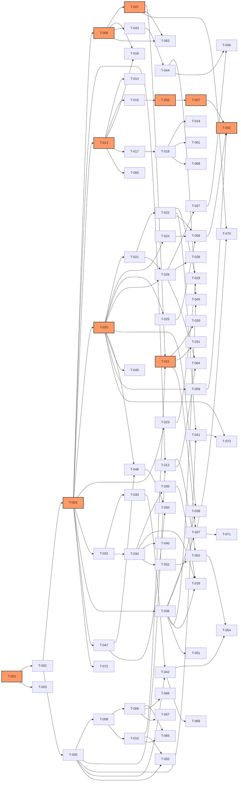

# Development Plan: wechat-flow

[NAV]
- §1 迭代规划 → Sprint 0..6 总览表
- §2 依赖图 → Mermaid DAG + 关键路径
- §3 任务卡详细 → T-001..T-094（见 Sprint 分卷）
- §4 Penpot 同步任务专章 → DS-001..DS-010
- §5 风险与假设
- §6 集成与E2E测试规划
[/NAV]

---

## 1. 迭代规划

### Sprint 总览

| Sprint | 主题 | 关键里程碑 | 演示路径 | 末尾 Validation |
|--------|------|------------|---------|----------------|
| Sprint 0 | 基础设施 + 设计系统建立 | Monorepo 骨架可跑 CI；Penpot Token 导入 | 无（纯工程） | T-VAL-00 |
| Sprint 1 | 三栏 UI 骨架 + 渲染管线核心 | 编辑器可输入 Markdown，右栏出现 HTML 预览 | `localhost:5173` 三栏可见 | T-VAL-01 |
| Sprint 2 | 规则集引擎 + 粘贴过滤 + 兼容性报告 | 渲染结果经规则集过滤；DiagnosticsPanel 可展开 | 输入含 `position:fixed` 的 Markdown，诊断面板变红 | T-VAL-02 |
| Sprint 3 | 主题系统 + 组件注册中心 + Palette 派生 | 五套主题热切换；内置 Block ≥ 10 个可插入 | 左侧面板切换主题，预览区即时变色 | T-VAL-03 |
| Sprint 4 | 输出能力 + MCP server + 图片处理 | 一键复制可粘贴到公众号；MCP `render_markdown` 可调 | 复制 HTML 粘贴到公众号编辑器视觉一致 | T-VAL-04 |
| Sprint 5 | CLI + 插件系统 + 中文排版 + 长图/封面 | CLI `validate` 可跑；`apply_zh_typo` 可用；长图异步导出可用 | `wechat-flow validate ./my-pack` 产出报告 | T-VAL-05 |
| Sprint 6 | 质量门禁 + 视觉回归 + 协作同步 + 收尾 | 规则集 ≥ 42 条 fixture 全绿；Playwright 视觉基线建立；Yjs 同步可选开启 | CI 全绿；`/settings` 开启同步后两标签页协作 | T-VAL-06 |

---

### Sprint 0 任务表（基础设施 + 设计系统）

| 任务 ID | 任务名 | task_kind | 优先级 | 复杂度 | 依赖 |
|---------|--------|-----------|--------|--------|------|
| T-001 | Monorepo 骨架初始化 | chore | P0 | medium | — |
| T-002 | TypeScript + Biome + Vitest 配置 | config | P0 | small | T-001 |
| T-003 | Turborepo 任务图配置 | config | P0 | small | T-001 |
| T-004 | packages/contracts schema 契约层骨架（M-012） | feature | P0 | small | T-002 |
| T-DS-001 | [DESIGN] Penpot — Token 导入 + 可读性验证（PS-001..PS-004） | design | P0 | medium | — |
| T-VAL-00 | [VALIDATION] Sprint 0 验证：CI 绿 + Penpot Token 可见 | validation | P0 | small | T-001,T-002,T-003,T-DS-001 |

### Sprint 1 任务表（三栏 UI 骨架 + 渲染管线核心）

| 任务 ID | 任务名 | task_kind | 优先级 | 复杂度 | 依赖 |
|---------|--------|-----------|--------|--------|------|
| T-DS-002 | [DESIGN] Penpot — P-001 三档响应式线框稿（PS-006） | design | P0 | medium | T-DS-001 |
| T-DS-003 | [DESIGN] Penpot — C-001/C-002/C-004/C-005 核心组件视觉稿 | design | P0 | medium | T-DS-001 |
| T-005 | apps/editor Vue 3.5 项目骨架 + Vue Router + Pinia | chore | P0 | small | T-002 |
| T-006 | packages/core 渲染管线骨架（parse + transform + serialize） | feature | P0 | medium | T-004 |
| T-007 | packages/core inline-style 阶段实现 | feature | P0 | medium | T-006 |
| T-008 | M-001 EditorShell 三栏布局（C-001 TopBar + C-002 Splitter） | feature | P0 | medium | T-005,T-DS-003 |
| T-009 | M-001 SourcePane（CodeMirror 6 + Markdown 高亮） | feature | P0 | medium | T-008 |
| T-010 | M-001 PreviewPane（iframe 沙箱 + 视口切换） | feature | P0 | medium | T-008,T-DS-003 |
| T-011 | M-008 composeRender use case（连接 core → PreviewPane） | feature | P0 | small | T-007,T-010 |
| T-012 | M-013 IndexedDB 本地草稿持久化（存 + 取） | feature | P0 | medium | T-005,T-004 |
| T-DS-004 | [DESIGN] Penpot — Sprint 1 设计稿签字验证 | design | P0 | small | T-DS-002,T-DS-003 |
| T-VAL-01 | [VALIDATION] Sprint 1 验证：三栏布局 + 实时预览 | validation | P0 | small | T-008,T-009,T-010,T-011,T-012 |

### Sprint 2 任务表（规则集 + 粘贴过滤 + 诊断）

| 任务 ID | 任务名 | task_kind | 优先级 | 复杂度 | 依赖 |
|---------|--------|-----------|--------|--------|------|
| T-DS-005 | [DESIGN] Penpot — C-013 DiagnosticsPanel + C-013.1 Diff 视图视觉稿 | design | P0 | medium | T-DS-001 |
| T-013 | packages/wechat-spec 规则集骨架 + 注册中心（M-003） | feature | P0 | medium | T-004 |
| T-014 | 规则集 strip 类 ≥ 10 条 + fixture（style/script/id/position 等） | feature | P0 | large | T-013 |
| T-015 | 规则集 clamp/transform/patch/lint 类 ≥ 15 条 + fixture | feature | P0 | large | T-013 |
| T-016 | M-002 sanitize 阶段（rehype-sanitize + wechatFlowSanitizeSchema） | feature | P0 | medium | T-006,T-013 |
| T-017 | M-004 粘贴过滤模拟器（simulatePaste + per-node diff） | feature | P0 | medium | T-013 |
| T-018 | M-001 DiagnosticsPanel（C-013）+ CompatibilityDiffView（C-013.1） | feature | P0 | medium | T-017,T-DS-005 |
| T-019 | 底部状态栏兼容性摘要接线（M-001 → M-003 诊断流） | feature | P0 | small | T-018 |
| T-VAL-02 | [VALIDATION] Sprint 2 验证：规则集过滤 + 诊断面板 | validation | P0 | small | T-014,T-015,T-017,T-018,T-019 |

### Sprint 3 任务表（主题系统 + 组件注册 + Palette）

| 任务 ID | 任务名 | task_kind | 优先级 | 复杂度 | 依赖 |
|---------|--------|-----------|--------|--------|------|
| T-DS-006 | [DESIGN] Penpot — C-009 CommandPalette + C-015 InsertDrawer + C-016 ContextMenu 视觉稿 | design | P1 | medium | T-DS-001 |
| T-020 | M-005 主题注册中心 + 主题守护 8 维校验骨架 | feature | P0 | medium | T-004 |
| T-021 | packages/themes default 主题（token + Block CSS） | feature | P0 | medium | T-020 |
| T-022 | packages/themes magazine/literary/business/tech 四套主题 | feature | P0 | large | T-021 |
| T-023 | M-006 调色板派生（LCH + WCAG 对比度校验） | feature | P0 | medium | T-004 |
| T-024 | packages/blocks 内置 Block ≥ 20 个（含 variant 注册） | feature | P0 | large | T-020 |
| T-025 | packages/marks 内置 Mark ≥ 11 个 | feature | P0 | medium | T-020 |
| T-026 | M-001 LeftPanelTabs（C-006）+ ThemeCard（C-007）+ BlockLibItem（C-008） | feature | P0 | medium | T-020,T-021 |
| T-027 | M-001 CommandPalette（C-009）接线 command registry | feature | P1 | medium | T-026,T-DS-006 |
| T-028 | M-001 InsertDrawer（C-015）+ ContextMenu（C-016） | feature | P1 | medium | T-026,T-DS-006 |
| T-029 | Frontmatter 解析：theme/paint/base-color 接线渲染管线 | feature | P0 | medium | T-022,T-023 |
| T-DS-007 | [DESIGN] Penpot — Sprint 3 设计稿签字验证 | design | P1 | small | T-DS-006 |
| T-VAL-03 | [VALIDATION] Sprint 3 验证：主题热切换 + Block 插入 | validation | P0 | small | T-021,T-022,T-026,T-027,T-028,T-029 |

### Sprint 4 任务表（输出能力 + MCP + 图片处理）

| 任务 ID | 任务名 | task_kind | 优先级 | 复杂度 | 依赖 |
|---------|--------|-----------|--------|--------|------|
| T-DS-008 | [DESIGN] Penpot — C-014 JobProgressBar + P-003 主题市场 + P-004 设置页视觉稿 | design | P1 | medium | T-DS-001 |
| T-030 | M-008 composeCopy（dual-MIME clipboard payload） | feature | P0 | small | T-011 |
| T-031 | M-008 composeExportHtml（standalone HTML 导出） | feature | P0 | small | T-011 |
| T-032 | apps/relay Hono 服务器骨架 + 健康检查端点 | chore | P1 | small | T-004 |
| T-033 | M-010 图片上传 proxy（6 类图床适配器）+ sharp 预处理 | feature | P0 | large | T-032 |
| T-034 | M-010 BullMQ job 队列 + Redis 接线 + SSE 进度推送（API-020） | feature | P1 | large | T-032 |
| T-035 | M-010 Playwright headless 渲染池（长图 + 封面） | feature | P1 | large | T-034 |
| T-036 | M-009 MCP server stdio transport + 鉴权骨架（API key scope=user） | feature | P1 | medium | T-004 |
| T-037 | M-009 render_markdown / lint_markdown / get_ruleset_version Tool 实现 | feature | P1 | medium | T-036,T-011 |
| T-038 | M-009 list_themes / describe_theme / list_blocks / describe_block Tool | feature | P1 | medium | T-036,T-020 |
| T-039 | M-009 export_long_image / export_cover / get_job / upload_image Tool | feature | P1 | medium | T-036,T-034,T-035 |
| T-040 | M-001 C-014 JobProgressBar + Toast（C-011）接线 SSE 进度 | feature | P1 | medium | T-034,T-DS-008 |
| T-041 | P-003 主题市场页面（/themes 路由） | feature | P1 | medium | T-022,T-005,T-DS-008 |
| T-042 | P-004 设置页（/settings 路由）— 图床配置 + API 密钥分组 | feature | P0 | medium | T-005,T-033,T-DS-008 |
| T-VAL-04 | [VALIDATION] Sprint 4 验证：复制 HTML + 长图导出 + MCP render_markdown | validation | P0 | small | T-030,T-031,T-035,T-037,T-042 |

### Sprint 5 任务表（CLI + 插件系统 + 中文排版 + 收尾功能）

| 任务 ID | 任务名 | task_kind | 优先级 | 复杂度 | 依赖 |
|---------|--------|-----------|--------|--------|------|
| T-DS-009 | [DESIGN] Penpot — P-005 移动端只读预览视觉稿（PS-009） | design | P2 | small | T-DS-001 |
| T-043 | packages/zh-typo 中文排版 4 类规则（M-014 附属模块） | feature | P1 | medium | T-006 |
| T-044 | M-008 composeApplyZhTypo use case + diff 预览 | feature | P1 | medium | T-043 |
| T-045 | M-009 apply_zh_typo Tool 实现 | feature | P1 | small | T-036,T-044 |
| T-046 | M-001 中文排版修订 UI（diff 预览 Modal + ContextMenu 接线） | feature | P1 | medium | T-044,T-027 |
| T-047 | M-007 插件沙箱 Worker 骨架（Comlink RPC + 网络门禁） | feature | P1 | large | T-004 |
| T-048 | M-007 plugin-api surface（defineBlock/defineVariant/defineRule/defineTheme） | feature | P1 | medium | T-047,T-020 |
| T-049 | M-005 品牌包锁定（delta-merge + brand-pack lock） | feature | P2 | medium | T-020 |
| T-050 | apps/cli init/dev/validate/publish 命令（M-011） | feature | P1 | large | T-047,T-048 |
| T-051 | M-009 HTTP/SSE transport + admin API key 管理端点（API-028..API-031） | feature | P1 | medium | T-036 |
| T-052 | M-010 Yjs y-websocket server 集成（协作中继） | feature | P2 | large | T-034 |
| T-053 | M-013 Yjs sync 客户端（y-codemirror.next + y-indexeddb + WebsocketProvider） | feature | P2 | large | T-012,T-052 |
| T-054 | P-004 设置页 — 同步与协作分组（F-012 开关 + WebSocket URL） | feature | P2 | small | T-042,T-053 |
| T-055 | P-005 移动端只读预览（/preview/:docId + 底部固定栏） | feature | P2 | medium | T-005,T-010,T-DS-009 |
| T-VAL-05 | [VALIDATION] Sprint 5 验证：CLI validate + apply_zh_typo + 插件沙箱 | validation | P1 | small | T-044,T-046,T-050,T-051 |

### Sprint 6 任务表（质量门禁 + 视觉回归 + 收尾）

| 任务 ID | 任务名 | task_kind | 优先级 | 复杂度 | 依赖 |
|---------|--------|-----------|--------|--------|------|
| T-DS-010 | [DESIGN] Penpot — C-013 诊断密度测试（PS-007） + 移动端拇指热区（PS-009） | design | P2 | small | T-DS-001 |
| T-056 | 规则集补全至 ≥ 42 条（补 strip+clamp+transform 分类空缺） | feature | P0 | large | T-015 |
| T-057 | E2E fixture：典型 Markdown → 最终 HTML 端到端验证（F-011 AC-001） | feature | P0 | medium | T-056 |
| T-058 | Playwright 视觉回归基线建立（5 主题 × Block/Mark/variant 矩阵） | feature | P0 | large | T-022,T-024,T-025 |
| T-059 | WCAG 对比度自动校验 + 主题守护 8 维完整实现（F-011 AC-003） | feature | P0 | medium | T-020 |
| T-060 | 已知 Bug 补丁库热加载（F-011 AC-005，patch-loader） | feature | P1 | medium | T-013 |
| T-061 | 可读性检查（颜色对比度 + 字号下限 + 段长，F-011 AC-006） | feature | P1 | medium | T-018 |
| T-062 | CI 任务图完整配置（lint → typecheck → unit-test → ruleset-fixture → cross-runtime → theme-guard → visual-regression） | chore | P0 | medium | T-057,T-058,T-059 |
| T-063 | cross-runtime 一致性测试（Node/Worker/Edge SHA-256 字节级一致） | feature | P0 | medium | T-006,T-007 |
| T-064 | 多文档管理 + 自动备份完善（C-006 Tab 3 + P-002 文档列表） | feature | P0 | medium | T-012,T-026 |
| T-065 | 源码 ↔ 预览双向高亮联动（F-001 AC-004） | feature | P0 | medium | T-009,T-010 |
| T-066 | 撤销/重做 + 查找/替换 + 字数统计（F-001 AC-006） | feature | P0 | medium | T-009 |
| T-067 | 输入辅助：中英文自动加空格 + 智能引号（F-001 AC-007） | feature | P1 | small | T-009 |
| T-068 | 夜间模式风险预警（F-002 AC-003/AC-004） | feature | P1 | medium | T-018 |
| T-069 | P-004 设置页 — 编辑器偏好分组（字体/行高/辅助开关） | feature | P1 | small | T-042 |
| T-070 | 版本三元组透传 + 确定性渲染验证（F-013 AC-001） | feature | P0 | small | T-007,T-037 |
| T-071 | MCP server 冷启动性能优化（P95 < 800ms，F-013 AC-006） | feature | P1 | medium | T-037 |
| T-072 | Public Tool Schema deprecation window 工具（F-013 AC-005） | feature | P1 | small | T-004 |
| T-073 | 模板市场骨架（F-008，M-005 template/registry.ts 接线 UI） | feature | P1 | medium | T-041,T-020 |
| T-VAL-06 | [VALIDATION] Sprint 6 验证：CI 全绿 + 视觉回归基线通过 | validation | P0 | small | T-056,T-057,T-058,T-059,T-062,T-063 |

---

## 2. 依赖图

**关键路径**（权重最重链路）：

`T-001 → T-002 → T-004 → T-006 → T-007 → T-011 → T-037 → T-070`（渲染核心 + MCP 确定性链路）

`T-013 → T-014 → T-015 → T-056 → T-057 → T-062`（规则集 + 质量门禁链路）

`T-020 → T-021 → T-022 → T-058 → T-062`（主题系统 + 视觉回归链路）

---

## 3. 任务卡详细

任务卡体量超过 `DOC_SPLIT_THRESHOLD_LINES`，按 Sprint 拆分为独立分卷存放：

| 分卷文件 | 覆盖任务 |
|---------|---------|
| `dev-plan-wechat-flow-s0.md` | Sprint 0: T-001..T-004, T-DS-001, T-VAL-00 |
| `dev-plan-wechat-flow-s1.md` | Sprint 1: T-005..T-012, T-DS-002..T-DS-004, T-VAL-01 |
| `dev-plan-wechat-flow-s2.md` | Sprint 2: T-013..T-019, T-DS-005, T-VAL-02 |
| `dev-plan-wechat-flow-s3.md` | Sprint 3: T-020..T-029, T-DS-006..T-DS-007, T-VAL-03 |
| `dev-plan-wechat-flow-s4.md` | Sprint 4: T-030..T-042, T-DS-008, T-VAL-04 |
| `dev-plan-wechat-flow-s5.md` | Sprint 5: T-043..T-055, T-DS-009, T-VAL-05 |
| `dev-plan-wechat-flow-s6.md` | Sprint 6: T-056..T-073, T-DS-010, T-VAL-06 |

---

## 4. Penpot 同步任务专章

本章将 `ui-spec-wechat-flow#§7` PS-001..PS-010 转化为具体 design 任务卡，与 §3 任务卡编号对应，便于设计 sign-off 跟踪。

| design 任务 | 对应 PS 编号 | 优先级 | 交付物 | Sprint |
|-------------|-------------|--------|--------|--------|
| T-DS-001 | PS-001 + PS-002 + PS-003 + PS-004 | P0 | Penpot 色彩可读性验证截图 + 全部 CSS Token 迁入 Penpot 变量组 | Sprint 0 |
| T-DS-002 | PS-006 | P0 | P-001 三档响应式线框稿（桌面/平板/移动对比图）| Sprint 1 |
| T-DS-003 | — | P0 | C-001 TopBar / C-002 Splitter / C-004 SourcePane / C-005 PreviewPane 视觉稿 + 状态变体 | Sprint 1 |
| T-DS-004 | — | P0 | Sprint 1 设计稿签字：开发者目视检查 + Penpot MCP `find_shape` 可检索 | Sprint 1 |
| T-DS-005 | — | P0 | C-013 DiagnosticsPanel + C-013.1 CompatibilityDiffView 视觉稿（含 3 色级别展示）| Sprint 2 |
| T-DS-006 | PS-005 | P1 | C-009 CommandPalette（6 状态原型）+ C-015 InsertDrawer + C-016 ContextMenu 视觉稿 | Sprint 3 |
| T-DS-007 | — | P1 | Sprint 3 设计稿签字 | Sprint 3 |
| T-DS-008 | — | P1 | C-014 JobProgressBar + P-003 主题市场 + P-004 设置页视觉稿 | Sprint 4 |
| T-DS-009 | PS-009 | P2 | P-005 移动端只读预览视觉稿 + 拇指热区可达性验证 | Sprint 5 |
| T-DS-010 | PS-007 + PS-008 | P2 | C-013 诊断密度视觉测试 + 暗色主题 Token 映射草稿 | Sprint 6 |

### design 任务通用验收标准

所有 design 任务的 `acceptance_criteria` 包含以下 4 条共同要求（各任务可追加特定条目）：

1. Penpot 项目内已建立对应组件/页面的设计稿，命名遵循 `C-{NNN}` / `P-{NNN}` / `Token-{group}` 模式
2. 通过 Penpot MCP `find_shape` 工具从代码侧可检索到该设计稿
3. 开发者目视检查通过：视觉调性、Token 应用、状态变体均符合 `ui-spec-wechat-flow#§对应章节`
4. 签字记录写入 Penpot 页面注释或 `docs/EVENT-LOG.jsonl`（`phase=development, event=design_signoff`）

---

## 5. 风险与假设

### 5.1 技术风险

| 风险编号 | 风险描述 | 影响 Sprint | 影响等级 | 缓解措施 |
|---------|---------|------------|---------|---------|
| R-001 | Vue 3.5 Vapor Mode 与 CodeMirror 6 集成兼容性未经实测 | Sprint 1 | HIGH | T-009 前用 PoC 验证 `@codemirror/view` 与 Vapor 模式的 DOM 操作兼容性；若不兼容退回标准 Vue 渲染模式，Vapor 为可选优化 |
| R-002 | 微信公众号编辑器粘贴过滤行为具有客户端版本差异，fixture 难以穷举 | Sprint 2 + Sprint 6 | HIGH | 优先建立 42 条基线；F-011 AC-008 提供实地验证脚本辅助扩充 fixture |
| R-003 | BullMQ + Redis 在自托管场景下增加运维复杂度 | Sprint 4 | MEDIUM | deploy-spec 阶段提供 Docker Compose 单键启动方案；v1 长图导出为可选 P1 功能 |
| R-004 | Playwright headless 渲染在 CI 环境内存消耗较大（视觉回归矩阵 5 主题 × N Block/variant）| Sprint 6 | MEDIUM | Turborepo 远程缓存跳过未变更包的截图；首次基线允许人工 approve，后续 CI diff 门禁 |
| R-005 | Yjs CRDT 协作（F-012 P2）依赖 y-websocket 服务端，v1 未做服务端鉴权完整实现 | Sprint 5 | LOW | F-012 定位 P2；协作开关默认关；y-websocket 鉴权在 T-052 中以 Bearer token 校验为最小实现，完整 ACL 延后 |
| R-006 | `@zod/mini` 在浏览器 bundle 与 Node 端 Zod 4.x 完整版并存可能导致类型版本不一致 | Sprint 0 | MEDIUM | T-004 阶段统一 contracts 包仅导出 Zod 4.x 完整版 schema；`@zod/mini` 仅在构建时按目标包按需切换，不在 contracts 包内混用 |
| R-007 | Penpot MCP 工具在 Windows 开发环境下的可用性未经验证 | Sprint 0 | LOW | T-DS-001 开始前运行 Penpot MCP `high_level_overview` 验证工具链；如不可用改用 Penpot SaaS Web UI 手动操作 |

### 5.2 ui-spec 残留假设处理策略

`ui-spec-wechat-flow#§6` 记录了 12 条 `[ASSUMPTION]`，本 dev-plan 阶段对各条的处理如下：

| 假设编号 | 假设内容摘要 | dev-plan 处理 |
|---------|------------|--------------|
| A-001 | v1 无用户登录，API 密钥本地加密存储 | 纳入 T-042（P-004 设置页 API 密钥分组）实现范围；本地加密存储由 M-013 IndexedDB 实现 |
| A-002 | 左侧面板宽度持久化到 IndexedDB | 纳入 T-012（IndexedDB 持久化）AC 中明确 Splitter 宽度持久化 |
| A-003 | macOS 下 Cmd+K，Windows/Linux 下 Ctrl+K | T-027 CommandPalette 实现时通过 `navigator.platform` 检测，不需要额外任务 |
| A-004 | 平板抽屉打开时半透明 Overlay | 纳入 T-008 EditorShell 布局实现范围，按 `rgba(28,25,23,0.3)` 实现 |
| A-005 | 移动端 Clipboard API 不支持时降级为选中全文 | 纳入 T-055 P-005 实现范围，配套 C-011 Toast 提示 |
| A-006 | 底部状态栏兼容性颜色策略 | 纳入 T-019（底部状态栏接线）AC 中明确三色阈值 |
| A-007 | 专注模式 F11 隐藏左右栏，顶栏保留最小版 | 纳入 T-008 EditorShell 实现范围 |
| A-008 | 主题切换 250ms 渐变 | 纳入 T-026 LeftPanelTabs 接线 T-029 Frontmatter 时确认 CSS transition |
| A-009 | 右侧预览默认 375px 视口 | T-010 PreviewPane 默认 `viewport='375'` |
| A-010 | DiagnosticsPanel 默认折叠，有 error 时自动展开 | 纳入 T-018 DiagnosticsPanel AC |
| A-011 | LXGW WenKai 字体通过 Web Font CDN 加载 | 纳入 T-005 Vue 骨架初始化的 `index.html` font-face 配置 |
| A-012 | 同步状态指示器位于预览面板右下角 | 纳入 T-010 PreviewPane 实现范围 |

### 5.3 架构残留假设

| 假设 | 来源 | dev-plan 处置 |
|------|------|--------------|
| 规则集总数最终以 42 条为门槛（可超过） | arch-wechat-flow-modules#§2.M-003 | T-014 + T-015 + T-056 分三 Sprint 实现 |
| SQLite 作为服务端首选，Postgres 为横扩备选 | arch-wechat-flow#§1.4 | deploy-spec 阶段终定；T-032 relay 骨架用 libsql，接口保持 adapter 形式 |
| juice / css-inline 内联化库最终选择 | arch-wechat-flow#§1.4 | T-007 inline-style 阶段由 implementer 选型验证（PoC 比较两库 wechat 场景表现） |

---

## 6. 集成与E2E测试规划

| Sprint | 测试类型 | 覆盖场景 | 依赖任务 | 测试范围描述 |
|--------|----------|----------|---------|-------------|
| Sprint 1 | Integration | M-008 use case → M-002 管线 → PreviewPane 渲染 | T-011 | 输入 Markdown 字符串，断言 PreviewPane iframe 内 HTML 含预期结构 |
| Sprint 2 | Integration | M-003 规则集 → M-004 粘贴模拟 → M-001 DiagnosticsPanel | T-017, T-018 | 含 `position:fixed` 的 HTML 经过滤后 DiagnosticsPanel 显示 error 级别诊断 |
| Sprint 2 | Ruleset Fixture | 每条规则 input.html / expected.html CI 验证 | T-014, T-015 | hast → hast 规则级 fixture 100% 通过 |
| Sprint 3 | Integration | 主题热切换 → M-002 重跑后段管线 → PreviewPane 视觉更新 | T-029 | 切换 default → magazine，断言 PreviewPane 内颜色 token 值变化 |
| Sprint 4 | Integration | M-008 composeCopy → Clipboard API → dual-MIME payload | T-030 | 模拟用户手势，调用 composeCopy，断言 clipboard 含 `text/html` + `text/plain` |
| Sprint 4 | Integration | M-009 MCP render_markdown → M-008 → M-002 → 版本三元组 | T-037, T-070 | stdio transport 发送 render_markdown，断言响应含 `html` + `rulesetVersion` + `themeVersion` |
| Sprint 5 | Integration | CLI validate → M-007 manifest 校验 → M-005 主题守护 | T-050 | 对合规 pack 跑 validate，退出码 0；对缺 manifest 的 pack，退出码非 0 + 错误描述 |
| Sprint 6 | E2E | 写作者完整流程：新建文档 → 输入 Markdown → 主题切换 → 复制 HTML | T-030, T-064, T-065 | Playwright 脚本模拟用户操作，断言复制后 clipboard HTML 可粘贴到模拟公众号编辑器并视觉一致 |
| Sprint 6 | Visual Regression | 5 套内置主题 × 所有 Block/Mark/variant story 矩阵 | T-058 | Playwright 截图 diff ≤ 5% 像素差异（相对基线） |
| Sprint 6 | Cross-Runtime | Node / Worker / Edge runtime 同输入 SHA-256 一致 | T-063 | `tests/cross-runtime/` 在三 target 各运行渲染 pipeline，比对 `sha256(html)` 相同 |
